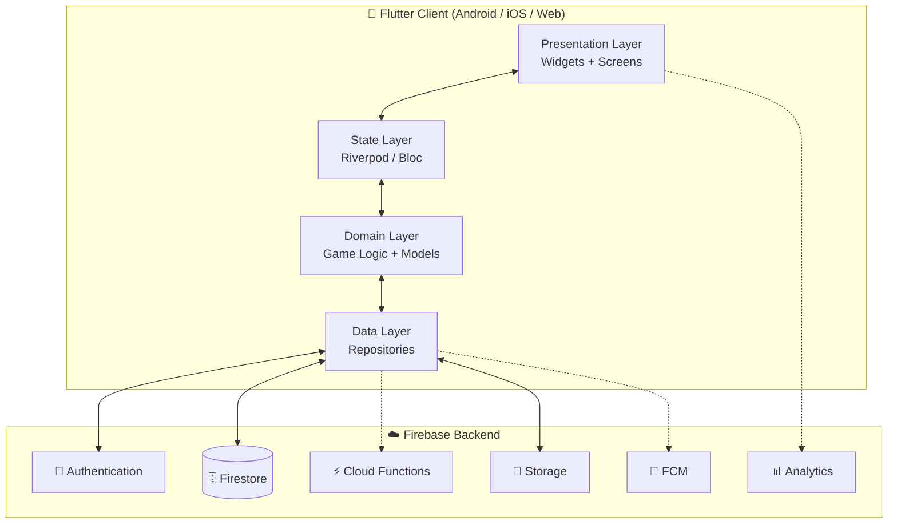
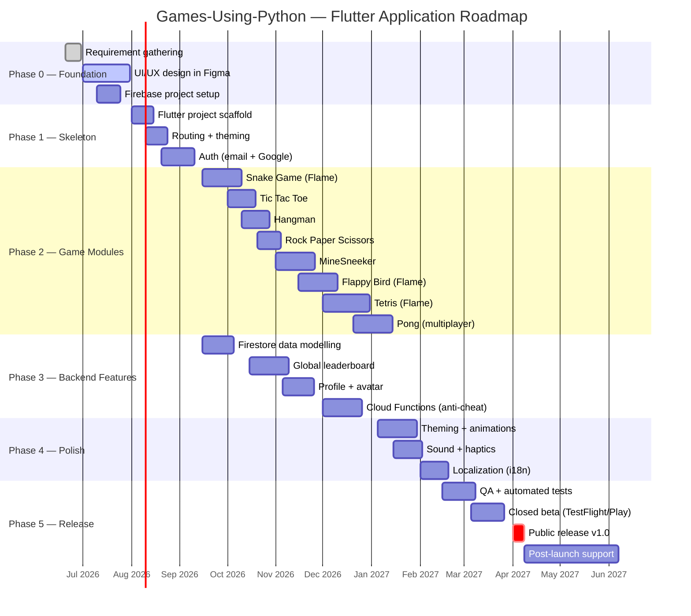
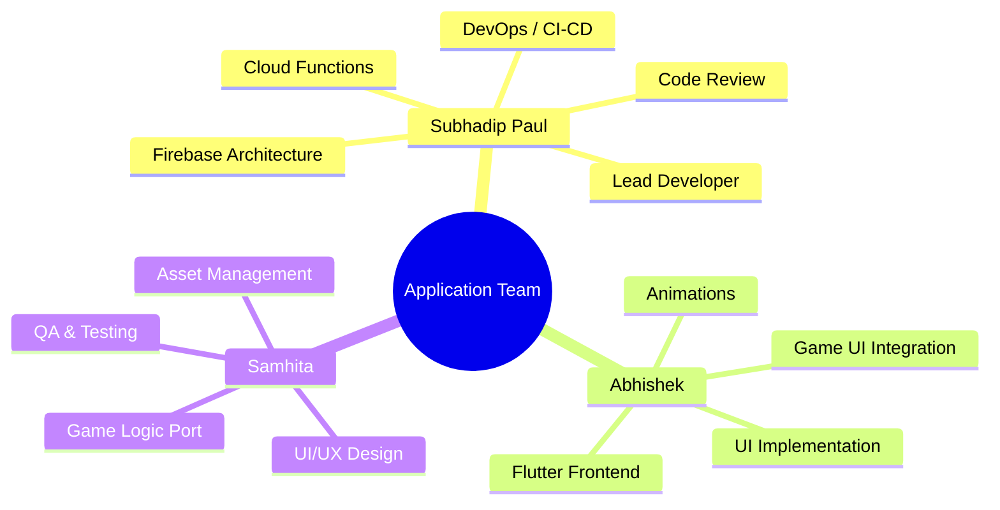
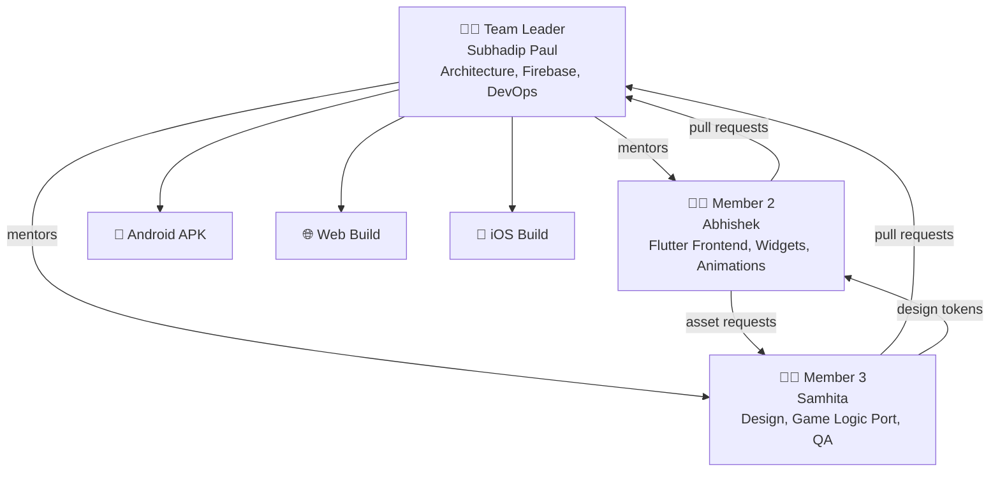
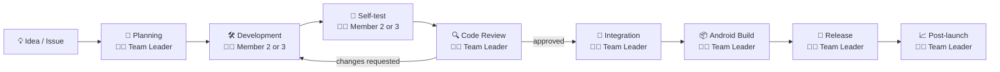
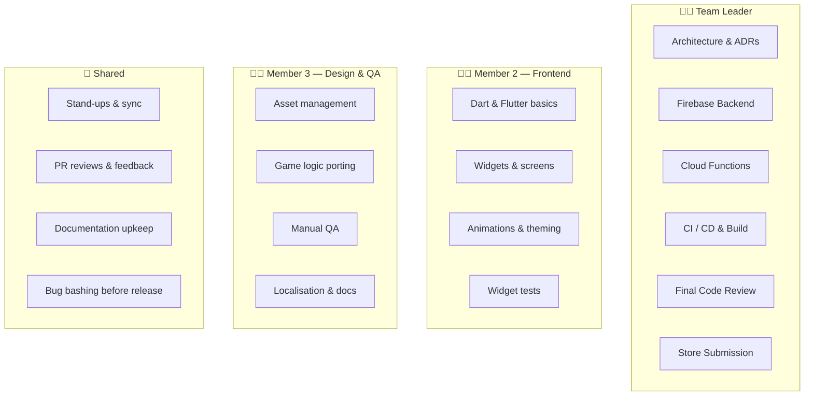
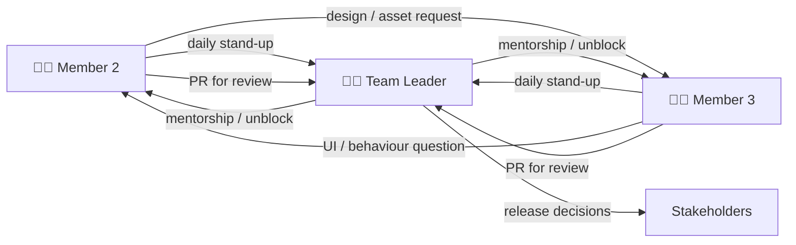
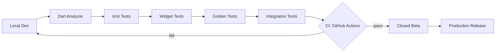

# 📱 Games Platform — Application Development

<p align="center">
  
  
  
  
  
  
</p>

<p align="center">
  <strong>The official roadmap for transforming the Python game collection into a unified cross-platform application using <em>Flutter</em> &amp; <em>Firebase</em>.</strong>
</p>

> 📌 This file documents the **Application** layer of the project.
> For the underlying Python game prototypes, see the [main README](./README.md).

---

## 🎯 Mission

Re-build the existing Python game prototypes (Snake, Tetris, Flappy Bird, Hangman, MineSneeker, Rock Paper Scissors, Tic Tac Toe, Pong) as **one polished cross-platform application** that runs on **Android, iOS and the Web** from a single Flutter codebase, backed by **Firebase** for authentication, real-time leaderboards, profiles and cloud sync.

```text
┌──────────────────────────────────────────────────────────────────┐
│                                                                  │
│   Python Prototypes  ──►  Flutter App  ──►  Firebase Backend     │
│   (logic reference)       (UI + Logic)      (Auth + DB + Funcs)  │
│                                                                  │
│                ▼                ▼                ▼               │
│            Android           iOS / Web        Real-time          │
│                                              Leaderboards        │
└──────────────────────────────────────────────────────────────────┘
```

---

## 🧰 Tech Stack & Tools

### 🧑‍💻 Core Languages & Frameworks

| Layer | Technology | Purpose |
|-------|------------|---------|
| **Frontend** | Flutter 3.x | Cross-platform UI (Android / iOS / Web) |
| **Language** | Dart 3.x | Application logic |
| **State Management** | Riverpod / Bloc | Predictable state & dependency injection |
| **Animations** | Flame Engine, Rive, Lottie | Game rendering & micro-interactions |
| **Game Loop** | Flame 1.x | 2D game engine for Flutter |

### ☁️ Firebase Services

| Service | Purpose |
|---------|---------|
| 🔐 **Firebase Authentication** | Email / Google / Anonymous login |
| 🗄️ **Cloud Firestore** | Profiles, scores, match history, leaderboards |
| ⚡ **Cloud Functions** | Score validation, anti-cheat, daily challenges |
| 📁 **Firebase Storage** | Avatars, custom skins, downloadable assets |
| 📲 **Cloud Messaging (FCM)** | Push notifications & challenges |
| 📊 **Firebase Analytics** | User journeys & retention |
| 🐞 **Crashlytics** | Real-time crash reporting |
| 🌐 **Firebase Hosting** | Web build deployment |
| 🧪 **Remote Config** | Feature flags, A/B testing |

### 🛠️ Dev & Ops Tooling

| Tool | Use |
|------|-----|
| **Android Studio / VS Code** | IDE + Flutter plugins |
| **Figma** | UI/UX design & prototyping |
| **GitHub + GitHub Actions** | Version control & CI/CD |
| **Codemagic / Fastlane** | Automated builds & store publishing |
| **Postman** | Cloud Function endpoint testing |
| **Sentry / Crashlytics** | Error monitoring |
| **Jira / GitHub Projects** | Task tracking |
| **Discord / Slack** | Team communication |

---

## 🏗️ Application Architecture



### Clean Architecture Layers

```text
lib/
├── core/                # constants, themes, utils, routing
├── data/                # Firebase repositories & DTOs
├── domain/              # entities, use-cases, abstract repos
├── presentation/        # screens, widgets, controllers
│   ├── auth/
│   ├── home/
│   ├── games/
│   │   ├── snake/
│   │   ├── tetris/
│   │   ├── flappy/
│   │   ├── hangman/
│   │   ├── minesweeper/
│   │   ├── rps/
│   │   ├── tic_tac_toe/
│   │   └── pong/
│   ├── leaderboard/
│   └── profile/
└── main.dart
```

---

## 🗺️ Detailed Roadmap



### Phase-by-Phase Breakdown

#### 🟣 Phase 0 — Foundation & Design *(June – July 2026)*
- Define MVP scope & user personas
- Wireframe every screen in **Figma** (low-fi → hi-fi)
- Build the **design system**: colors, typography, spacing, components
- Create the **Firebase project**, enable Auth + Firestore + Storage
- Lock the **app name**, logo and store presence

#### 🔵 Phase 1 — Skeleton *(August 2026)*
- `flutter create` with null-safety & sound migration
- Configure flavors (dev / staging / prod)
- Set up routing (`go_router`), theming (light / dark), L10n bootstrap
- Implement Auth screens (Sign-in, Sign-up, Forgot password, Anonymous)
- Wire Firebase SDK + secure config via `flutter_dotenv`

#### 🟢 Phase 2 — Game Modules *(September – December 2026)*
Each game is its own Flutter package under `lib/presentation/games/<name>/` with:
- Game state machine
- Flame component tree (for arcade games) or plain widgets (for board games)
- Per-game settings, controls, tutorial
- Local high score + Firestore sync hook

#### 🟡 Phase 3 — Backend Features *(September – December 2026, parallel)*
- Firestore schema: `users`, `scores`, `matches`, `daily_challenges`
- Security rules with unit tests via `@firebase/rules-unit-testing`
- Real-time leaderboard with pagination
- Cloud Functions for score validation & anti-cheat
- Daily / weekly challenge generator

#### 🟠 Phase 4 — Polish *(January – February 2027)*
- Implicit & hero animations
- Sound (Just Audio) + haptic feedback
- Accessibility (semantics, contrast, font scaling)
- Localization (English + Hindi + Bengali to start)
- Performance pass: tree shaking, lazy routes, image caching

#### 🔴 Phase 5 — Release *(February – April 2027)*
- Unit, widget, golden & integration tests (target ≥ 70% coverage)
- Closed beta via **TestFlight** & **Play Console internal track**
- Crashlytics & Analytics dashboards reviewed weekly
- Submission to **Play Store**, **App Store**, **Web** (Firebase Hosting)
- Post-launch: weekly patches, feature flags via Remote Config

---

## 👥 Team & Task Division



### 🧑‍✈️ Subhadip Paul — *Lead Developer & Backend Engineer*

> **Focus:** architecture, Firebase, infrastructure, code review.

| Area | Responsibilities |
|------|------------------|
| 🏗️ Architecture | Define clean-architecture layers, repositories, dependency graph |
| 🔐 Firebase Backend | Configure Auth providers, Firestore schema, security rules |
| ⚡ Cloud Functions | Score validation, leaderboard aggregation, daily challenges |
| 🚀 DevOps | GitHub Actions, build flavors, signing, Codemagic/Fastlane |
| 📈 Monitoring | Crashlytics, Analytics, Remote Config |
| 🧪 Backend Tests | Firestore rules tests, Functions emulator tests |
| 👀 Code Review | Final approver on all PRs touching `data/` & `domain/` |

**Key deliverables**
- ✅ Firebase project + security rules
- ✅ `data/` & `domain/` layers fully implemented
- ✅ CI/CD pipeline with automated APK + Web build
- ✅ Cloud Functions deployed & monitored

---

### 🎨 Abhishek — *Flutter Frontend Engineer*

> **Focus:** screens, widgets, navigation, game UI shell.

| Area | Responsibilities |
|------|------------------|
| 🖼️ Presentation Layer | Build every screen from Figma to pixel-perfect Flutter |
| 🎬 Animations | Hero transitions, micro-interactions, Lottie / Rive |
| 🧭 Navigation | `go_router` setup, deep links, route guards |
| 🎮 Game UI Shell | Wrappers, HUDs, pause / game-over overlays |
| 🌗 Theming | Light / dark mode, dynamic theming |
| 🧩 Reusable Widgets | Buttons, cards, dialogs, leaderboards |
| 📱 Responsive Design | Phone, tablet & web breakpoints |

**Key deliverables**
- ✅ Auth flow screens
- ✅ Home, Profile, Leaderboard, Settings screens
- ✅ Reusable widget library
- ✅ Per-game UI shells (HUD, pause menu, scoreboard)

---

### 🧪 Samhita — *UI/UX Designer & QA Lead*

> **Focus:** design system, game logic porting, testing.

| Area | Responsibilities |
|------|------------------|
| ✏️ Design | Figma wireframes, mockups, prototypes, design system |
| 🖌️ Assets | Icons, splash, sprites, sound assets, store graphics |
| 🕹️ Game Logic Port | Translate Python game logic → Dart use-cases |
| 🌍 Localization | Manage translation files (EN / HI / BN) |
| 🐛 QA & Testing | Manual test plans, widget tests, golden tests, bug triage |
| 📦 Beta Coordination | TestFlight / Play internal track, gathering tester feedback |
| 📚 Documentation | User guide, FAQ, in-app onboarding copy |

**Key deliverables**
- ✅ Complete Figma design system
- ✅ Dart ports of all 8 game logics (pure Dart, no UI)
- ✅ Test suites for every game module
- ✅ Localization + accessibility audit

---

### 🤝 Shared Responsibilities

| Activity | Everyone |
|----------|---------|
| 🔁 Daily stand-ups (15 min) | ✅ |
| 📝 Sprint planning (every 2 weeks) | ✅ |
| 🧐 Code reviews (cross-team) | ✅ |
| 📚 Documentation upkeep | ✅ |
| 🐞 Bug bashing before release | ✅ |

---

## 🗺️ Per-Phase Role Breakdown

> **How to use this section:** every phase from the roadmap above is
> expanded into a small table showing what *each* team member is
> actually doing in that phase, what they should be learning, and what
> artefact they hand off to the others. If you are a junior developer,
> open the phase you are currently in and read only your row first —
> then read the Team Leader row to see how your work slots in.

### 🟣 Phase 0 — Foundation & Design *(June – July 2026)*

**Phase goal:** lock scope, ship the design system, stand up Firebase.

| Member | Responsibilities (this phase) | Learning Goals | Deliverables | Dependencies |
|--------|-------------------------------|----------------|--------------|--------------|
| 🧑‍✈️ **Team Leader (Subhadip)** | Run a kickoff workshop; create the Firebase project; decide MVP scope; write architecture decisions (ADRs); set up the GitHub repo, branch protection and CI skeleton. | Refresh on Firebase Auth + Firestore cost modelling; review ADR templates. | Firebase project, repo with branch rules, ADR-001 (architecture), CI workflow draft, signed-off MVP scope doc. | Needs sign-off from all three team members on the MVP scope before enabling CI. |
| 🧑‍💻 **Member 2 (Abhishek) — Beginner** | Install Flutter & VS Code; complete the DartPad "Hello World" tour; reproduce two of the existing Python games as plain console Dart programs; open the *first* PR. | Dart syntax, `flutter create`, hot-reload, Git basics, opening a PR. | "Hello Flutter" PR merged; one Python→Dart port of Snake (console only). | Blocks: Phase 1 (cannot start screens until Dart fundamentals are clear). |
| 🧑‍💻 **Member 3 (Samhita) — Beginner** | Create a Figma account; follow Figma's beginner tutorial; audit the existing Python games and list all in-game text and assets; write a *content inventory* spreadsheet. | Figma basics, asset formats (PNG/SVG/MP3), spreadsheet structure. | Figma file with one hi-fi screen, content inventory sheet (`assets-inventory.csv`). | Blocks: Member 2 (cannot build screens until there is a Figma reference). |

> 💡 **Why this phase matters for beginners:** the first month is
> deliberately *low-stakes*. You will not be deploying anything yet —
> you are only learning your tools and producing a single, small
> artefact. Ask questions in stand-ups; do not "figure it out alone"
> because that wastes the Team Leader's review time later.

---

### 🔵 Phase 1 — Skeleton *(August 2026)*

**Phase goal:** a runnable Flutter app with routing, theming and auth.

| Member | Responsibilities (this phase) | Learning Goals | Deliverables | Dependencies |
|--------|-------------------------------|----------------|--------------|--------------|
| 🧑‍✈️ **Team Leader** | Scaffold `flutter create`; wire `go_router`, Riverpod, themes, `flutter_dotenv`; configure Android signing key; enable Firebase Auth providers; write the first Firestore security rules; produce the folder-structure RFC. | Cross-platform build flavours, dotenv secrets handling. | Skeleton app on `develop` branch, Auth flow code-reviewed, security rules v1. | Depends on Member 3's design tokens for theming. |
| 🧑‍💻 **Member 2 (Abhishek)** | Implement the Sign-in / Sign-up / Forgot-password screens **from Figma**; add unit tests for the form validators; document widgets with `dart doc` comments. | Forms in Flutter, `TextFormField` + validators, widget testing basics, theming tokens. | Auth screens PR, ≥ 80 % validator test coverage, widget catalogue entry. | Depends on the Team Leader's router + theme merge first. |
| 🧑‍💻 **Member 3 (Samhita)** | Export the auth screen designs from Figma (PNG + SVG); prepare splash + app icon assets at all required sizes; create a "how to add a new icon" guide; write a checklist of accessibility items (contrast, font size, tap targets). | Figma export pipeline, asset naming conventions, WCAG 2.1 AA basics. | Exported assets in `assets/`, accessibility checklist, splash + icon PR. | Depends on Member 2 telling them which screen sizes failed on first test. |

> 🛑 **Common beginner mistake to avoid:** do not commit *generated*
> files (`build/`, `.dart_tool/`, `google-services.json`) — the
> `.gitignore` the Team Leader added in Phase 0 is there for a reason.
> If you see a file in the PR diff that you did not write, ask before
> committing.

---

### 🟢 Phase 2 — Game Modules *(September – December 2026)*

**Phase goal:** ship all 8 games as Flutter modules with local high
scores.

| Member | Responsibilities (this phase) | Learning Goals | Deliverables | Dependencies |
|--------|-------------------------------|----------------|--------------|--------------|
| 🧑‍✈️ **Team Leader** | Define the `Game` interface; review each game PR; integrate Flame into the project; write the leaderboard repository contract; manage the schedule so games land roughly in roadmap order. | Flame engine architecture, dependency injection in Riverpod, performance profiling. | `Game` base class merged, Flame integration PR, 2 game modules code-reviewed. | Depends on Member 3's per-game visual references being stable. |
| 🧑‍💻 **Member 2 (Abhishek)** | Build the **UI shell** of each game (HUD, pause menu, game-over overlay, settings drawer) on top of the Team Leader's game logic. | Stateful widgets, `Navigator` 2.0, Lottie, accessibility widgets. | UI shell PR per game (8 in total). | Depends on the Team Leader's `Game` interface and Member 3's game assets. |
| 🧑‍💻 **Member 3 (Samhita)** | **Port** the Python game logic to Dart as pure use-cases (no UI); export per-game sprites, sound effects and animations; write a quick smoke-test script for each game on the emulator. | Python → Dart translation patterns, Flame component lifecycle, audio asset compression. | 8 Dart use-case PRs, per-game asset bundles, smoke-test pass log. | Depends on Member 2's UI shell to integrate against. |

> 📊 **Milestone check (end of phase):** all 8 games must run on an
> Android emulator with no crashes, must save a high score locally,
> and must hand off the score to a `LeaderboardRepository.save()` stub
> that the Team Leader will wire to Firestore in Phase 3.

---

### 🟡 Phase 3 — Backend Features *(September – December 2026, parallel)*

**Phase goal:** live leaderboards, profiles and anti-cheat.

| Member | Responsibilities (this phase) | Learning Goals | Deliverables | Dependencies |
|--------|-------------------------------|----------------|--------------|--------------|
| 🧑‍✈️ **Team Leader** | Model the Firestore schema (`users`, `scores`, `matches`, `daily_challenges`); write security rules + unit tests; author Cloud Functions for score validation and leaderboard aggregation; enable Crashlytics. | Firestore data modelling, security rules unit testing, Cloud Functions, anti-cheat heuristics. | Schema diagram, rules + tests, ≥ 3 Cloud Functions deployed. | Independent — can run in parallel with Phase 2. |
| 🧑‍💻 **Member 2 (Abhishek)** | Build the Profile screen, Avatar picker (uses Firebase Storage), Settings screen and Leaderboard UI; wire real-time listeners with `StreamBuilder`. | Firebase SDK calls, `StreamBuilder`, image upload to Storage, pagination patterns. | Profile / Settings / Leaderboard PRs, screenshot tests. | Depends on Team Leader's repository contract. |
| 🧑‍💻 **Member 3 (Samhita)** | Write a manual test plan for every Cloud Function; run end-to-end tests on the Firebase emulator; maintain a bug-tracker spreadsheet; document the daily-challenge format for users. | Manual test plan design, Firebase emulator, bug-reporting template. | Test plan doc, ≥ 1 round of emulator passes, bug tracker, user-facing copy for challenges. | Depends on the Team Leader merging Cloud Functions first. |

---

### 🟠 Phase 4 — Polish *(January – February 2027)*

**Phase goal:** feel-good moment-to-moment UX.

| Member | Responsibilities (this phase) | Learning Goals | Deliverables | Dependencies |
|--------|-------------------------------|----------------|--------------|--------------|
| 🧑‍✈️ **Team Leader** | Performance pass (tree shaking, lazy routes, image caching); accessibility audit; finalise build flavours and signing. | Flutter performance tooling, a11y audits, signing automation. | Performance report, a11y checklist signed off, signed release APK. | Depends on all Phase 2 + 3 bugs being closed. |
| 🧑‍💻 **Member 2 (Abhishek)** | Add hero transitions, Lottie micro-interactions, sound + haptics using `just_audio` and `HapticFeedback`. | Implicit animations, Lottie integration, audio focus. | Animation PR, sound/haptics PR, before/after screen recordings. | Depends on Member 3's translated strings. |
| 🧑‍💻 **Member 3 (Samhita)** | Manage EN / HI / BN translations in `.arb` files; produce store-listing screenshots and a 30-second promo video; review every screen for tone and clarity. | Flutter intl / arb workflow, App Store / Play Store screenshot specs. | Localisation PR, store-listing assets, 30-second promo video. | Depends on Member 2 freezing the UI before screenshots are taken. |

---

### 🔴 Phase 5 — Release *(February – April 2027)*

**Phase goal:** ship v1.0 and keep it healthy.

| Member | Responsibilities (this phase) | Learning Goals | Deliverables | Dependencies |
|--------|-------------------------------|----------------|--------------|--------------|
| 🧑‍✈️ **Team Leader** | Drive the closed beta on TestFlight + Play internal track; triage Crashlytics issues weekly; own the v1.0 store submission; set up Remote Config flags. | Store submission, Crashlytics triage, Remote Config. | Public v1.0 release, post-launch monitoring dashboard. | Depends on Member 3 finishing store-listing copy. |
| 🧑‍💻 **Member 2 (Abhishek)** | Write widget + golden tests for every screen; fix bugs filed against the UI; respond to beta-tester feedback within 48 hours. | Golden tests, beta feedback loops, patch releases. | Test suite ≥ 70 % coverage, 0 P0/P1 bugs open. | Depends on Team Leader's bug list. |
| 🧑‍💻 **Member 3 (Samhita)** | Coordinate the beta tester pool; collect structured feedback; write the user-facing FAQ + onboarding copy; run a final accessibility walkthrough with a screen reader. | Beta coordination, user-research basics, screen-reader testing. | Beta sign-off doc, FAQ published in-app, a11y walkthrough report. | Depends on Member 2 fixing reported UI bugs. |

---

## 🧭 Team Structure at a Glance



> **Read this diagram as:** the Team Leader is the only person who can
> ship a build; the two juniors collaborate horizontally (e.g., Member 2
> asks Member 3 for assets, Member 3 asks Member 2 to confirm screen
> sizing) and both report upward through pull requests and stand-ups.

---

## 🔁 Development Workflow



> The first three boxes (Idea → Planning → Development) are where the
> junior developers spend most of their time. The last three boxes
> (Integration → Build → Release) belong to the Team Leader so that
> there is **one** person accountable for what actually ships to users.

---

## 🎯 Member Responsibility Distribution



> When you are unsure who owns a task, look at this diagram first —
> if the task is not in your box, ask the Team Leader before starting.

---

## 🎓 Team Learning Roadmap

> **How to use this section:** pick your role, then follow the skills
> in the listed order. Each block has a *prerequisite* (the skill
> you must already be comfortable with), an *estimated duration* for
> a complete beginner studying ~5 hours/week, and a *recommended
> resource* that you can start with tonight.

### 🧑‍✈️ Team Leader — Continuous Refresh

| Order | Skill | Prerequisite | Duration | Resource |
|-------|-------|--------------|----------|----------|
| 1 | Re-skim the [Flutter install docs](https://docs.flutter.dev/get-started/install) and run `flutter doctor` | — | 1 day | docs.flutter.dev |
| 2 | Re-read [Riverpod / Bloc docs](https://riverpod.dev) | 1 | 2 days | riverpod.dev |
| 3 | Firebase Auth + Firestore security rules refresher | 2 | 3 days | firebase.google.com/docs/rules |
| 4 | GitHub Actions for Flutter (cache pub, build APK, run tests) | 3 | 2 days | github.com/features/actions |
| 5 | Cloud Functions v2 + scheduled functions | 4 | 2 days | firebase.google.com/docs/functions |

### 🧑‍💻 Member 2 (Abhishek) — Beginner Track

| Order | Skill | Prerequisite | Duration | Resource |
|-------|-------|--------------|----------|----------|
| 1 | **Git & GitHub basics** — clone, add, commit, push, branch, PR | None | 1 week | [GitHub Skills "Introduction to GitHub"](https://github.com/skills) |
| 2 | **Dart fundamentals** — variables, functions, classes, null-safety | None | 2 weeks | [DartPad tour](https://dartpad.dev) + *Dart Apprentice* (raywenderlich.com) |
| 3 | **Flutter basics** — `flutter create`, `StatelessWidget`, `StatefulWidget`, hot reload | 2 | 2 weeks | [Flutter codelab](https://docs.flutter.dev/get-started/codelab) |
| 4 | **Forms & validation** — `TextFormField`, `Form`, `GlobalKey` | 3 | 1 week | Flutter widget of the week (YouTube) |
| 5 | **Navigation** — `go_router` basics, named routes, deep links | 4 | 1 week | pub.dev/packages/go_router |
| 6 | **State management** — `flutter_riverpod` `Provider`/`Consumer` | 5 | 1 week | riverpod.dev docs |
| 7 | **Animations** — implicit + `Hero` | 6 | 1 week | Flutter animations codelab |
| 8 | **Widget testing** — `pumpWidget`, `find.byType`, golden tests | 7 | 1 week | docs.flutter.dev/testing |
| 9 | **Performance basics** — DevTools timeline, `const` everywhere | 8 | ongoing | docs.flutter.dev/perf |

> 🛟 **Tip for Member 2:** *do not* jump ahead. Each step is small
> enough to finish in a week. If a step takes longer, raise it in the
> next stand-up so the Team Leader can re-balance the schedule.

### 🧑‍💻 Member 3 (Samhita) — Beginner Track

| Order | Skill | Prerequisite | Duration | Resource |
|-------|-------|--------------|----------|----------|
| 1 | **Git & GitHub basics** — same as Member 2 | None | 1 week | GitHub Skills |
| 2 | **Spreadsheet fundamentals** — sort, filter, pivot tables | None | 2 days | Google Sheets beginner course |
| 3 | **Figma basics** — frames, components, variants, auto-layout | None | 1 week | [Figma YouTube channel — "Beginner Basics"](https://youtube.com/@Figma) |
| 4 | **Asset management** — naming conventions, formats, sizes, compression | 3 | 1 week | web.dev "Choose the right image format" |
| 5 | **Python → Dart translation** — read existing Python game code, rewrite logic in pure Dart | 4 | 2 weeks | dart.dev "Dart for Python developers" |
| 6 | **Game testing on emulator** — install Android Studio, run AVD, file bug reports | 5 | 1 week | developer.android.com/studio |
| 7 | **Bug reporting** — minimal repro, expected vs actual, screenshots, logs | 6 | 3 days | GitHub issue templates |
| 8 | **Localisation workflow** — `.arb` files, `flutter gen-l10n` | 7 | 1 week | docs.flutter.dev/accessibility-and-i18n |
| 9 | **Accessibility audit** — colour contrast, font scaling, screen reader | 8 | ongoing | web.dev "Accessibility" |

> 🛟 **Tip for Member 3:** the design and QA skills transfer well from
> non-engineering hobbies (drawing, playing games, writing) — lean on
> those instincts. You are not "behind" because you have not coded
> before; you are the team's *user advocate*.

### Cross-Skill Milestones

By the end of **each phase**, *every* member should be able to point
to one new skill they have actually used in production code (not just
read about). The Team Leader will confirm this during the phase-end
review.

---

## 📅 Weekly Collaboration Workflow

### Daily Responsibilities (every weekday)

| Time | Activity | Who | Output |
|------|----------|-----|--------|
| 09:00 (or first hour of work) | Read your open PR comments + any new issues assigned to you | Everyone | Triage list |
| 10:00 | **Stand-up** in `#standup` channel (async or 15-min call) | All three | Three-question update |
| Rest of day | Code, test, write docs, attend ad-hoc pairing with Team Leader | Whoever is on the task | Commits, PRs, docs |
| Last 10 min | Update the *Weekly Status* doc with today's progress | Whoever owns that week's slice | Status entry |

> **What "async stand-up" means for us:** if all three of you are in
> the same time-zone, use a 15-minute voice call. Otherwise, post the
> three answers in the team chat before 10:00. Either way, the output
> is the same — three short sentences.

### Weekly Sync (every **Friday, 16:00, 30 min**)

**Attendees:** all three team members (mandatory).
**Facilitator:** rotates weekly (Member 2 → Member 3 → Team Leader).

**Agenda (time-boxed):**

| # | Item | Time | Owner |
|---|------|------|-------|
| 1 | Round-robin: what shipped this week? | 10 min | Each member (1 min) |
| 2 | Round-robin: what's blocked? | 5 min | Each member |
| 3 | Demo or screen-share of one thing you built | 5 min | Rotating member |
| 4 | Decisions needed from Team Leader | 5 min | Team Leader |
| 5 | Action items + next-week commitments | 5 min | Facilitator |

**Outputs (written in the meeting doc):**
- List of *Decisions made* (with the deciding person)
- List of *Action items* (with owner + due date)
- Updated *Risk register* (one line per risk)

### Sprint Planning (every 2 weeks, **Monday, 10:00, 60 min**)

- Review last sprint's outcomes
- Pull top items from the backlog into the new sprint
- Each member picks 2–4 tasks that fit their current learning arc
- Team Leader confirms the load is balanced (no one > 6 h/day of
  focused work)

### Task Assignment Process

1. The **Team Leader** creates or refines an *Issue* in GitHub
   Projects. Every issue must have: title, description, acceptance
   criteria, and the *role tag* (`@frontend`, `@design`, `@qa`,
   `@backend`).
2. During sprint planning, the relevant member **self-assigns** by
   commenting `I will take this`.
3. The Team Leader reviews assignments and re-balances if needed.
4. When the work is done, the assignee opens a PR that **links the
   issue** (`Closes #123`). The issue auto-closes on merge.

### Reporting Structure

| Report | Frequency | Author | Audience | Where |
|--------|-----------|--------|----------|-------|
| Daily stand-up | Daily | Each member | Whole team | `#standup` or call |
| Weekly status | Weekly (Friday) | Each member | Whole team | `weekly-status.md` |
| Sprint review | Bi-weekly (Monday) | Team Leader | Whole team + stakeholders | Sprint board |
| Post-mortem | After any P0 incident | Team Leader | Whole team | `post-mortems/` |
| Personal retro | Monthly | Each junior (private) | 1:1 with Team Leader | Verbal / shared doc |

---

## 📣 Communication Structure



### Who Reports to Whom

- **Both juniors report to the Team Leader.** You do *not* report to
  each other — the Team Leader is the single point of accountability.
- The Team Leader reports to external stakeholders (course instructor,
  open-source users, app store reviewers).
- All three members can talk to each other directly for *coordination*
  (e.g., "can you send me the icon at 4× size?"). Coordination is not
  the same as reporting.

### Pull Request Process

1. **Branch from `develop`.** Branch name pattern:
   `<type>/<short-kebab-description>` — for example
   `feature/login-form`, `fix/leaderboard-pagination`,
   `docs/onboarding-update`.
2. **Commit messages follow [Conventional Commits](https://www.conventionalcommits.org/en/v1.0.0/):**
   `feat(login): add forgot-password link`,
   `fix(leaderboard): cap query at 100 docs`,
   `docs: update onboarding checklist`.
3. **PR title** is the same as the commit message (the PR squash-merges
   into one commit on `develop`).
4. **PR description template** (copy-paste into every PR):
   ```markdown
   ## What
   <!-- one-paragraph summary of the change -->

   ## Why
   <!-- link the issue: Closes #123 -->

   ## How to test
   <!-- exact steps for the reviewer to reproduce -->

   ## Screenshots / recordings
   <!-- only for UI changes -->

   ## Checklist
   - [ ] I read the PR template
   - [ ] I ran the project locally
   - [ ] I added or updated tests
   - [ ] I updated relevant docs
   ```
5. **Reviewer assignment:** Member 2 & 3 → Team Leader.
   Team Leader PRs → any one other team member.
6. **Approval needed:** ≥ 1 approval + all CI checks green.
7. **Merge strategy:** squash-merge, branch deleted automatically.

### Issue Reporting Process

Every bug, idea or task is an **Issue** in the GitHub repo.

| Field | Required? | Example |
|-------|-----------|---------|
| Title | ✅ | "Leaderboard crashes when score > 999,999" |
| Description | ✅ | One paragraph of context |
| Steps to reproduce | ✅ for bugs | 1. Open app 2. Play Snake … |
| Expected vs actual | ✅ for bugs | "Expected: snake moves. Actual: app closes." |
| Screenshot / log | Nice to have | Paste of `flutter logs` |
| Labels | ✅ | `bug`, `frontend`, `priority: high` |
| Assignee | After sprint planning | `@abhishek` |

Junior developers **should not** silently fix a bug they spotted
during another task — they should *file an issue* first, then ask in
stand-up whether to take it now or in the next sprint.

### Code Review Workflow

The Team Leader reviews every PR within **one working day**.
Reviewers should:

1. **Read the description first** — if you don't understand the *why*,
   ask before reading the code.
2. **Run the change locally** for any non-trivial PR.
3. **Use the three review verbs** from GitHub:
   - 💬 **Comment** — non-blocking feedback or questions
   - ✅ **Approve** — ship it
   - ❌ **Request changes** — must be addressed before merge
4. **Be specific and kind.** "Rename this variable" is better than
   "this is bad." A good review reads like a senior pair-programming
   with you, not a scorecard.
5. **Prefer suggestions over demands** when there is more than one
   valid approach.

A PR can be merged when it has **at least one approval**, all CI
checks pass, and any "request changes" threads are resolved.

### Documentation Workflow

- **Code comments:** use `dart doc` (`///`) for every public class
  and method. The Team Leader will block PRs without them.
- **`README.md` per game:** Member 3 keeps this up to date in the
  same PR that changes the game.
- **`CHANGELOG.md`:** updated automatically from Conventional
  Commits by a release-please bot (set up by the Team Leader).
- **Onboarding doc:** owned by the Team Leader, updated whenever a
  junior hits a missing step during their first month.

---

## 🚀 New Team Member Onboarding Guide

> **Welcome!** Whether you are Member 2 or Member 3, follow this
> guide in order during your first week. Each step is small enough to
> finish in one sitting.

### What to Install (Day 1)

| Tool | Why | Link |
|------|-----|------|
| **Git** | Version control | git-scm.com/downloads |
| **GitHub Desktop** *(optional, easier for beginners)* | Visual git client | desktop.github.com |
| **VS Code** | Code editor with first-class Flutter support | code.visualstudio.com |
| **VS Code extensions** | Flutter, Dart, Error Lens, GitLens | VS Code marketplace |
| **Flutter SDK (3.x)** | Build framework | docs.flutter.dev/get-started/install |
| **Android Studio** | Android emulator + device manager | developer.android.com/studio |
| **Figma desktop app** | Design review (Member 3) | figma.com/downloads |
| **Discord / Slack** | Team communication | (your team's choice) |

### Development Environment Setup (Day 1–2)

1. **Install Flutter** following the *Quick start* path on
   [docs.flutter.dev/get-started/install](https://docs.flutter.dev/get-started/install)
   (it uses VS Code and is the most beginner-friendly).
2. **Open a terminal and run:**
   ```bash
   flutter doctor
   ```
   Resolve every ❌ before moving on. Common fixes:
   - "Android licenses not accepted" → `flutter doctor --android-licenses`
   - "cmdline-tools missing" → install via Android Studio
3. **Clone the repo:**
   ```bash
   git clone https://github.com/Subhadip-Paul2006/Games-Using-Python.git
   cd Games-Using-Python
   ```
4. **Open the `app/` folder in VS Code.** VS Code will offer to
   install recommended extensions — accept.
5. **Get dependencies:**
   ```bash
   flutter pub get
   ```
6. **Run the app on the Android emulator** (start the emulator from
   Android Studio first):
   ```bash
   flutter run
   ```

### GitHub Setup (Day 2)

1. Create a GitHub account if you don't have one.
2. Enable **2FA** (two-factor authentication) in
   *Settings → Password and authentication*.
3. Ask the Team Leader to add you as a **collaborator** to the repo.
4. Configure Git locally:
   ```bash
   git config --global user.name "Your Name"
   git config --global user.email "your-github-email@example.com"
   ```
5. **Authenticate** with GitHub using either:
   - the GitHub CLI (`gh auth login`), or
   - an SSH key (follow GitHub's official guide).

### Project Folder Structure (read this once on Day 2)

```text
Games-Using-Python/
├── APP_DEVELOPMENT.md     # ← you are reading this file
├── README.md              # project overview
├── Snake Game/            # Python prototype (logic reference)
├── Tetris Game/
├── …other Python games…
└── app/                   # Flutter app (the work-in-progress product)
    ├── lib/
    │   ├── core/          # constants, themes, routing
    │   ├── data/          # Firebase repositories
    │   ├── domain/        # entities & use-cases
    │   └── presentation/  # screens, widgets, controllers
    ├── test/              # automated tests
    ├── assets/            # images, sounds, fonts
    └── pubspec.yaml       # Flutter dependencies
```

### First-Week Tasks

| Day | Member 2 task | Member 3 task |
|-----|---------------|---------------|
| **Mon** | Install Flutter, run `flutter doctor` green | Install Figma + Android Studio |
| **Tue** | Read *Git Skills: Introduction to GitHub* | Audit Python games, list all assets |
| **Wed** | Open your first PR — a typo fix in `README.md` | Open your first PR — a typo fix in `README.md` |
| **Thu** | Build a `Hello, name!` Flutter screen and PR it | Build a one-page Figma file of the home screen |
| **Fri** | Demo at weekly sync | Demo at weekly sync |

### First Pull Request — Step-by-Step

1. **Pull the latest changes:**
   ```bash
   git checkout develop
   git pull
   ```
2. **Create a branch:**
   ```bash
   git checkout -b docs/fix-readme-typo
   ```
3. **Make your change** in your editor.
4. **Stage and commit** with a Conventional Commit message:
   ```bash
   git add README.md
   git commit -m "docs: fix typo in installation section"
   ```
5. **Push:**
   ```bash
   git push -u origin docs/fix-readme-typo
   ```
6. **Open the PR** on GitHub. Title = commit message. Description =
   the PR template above.
7. **Tag the Team Leader** as a reviewer (`@Subhadip-Paul2006`).
8. **Respond to review comments** by pushing new commits to the same
   branch — do not open a new PR.
9. **Celebrate** 🎉 when the PR is merged and the branch is deleted.

> 🛟 **If you get stuck on any of the above, paste the exact error
> message into the team chat.** Do not spend more than 30 minutes
> debugging alone — the Team Leader is paid (metaphorically) to
> unblock you.

---

## 🏆 Success Criteria

> "Success" is **observable**, not vibes-based. Each role has
> concrete artefacts and competencies the Team Leader will check at
> the end of every phase.

### 🧑‍✈️ Team Leader — Success Looks Like

- ✅ Every phase ends on (or before) the date in the Gantt chart
- ✅ `develop` is always green (CI passes, deploy-able)
- ✅ All junior PRs reviewed within one working day
- ✅ At least one personal learning item shipped per month
- ✅ Public v1.0 released on Play Store + Web
- ✅ Crashlytics "P0 crash-free users" ≥ 99 %

**Promotion path:** the role itself is the destination. Continued
growth comes from taking on mentor-of-mentors responsibility
(recruiting, architecture reviews across multiple teams).

### 🧑‍💻 Member 2 (Abhishek) — Success Looks Like

**Required competencies by end of Phase 3:**

- [ ] Comfortable reading and writing Dart 3 with null-safety
- [ ] Can build a Flutter screen from a Figma reference *without
      asking the Team Leader for help*
- [ ] Writes `TextFormField` validators and at least one widget test
      for every form
- [ ] Uses `git status`, `git diff`, `git log` fluently
- [ ] Opens PRs that pass CI on the first try ≥ 70 % of the time
- [ ] Documents every public widget with a `///` dart doc comment
- [ ] Reviews at least one PR per sprint from a peer

**Expected outputs by end of Phase 5:**

- All 8 game UI shells merged
- ≥ 70 % widget-test coverage on `lib/presentation/`
- ≥ 1 golden test per screen
- Zero P0/P1 UI bugs open at v1.0

**Promotion path to "Mid-level Flutter Developer":**

| Milestone | What it unlocks |
|-----------|-----------------|
| Phase 3 complete + competencies checked | You may *propose* architecture for new features |
| Phase 4 complete | You may review **other people's** PRs as a secondary reviewer |
| Phase 5 complete + shipped v1.0 | You may *lead* a single game module end-to-end (e.g., a future v2 game) |
| After 3 months post-launch | Eligible to be the **Frontend Lead** on the next project |

### 🧑‍💻 Member 3 (Samhita) — Success Looks Like

**Required competencies by end of Phase 3:**

- [ ] Can navigate Figma: frames, components, variants, auto-layout
- [ ] Can write a clear, reproducible bug report with logs +
      screenshots
- [ ] Comfortable reading Python and rewriting the logic in Dart
- [ ] Manages the assets folder without creating duplicate files
- [ ] Maintains the bug-tracker spreadsheet up to date daily
- [ ] Writes at least one `.arb` translation per release

**Expected outputs by end of Phase 5:**

- Complete Figma design system (one source of truth)
- 8 Dart use-cases ported and unit-tested
- Beta-test sign-off document
- Localised app in English + Hindi + Bengali
- A11y walkthrough report

**Promotion path to "Product Designer & QA Lead":**

| Milestone | What it unlocks |
|-----------|-----------------|
| Phase 3 complete + competencies checked | You may *propose* UX changes to existing flows |
| Phase 4 complete | You may own the *full* localisation pipeline alone |
| Phase 5 complete + shipped v1.0 | You may run the *closed beta programme* end-to-end |
| After 3 months post-launch | Eligible to be the **Design & QA Lead** on the next project |

### 🤝 Shared Success Indicators

- All three members can explain, in one minute, *what the app does* to
  a stranger
- No single person is a bottleneck — the Team Leader can take a
  week off and the juniors can keep shipping
- The repo has a green `main` branch 95 % of the time
- Every public release is followed by a written retro

---

## 🧪 Quality Strategy



- **Lint:** `flutter_lints` + custom rules
- **Format:** `dart format` on pre-commit hook
- **Tests:** target ≥ 70% coverage across `domain/` & `data/`
- **CI:** every PR runs analyze + tests + build (Android + Web)
- **Beta:** Play Console internal + TestFlight before each release

---

## 🚀 Getting Started (for contributors)

```bash
# 1. Clone the repo
git clone https://github.com/Subhadip-Paul2006/Games-Using-Python.git
cd Games-Using-Python/app

# 2. Install Flutter (3.x) and verify
flutter doctor

# 3. Install dependencies
flutter pub get

# 4. Configure Firebase
flutterfire configure

# 5. Run on a connected device or emulator
flutter run

# 6. Run tests
flutter test
```

> 🔑 Ask **Subhadip** for the `dev` Firebase project access before running.

---

## 📦 Release Channels

| Channel | Audience | Trigger |
|---------|----------|---------|
| `dev` | Developers only | Every push to `develop` |
| `staging` | Internal team | Tagged `v*-beta` |
| `production` | Public | Tagged `v*` on `main` |

---

## 📜 License

This application is part of the **Games-Using-Python** project and is distributed under the **MIT License**. See [`LICENSE`](./LICENSE).

---

<p align="center">
  Crafted with 💙 by the <strong>Games-Using-Python Application Team</strong><br/>
  <a href="https://github.com/Subhadip-Paul2006">Subhadip Paul</a> · Abhishek · Samhita
</p>
