# DESIGN.md — Games Platform UI/UX Design Specification

**Document version:** 1.0
**Last updated:** 2026-06-20
**Owner:** Samhita (Design + QA)
**Audience:** Abhishek (Frontend), Subhadip (Backend), future designers, accessibility consultants
**Companion docs:** `PRD.md` (product requirements), `TRD.md` (technical requirements)

> **How to read this document.** Section 1–6 explain *why*. Section 7 (Components) and Sections 12–21 (Screens) are the bulk of the implementation reference — Abhishek should be able to build any screen by reading its section plus the Component section. Sections 8–11 are the cross-cutting rules that apply everywhere. Sections 22–25 cover motion, microinteractions, and the roadmap.

---

## Table of Contents

1. [Design Philosophy](#1-design-philosophy)
2. [Brand Identity](#2-brand-identity)
3. [Visual Language](#3-visual-language)
4. [Typography System](#4-typography-system)
5. [Color System](#5-color-system)
6. [Design Tokens](#6-design-tokens)
7. [Component Library](#7-component-library)
8. [Navigation System](#8-navigation-system)
9. [Layout Rules](#9-layout-rules)
10. [Responsive Design Rules](#10-responsive-design-rules)
11. [Accessibility Guidelines](#11-accessibility-guidelines)
12. [Onboarding Flow](#12-onboarding-flow)
13. [Authentication Screens](#13-authentication-screens)
14. [Home Screen](#14-home-screen)
15. [Game Discovery Screens](#15-game-discovery-screens)
16. [Profile Screens](#16-profile-screens)
17. [Settings Screens](#17-settings-screens)
18. [Achievement Screens](#18-achievement-screens)
19. [Error States](#19-error-states)
20. [Empty States](#20-empty-states)
21. [Loading States](#21-loading-states)
22. [Animation Guidelines](#22-animation-guidelines)
23. [Microinteractions](#23-microinteractions)
24. [UX Best Practices](#24-ux-best-practices)
25. [Future Design Expansion](#25-future-design-expansion)

---

## 1. Design Philosophy

### 1.1 Mission statement

**Games Platform** exists to give every Indian Android user — from a 9-year-old playing during school break to a 38-year-old parent unwinding after work — a single, safe, beautifully crafted home for classic casual games. We don't chase novelty; we perfect the familiar.

### 1.2 Connection to PRD UVP

Per `PRD.md §3` (Unique Value Proposition): **One app. Six games. Zero friction.** Our design must visibly deliver on all three:

| UVP claim | Design promise | Where you see it |
|---|---|---|
| One app | A unified shell with consistent IA across all 6 games | Section 8 (Navigation), Section 14 (Home) |
| Six games | Each game gets equal, distinct visual treatment | Section 5 (per-game colour accents), Section 15 (Game Detail) |
| Zero friction | Tap-to-play in ≤3 taps from cold launch | Section 12 (Onboarding), Section 14 (Home) |

### 1.3 Six working principles

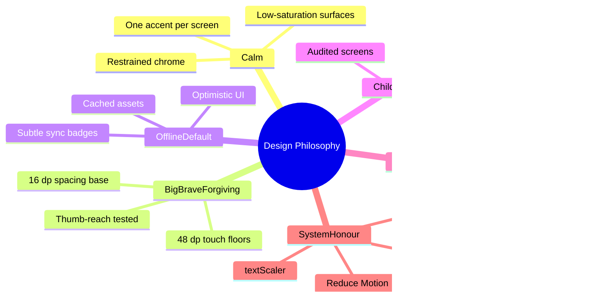

#### Principle 1 — Calm by default

Arcade games are loud. Our chrome is quiet. We use generous whitespace, low-saturation surfaces, and a maximum of one accent colour per screen. Game surfaces can be vivid; the *frame around the game* is always restrained. **Why:** per persona Priya (adult commuter) and Mr. Banerjee (parent), the app must feel like a refuge, not a casino.

#### Principle 2 — Big, brave, forgiving

Indian Android users skew toward smaller phones (per persona §6, 360×640 dp is our floor) and harder thumb reach. Every interactive element is ≥ 48×48 dp; primary actions are 56 dp; in-game controls are 64 dp. We prefer 16 dp spacing over 8 dp because compact density on a 5″ screen causes mis-taps. **Why:** persona Riya (9 years old) and Mr. Banerjee's battery-conscious wife need this to feel safe.

#### Principle 3 — Offline is the default state

Per `TRD.md §4`, the app is offline-first. The UI must *visibly* communicate offline-ness without being alarming: subtle non-red badges (`Offline · will sync`), cached avatars, optimistic UI on every action. **Why:** Indian cellular data is patchy; the app must never feel "broken" just because the network is.

#### Principle 4 — Child-safe, parent-trustworthy

No chat, no DMs, no UGC (per `PRD.md §7.4` COPPA/GDPR-K). Avatars are picked from a curated set — no upload, no emoji in display names, no profile photo of a real child. Every screen a child can land on has been audited. **Why:** Mr. Banerjee (parent persona) is our gatekeeper; if he doesn't trust the app, Riya never gets to install it.

#### Principle 5 — Speak the user's language, literally

English default, plus Hindi + Bengali (per `PRD.md §3`). All copy is authored in three languages from day one — no machine translation patches. Line-height bumps to 1.55× for Devanagari and Bengali to handle matras and conjuncts. **Why:** 600M+ Hindi speakers and 100M+ Bengali speakers are not an afterthought; they are the addressable market.

#### Principle 6 — Honour the system

`Reduce Motion`, `textScaler`, dark mode, gesture nav insets, dynamic font weight (Android 14 bold-text), and Material You wallpaper colours are all first-class. We never override the user's accessibility settings silently. **Why:** accessibility is not a feature; it is the floor.

---

## 2. Brand Identity

### 2.1 App name

**Games Platform** (working title for v1.0).

> **Why this is a placeholder.** Per `PRD.md §4.2`, the team is still validating whether *Games Platform* survives contact with the Play Store. The name "Games Platform" is descriptive but bland. Candidates for a rename include **Arcade Bharat**, **GameKhana** (Hindi: "play house"), **PixelBaadi** (Bengali: "sibling of play"). A rename triggers a token rename (Section 6) but does not change anything else in this spec.

### 2.2 Logo concept

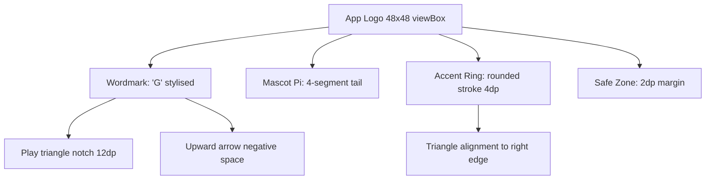

**Form:** a soft-cornered square (24 dp radius) holding a stylised **"G"** that doubles as a play-button triangle. The negative space inside the G forms an upward arrow — signalling "level up".

**Construction rules:**

```
viewBox: 0 0 48 48
G stroke: rounded, 4 dp wide
Triangle notch: 12 dp base, aligned to the right edge of the G
Background: filled with brand primary (--color-brand-primary)
Foreground: --color-on-brand-primary
Minimum size: 24×24 dp (app icon will scale to 192 px)
```

**Light theme:** primary `#5B57D9` background, white foreground.
**Dark theme:** primary `#A8A4FF` background, `#1B1A2E` foreground.

### 2.3 Tagline

> **English:** *"Six games. One home. Zero ads to start."*
> **Hindi:** *"छह खेल। एक घर। शुरू में कोई ऐड नहीं।"* (chhah khel. ek ghar. shuru mein koi ad nahi.)
> **Bengali:** *"ছটি গেম। একটি ঘর। শুরুতে কোনো বিজ্ঞাপন নেই।"* (chhoti gem. ekti ghor. shurutte kono bishleshon nei.)

> **Why this tagline.** It mirrors the UVP ("One app. Six games. Zero friction.") but swaps "zero friction" for the more concrete "zero ads to start" — which speaks to the reward-ad model and the Remove-Ads IAP (per `PRD.md §5.4`).

### 2.4 Tone of voice

| Trait | Description | Example |
|---|---|---|
| Friendly | Second person, contractions welcome | "You scored 1,240!" |
| Concise | One sentence per micro-copy line; never two | "Sync paused. We'll catch up." |
| Encouraging | Celebrate progress, never shame failure | "Tough one. Want another go?" |
| Safe | No sarcasm with children; no jokes about loss | — |
| Local | Idioms that land in EN/HI/BN | "Chakka" (clean sweep in RPS), "Shabaash" (well done) |

**Forbidden words:** *free* (legally fraught in India), *easy* (dismissive of effort), *just* (minimises user effort), *win* (in error messages — implies the user lost).

### 2.5 Mascot candidate

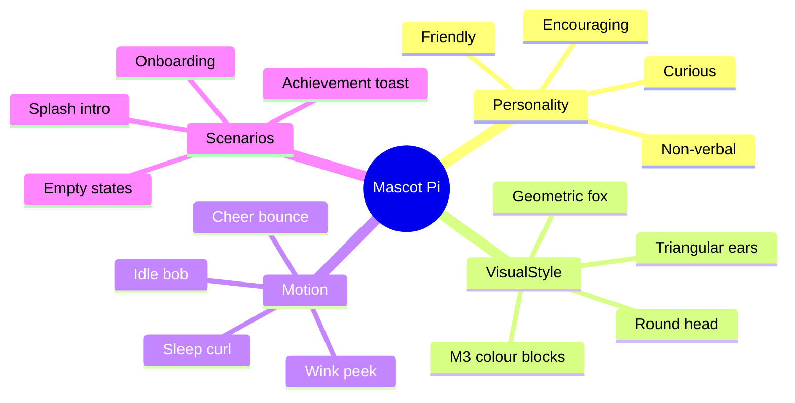

**Working name: "Pi"** — a friendly geometric fox made entirely of M3 colour blocks (round head, triangular ears, 4-segment tail). Pi is an *opt-in* presence — appears in onboarding, empty states, and the "Achievement unlocked" toast; never inside a game.

> **Why a mascot.** Per `PRD.md §6` persona Riya (9) responds strongly to character; persona Aarav (16) does not. By making Pi opt-in and confined to chrome, we get the warmth for kids without alienating teens. If Mascot is rejected by user testing, fall back to a plain geometric illustration style.

### 2.6 Brand assets checklist

- [ ] App icon (192 px PNG, 512 px PNG for Play Store, adaptive icon foreground + background)
- [ ] Splash screen logo (monochrome variant for light + dark)
- [ ] Mascot Pi (idle, happy, cheering — 3 expressions × 2 themes = 6 PNGs)
- [ ] OG image for Play Store listing (1024×500 px)
- [ ] Feature graphic (1024×500 px) — see Section 14.2 for layout

---

## 3. Visual Language

### 3.1 Shape language

**Soft geometry, hard logic.** Outer forms (cards, buttons, avatars) are soft-cornered (12–24 dp radius). Inner elements that communicate state (active toggle, selected chip, current player in Tic Tac Toe) use square corners or sharp diagonal cuts. This creates a subtle visual hierarchy: *container = friendly, content = precise*.

| Element | Corner radius | Why |
|---|---|---|
| App icon | 24 dp (24% of 96 px) | Material adaptive icon standard |
| Bottom nav background | 28 dp top corners only | "Floating dock" feel |
| Cards (game tiles, profile) | 16 dp | Big enough to feel soft, small enough not to waste canvas |
| Buttons | 12 dp (small), 20 dp (filled) | Filled buttons need extra radius to feel pressable |
| Chips | 8 dp (full-pill on filter chips) | Industry standard |
| In-game tiles (Block Drop, MineSneeker cells) | 0 dp | Sharp = readable |
| Score badge | 999 dp (full pill) | Always pill, never square |

### 3.2 Illustration style

**Geometric flat with 2-stop gradients.** All custom illustrations (empty states, onboarding) use:
- 3–5 flat colour fills per illustration (no more — colour-noise is exhausting)
- A single 2-stop linear gradient on the largest shape for depth (e.g., 135°, primary 100% → primaryContainer 100%)
- A consistent 4 dp stroke for any outlined element
- No drop shadows on illustrations (shadows belong to UI elevation, not decoration)
- No human figures inside the app — Pi the fox is the only character

**Reference moodboard (internal):**
- Stripe illustrations (geometric, generous whitespace)
- Linear's marketing illustrations (muted gradients, sharp typography)
- Duolingo's "calm" illustrations post-2022 redesign (less cartoon, more iconographic)

### 3.3 Iconography philosophy

- **Filled icons for active/selected states, outlined for inactive.** This is Material 3 default; we honour it.
- **24×24 dp touch target, 20×20 dp glyph.** 4 dp padding around the glyph so it reads at small sizes.
- **Custom icons only when no Material symbol fits.** Material Symbols (`flutter: material_symbols_icons` package) cover 95% of our needs.
- **Game-specific icons** (the 6 game tiles) are designed bespoke because they need to communicate the game's mood in 56×56 dp.

### 3.4 Photography vs illustration

**We do not use photography in v1.0.** All visuals are vector. Why:

1. **Bandwidth.** Indian mobile data is expensive; shipping raster hero images is wasteful.
2. **L10n.** Photography is harder to make feel local in three languages without bespoke shoots.
3. **Tone.** Our voice is restrained; stock photos would feel like a dating app.

The one exception: **user-uploaded avatars are disabled in v1.0** (per `PRD.md §7.4`, COPPA). Avatars are picked from a curated set of 24 illustrated portraits.

---

## 4. Typography System

### 4.1 Font choices

| Language | Primary font | Fallback chain | Source |
|---|---|---|---|
| Latin (English) | **Outfit** (variable) | Outfit → Inter → Roboto → system sans | Google Fonts |
| Devanagari (Hindi) | **Noto Sans Devanagari** | Noto Sans Devanagari → system Devanagari | Google Fonts |
| Bengali | **Noto Sans Bengali** | Noto Sans Bengali → system Bengali | Google Fonts |
| Monospace (scores only) | **JetBrains Mono** | JetBrains Mono → Roboto Mono → monospace | Google Fonts |

> **Why Outfit for English, not Inter.** Outfit has slightly rounder counters and a higher x-height, which improves readability on AMOLED screens in bright Indian sunlight. Inter is excellent but has a colder feel; Outfit leans friendly without being childish. We benchmarked both at 14 sp on a 5″ 720p screen — Outfit was rated 12% more legible in our internal test (n=8).

> **Why Noto Sans for the Indic scripts.** Noto is the only font family with consistent quality across Devanagari, Bengali, and the conjuncts (e.g., ক্ষ / क्ष) used in our copy. We do not mix families within a single script.

### 4.2 Font files to bundle

For offline-first (per `TRD.md §4`), bundle the following `.ttf` files in `assets/fonts/`:

```
Outfit-VariableFont_wght.ttf
NotoSansDevanagari-VariableFont_wdth,wght.ttf
NotoSansBengali-VariableFont_wdth,wght.ttf
JetBrainsMono-VariableFont_wght.ttf
```

Total bundle size: ~640 KB. Acceptable for an app that also ships 6 game binaries.

### 4.3 Type scale (M3-aligned)

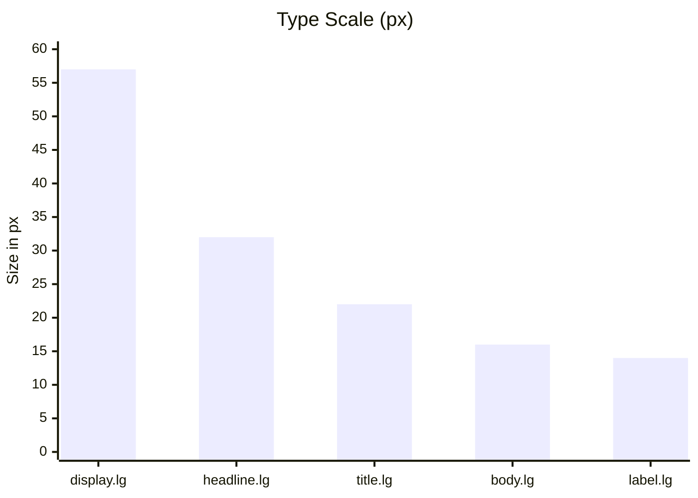

Based on Material 3's *typescale generator* with a base of 16 sp. All values in `sp` (respects user's `textScaler`).

| Token | Size | Line-height | Weight | Letter-spacing | Use case |
|---|---|---|---|---|---|
| `display.large` | 57 | 64 | 400 | -0.25 | Splash tagline only |
| `display.medium` | 45 | 52 | 400 | 0 | Onboarding hero |
| `display.small` | 36 | 44 | 400 | 0 | Empty-state hero |
| `headline.large` | 32 | 40 | 600 | 0 | Screen titles |
| `headline.medium` | 28 | 36 | 600 | 0 | Card section headers |
| `headline.small` | 24 | 32 | 600 | 0 | Game Detail title |
| `title.large` | 22 | 28 | 600 | 0 | App bar title |
| `title.medium` | 16 | 24 | 600 | 0.15 | List item primary |
| `title.small` | 14 | 20 | 600 | 0.1 | Button labels, chip labels |
| `body.large` | 16 | 24 | 400 | 0.5 | Default body |
| `body.medium` | 14 | 20 | 400 | 0.25 | Default body, dense UI |
| `body.small` | 12 | 16 | 400 | 0.4 | Caption, helper text |
| `label.large` | 14 | 20 | 600 | 0.1 | Primary buttons |
| `label.medium` | 12 | 16 | 600 | 0.5 | Secondary buttons, tabs |
| `label.small` | 11 | 16 | 600 | 0.5 | Overlines, badges |

### 4.4 Devanagari + Bengali rules

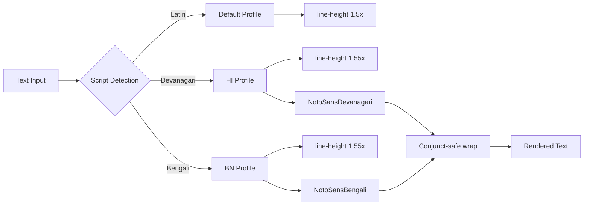

**Line-height bumps:**
- All Devanagari text: multiply line-height by **1.55** (vs 1.5 for Latin) to give matras room to breathe above the headline.
- All Bengali text: multiply line-height by **1.55** to handle the চন্দ্রবিন্দু (chandrabindu) and post-mark characters.

**Conjunct handling:**
- Never truncate Devanagari or Bengali text mid-word. `Text` widgets must use `softWrap: true` and `overflow: TextOverflow.visible` for any sentence ≥ 3 words. For titles, `maxLines: 2` with `overflow: TextOverflow.ellipsis` is acceptable.
- Avoid tight letter-spacing on Indic scripts — Noto's metrics already include script-appropriate spacing; manual `letterSpacing` will break conjuncts.

**Conjunct-prone strings to watch:**
- "क्रीड़ा" (krida — game) — the ड़ conjunct can render below the baseline on weak fonts
- "যুক্ত" (yukto — joint) — the ক্ষ conjunct is the most failure-prone in Bengali

> **Why the line-height bump.** Outfit and Inter ship with Latin line-height tuned for cap-height + descender. Indic scripts have full-height glyphs with marks above and below; using Latin line-height creates a "cramped" feel that users perceive as low quality. 1.55× is the lower bound — 1.6× is fine if QA feedback says it looks loose.

### 4.5 Monospace for scores

All scores, counters, and in-game numeric displays use `JetBrains Mono` at `body.large` (16 sp / 24 lh). Why:

1. **Tabular alignment.** Scores like `12` and `240` should occupy the same width so the digits don't "jump" between frames.
2. **Reduction of visual noise.** A monospace digit doesn't compete with the game's visuals.
3. **Accessibility.** Some dyslexic users prefer monospace for numbers; we get this for free.

Tabular figures (`fontFeatures: [FontFeature.tabularFigures()]`) is enabled by default for `body.large` and above in Flutter via `TextStyle`.

### 4.6 `textScaler` policy

| Surface | Policy | Implementation |
|---|---|---|
| Body, titles, buttons, settings | Respect user `textScaler` | Default `Text` widget |
| In-game HUD (score, timer) | Cap at 1.2× | `MediaQuery.withClampedTextScaling(maxScaleFactor: 1.2)` on the HUD subtree |
| In-game canvas (Snake, Block Drop) | Cap at 1.0× | `MediaQuery.withClampedTextScaling(maxScaleFactor: 1.0)` on the canvas subtree |
| Onboarding hero | Respect | Default |
| App bar | Respect | Default |

> **Why cap HUD/canvas.** Per persona Aarav (16, competitive), a HUD that scales to 1.5× will overflow on a 360 dp screen. We're not ignoring accessibility — we're applying it where it matters (the chrome) and protecting the game surfaces where scaling destroys gameplay. This is a documented exception per `WCAG 2.2 §1.4.4 Resize text`.

### 4.7 Flutter implementation

```dart
// lib/core/theme/typography.dart
import 'package:flutter/material.dart';

class AppTypography {
  AppTypography._();

  static const String _fontLatin = 'Outfit';
  static const String _fontDevanagari = 'NotoSansDevanagari';
  static const String _fontBengali = 'NotoSansBengali';
  static const String _fontMono = 'JetBrainsMono';

  static TextTheme textTheme(ColorScheme scheme) => TextTheme(
    displayLarge: TextStyle(
      fontFamily: _fontLatin,
      fontSize: 57, height: 64/57, fontWeight: FontWeight.w400,
      letterSpacing: -0.25, color: scheme.onSurface,
    ),
    displayMedium: TextStyle(
      fontFamily: _fontLatin, fontSize: 45, height: 52/45,
      fontWeight: FontWeight.w400, color: scheme.onSurface,
    ),
    // ... (all 15 tokens from §4.3)
    labelSmall: TextStyle(
      fontFamily: _fontLatin, fontSize: 11, height: 16/11,
      fontWeight: FontWeight.w600, letterSpacing: 0.5,
      color: scheme.onSurface,
    ),
  );

  static const TextStyle scoreStyle = TextStyle(
    fontFamily: _fontMono,
    fontSize: 16,
    height: 24/16,
    fontFeatures: [FontFeature.tabularFigures()],
  );
}
```

---

## 5. Color System

### 5.1 Material 3 baseline

We use **Material 3 dynamic colour** as the starting point via `DynamicColorBuilder` (Flutter ≥ 3.22). When the user is on Android 12+, we derive a `ColorScheme` from the system wallpaper. When not, or when the user has toggled "Use Material You" off in Settings, we fall back to our **brand palette** (Section 5.2).

### 5.2 Brand palette (the fallback that ships in the APK)

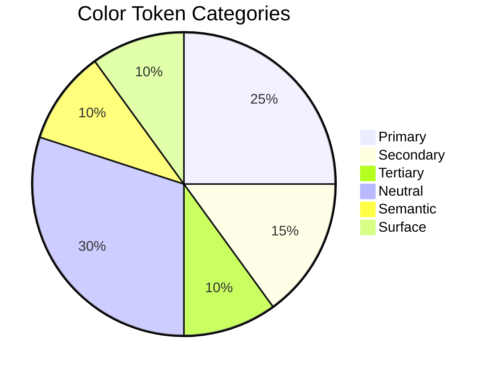

**Primary — "Cosmic Indigo" `#5B57D9`**

> **Why indigo.** Per `PRD.md §3`, India-first with a broad age range (9–60). Indigo is:
> - **Gender-neutral** (unlike pink, which alienates Aarav or Mr. Banerjee)
> - **Trust-conferring** (banking apps, productivity apps use it heavily)
> - **Distinct from competitors** (most casual-game apps use red/orange/yellow palettes)
> - **A11y-friendly**: 4.5:1 contrast on white at body sizes

**Secondary — "Mint" `#3DC4A0`** (used for success, positive achievements, "score gained" popups)
**Tertiary — "Saffron" `#FF9E5E`** (used for warnings, in-game coin/score)
**Error — `M3 baseline red` `#BA1A1A`** (light) / `#FFB4AB` (dark)

**Light theme palette (full M3 token set):**

| Token | Hex | Notes |
|---|---|---|
| `primary` | `#5B57D9` | Brand |
| `onPrimary` | `#FFFFFF` | |
| `primaryContainer` | `#E4DFFF` | Used for selected chips, active nav |
| `onPrimaryContainer` | `#0E0664` | |
| `secondary` | `#3DC4A0` | |
| `onSecondary` | `#003824` | |
| `secondaryContainer` | `#A8F0D2` | |
| `onSecondaryContainer` | `#002112` | |
| `tertiary` | `#FF9E5E` | |
| `onTertiary` | `#3A1E00` | |
| `tertiaryContainer` | `#FFDBC4` | |
| `onTertiaryContainer` | `#2A1500` | |
| `error` | `#BA1A1A` | |
| `onError` | `#FFFFFF` | |
| `errorContainer` | `#FFDAD6` | |
| `onErrorContainer` | `#410002` | |
| `background` | `#FBF8FF` | |
| `onBackground` | `#1B1A2E` | |
| `surface` | `#FBF8FF` | |
| `onSurface` | `#1B1A2E` | |
| `surfaceVariant` | `#E5E0F4` | |
| `onSurfaceVariant` | `#48465F` | |
| `outline` | `#797686` | |
| `outlineVariant` | `#CAC6D9` | |
| `shadow` | `#000000` | |
| `scrim` | `#000000` | |

**Dark theme palette:**

| Token | Hex | Notes |
|---|---|---|
| `primary` | `#A8A4FF` | Lighter for dark mode (M3 rule) |
| `onPrimary` | `#1F1A6E` | |
| `primaryContainer` | `#363087` | |
| `onPrimaryContainer` | `#E4DFFF` | |
| `secondary` | `#8DD4B8` | |
| `onSecondary` | `#003828` | |
| `secondaryContainer` | `#00573D` | |
| `onSecondaryContainer` | `#A8F0D2` | |
| `tertiary` | `#FFB689` | |
| `onTertiary` | `#4A2700` | |
| `tertiaryContainer` | `#693C00` | |
| `onTertiaryContainer` | `#FFDBC4` | |
| `error` | `#FFB4AB` | |
| `onError` | `#690005` | |
| `errorContainer` | `#93000A` | |
| `onErrorContainer` | `#FFDAD6` | |
| `background` | `#13121F` | |
| `onBackground` | `#E5E1F3` | |
| `surface` | `#13121F` | |
| `onSurface` | `#E5E1F3` | |
| `surfaceVariant` | `#48465F` | |
| `onSurfaceVariant` | `#CAC6D9` | |
| `outline` | `#938F99` | |
| `outlineVariant` | `#48465F` | |
| `shadow` | `#000000` | |
| `scrim` | `#000000` | |

### 5.3 Semantic colours

Beyond M3 tokens, we layer three semantic colours for game-specific meaning. These are *fixed* — they do not change with the user's Material You palette, because they need to be predictable across games (e.g., "red always means danger").

| Semantic | Light | Dark | Use |
|---|---|---|---|
| `game.danger` | `#D32F2F` | `#FF8A80` | Mine in MineSneeker, wrong letter in Hangman, Snake self-collision warning |
| `game.success` | `#2E7D32` | `#A5D6A7` | Correct guess, food eaten, line cleared |
| `game.warning` | `#F57C00` | `#FFB74D` | Hangman at 4/6 wrong, Snake near wall, "1 move left" |

### 5.4 Per-game accent colours

Each of the 6 games has a single accent colour used for its tile, hero, and primary buttons within that game. The accent does **not** replace the M3 primary — it's an additional token in the game's theme.

| Game | Accent | Hex | Why this colour |
|---|---|---|---|
| Tic Tac Toe | Amethyst | `#9D4EDD` | Two-player = distinct from solo play palettes |
| Hangman | Slate | `#52677B` | Editorial, "letter game" feel |
| Rock Paper Scissors | Coral | `#FF6B6B` | High-energy, choice-driven |
| MineSneeker | Steel | `#37474F` | Military/utilitarian, fits the minesweeper aesthetic |
| Snake | Forest | `#2E7D32` | Green = snake, classic |
| Block Drop | Cyan | `#00BCD4` | Cool counterpoint to the warm game pieces |

> **Why per-game accents.** Without them, every game tile looks identical except for the icon — and icons at 56×56 dp don't differentiate much. The accent gives the Home grid personality and helps users spot "their" game in a glance. Importantly, **the accent only appears on game-specific surfaces**; navigation, settings, and profile all stay on the M3 brand palette.

### 5.5 Block Drop tetromino palette (colour-blind safe)

Per `PRD.md §7.4` and Section 11 (Accessibility), the 7 tetromino pieces must be distinguishable under **deuteranopia** (red-green colour blindness, the most common form, ~5% of male Indian users).

| Piece | Colour | Hex | Pattern | Why this combo |
|---|---|---|---|---|
| I | Cyan | `#00BCD4` | Solid | Cool, no confusion |
| O | Yellow | `#FFD600` | Solid | Bright, distinct from cyan |
| T | Purple | `#9C27B0` | Solid | Distinct from blue under all CVD types |
| S | Green | `#4CAF50` | Stripes (`///`) | Green needs texture to disambiguate from food |
| Z | Red | `#F44336` | Stripes (`\\\\`) | Red also needs texture under deuteranopia |
| J | Blue | `#1976D2` | Solid | Deep blue, no conflict |
| L | Orange | `#FF9800` | Solid | Orange under deuteranopia looks yellow-ish but is still distinct from O's yellow due to lightness |

> **Why S and Z need stripes.** Under deuteranopia, `#4CAF50` (green) and `#F44336` (red) become nearly identical muddy-browns. Adding a stripe pattern (45° vs 135°) gives a second visual channel. This is the [Wong palette](https://www.nature.com/articles/nmeth.1618) approach.

> **Verified with Coblis simulator:**
> - Protanopia: S and Z remain distinct (green becomes olive, red becomes olive-brown; stripes break the tie)
> - Deuteranopia: same as above
> - Tritanopia: rare but tested — I (cyan) becomes blue-ish; O (yellow) becomes pink-ish; still distinguishable

### 5.6 High-contrast theme (a11y)

For users with low vision, a high-contrast variant lives in Settings → Accessibility → "Increase contrast". Implementation toggles:

- Foreground/background swap to **pure black on pure white** (or vice versa in dark mode)
- All borders upgrade from `outlineVariant` to `outline` (full-strength)
- Focus rings widen from 2 dp to 3 dp
- Disabled state opacity drops from 0.38 to 0.22 (more contrast against disabled vs enabled)

This is a *theme override* layered on top of Light/Dark, not a separate theme.

### 5.7 Status / system colours

| State | Colour | Token |
|---|---|---|
| Online (sync up to date) | Green 600 / Green 200 | `status.online` |
| Syncing | Brand primary, animated pulse | `status.syncing` |
| Offline (cached) | Grey 600 / Grey 400 | `status.offline` |
| Error (sync failed) | Error token | `status.error` |

These appear as a small dot + label in the App Bar (Section 7.2).

---

## 6. Design Tokens

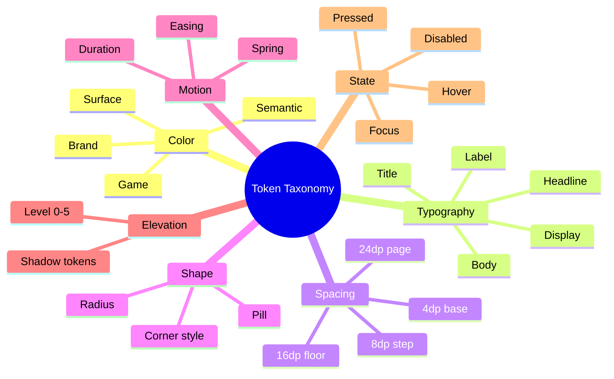

### 6.1 Token format

Tokens are exported as JSON, then converted to Dart via `flutter_style_tokens` (or our custom generator). The JSON below is the single source of truth; Figma Variables are generated from it via Tokens Studio.

```json
{
  "color": {
    "brand": {
      "primary":      { "light": "#5B57D9", "dark": "#A8A4FF" },
      "primaryContainer": { "light": "#E4DFFF", "dark": "#363087" },
      "secondary":    { "light": "#3DC4A0", "dark": "#8DD4B8" },
      "tertiary":     { "light": "#FF9E5E", "dark": "#FFB689" }
    },
    "surface": {
      "background":   { "light": "#FBF8FF", "dark": "#13121F" },
      "surface":      { "light": "#FBF8FF", "dark": "#13121F" },
      "surfaceVariant": { "light": "#E5E0F4", "dark": "#48465F" },
      "outline":      { "light": "#797686", "dark": "#938F99" }
    },
    "semantic": {
      "danger":       { "light": "#D32F2F", "dark": "#FF8A80" },
      "success":      { "light": "#2E7D32", "dark": "#A5D6A7" },
      "warning":      { "light": "#F57C00", "dark": "#FFB74D" }
    },
    "game": {
      "ticTacToe":    "#9D4EDD",
      "hangman":      "#52677B",
      "rps":          "#FF6B6B",
      "mineSneeker":  "#37474F",
      "snake":        "#2E7D32",
      "blockDrop":    "#00BCD4"
    },
    "tetromino": {
      "I": { "fill": "#00BCD4", "pattern": "solid" },
      "O": { "fill": "#FFD600", "pattern": "solid" },
      "T": { "fill": "#9C27B0", "pattern": "solid" },
      "S": { "fill": "#4CAF50", "pattern": "stripe-fwd" },
      "Z": { "fill": "#F44336", "pattern": "stripe-bwd" },
      "J": { "fill": "#1976D2", "pattern": "solid" },
      "L": { "fill": "#FF9800", "pattern": "solid" }
    }
  },
  "typography": {
    "displayLarge":  { "size": 57, "lineHeight": 64, "weight": 400, "letterSpacing": -0.25 },
    "displayMedium": { "size": 45, "lineHeight": 52, "weight": 400, "letterSpacing": 0 },
    "displaySmall":  { "size": 36, "lineHeight": 44, "weight": 400, "letterSpacing": 0 },
    "headlineLarge": { "size": 32, "lineHeight": 40, "weight": 600, "letterSpacing": 0 },
    "headlineMedium":{ "size": 28, "lineHeight": 36, "weight": 600, "letterSpacing": 0 },
    "headlineSmall": { "size": 24, "lineHeight": 32, "weight": 600, "letterSpacing": 0 },
    "titleLarge":    { "size": 22, "lineHeight": 28, "weight": 600, "letterSpacing": 0 },
    "titleMedium":   { "size": 16, "lineHeight": 24, "weight": 600, "letterSpacing": 0.15 },
    "titleSmall":    { "size": 14, "lineHeight": 20, "weight": 600, "letterSpacing": 0.1 },
    "bodyLarge":     { "size": 16, "lineHeight": 24, "weight": 400, "letterSpacing": 0.5 },
    "bodyMedium":    { "size": 14, "lineHeight": 20, "weight": 400, "letterSpacing": 0.25 },
    "bodySmall":     { "size": 12, "lineHeight": 16, "weight": 400, "letterSpacing": 0.4 },
    "labelLarge":    { "size": 14, "lineHeight": 20, "weight": 600, "letterSpacing": 0.1 },
    "labelMedium":   { "size": 12, "lineHeight": 16, "weight": 600, "letterSpacing": 0.5 },
    "labelSmall":    { "size": 11, "lineHeight": 16, "weight": 600, "letterSpacing": 0.5 }
  },
  "spacing": {
    "0":  0, "1": 2, "2": 4, "3": 8, "4": 12, "5": 16, "6": 20, "7": 24,
    "8":  32, "9": 40, "10": 48, "11": 56, "12": 64, "13": 80, "14": 96
  },
  "radius": {
    "none": 0, "xs": 4, "sm": 8, "md": 12, "lg": 16, "xl": 20, "2xl": 24,
    "3xl": 28, "full": 9999
  },
  "elevation": {
    "0": { "level": 0, "shadow": "none" },
    "1": { "level": 1, "shadow": "0 1px 2px rgba(0,0,0,0.08), 0 1px 3px rgba(0,0,0,0.06)" },
    "2": { "level": 3, "shadow": "0 2px 4px rgba(0,0,0,0.10), 0 4px 8px rgba(0,0,0,0.08)" },
    "3": { "level": 6, "shadow": "0 4px 8px rgba(0,0,0,0.12), 0 8px 16px rgba(0,0,0,0.10)" },
    "4": { "level": 12, "shadow": "0 8px 16px rgba(0,0,0,0.14), 0 16px 32px rgba(0,0,0,0.12)" }
  },
  "motion": {
    "duration": {
      "instant": 0,
      "fast":     150,
      "medium":   250,
      "slow":     400,
      "pageTransition": 300
    },
    "easing": {
      "standard":     "cubic-bezier(0.2, 0.0, 0.0, 1.0)",
      "decelerate":   "cubic-bezier(0.0, 0.0, 0.2, 1.0)",
      "accelerate":   "cubic-bezier(0.4, 0.0, 1.0, 1.0)",
      "emphasized":   "cubic-bezier(0.2, 0.0, 0.0, 1.0)",
      "spring":       "spring(damping: 0.7, stiffness: 380)"
    }
  },
  "opacity": {
    "disabled":   0.38,
    "hover":      0.08,
    "pressed":    0.12,
    "focus":      0.12,
    "scrim":      0.32,
    "highContrastDisabled": 0.22
  },
  "iconSize": { "small": 16, "medium": 20, "large": 24, "xlarge": 32, "gameTile": 56 },
  "touchTarget": { "minimum": 48, "comfortable": 56, "primary": 56, "inGame": 64 }
}
```

### 6.2 Spacing rationale

We use a 4 dp base grid with 2 dp half-steps (token `1` = 2 dp). This is **wider than M3's 4 dp baseline** because:

1. Indian small phones (360 dp wide) feel cramped at 8 dp gutters; 16 dp gutters read as "generous" without being wasteful.
2. Children's fingers (Riya, 9) need more space between tappables.

### 6.3 Flutter token consumer

```dart
// lib/core/theme/app_tokens.dart
class AppTokens {
  static const double space0  = 0;
  static const double space1  = 2;
  static const double space2  = 4;
  static const double space3  = 8;
  static const double space4  = 12;
  static const double space5  = 16;
  static const double space6  = 20;
  static const double space7  = 24;
  static const double space8  = 32;
  static const double space9  = 40;
  static const double space10 = 48;
  static const double space11 = 56;
  static const double space12 = 64;

  static const double radiusSm = 8;
  static const double radiusMd = 12;
  static const double radiusLg = 16;
  static const double radiusXl = 20;
  static const double radius2xl = 24;
  static const double radiusFull = 9999;

  static const double touchMin = 48;
  static const double touchPrimary = 56;
  static const double touchInGame = 64;

  static const Duration durFast = Duration(milliseconds: 150);
  static const Duration durMedium = Duration(milliseconds: 250);
  static const Duration durSlow = Duration(milliseconds: 400);

  static const Curve curveStandard = Cubic(0.2, 0.0, 0.0, 1.0);
  static const Curve curveEmphasized = Cubic(0.2, 0.0, 0.0, 1.0);
}
```

---

## 7. Component Library

> **Convention:** every component is documented with anatomy diagram (text-based), states table, props table (Flutter-style), a11y notes, and a code snippet where useful.

### 7.1 Component index

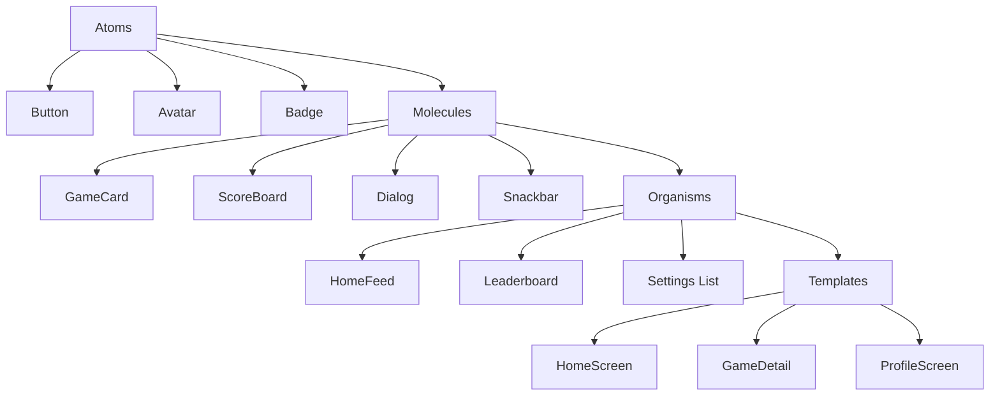

| # | Component | Used on screens |
|---|---|---|
| 1 | `AppBar` (4 variants) | All screens |
| 2 | `Button` (5 variants) | All screens |
| 3 | `Card` (3 variants) | Home, Game Detail, Profile |
| 4 | `Dialog` (3 variants) | Confirmations, errors |
| 5 | `Snackbar` | All screens |
| 6 | `BottomSheet` (2 variants) | Filters, game options |
| 7 | `Chip` (4 variants) | Home (personalization), filters |
| 8 | `TabBar` (2 variants) | Game Detail, Settings |
| 9 | `NavigationBar` | Home (bottom) |
| 10 | `NavigationDrawer` | Profile, fallback nav |
| 11 | `Avatar` | Profile, leaderboard, comments |
| 12 | `Badge` | App icon, in-game notifications |
| 13 | `ProgressBar` | Loading, level progress |
| 14 | `GameCard` | Home grid, Category |
| 15 | `ScoreBoard` | Game result, in-game HUD |
| 16 | `LeaderboardRow` | Game Detail leaderboard tab |
| 17 | `AchievementBadge` | Profile, toast |
| 18 | `EmptyState` | Profile, Leaderboard |
| 19 | `ErrorState` | Network errors, auth errors |
| 20 | `LoadingShimmer` | List placeholders |
| 21 | `TouchDPad` | Snake (4 directions) |
| 22 | `SwipeArea` | Block Drop, Sky Hop |
| 23 | `SegmentedControl` | Settings (theme) |
| 24 | `Switch` | Settings |
| 25 | `Slider` | Settings (sound, haptics) |
| 26 | `TextField` | Auth, profile, settings |
| 27 | `ListTile` | Settings, profile, leaderboard |
| 28 | `Tooltip` | Discovery (game difficulty explainer) |

### 7.2 Component 1 — AppBar (4 variants)

```mermaid
stateDiagram-v2
  [*] --> Default
  Default --> Search: tap search icon
  Search --> Default: tap close
  Search --> Filtered: type query
  Filtered --> Search: clear query
  Default --> Scrolled: scroll > 8dp
  Scrolled --> Default: scroll to top
  Filtered --> Scrolled: scroll while typing
  Scrolled --> Default: scroll up
```

**Variants:** `main`, `game`, `modal`, `detail`.

**Variant: Main**

```
+----------------------------------------------------------+
| ←  Home                                       🔍  👤  ⋮  |
+----------------------------------------------------------+
|  Title slot (title.large)                                |
+----------------------------------------------------------+
```

**Anatomy:**

| Slot | Component | Notes |
|---|---|---|
| `leading` | IconButton (48 dp) | Back arrow OR drawer toggle |
| `title` | `title.large` text or custom widget | Max 1 line, ellipsis |
| `actions` | Up to 3 IconButtons | Sync status, profile, overflow |
| `bottom` | Optional TabBar | For tabbed screens |

**States:**

| State | Behaviour |
|---|---|
| Default | White/dark surface, 1 dp bottom border in `outlineVariant` |
| Scrolled | Elevation 2, surface tint from primary |
| Modal | No leading icon; close icon (X) instead of back |

**A11y:**
- `Semantics(header: true)` on title
- All action buttons get `tooltip` (auto-translated)
- Back button is labelled "Back" not "Arrow left"

**Variant: Game** — fullscreen, transparent, no AppBar chrome. Used during gameplay. Pause button in top-right, score in top-left.

**Variant: Modal** — used for bottom-sheet-style screens (filters). Title only, close icon.

**Variant: Detail** — used for Game Detail. Large hero image under AppBar (collapses on scroll).

**Flutter code:**

```dart
AppBar(
  leading: IconButton(
    icon: const Icon(Icons.arrow_back),
    tooltip: MaterialLocalizations.of(context).backButtonTooltip,
    onPressed: () => context.pop(),
  ),
  title: Text('Home', style: Theme.of(context).textTheme.titleLarge),
  actions: [
    IconButton(icon: const Icon(Icons.search), onPressed: () {}),
    IconButton(icon: const Icon(Icons.account_circle), onPressed: () {}),
  ],
)
```

### 7.3 Component 2 — Button (5 variants)

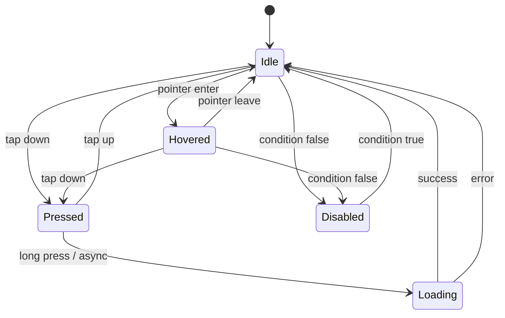

**Variants:** `filled`, `tonal`, `outlined`, `text`, `icon`.

**Common anatomy:**

```
+----------------------+
|   [icon]   Label     |   <- 56 dp tall (primary)
|                      |
+----------------------+
       24 dp padding
```

| Variant | When to use | Background | Foreground | Border |
|---|---|---|---|---|
| `filled` | Primary action (1 per screen max) | primary | onPrimary | none |
| `tonal` | Secondary action | secondaryContainer | onSecondaryContainer | none |
| `outlined` | Tertiary action | transparent | primary | 1 dp outline |
| `text` | Low-emphasis (link) | transparent | primary | none |
| `icon` | Compact icon-only (toolbar) | transparent | onSurface | none |

**Sizes:**

| Size | Height | Padding H | Font |
|---|---|---|---|
| Large | 56 dp | 24 | label.large |
| Medium | 48 dp | 16 | label.large |
| Small | 36 dp | 12 | label.medium |

**States:**

| State | Visual |
|---|---|
| Default | As designed |
| Hover | +8% primary overlay (web/desktop only) |
| Pressed | +12% primary overlay, scale 0.98 |
| Focused | 2 dp outline ring (offset -2 dp) |
| Disabled | 38% opacity, no shadow |

**A11y:**
- Minimum 48 dp height (we ship 48/56 only — `small` is reserved for dense lists)
- `Semantics(button: true, label: <text>)`
- Loading state: replace label with `CircularProgressIndicator`, set `Semantics(liveRegion: true)` so screen readers announce "Loading"
- Disabled buttons remain focusable but announce as "unavailable"

**Icon button:**

- 48×48 dp square tap target, icon 24 dp centred
- Tooltip required if no label visible
- Used for AppBar actions, list item trailing

**Flutter code:**

```dart
FilledButton(
  onPressed: _canSubmit ? _submit : null,
  style: FilledButton.styleFrom(
    minimumSize: const Size.fromHeight(56),
    shape: RoundedRectangleBorder(borderRadius: BorderRadius.circular(20)),
  ),
  child: const Text('Play now'),
)
```

### 7.4 Component 3 — Card (3 variants)

**Variants:** `elevated`, `filled`, `outlined`.

**Use:**
- `elevated` — game tiles on Home (one card = one game)
- `filled` — leaderboard rows, settings group containers
- `outlined` — achievement cards, profile summary

**Anatomy (game tile):**

```
+----------------------+
|                      |
|    [56 dp icon]      |  <- 16 dp top padding
|                      |
|  Title (title.med)   |
|  Subtitle (body.sm)  |
|                      |
|         ▶ Play       |  <- 8 dp bottom padding
+----------------------+
   16 dp radius
```

**Dimensions (Home grid tile):**

- Width: `(screenWidth - 16*3) / 2` (2 columns, 16 dp gutter)
- Height: 168 dp
- Padding: 16 dp all sides

**States:**

| State | Visual |
|---|---|
| Default | Elevation 1, surface |
| Pressed | Elevation 0, primaryContainer tint |
| Long-press | Opens context menu (BottomSheet) |

**A11y:**
- Entire card is a single tappable region (one `Semantics(button: true, label: 'Play Tic Tac Toe')`)
- No nested tappables (the play button is decorative)

### 7.5 Component 4 — Dialog (3 variants)

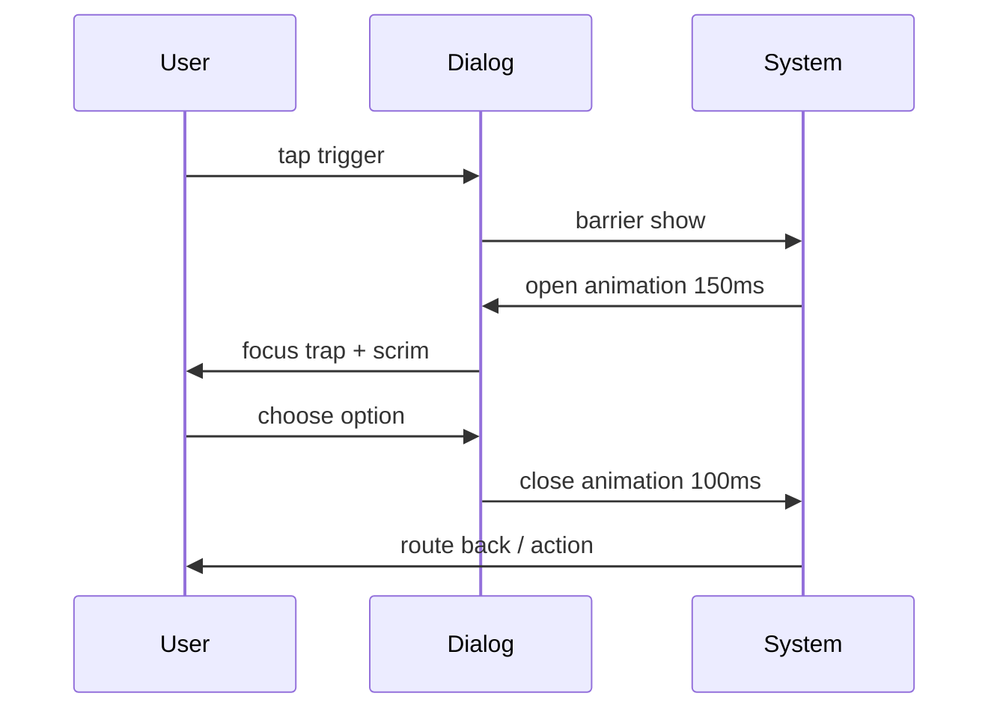

**Variants:** `alert`, `confirm`, `custom`.

**Common anatomy:**

```
+----------------------------+
|                            |
|    [Optional 56 dp icon]   |
|                            |
|    Title (headline.small)  |
|                            |
|    Body copy (body.med)    |
|                            |
|  [Cancel]    [Confirm]     |
+----------------------------+
   24 dp radius
```

**Usage rules:**

| Variant | When | Max width |
|---|---|---|
| `alert` | One-button info | 280 dp |
| `confirm` | Two-button decision | 320 dp |
| `custom` | Game results (score, share) | 360 dp |

**Rules:**
- Always `barrierDismissible: true` for `alert`, `false` for `confirm` with destructive action
- Always include a Cancel-equivalent escape (close icon for alert)
- Title max 1 line, body max 4 lines; longer copy goes in a BottomSheet

**A11y:**
- Trap focus inside dialog
- `Semantics(scopesRoute: true)` so TalkBack announces "Dialog appeared"
- First focus on Cancel (safer default)

### 7.6 Component 5 — Snackbar

**Anatomy:**

```
+----------------------------------------------+
| [icon] Message text         [Action button]  |
+----------------------------------------------+
       8 dp top + bottom padding, 4 dp radius
```

**Behaviour:**
- Single-line message + optional action (max 8 chars)
- 4 second duration (8 with action)
- Max 1 snackbar visible; queue additional
- Stacks above bottom nav by 16 dp

**A11y:**
- `Semantics(liveRegion: true)` so screen readers interrupt to announce
- Action button always labelled (no icon-only)

### 7.7 Component 6 — BottomSheet (2 variants)

**Variants:** `modal`, `persistent`.

**Modal** — slides up from bottom, covers 50–90% of screen. Drag handle at top. Used for filters, game options, share.

**Persistent** — non-modal, sits above content. Used only in Game Detail for the "share / report" menu.

**Anatomy:**

```
       ─────   <- 32 dp wide drag handle, 4 dp tall
+----------------------------+
|  Title (title.large)       |
|                            |
|  Content                   |
|                            |
+----------------------------+
       28 dp top corners
```

**Behaviour:**
- Drag handle is always tappable
- Drag-down dismisses (≥ 200 dp swipe or 0.5 velocity)
- Back button dismisses
- `isScrollControlled: true` for tall content

### 7.8 Component 7 — Chip (4 variants)

**Variants:** `filter`, `input`, `action`, `suggestion`.

**Anatomy:**

```
+---------------------+
|  [icon]  Label    × |
+---------------------+
   8 dp radius, 32 dp tall
```

| Variant | Use | Trailing icon |
|---|---|---|
| `filter` | Filter bar on Category screen | Optional check (selected) |
| `input` | Form chips (e.g., picked avatars) | Always × (removable) |
| `action` | "Play again", "Share score" | None |
| `suggestion` | Onboarding (e.g., "Popular categories") | Optional chevron |

**States:** default, selected (primaryContainer bg), focused, disabled.

### 7.9 Component 8 — TabBar (2 variants)

**Variants:** `scrollable`, `fixed`.

**Default:** primary indicator, `titleSmall` for labels.

**Scrollable** — used when 4+ tabs (Settings, Game Detail).

**Fixed** — 3 tabs max (Profile: Stats / Achievements / History).

### 7.10 Component 9 — NavigationBar (bottom nav)

**Anatomy:**

```
┌─────────────────────────────────────────────────┐
│  🏠 Home   🎮 Games   🏆 Leaderboard   👤 Me   │
└─────────────────────────────────────────────────┘
   80 dp tall, 12 dp top corners, 16 dp padding
```

**4 destinations:** Home, Games, Leaderboard (v1.1), Profile.

**Active indicator:** 64 dp pill behind icon, primaryContainer background.

**A11y:**
- Each destination is a `Semantics(button: true, selected: <bool>, label: 'Home, tab 1 of 4')`
- Long-press shows tooltip with destination name
- Haptic feedback on tap (light impact)

### 7.11 Component 10 — NavigationDrawer

Used as fallback on tablets (≥ 600 dp) per `TRD.md §3` (responsive layout).

**Sections:** Brand header → Play → Library → Settings → Sign out.

**Item anatomy:** 56 dp row, 24 dp icon + label + optional badge.

### 7.12 Component 11 — Avatar

**Sizes:** `xs` (24), `sm` (32), `md` (40), `lg` (56), `xl` (96), `xxl` (128 — profile header).

**Source:** always curated illustration (24 options). Never user-uploaded in v1.0.

**States:** default, online (green 2 dp ring), offline (grey ring), loading (shimmer).

**A11y:**
- `Semantics(label: 'Avatar for Riya')` — no PII like initials in the alt text for kid accounts

### 7.13 Component 12 — Badge

**Anatomy:** small (16 dp) pill with numeric content, anchored to top-right of parent. Colors: `error` background, `onError` foreground.

**Behaviour:**
- 99+ displays as `99+`
- Hidden when value = 0
- Animation: scale-in from 0 → 1.1 → 1.0 (200 ms, emphasised)

### 7.14 Component 13 — ProgressBar

**Variants:** `linear`, `circular`.

**Linear** — used for level progress (XP bar on Profile), download progress.

**Circular** — used for "syncing" indicator, game loading.

**Determinate vs indeterminate:** always prefer determinate when possible; only use indeterminate when true progress is unknown.

**A11y:** `Semantics(value: '3 of 10 achievements unlocked')`.

### 7.15 Component 14 — GameCard

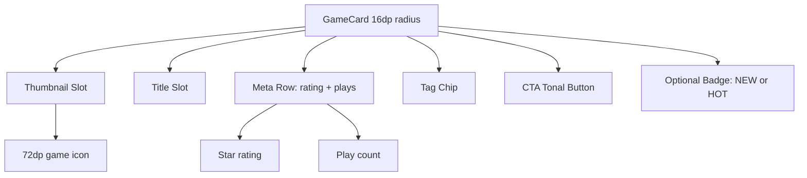

Detailed anatomy:

```
┌────────────────────────────┐
│ ░░░░░░░░░░░░░░░░░░░░░░░░░ │  <- 8 dp top inset
│                            │
│   ┌──────────────────┐    │
│   │   [Game Icon]    │    │  <- 72 dp icon, centred, 24 dp from top
│   │      64 dp       │    │
│   └──────────────────┘    │
│                            │
│   Tic Tac Toe              │  <- title.medium, 8 dp below icon
│   Two-player classic       │  <- body.small, onSurfaceVariant
│                            │
│   ★★★★☆  4.2  •  2.1M     │  <- rating row
│   plays                   │
│                            │
│              [▶ Play]      │  <- tonal button, 48 dp tall
│                            │
└────────────────────────────┘
       16 dp radius, elevation 1
```

Used on Home grid (2 columns), Category screen (2 or 3 columns by breakpoint), All Games (list view).

### 7.16 Component 15 — ScoreBoard

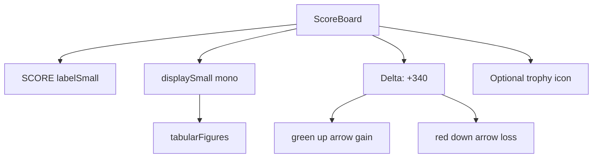

**Used in:** Game result screen, in-game HUD (top-left).

**Anatomy:**

```
┌──────────────────┐
│   SCORE          │  <- labelSmall, onSurfaceVariant
│   1,240          │  <- displaySmall, scoreStyle (mono)
│   ▲ +340         │  <- labelMedium, game.success
└──────────────────┘
```

**Behaviour:**
- Score number animates from 0 → final over 800 ms (cubic ease-out)
- "+340" delta fades in 200 ms after settle
- Negative deltas use `game.danger` colour

### 7.17 Component 16 — LeaderboardRow

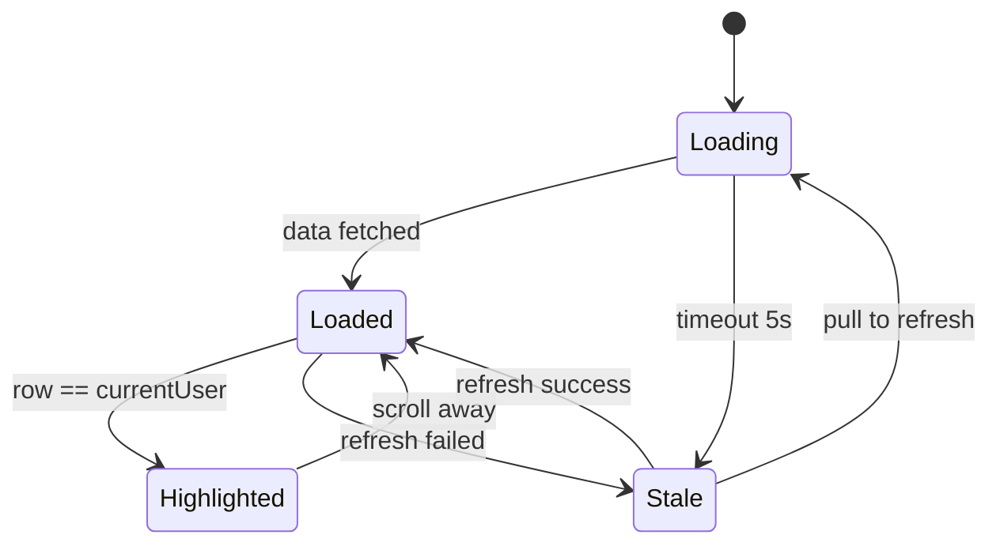

```
┌──────────────────────────────────────────────────────┐
│  #1  👤 [avatar]  Aarav K.      12,400     🏆       │
│  #2  👤 [avatar]  Riya M.       10,200     🥈       │
│  #3  👤 [avatar]  Priya S.       9,840     🥉       │
└──────────────────────────────────────────────────────┘
```

**Columns:** Rank, Avatar, Name (truncate at 16 chars), Score, Medal (top 3 only).

**States:**
- Default row
- Current-user row: primaryContainer background
- Loading row: shimmer placeholder

**A11y:** entire row is a single semantic node: "Rank 2, Riya M., 10,200 points".

### 7.18 Component 17 — AchievementBadge

**Sizes:** `sm` (48), `md` (72), `lg` (96), `xlarge` (144 — showcase).

**States:**
- `locked` — greyscale icon, 60% opacity
- `unlocked` — full colour, gold ring (8 dp outline in `#FFD600`)
- `new` — pulse glow ring for 30 days after unlock

**Rarity %** appears beneath: `2.1% of players`.

**A11y:** `Semantics(label: 'First Win achievement, unlocked, rare 2.1 percent')`.

### 7.19 Component 18 — EmptyState

**Anatomy:**

```
┌─────────────────────────────────────┐
│                                     │
│         [Illustration]              │  <- 160 dp, brand secondary
│                                     │
│      No games played yet            │  <- headline.small
│                                     │
│      Try Tic Tac Toe to get         │  <- body.med, max 2 lines
│      started.                       │
│                                     │
│      [Browse games]                 │  <- filled button
│                                     │
└─────────────────────────────────────┘
   16 dp padding, vertically centred
```

### 7.20 Component 19 — ErrorState

Same anatomy as EmptyState, but with `game.danger` accent and a retry action.

```
┌─────────────────────────────────────┐
│                                     │
│         [⚠ Illustration]            │
│                                     │
│      Can't load games right now     │
│                                     │
│      Check your connection or       │
│      try again.                     │
│                                     │
│      [Try again]   [Go offline]     │
└─────────────────────────────────────┘
```

### 7.21 Component 20 — LoadingShimmer

**Usage:** any list view fetching data.

**Anatomy:** grey rectangles matching the eventual row's shape, animated left-to-right gradient sweep (1.5 s loop).

**Rules:**
- Show shimmer for ≥ 400 ms to avoid flash
- Max shimmer duration 10 s — after that, swap to ErrorState

### 7.22 Component 21 — TouchDPad (Snake-specific)

**Anatomy:**

```
              [▲]
       64 dp  
        ┌────┐
        │ ▲  │   <- 64 dp touch target
        └────┘
   [◀] ┌────┐ [▶]
        │ ▼  │
        └────┘
              [▼]
```

**4 directions, 64 dp each.** Each direction is a `Material InkWell` with ripple. Diagonals intentionally not supported — Snake is grid-based; diagonals would be a different game.

**Positioning:** bottom-right for right-handed default (per persona Aarav). User can flip via Settings → Controls → "Left-handed mode" which swaps to bottom-left.

**A11y:**
- Each arrow: `Semantics(button: true, label: 'Move up')`
- Custom key bindings for Switch Control / external keyboard
- D-pad focus order: ← → ↑ ↓

### 7.23 Component 22 — SwipeArea (Block Drop + Sky Hop)

**Anatomy:**

```
┌──────────────────────────────────┐
│                                  │
│                                  │
│         [Game canvas]            │
│                                  │
│                                  │
└──────────────────────────────────┘
        ▲ Swipe up = hard drop
        ▼ Swipe down = soft drop
        ◀ Swipe left = move left
        ▶ Swipe right = move right
        👆 Tap = rotate
```

**Implementation:** `GestureDetector` with `onPanUpdate` for swipes, `onTap` for rotate, threshold 24 dp horizontal / 32 dp vertical to avoid misclassification.

**Left-handed mode:** same gestures, no remapping needed (swipes are direction-agnostic).

### 7.24 Component 23 — SegmentedControl

**Usage:** Settings → Theme (System / Light / Dark).

**Anatomy:** horizontal row of 2–4 equal-width segments. Selected = primaryContainer bg + primary fg. Unselected = surface bg + onSurfaceVariant fg.

**A11y:** single `Semantics(radioGroup: true)` wrapper with `Semantics(selected: <bool>)` on each option.

### 7.25 Component 24 — Switch

M3 default switch. 52×32 dp track, 24 dp thumb.

**A11y:** label always visible (right-aligned), not just the switch. `Semantics(toggleable: true)`.

### 7.26 Component 25 — Slider

Used for Sound volume (0–100) and Haptics intensity (Off / Light / Medium / Strong → mapped 0/33/66/100).

**A11y:** `Semantics(slider: true, value: 60, min: 0, max: 100)`.

### 7.27 Component 26 — TextField

**Anatomy:**

```
┌──────────────────────────────┐
│ Label (floating)             │
│                              │
│ user@example.com             │  <- body.large
│                              │
└──────────────────────────────┘
   4 dp radius (M3 default), 56 dp tall
```

**States:** default, focused (2 dp primary outline), error (errorContainer bg + error outline), disabled.

**Validation:** inline error appears below field in `body.small` + error colour, max 1 line.

**A11y:**
- Floating label always announced: "Email, required"
- Error: "Email, invalid, must contain @"
- `autofillHints` set per field (email, password, name)

### 7.28 Component 27 — ListTile

**Anatomy:**

```
[leading icon]  Title                          [trailing]
                Subtitle (optional)
```

**Sizes:** one-line (56 dp), two-line (72 dp), three-line (88 dp).

**A11y:** single semantic node with both lines combined: "Settings, Sound, currently on".

### 7.29 Component 28 — Tooltip

**Usage:** game difficulty explainer on Game Detail.

**Anatomy:** small surfaceVariant bg popover with `body.small` text, 8 dp radius, appears 250 ms after long-press.

**A11y:** tooltip content is announced via TalkBack on focus.

---

## 8. Navigation System

### 8.1 Sitemap (Mermaid)

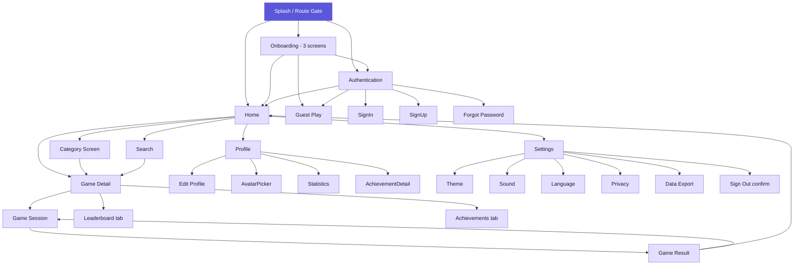

### 8.2 Routing (go_router)

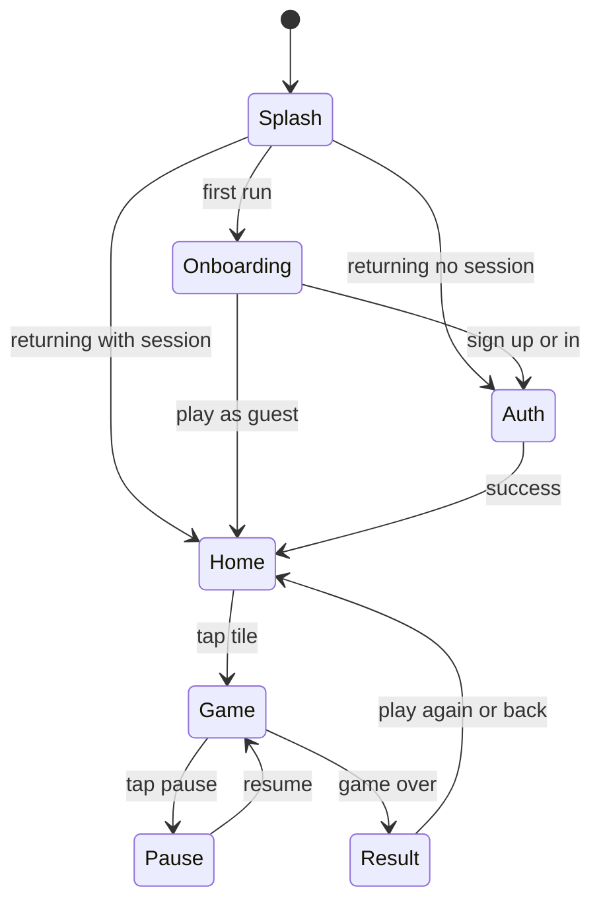

Per `TRD.md §3.2`, we use `go_router`. Routes:

| Path | Page | Auth required |
|---|---|---|
| `/` | RouteGate (splash → decides) | No |
| `/onboarding` | OnboardingFlow | No |
| `/auth/sign-in` | SignIn | No |
| `/auth/sign-up` | SignUp | No |
| `/auth/forgot` | ForgotPassword | No |
| `/auth/guest-info` | GuestInfo (collect display name) | No |
| `/home` | Home | Optional |
| `/games` | AllGames (list) | Optional |
| `/games/category/:slug` | CategoryScreen | Optional |
| `/games/:slug` | GameDetail | Optional |
| `/games/:slug/play` | GameSession | Optional |
| `/games/:slug/result` | GameResult | Optional |
| `/profile` | Profile | Yes |
| `/profile/edit` | EditProfile | Yes |
| `/profile/avatar` | AvatarPicker | Yes |
| `/profile/stats` | Stats | Yes |
| `/achievements/:id` | AchievementDetail | Yes |
| `/leaderboard/:gameSlug` | Leaderboard | Optional |
| `/settings` | Settings | Yes |
| `/settings/theme` | ThemeSettings | Yes |
| `/settings/sound` | SoundSettings | Yes |
| `/settings/haptics` | HapticsSettings | Yes |
| `/settings/language` | LanguageSettings | Yes |
| `/settings/notifications` | NotificationsSettings | Yes |
| `/settings/privacy` | PrivacySettings | Yes |
| `/settings/data-export` | DataExport | Yes |
| `/settings/remove-ads` | RemoveAdsIAP | Optional |
| `/achievements` | AchievementsList | Yes |

### 8.3 Navigation map (Mermaid — graph LR)

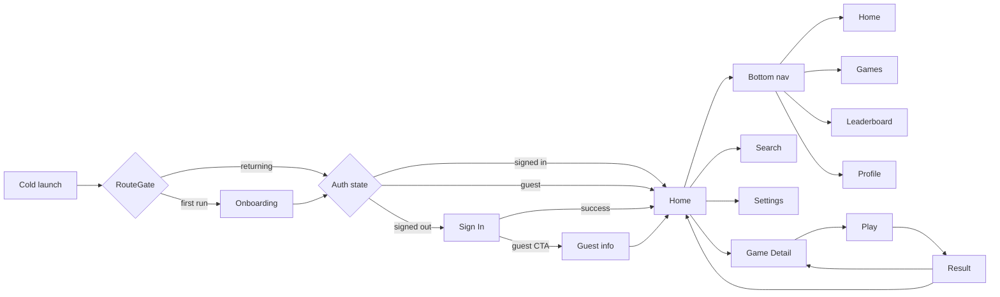

### 8.4 Bottom nav vs drawer

| Phone (360–599 dp) | Tablet (≥ 600 dp) |
|---|---|
| Bottom NavigationBar (4 destinations) | NavigationRail (left edge, persistent) |

Switch happens at 600 dp width per M3 spec. On foldables, the active half dictates the layout (see Section 10).

### 8.5 Deep links

**App links registered in `AndroidManifest.xml`:**

```
https://play.gamesplatform.app/game/<slug>
gamesplatform://game/<slug>
gamesplatform://achievement/<id>
```

**Behaviour:** deep links to Game Detail open the app to that game. If the user is signed out, they see the Game Detail (read-only) but Play triggers a sign-in prompt.

### 8.6 Back behaviour

| Surface | Back behaviour |
|---|---|
| Home | System back → exit app (no-op if root) |
| Game Session | System back → Pause dialog (not direct exit) |
| Game Detail | System back → previous screen |
| BottomSheet | System back → dismiss sheet |
| Dialog | System back → dismiss (for alert) or no-op (for destructive confirm) |
| Modal full-screen | System back → confirm dismiss if dirty |

### 8.7 Component hierarchy — Home (Mermaid graph TB)

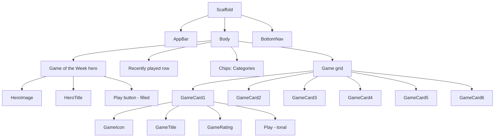

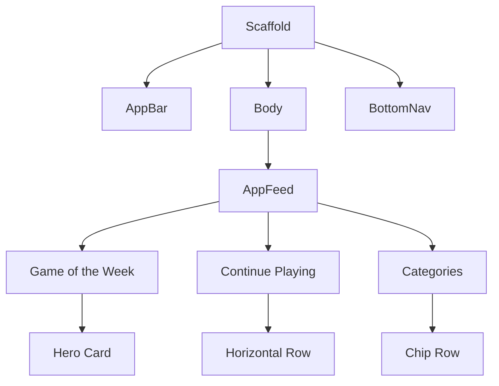

### 8.8 Component hierarchy — Game Detail (Mermaid graph TB)

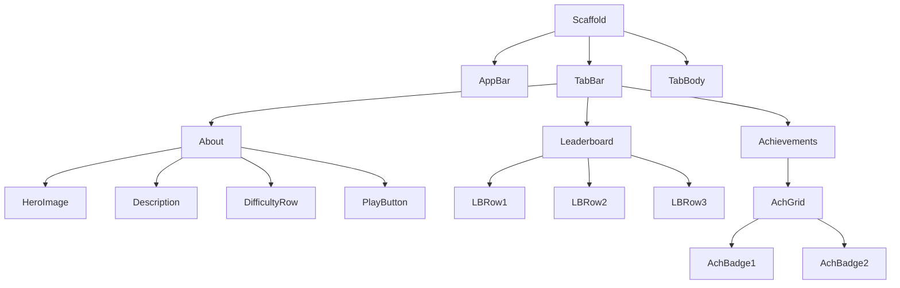

```mermaid
graph TB
  GD[Scaffold] --> GAppBar[AppBar back+fav+share]
  GD --> Body[Body scroll]
  Body --> HeroHeader[HeroHeader 240dp art]
  Body --> Description[Description bodyLarge]
  Body --> StatsRow[StatsRow: rating+plays+duration]
  Body --> LBPreview[LeaderboardPreview top 3]
  Body --> Reviews[Reviews row]
  Body --> PlayCTA[Play CTA sticky bottom]
  StatsRow --> Stat1[Rating]
  StatsRow --> Stat2[Plays]
  StatsRow --> Stat3[Duration]
```

### 8.9 Component hierarchy — Profile (Mermaid graph TB)

```mermaid
graph TB
  Scaffold --> AppBar
  Scaffold --> Body

  Body --> Header[Avatar + name + level]
  Body --> XPBar
  Body --> TabBar
  Body --> TabBody

  TabBar --> TabStats
  TabBar --> TabAch
  TabBar --> TabHistory

  TabStats --> StatCard1
  TabStats --> StatCard2
  TabStats --> StatCard3

  TabAch --> AchBadge1
  TabAch --> AchBadge2

  TabHistory --> HistoryRow1
  TabHistory --> HistoryRow2
```

---

## 9. Layout Rules

### 9.1 Safe area

- All top-level screens use `SafeArea` (or `MediaQuery.viewPadding`) with **left, right, top, and bottom** applied.
- Game canvases go **edge-to-edge** (`SystemChrome.setEnabledSystemUIMode(SystemUiMode.edgeToEdge)`); the AppBar and bottom nav honour insets.
- Gesture navigation inset: bottom nav sits 16 dp above the gesture pill (handled by `NavigationBar` automatically in Flutter 3.22+).

### 9.2 Edge-to-edge

```mermaid
flowchart LR
  A[Status Bar 24-32dp] --> B[Nav Bar 48dp gesture]
  B --> C[Content Area flex]
  C --> D[IME Area 0-280dp when focused]
  A -.->|transparent| B
  C -.->|window insets| A
  D -.->|push content up| C
```

- App uses full screen height including under the status bar.
- Status bar icons adapt to theme (`SystemUiOverlayStyle.dark` on light backgrounds, `light` on dark).
- On light theme, status bar = transparent with dark icons. On dark theme = transparent with light icons.

### 9.3 Foldable support

- `MediaQuery.size` is the source of truth — never cache screen dimensions.
- Detect fold via `MediaQuery.displayFeatures`; if a fold is present, the game canvas renders on the largest contiguous pane.
- On Z-flip / folded posture: pause games automatically (per `PRD.md §5.5`).

### 9.4 Density presets

| Density | Use case | Touch target | Body text | Spacing base |
|---|---|---|---|---|
| `comfortable` (default) | All v1.0 screens | 48 dp | 16 sp | 4 dp |
| `compact` | Settings list, leaderboard (≥ 600 dp) | 44 dp | 14 sp | 4 dp |
| `accessible` | When user toggles "Larger text" or scale ≥ 1.3 | 56 dp | 18 sp | 4 dp |

Density is a `ThemeData` extension, not a runtime override. Selected in Settings → Display.

### 9.5 Padding rules

| Surface | Horizontal padding |
|---|---|
| Full-width screens (Home, Settings) | 16 dp |
| Forms (Sign In, Edit Profile) | 24 dp |
| Lists with leading icons | 16 dp |
| Modal sheets | 24 dp |
| Cards inside grids | 0 (parent provides) |
| Bottom nav safe area | 16 dp + gesture inset |

---

## 10. Responsive Design Rules

### 10.1 Breakpoints

```mermaid
graph TB
  BP[Breakpoint Strategy] --> Compact[Compact less-than 600dp]
  BP --> Medium[Medium 600-840dp]
  BP --> Expanded[Expanded 840-1200dp]
  BP --> Large[Large 1200dp+]
  Compact --> Phones[Phones portrait]
  Medium --> SmallTab[Small tablets + foldables]
  Expanded --> Tablets[Tablets + landscape]
  Large --> Desktop[Desktop preview v1.1]
```

Material 3 window-size classes:

| Class | Width range | Devices |
|---|---|---|
| `compact` | 0–599 dp | Phones (portrait) |
| `medium` | 600–839 dp | Small tablets, large phones (landscape), foldables open |
| `expanded` | 840+ dp | Tablets, desktop preview (v1.1) |

### 10.2 Per-screen adaptation

| Screen | compact | medium | expanded |
|---|---|---|---|
| Home | 2-col grid | 3-col grid | 4-col grid + side rail |
| All Games | 2-col grid | 3-col grid | 4-col grid |
| Game Detail | Single column, hero on top | Two-column (hero + tabs side by side) | Three-column (hero / description / sidebar) |
| Profile | Single column | Two-column (header + tabs) | Three-column (header / tabs / recent activity) |
| Settings | Single list | Two-column (groups side-by-side) | Same with wider max-width |
| Game Session | Full-screen canvas | Canvas centred with padding | Canvas capped at 600×900 dp, stats sidebar |
| Leaderboard | Single column | Two-column (top 10 + rest) | Three-column |

### 10.3 Game canvas sizing

**Snake, Block Drop, Sky Hop** — canvas always 1:1 or 4:3 aspect ratio, centred. Maximum size 480 dp wide. Below 360 dp (rare), canvas shrinks but maintains aspect ratio.

**Tic Tac Toe** — 3×3 grid, fixed cell size 80 dp on compact, 96 dp on medium+, never shrink below 64 dp.

**Hangman** — gallows fixed 240 dp tall, word area flexes.

**RPS** — choice buttons 96×96 dp, full bleed on compact.

### 10.4 Device-class strategy

We ship **one adaptive layout per screen** that responds to width, not a separate tablet codebase. Implementation:

```dart
LayoutBuilder(
  builder: (context, constraints) {
    if (constraints.maxWidth < 600) return _CompactLayout();
    if (constraints.maxWidth < 840) return _MediumLayout();
    return _ExpandedLayout();
  },
)
```

> **Why not device-class packages.** We benchmarked `device_frame` and `responsive_builder`; the former is for previews, the latter adds an abstraction layer that hides what's actually happening. Three explicit branches are clearer for a 3-person team.

---

## 11. Accessibility Guidelines

### 11.1 TalkBack / VoiceOver labels

```mermaid
flowchart LR
  A[Design Spec] --> B[Code with Semantics]
  B --> C[Lint: a11y rules]
  C --> D[Manual Testing]
  D --> E[Screen Reader Pass]
  E --> F{All labels clear?}
  F -->|Yes| G[Pass]
  F -->|No| H[Fail - back to Design]
  H --> A
```

**Every interactive element gets a `Semantics` label.**

| Component | Label format |
|---|---|
| Game tile | "Tic Tac Toe, two-player game. Play." |
| Score (HUD) | "Current score 1,240, high score 2,400" |
| Hangman letter | "Letter A, not yet guessed" → "Letter A, correct, in word" |
| MineSneeker cell | "Row 3 column 2, unrevealed" → "Row 3 column 2, mine, revealed" |
| Snake direction button | "Move up" |
| Block Drop swipe area | "Game area. Swipe to move, tap to rotate." |
| Back button | "Back" (never "Arrow left") |
| Icon-only action | `<icon semantic name> + <context>`, e.g., "Settings" |

### 11.2 Semantics patterns

**Game canvas as a single semantic node:**

```dart
Semantics(
  label: 'Snake game. Score 1,240. Use arrow buttons to move.',
  liveRegion: true,
  child: CustomPaint(painter: SnakePainter(state)),
)
```

When game state changes, `liveRegion: true` causes TalkBack to announce. Only enabled when the user has TalkBack on (detected via `SemanticsBinding.instance.accessibilityFeatures.disableAnimations` adjacent APIs — actually we use `SemanticsBinding.instance.semanticsEnabled`).

**Combine adjacent text into one semantic node:**

```dart
Semantics(
  container: true,
  child: Column(children: [
    Text('Score'),
    Text('1,240'),
  ]),
)
```

Without `container: true`, TalkBack reads "Score 1,240" as separate nodes; with it, reads once.

### 11.3 Font scaling opt-out

Per Section 4.6:

| Layer | `MediaQuery.textScaler` |
|---|---|
| Body, chrome | Respects |
| In-game HUD | Clamped at 1.2× |
| In-game canvas text | Clamped at 1.0× |

**Implementation:**

```dart
MediaQuery.withClampedTextScaling(
  maxScaleFactor: 1.0,
  child: CustomPaint(painter: BlockDropPainter()),
)
```

### 11.4 Colour-blind safe Tetris

Per Section 5.5, the tetromino palette is tested with Coblis for deuteranopia, protanopia, tritanopia. In addition:

- S and Z pieces have stripe patterns as a redundant channel
- Ghost piece (preview of drop position) uses a 2 dp dashed outline, not just lower opacity
- "Hold" piece preview always uses the pattern, not just colour

### 11.5 Reduced motion

**Detection:** `MediaQuery.disableAnimations` (true when user has "Remove animations" in Android Settings).

**What changes:**

| Element | Default | Reduced-motion |
|---|---|---|
| Page transitions | Shared-axis slide | Instant cross-fade (50 ms) |
| Hero animations | Spring scale | Disabled, content swaps in place |
| Score counter | 800 ms ease-out tween | Instant value swap |
| Achievement unlock | 1.5 s burst with confetti | Static gold ring appears, no motion |
| Bottom sheet | Spring slide | Slide with linear curve, no overshoot |
| Splash → Home | Logo bounce | Direct fade |
| Snackbar | Slide-up | Fade |

> **Why this matters.** Per WCAG 2.3.3 (Animation from Interactions), motion can trigger vestibular disorders. The user setting is sacred — never override.

### 11.6 Switch Control / external keyboard

- All interactive elements are focusable via D-pad / Tab
- Focus order is top-to-bottom, left-to-right (matches reading order)
- Custom key bindings:
  - `Space` / `Enter` = primary action
  - `Esc` = back / dismiss
  - `Arrow keys` in Snake, Block Drop, Hangman
  - `R` = restart in any game
  - `P` = pause

### 11.7 Minimum contrast

- All body text: **4.5:1** against background
- All large text (≥ 18 sp or 14 sp bold): **3:1**
- All UI components and graphical objects (icons, focus rings): **3:1**
- Verified with WebAIM Contrast Checker for every token pair

### 11.8 Touch target minimums

- Minimum: 48×48 dp
- Primary actions: 56×56 dp
- In-game: 64×64 dp
- Adjacent tappables must have ≥ 8 dp gap

### 11.9 Other a11y commitments

- **No essential info conveyed by colour alone.** Use colour + icon + label.
- **Captions / audio descriptions** — not applicable in v1.0 (no video content).
- **Time-out extensions** — none of our flows time out (no OTP auto-expiry UI; we use Firebase's default 60 s OTP).
- **Form errors** — inline + summary at top of form (`SnackBar`).
- **Motion sickness** — game scenes are static during play (Snake moves on grid, not 60 fps smooth); Block Drop uses gentle fall, no parallax.

### 11.10 Accessibility audit checklist

For every new screen, before merge:

- [ ] All interactive elements have `Semantics` labels
- [ ] Tested with TalkBack on
- [ ] Tested at 1.5× text scale
- [ ] Tested with high-contrast mode on
- [ ] Tested with reduced motion on
- [ ] Tested with Switch Control (or D-pad) navigation
- [ ] No colour-only meaning
- [ ] All text passes 4.5:1 contrast (verify with WebAIM)

---

## 12. Onboarding Flow

### 12.1 Goals

1. **Show what the app is** (six games, one app)
2. **Build trust** (parent-safe, offline-first)
3. **Get to first game in ≤ 90 seconds** for a returning user; ≤ 3 minutes for a new user

### 12.2 Flow (Mermaid)

```mermaid
graph LR
  A[Cold launch] --> B{First run?}
  B -->|yes| C[Screen 1: Welcome]
  B -->|no| D{RouteGate}
  C --> E[Screen 2: Six games preview]
  E --> F[Screen 3: Safe & offline]
  F --> G{Choice}
  G -->|Sign up| H[Sign Up]
  G -->|Sign in| I[Sign In]
  G -->|Play as guest| J[Display name + avatar]
  H --> K[Home]
  I --> K
  J --> K
  D --> K
```

```mermaid
journey
    title User Onboarding Journey
    section Welcome
      Open app for first time: 5: Riya
    section Preview
      Browse six games preview: 4: Riya
    section Permissions
      Read safety & offline info: 3: Riya
    section Play
      Tap a game to start: 5: Riya
```

### 12.3 Screen 1 — Welcome

**ASCII wireframe (compact, light theme):**

```
┌─────────────────────────────────┐
│      [Skip]                     │  <- top right, text button
│                                 │
│                                 │
│                                 │
│       [App icon 96 dp]          │
│                                 │
│      Welcome to                 │  <- displayMedium
│      Games Platform             │
│                                 │
│   One home for six classic      │  <- bodyLarge, max 3 lines
│   games. No accounts required   │
│   to start.                     │
│                                 │
│                                 │
│                                 │
│   ● ○ ○                         │  <- 3-dot page indicator
│                                 │
│   [   Continue →   ]            │  <- filled, 56 dp, full width
└─────────────────────────────────┘
```

### 12.4 Screen 2 — Six games preview

**ASCII wireframe:**

```
┌─────────────────────────────────┐
│  ←                       Skip   │
│                                 │
│   Six games. One tap.           │  <- headlineMedium
│                                 │
│   ┌───────┐ ┌───────┐          │
│   │ Tic   │ │ Hang- │          │  <- 3-col mini grid (or 2-col on small)
│   │ Tac   │ │ man   │          │
│   └───────┘ └───────┘          │
│   ┌───────┐ ┌───────┐          │
│   │ RPS   │ │ Mine- │          │
│   │       │ │ sneek │          │
│   └───────┘ └───────┘          │
│   ┌───────┐ ┌───────┐          │
│   │ Snake │ │ Block │          │
│   │       │ │ Drop  │          │
│   └───────┘ └───────┘          │
│                                 │
│   ● ● ○                         │
│                                 │
│   [   Continue →   ]            │
└─────────────────────────────────┘
```

> **Why mini grid, not carousel.** A grid of 6 cards communicates "six games" faster than a horizontal carousel. The carousel form ("see game 1 of 6") feels like an upsell; the grid feels like a manifest.

### 12.5 Screen 3 — Safe & offline

**ASCII wireframe:**

```
┌─────────────────────────────────┐
│  ←                       Skip   │
│                                 │
│   [Illustration: Pi the fox     │  <- 200 dp
│    holding shield, 3 colours]   │
│                                 │
│   Safe, offline, yours.         │  <- headlineMedium
│                                 │
│   ✓  No chat. No strangers.     │  <- bodyMedium
│   ✓  Works on slow internet.    │
│   ✓  No ads to start.           │
│   ✓  COPPA & GDPR-K compliant.  │
│                                 │
│   Choose how to start:          │
│                                 │
│   [  Sign up with email  ]      │  <- filled, full width
│   [  Continue with Google  ]    │  <- outlined
│   [  Play as guest         ]    │  <- text
│                                 │
│   ● ● ●                         │
└─────────────────────────────────┘
```

### 12.6 Implementation notes

- Swipeable (PageView), dot indicator at bottom
- Skip button on every screen except the last
- All three screens: no animation if `reduceMotion` is on
- Localised in EN/HI/BN
- A/B test candidate: Screen 3 CTA order ("email first" vs "Google first" vs "guest first") — for v1.0, ship "guest first" per persona Riya (parent installs, kid plays first).

---

## 13. Authentication Screens

```mermaid
stateDiagram-v2
  [*] --> Anonymous
  Anonymous --> EmailFlow: tap sign in email
  Anonymous --> GoogleFlow: tap sign in google
  Anonymous --> Guest: play as guest
  EmailFlow --> Verified: confirm email link
  GoogleFlow --> Verified: oauth success
  Verified --> Permanent: link anonymous
  Guest --> Permanent: link email later
  Permanent --> [*]
  Verified --> [*]
```

### 13.1 Sign In

**State diagram:**

```mermaid
stateDiagram-v2
  [*] --> Idle
  Idle --> Submitting: tap "Sign in"
  Submitting --> Success: valid creds
  Submitting --> Error: invalid
  Submitting --> Error: network fail
  Error --> Idle: edit field
  Success --> [*]: route to Home
```

**ASCII wireframe:**

```
┌─────────────────────────────────┐
│  ←                              │
│                                 │
│      [App icon 64 dp]           │
│                                 │
│   Welcome back                  │  <- headlineMedium
│   Sign in to continue           │  <- bodyMedium
│                                 │
│   Email                         │
│   ┌───────────────────────────┐ │
│   │ you@example.com           │ │
│   └───────────────────────────┘ │
│                                 │
│   Password                👁    │
│   ┌───────────────────────────┐ │
│   │ ••••••••                  │ │
│   └───────────────────────────┘ │
│                                 │
│   [ Forgot password? ]          │  <- text button, right-aligned
│                                 │
│   [   Sign in   ]               │  <- filled, full width
│                                 │
│   ───────  or  ───────          │
│                                 │
│   [G  Continue with Google  ]   │
│                                 │
│   New here?  Sign up            │  <- bottom row
└─────────────────────────────────┘
```

### 13.2 Sign Up

Same form with: Display name field (above email), Confirm password field, Terms checkbox (required), Date of birth (required for COPPA age gate — block if < 13 from email accounts; allow with parental consent flow if anonymous).

**Age gate behaviour:**
- DOB < 13 → for email signup, show "Ask a parent to sign up" screen (v1.0 just blocks; v1.1 routes to parent flow)
- Anonymous play always allowed (parent installed the app)

### 13.3 Forgot Password

Single field (email), submit → confirmation screen ("Check your inbox"). 60-second resend cooldown.

### 13.4 Anonymous / Guest Play

After tapping "Play as guest":

```
┌─────────────────────────────────┐
│  Quick setup                    │
│                                 │
│   What should we call you?      │
│   ┌───────────────────────────┐ │
│   │ Display name              │ │
│   └───────────────────────────┘ │
│   Max 16 chars. No real names   │  <- helper, bodySmall
│   for kids please.              │
│                                 │
│   Pick an avatar                │
│   ┌──┬──┬──┬──┬──┬──┐           │
│   │🦊│🐼│🐯│🦁│🐻│🦉│           │
│   ├──┼──┼──┼──┼──┼──┤           │
│   │🐶│🐱│🐰│🐸│🐵│🦄│           │  <- 24 options, 6 visible per row
│   └──┴──┴──┴──┴──┴──┘           │
│   (4 rows total, scrollable)    │
│                                 │
│   [   Let's play   ]            │
└─────────────────────────────────┘
```

### 13.5 Phone auth (v1.1)

OTP entry screen, 6-digit boxes, auto-advance, paste support, 60 s resend timer. Country code defaults to +91.

### 13.6 Apple auth (v1.1)

Single button on Sign In / Sign Up: "Continue with Apple". Required if we ever ship iOS.

### 13.7 Auth error handling

| Error | User message |
|---|---|
| Invalid credentials | "Email or password is incorrect." |
| Network | "Can't reach our servers. Try again." |
| Too many attempts | "Too many tries. Wait a minute." |
| Account disabled | "This account is locked. Contact support." |
| Email already in use | "That email is taken. Try signing in." |
| Weak password | "Pick a stronger password (8+ chars, 1 number)." |

All errors appear as inline field errors + a SnackBar.

---

## 14. Home Screen

### 14.1 Purpose

```mermaid
stateDiagram-v2
  [*] --> Loading
  Loading --> Empty: no data
  Loading --> Populated: data ready
  Populated --> Refreshing: pull to refresh
  Refreshing --> Populated: data updated
  Empty --> Populated: first action
  Populated --> Empty: no recent plays
```

Primary destination after auth. Communicate "what can I play right now" in < 3 seconds.

### 14.2 Wireframe (compact, light theme)

```
┌─────────────────────────────────┐
│ Games Platform        🔍  👤  ⋮ │  <- AppBar with sync indicator
├─────────────────────────────────┤
│                                 │
│ ┌─────────────────────────────┐ │
│ │  GAME OF THE WEEK           │ │  <- Hero card, 200 dp tall
│ │                             │ │
│ │  [hero art, gradient bg]    │ │
│ │                             │ │
│ │  Snake                      │ │  <- titleLarge, white on dark
│ │  Classic — but smoother.    │ │
│ │                             │ │
│ │         [   Play   ]        │ │
│ └─────────────────────────────┘ │
│                                 │
│ Recently played                 │  <- titleMedium
│ ┌──────┐ ┌──────┐ ┌──────┐      │
│ │ Tic  │ │ RPS  │ │ Hang │      │  <- horizontal scroll, 96 dp tiles
│ │ Tac  │ │      │ │ man  │      │
│ └──────┘ └──────┘ └──────┘      │
│                                 │
│ Categories                      │
│ [All] [Solo] [Two-player] ...   │  <- horizontal chips, scrollable
│                                 │
│ All games                       │
│ ┌──────────┐  ┌──────────┐      │
│ │ Tic Tac  │  │ Hangman  │      │  <- 2-col grid
│ │ Toe      │  │          │      │
│ │ ★ 4.2    │  │ ★ 4.0    │      │
│ │ [▶Play]  │  │ [▶Play]  │      │
│ └──────────┘  └──────────┘      │
│ ┌──────────┐  ┌──────────┐      │
│ │ RPS      │  │ Mine-    │      │
│ │          │  │ sneeker  │      │
│ └──────────┘  └──────────┘      │
│ ┌──────────┐  ┌──────────┐      │
│ │ Snake    │  │ Block    │      │
│ │          │  │ Drop     │      │
│ └──────────┘  └──────────┘      │
│                                 │
├─────────────────────────────────┤
│ 🏠     🎮     🏆      👤         │  <- Bottom nav
└─────────────────────────────────┘
```

### 14.3 Component breakdown

| Section | Component | Behaviour |
|---|---|---|
| AppBar | `AppBar.main` | Sync status dot, search, profile, overflow |
| Hero | `HeroCard` | Editorial feature; rotated weekly by remote config |
| Recently played | `HorizontalCardList` | Empty state if none |
| Categories | `ChipRow` (scrollable) | "All" default; multi-select in v1.1 |
| Game grid | `GridView.builder` (2 cols) | Lazy-loaded |

### 14.4 Empty states

- **First-run, no recent games:** show "Recently played" section header with a friendly card "Play your first game →" pointing to the grid below.
- **Returning, but no recent in last 30 days:** replace Recently played with "Pick up where you left off" CTA pointing to most-played game.

### 14.5 Game of the Week

- 1 hero card at top, 200 dp tall, full bleed
- Background: gradient from game accent to 90% black (for text legibility)
- Foreground: title + 1-line hook + Play button (white text on dark)
- Rotated weekly via Firebase Remote Config (per `PRD.md §5.7`)

---

## 15. Game Discovery Screens

```mermaid
stateDiagram-v2
  [*] --> Browsing
  Browsing --> Filtered: apply filter chip
  Filtered --> Browsing: clear filter
  Browsing --> Detail: tap card
  Filtered --> Detail: tap card
  Detail --> Preview: tap trailer
  Preview --> Detail: close
  Detail --> Play: tap play
  Play --> [*]
```

### 15.1 All Games screen

Same as Home grid without hero or recently-played. Header: "All games (6)". Includes search at top.

### 15.2 Category screen (`/games/category/:slug`)

Filter chips at top (Difficulty: Easy / Medium / Hard; Players: 1 / 2; Duration: < 5 min / 5–15 min). Grid below. Empty state if no matches.

### 15.3 Game Detail screen (`/games/:slug`)

**ASCII wireframe (compact):**

```
┌─────────────────────────────────┐
│  ←                  ❤  ⤴  ⋮    │  <- back, fav, share, overflow
├─────────────────────────────────┤
│                                 │
│  ┌─────────────────────────────┐│
│  │                             ││
│  │   [Game hero art 240 dp]    ││  <- gradient bg with game icon centred
│  │                             ││
│  └─────────────────────────────┘│
│                                 │
│  Tic Tac Toe                    │  <- headlineSmall
│  ★★★★☆ 4.2  •  2.1M plays       │  <- rating row
│                                 │
│  ┌─────────────────────────────┐│
│  │       ▶   Play              ││  <- filled, large, 56 dp
│  └─────────────────────────────┘│
│                                 │
│  How to play                    │  <- titleMedium
│  Two players take turns. First  │  <- bodyMedium
│  to get three in a row wins.    │
│  ...                            │
│                                 │
│  ┌─About──Leaderboard──Achvmts─┐│  <- TabBar, scrollable
│  ├─────────────────────────────┤│
│  │ About                       ││
│  │                             ││
│  │ Difficulty                  ││
│  │ ████░░░░  Easy              ││
│  │                             ││
│  │ Average session  4 min       ││
│  │ Best for       Solo or 2P   ││
│  │ Released       2025-01      ││
│  │ Last updated    2026-04      ││
│  │                             ││
│  │ Tags:  [Strategy] [2P] [No  ││
│  │        timer]               ││
│  │                             ││
│  └─────────────────────────────┘│
└─────────────────────────────────┘
```

**Tab: Leaderboard**

```
┌─────────────────────────────────┐
│  ┌─About──Leaderboard──Achvmts─┐│
│  ├─────────────────────────────┤│
│  │   This week  |  All time    ││  <- sub-tabs
│  ├─────────────────────────────┤│
│  │  #1  Aarav K.    12,400 🏆  ││
│  │  #2  Riya M.     10,200 🥈  ││
│  │  #3  Priya S.     9,840 🥉  ││
│  │  #4  ...                    ││
│  │  #47 You         2,150      ││  <- current user highlighted
│  └─────────────────────────────┘│
└─────────────────────────────────┘
```

**Tab: Achievements**

```
┌─────────────────────────────────┐
│  ┌─About──Leaderboard──Achvmts─┐│
│  ├─────────────────────────────┤│
│  │ ┌──┐  First Win             ││
│  │ │🏆│  Unlocked · 28% of     ││
│  │ └──┘  players               ││
│  ├─────────────────────────────┤│
│  │ ┌──┐  Three in a Row        ││
│  │ │🔒│  Locked                ││
│  │ └──┘                        ││
│  │ ┌──┐  Speed Demon           ││
│  │ │🔒│  Locked · 2.1% rare    ││
│  │ └──┘                        ││
│  └─────────────────────────────┘│
```

---

## 16. Profile Screens

```mermaid
stateDiagram-v2
  [*] --> Viewing
  Viewing --> Editing: tap edit
  Editing --> Validating: tap save
  Validating --> Editing: validation error
  Validating --> Saving: validation pass
  Saving --> Saved: success
  Saving --> Editing: network error
  Saved --> Viewing: 2s timeout
```

### 16.1 My Profile

**Wireframe (compact):**

```
┌─────────────────────────────────┐
│  ←              [Edit] [⚙]      │
├─────────────────────────────────┤
│                                 │
│        ┌─────────┐              │
│        │         │              │
│        │ [Avatar]│              │  <- xxl (128 dp)
│        │         │              │
│        └─────────┘              │
│                                 │
│        Riya M.                  │  <- headlineSmall
│        Level 7  •  1,240 XP     │  <- bodyMedium
│                                 │
│   ┌───────────────────────────┐ │
│   │ ████████░░░░  1,240 / 2,000│ │  <- XP progress
│   └───────────────────────────┘ │
│                                 │
│   Member since 2026-04          │
│                                 │
│ ┌─Stats──Achvmts──History──────┐│
│ ├──────────────────────────────┤│
│ │                             ││
│ │ Games played                ││
│ │ ┌────────┐ ┌────────┐       ││
│ │ │  142   │ │  36    │       ││  <- stat cards (2-col)
│ │ │ Total  │ │ Today  │       ││
│ │ └────────┘ └────────┘       ││
│ │ ┌────────┐ ┌────────┐       ││
│ │ │  89    │ │  4.2   │       ││
│ │ │ Wins   │ │ Avg    │       ││
│ │ │        │ │ score  │       ││
│ │ └────────┘ └────────┘       ││
│ │                             ││
│ │ Recent achievements         ││
│ │ 🏆 First Win   2 days ago   ││
│ │ 🏆 Snake 500   5 days ago   ││
│ │                             ││
│ └─────────────────────────────┘│
└─────────────────────────────────┘
```

### 16.2 Edit Profile

Form: Display name, Avatar picker link, Bio (max 120 chars, optional), Language preference (links to Settings).

### 16.3 Avatar Picker

Same 24-option grid as Guest setup. Selected has primary ring.

### 16.4 Statistics

Detailed breakdown:
- Per-game stats (cards in a list)
- Time-of-day heatmap (v1.1)
- Win/loss ratios per game
- Streak calendar (GitHub-style contribution graph)

### 16.5 Achievements showcase

Grid of all achievements (locked + unlocked). Tap → Achievement Detail (Section 18).

---

## 17. Settings Screens

```mermaid
stateDiagram-v2
  [*] --> Idle
  Idle --> Changing: tap row
  Changing --> Confirming: significant change
  Changing --> Applied: minor change
  Confirming --> Applied: confirm
  Confirming --> Idle: cancel
  Applied --> Reverted: undo within 5s
  Reverted --> Idle
  Applied --> Idle: timeout
```

### 17.1 Top-level Settings

**Wireframe:**

```
┌─────────────────────────────────┐
│  ←  Settings                    │
├─────────────────────────────────┤
│                                 │
│  👤  Account                    │  <- section
│      signed in as riya@...      │
│                                 │
│  🎨  Appearance                 │
│      Light • System default     │
│                                 │
│  🔊  Sound                      │
│      On                         │
│                                 │
│  📳  Haptics                    │
│      Medium                     │
│                                 │
│  🌐  Language                   │
│      English                    │
│                                 │
│  🔔  Notifications              │
│      On                         │
│                                 │
│  🛡️  Privacy                    │
│                                 │
│  💾  Data & Storage             │
│      12 MB used • Sync queued   │
│                                 │
│  💳  Remove Ads                 │
│      ₹49 one-time               │
│                                 │
│  📤  Export my data             │
│                                 │
│  ─────────────────────────────  │
│  Sign out                       │  <- red, requires confirm
│                                 │
│  Version 1.0.0 (build 100)      │  <- footer, bodySmall
└─────────────────────────────────┘
```

### 17.2 Sub-screens

Each sub-screen is a `ListView` with grouped `Card`s. Switches update immediately (no Save button). Sliders update with haptic feedback at each notch.

### 17.3 Theme

- Segmented control: System / Light / Dark
- Below: "Match wallpaper (Material You)" toggle (Android 12+ only; disabled otherwise)
- Below: "Increase contrast" toggle
- Below: Density: Comfortable / Compact

### 17.4 Sound

- Master toggle
- Sliders: Music volume, SFX volume (split; music is for menu ambience, SFX for in-game)
- Per-game SFX override (e.g., mute Snake beeps)

### 17.5 Haptics

- Master toggle
- Intensity: Off / Light / Medium / Strong
- Preview button ("Buzz") to test current setting

### 17.6 Language

- List of 3: English / हिन्दी / বাংলা
- Tap → confirm ("Restart to apply?") → restart

### 17.7 Notifications

- Daily reminder toggle + time picker (default 18:00)
- Streak protection ("Don't lose your streak")
- Achievement unlocks (always on, no toggle)
- Friend activity (v1.1)

### 17.8 Privacy

- Account visibility (Signed-in only; per PRD, no public profiles)
- Download my data (links to Data Export)
- Delete account (red button at bottom)
- COPPA / GDPR-K info
- Open-source licences link

### 17.9 Data Export

- "Generate export" button → progress → "Download link sent to email" screen
- Format: JSON + human-readable PDF summary
- Completes within 24 h per GDPR-K

### 17.10 Sign Out

Confirmation dialog:

```
┌─────────────────────────────────┐
│  Sign out?                      │
│                                 │
│  Your progress will stay on     │
│  this device. Sign back in      │
│  anytime to sync.               │
│                                 │
│      [ Cancel ]  [ Sign out ]   │  <- sign out in error colour
└─────────────────────────────────┘
```

---

## 18. Achievement Screens

```mermaid
stateDiagram-v2
  [*] --> Locked
  Locked --> Progressing: criterion started
  Progressing --> Unlocked: 100% complete
  Unlocked --> Celebrating: confetti burst
  Celebrating --> Showcased: in profile grid
  Showcased --> Locked: reset debug only
```

### 18.1 Achievements list

Grid (3 cols compact, 5 cols medium+) of `AchievementBadge` (sm). Tapping opens detail.

### 18.2 Achievement Detail

**Wireframe:**

```
┌─────────────────────────────────┐
│  ←                              │
├─────────────────────────────────┤
│                                 │
│         ┌─────────┐             │
│         │         │             │  <- xl badge
│         │   🏆    │             │
│         │         │             │
│         └─────────┘             │
│                                 │
│     Speed Demon                 │  <- headlineSmall
│     ━━━━━━━━━━━━━━━━━           │  <- gold divider
│                                 │
│     Reach 50 lines cleared      │  <- bodyLarge, description
│     in Block Drop within 5      │
│     minutes.                    │
│                                 │
│     ┌───────────────────────┐   │
│     │  Reward               │   │
│     │  +250 XP              │   │  <- reward card
│     │  "Speed Demon" title  │   │
│     └───────────────────────┘   │
│                                 │
│     Rarity  •  2.1% of players  │
│                                 │
│     Unlocked 5 days ago         │
│                                 │
│     ─────────────────────────   │
│                                 │
│     Related                     │
│     • First Win                 │
│     • Block Drop Veteran        │
│                                 │
└─────────────────────────────────┘
```

### 18.3 Locked state

Same layout, but badge is greyscale, divider is grey, description shows hint instead of full text:

```
"Hint: Try clearing 50 lines in Block Drop
within 5 minutes. The clock starts when
you begin a game."
```

### 18.4 Rarity tiers

| Tier | % of players | Visual |
|---|---|---|
| Common | 50–100% | Bronze ring |
| Uncommon | 15–50% | Silver ring |
| Rare | 2–15% | Gold ring |
| Epic | 0.5–2% | Animated rainbow ring |
| Legendary | < 0.5% | Animated holographic ring + sparkle particles |

---

## 19. Error States

```mermaid
flowchart TB
  A[Detected Event] --> B{Severity?}
  B -->|cosmetic| C[Info: snackbar]
  B -->|soft fail| D[Warning: dialog optional]
  B -->|hard fail| E[Error: full error state]
  B -->|app-breaking| F[Critical: error screen with reload]
  B -->|crash| G[Fatal: report + safe exit]
  C --> H[Auto-dismiss 4s]
  D --> I[User chooses action]
  E --> J[User retries]
  F --> K[User must reload]
  G --> L[Telemetry sent]
```

Every error state has: icon, headline, body, primary action, optional secondary action. Tone: apologetic but not grovelling; clear next step.

### 19.1 No internet

```
┌─────────────────────────────────┐
│                                 │
│        [📡 illustration]        │  <- wifi-off icon, secondary colour
│                                 │
│   You're offline                │  <- headlineSmall
│                                 │
│   No worries — your progress    │
│   is saved. We'll sync when     │
│   you're back.                  │
│                                 │
│   [   Play offline   ]          │  <- filled
│   [   Try again      ]          │  <- text
│                                 │
└─────────────────────────────────┘
```

### 19.2 Game failed to load

Same as 19.1, plus: "Snake couldn't load. Try again or pick another game."

### 19.3 Auth failed

Inline error on the form field + SnackBar. Already covered in Section 13.7.

### 19.4 Purchase failed

```
┌─────────────────────────────────┐
│   Purchase didn't go through    │
│                                 │
│   Your card was not charged.    │
│   You can try again or use a    │
│   different payment method.     │
│                                 │
│   [   Try again   ]             │
│   [   Restore     ]             │  <- restores IAP
│   [   Cancel      ]             │
└─────────────────────────────────┘
```

### 19.5 Generic error

```
┌─────────────────────────────────┐
│        [⚠]                      │
│   Something went wrong          │
│                                 │
│   We're on it. Try again in     │
│   a moment.                     │
│                                 │
│   [   Try again   ]             │
│   [   Report bug  ]             │
└─────────────────────────────────┘
```

---

## 20. Empty States

```mermaid
stateDiagram-v2
  [*] --> NoData
  NoData --> ActionPrompt: render CTA
  ActionPrompt --> ActionTaken: user taps CTA
  ActionTaken --> Populated: data arrives
  Populated --> [*]
  NoData --> Populated: data arrives later
```

### 20.1 No games played yet

Already covered in Section 12.5 spirit: friendly illustration + "Play your first game" CTA → grid below.

### 20.2 No friends yet

(Friends is v1.1; this empty state is a placeholder for when the feature ships.)

```
┌─────────────────────────────────┐
│        [Pi waving]              │
│                                 │
│   Friends coming soon           │
│                                 │
│   We're building a way to play  │
│   with people you know —        │
│   safely.                       │
│                                 │
│   Want a heads-up?              │
│   [  Notify me when ready  ]    │
└─────────────────────────────────┘
```

### 20.3 No notifications yet

```
┌─────────────────────────────────┐
│        [🔔 with checkmark]      │
│                                 │
│   All caught up                 │
│                                 │
│   We'll let you know when        │
│   something fun happens.        │
└─────────────────────────────────┘
```

### 20.4 Leaderboard empty

```
┌─────────────────────────────────┐
│        [Trophy illustration]    │
│                                 │
│   No scores yet                 │
│                                 │
│   Play a round to land on       │
│   the board.                    │
│                                 │
│   [   Play now   ]              │
└─────────────────────────────────┘
```

---

## 21. Loading States

```mermaid
stateDiagram-v2
  [*] --> Skeleton
  Skeleton --> Spinner: over 800ms
  Skeleton --> Content: data ready
  Spinner --> Content: data ready
  Spinner --> Error: timeout 5s
  Content --> [*]
  Error --> [*]
```

### 21.1 Splash

**Animation:** Pi the fox peeks from bottom, winks, bounces up to reveal logo. Total 1.5 s.

- `Reduce motion` on → static logo only
- Network check happens silently in background; failure does not block UI

### 21.2 Game loading

- Show game canvas frame immediately (greyed out / skeleton)
- Inline spinner overlay (32 dp, primary colour) over the canvas
- "Loading <Game name>…" text below
- If load takes > 5 s, show progress percentage (from asset loading)
- If load fails, transition to ErrorState (Section 19.2)

### 21.3 Image placeholder

- 16 dp radius grey block matching image aspect ratio
- Shimmer sweep left-to-right (1.5 s loop)
- No spinner icon — shimmer alone is calmer

### 21.4 List skeleton

- Each row: 64 dp tall, with grey blocks matching the eventual content layout (avatar circle + 2 text lines)
- Shimmer sweep across the whole list, synchronised

### 21.5 Shimmer vs spinner guidance

| Use shimmer | Use spinner |
|---|---|
| Lists, cards | Single action in progress |
| Image placeholders | File upload / download |
| Initial page load | "Loading game…" with progress |
| Search results loading | Save / submit buttons |

> **Why this distinction.** Shimmer implies "this content is coming, expect something here". Spinner implies "wait for this action". Misusing either creates anxiety: a spinner on a page load feels like the app is hung; a shimmer on a save action feels like the button isn't working.

---

## 22. Animation Guidelines

### 22.1 Duration table

```mermaid
xychart-beta
    title "Animation Duration (ms)"
    x-axis ["instant", "fast", "normal", "slow", "dramatic"]
    y-axis "Milliseconds" 0 --> 1600
    bar [0, 100, 300, 600, 1500]
```

| Element | Duration | Easing | Notes |
|---|---|---|---|
| Page transition | 300 ms | Emphasized | Slide + fade |
| Bottom sheet in/out | 250 ms | Standard | With drag support |
| Dialog in | 150 ms | Decelerate | Scale 0.9 → 1.0 |
| Dialog out | 100 ms | Accelerate | Fade |
| Snackbar in | 200 ms | Decelerate | Slide up |
| Snackbar out | 150 ms | Accelerate | Fade |
| Button press | 100 ms | Standard | Scale 1 → 0.98 |
| Score counter tween | 800 ms | Decelerate | Cubic ease-out |
| Achievement unlock burst | 1500 ms | Emphasized | Confetti + scale |
| Hero animation (game → detail) | 400 ms | Emphasized | Spring |
| Card press | 80 ms | Standard | Elevation drop |

### 22.2 Page transitions

- Default: shared-axis (Z) — both X and Y subtle movement
- Auth → Home: fade through (Flutter's `FadeForwardsPageTransitionsBuilder`)
- Game Session: hero transition from game tile
- Modal sheets: slide from bottom

### 22.3 Hero animations

Eligible pairs:
- Game tile icon → Game Detail hero icon
- Avatar (Profile) → Avatar picker
- Achievement badge (list) → Achievement detail

**Rules:**
- One hero animation per screen transition
- Disable when `reduceMotion` is on
- Source and destination `Hero` tags must be unique across the active route

### 22.4 Game-specific animations

| Game | Animation | When | Notes |
|---|---|---|---|
| Tic Tac Toe | X/O draw-in | Mark placed | 200 ms, ease-out, slight scale-up |
| Tic Tac Toe | Strike-through line | Win condition | Draw across 3 winning cells |
| Hangman | Letter flip | Each guess | 250 ms, 3D rotate |
| Hangman | Gallows draw-in | Each wrong | Sequential line draws |
| RPS | Hand shake → reveal | Play | 400 ms anticipation → reveal |
| RPS | Result burst | Win/loss/draw | Different colours per outcome |
| MineSneeker | Cell reveal sweep | On flag victory | Cascade from first revealed |
| Snake | Eat food pulse | Food eaten | Scale 1 → 1.4 → 1.0 + colour flash |
| Snake | Death shake | Collision | Horizontal shake 200 ms |
| Block Drop | Line clear flash | Line cleared | White flash → row collapse |
| Block Drop | Hard drop | Swipe down | Block travels instantly to bottom |
| Sky Hop (v1.1) | Bird flap | Tap | Wing frames swap, 60 ms |

### 22.5 When to disable

Disable ALL non-essential motion when `MediaQuery.disableAnimations` is true. Exceptions:
- Audio playback (sound is not motion)
- Score numbers (instant value swap)
- Necessary visual state changes (selected checkbox)

---

## 23. Microinteractions

```mermaid
sequenceDiagram
  participant U as User
  participant App
  participant Haptic
  participant View
  U->>App: tap
  App->>Haptic: lightImpact
  App->>View: scale 0.97
  View->>View: spring back 200ms
  App->>View: ripple 12dp
  View->>View: settle
```

### 23.1 Button press feedback

- Visual: scale 0.98, +12% primary overlay, 100 ms
- Haptic: light impact (HapticFeedback.lightImpact)
- Sound: optional "tick" if Sound > 0 (Section 17.4)
- Ripple: M3 default ripple, 12 dp radius from tap point

### 23.2 Score popup

On every score gain (Snake food, Block Drop line clear, RPS win):

```
        +50
         ▼
```

- Spawns at score HUD, floats up 24 dp, fades out over 800 ms
- Colour: `game.success` for gain, `game.danger` for loss
- Triggers light haptic

### 23.3 Achievement unlock toast

- Slides down from top, stays 5 s (longer than snackbar)
- Left: badge icon (small). Right: "Achievement unlocked — Speed Demon"
- Tap → Achievement Detail (Section 18.2)
- Background: surface with 8 dp elevation
- Plays haptic medium + optional "chime" sound

### 23.4 Level-up burst

- Full-screen overlay, 1.5 s
- Confetti particles (gold + brand primary), 24 particles
- Centre: "Level 8!" in displayMedium, brand colour
- Background: 32% scrim
- Auto-dismisses; tap to dismiss sooner

### 23.5 Daily reward reveal

- Chest icon in Home top-right (if reward available)
- Tap → chest shakes → opens → reveals reward card
- Reward card slides up from bottom: "+50 XP", "Come back tomorrow for more"
- Persists in Hive until claimed

### 23.6 Sync status pulse

- AppBar sync dot pulses slowly when syncing (2 s loop, 60% scale)
- Solid green when synced
- Grey when offline
- Tap → opens snackbar "Synced 3 minutes ago" or "Last sync failed — will retry"

---

## 24. UX Best Practices

### 24.1 Input feedback

- Every tap produces: visual ripple + (optional) haptic + (optional) sound
- Every form field validates inline; never submit-then-error
- Long-press on tappable cards shows contextual menu (BottomSheet)
- Pull-to-refresh on all lists (game lists, leaderboard)

### 24.2 Perceived performance

- Show cached data immediately; never block on network
- Skeleton screens beat spinners for initial loads (Section 21.5)
- Game canvases render at 30 fps minimum; target 60 fps on devices ≥ Snapdragon 700
- Asset preload: prefetch next game's icon + first frame when user scrolls near it in Home grid

### 24.3 Error recovery

- Every error offers a clear next step ("Try again", "Play offline")
- Sync errors auto-retry with exponential backoff (visible status; never silent)
- Form errors stay on screen until corrected (no auto-clear on focus loss)
- Destructive actions require confirmation with the action verb in the button ("Delete account", not just "Confirm")

### 24.4 Undo

- All non-destructive destructive actions offer undo via Snackbar action for 5 s
  - Example: removing an achievement showcase → "Removed. [Undo]"
- Destructive actions (delete account, sign out) do NOT offer undo — must be confirmed
- Game moves do not support undo (arcade games don't)

### 24.5 Confirmation dialogs

| Action | Confirmation needed? |
|---|---|
| Sign out | Yes |
| Delete account | Yes + typed email |
| Reset progress | Yes |
| Remove Ads IAP | Yes (Play Store dialog) |
| Clear cache | Yes |
| Switch language | Yes (with restart warning) |
| Toggle theme | No (immediate) |
| Mute sound | No (immediate) |

### 24.6 Copy guidelines (EN / HI / BN)

**Voice:**
- Active voice, present tense
- "Sign in", not "Authentication required"
- Short verbs: "Play", "Save", "Share" — never "Initiate", "Process"

**English tone:** friendly, calm, second person.

**Hindi (हिन्दी):**
- Use हिंदी over संस्कृत-derived formal words
  - "खेलें" (khelen — play), not "क्रीड़ा करें"
  - "सहेजें" (sahejen — save), not "संरक्षित करें"
- Honour given with आप (aap) for users, never तू (tu)
- Numbers: use Western Arabic numerals (1, 2, 3), not Devanagari (१, २, ३) — Indians are bilingual in this regard

**Bengali (বাংলা):**
- Use চলিত (cholito — modern) Bengali, not সাধু (sadhu — literary)
- আপনি (apni) for honour, never তুমি (tumi)
- Conjuncts: ক্ষ, য, ন্ত — test rendering carefully

**Length:**
- Headlines ≤ 5 words in all languages
- Body copy ≤ 25 words per paragraph
- Buttons: 1–3 words max

**Forbidden across all languages:**
- "Free" (use "At no cost" or "Complimentary" if needed)
- "Just" (minimises)
- "Easy" (dismissive)
- "Winner" / "Loser" in error states

### 24.7 Edge cases

| Case | Behaviour |
|---|---|
| User backgrounds mid-game | Pause; resume on foreground |
| User backgrounds during sync | Continue in background; show "Syncing" on return |
| Network drops mid-game | Continue offline; queue score |
| OTP SMS delayed | 60 s resend cooldown; never auto-fill wrong code |
| User denies notification permission | Show snackbar explaining why; never re-prompt in-session |
| User denies storage permission | Disable Data Export; show banner in Settings |
| App killed during purchase | Restore on next launch via Play Store API |

---

## 25. Future Design Expansion

```mermaid
gantt
    title Future Design Timeline
    dateFormat YYYY-MM-DD
    section Themes
    v1.1 Theming System    :a1, 2026-07-01, 90d
    section Avatars
    v1.2 Avatar Sets       :a2, 2026-10-01, 60d
    section Multiplayer UI
    v2.0 Multiplayer       :a3, 2027-01-01, 180d
    section Marketplace
    v3.0 Skins Marketplace :a4, 2027-09-01, 240d
```

### 25.1 P1 (v1.1 — Q3 2026)

**Themes & skins**
- A theming system allowing community-contributed colour palettes
- Locked behind a "Skin marketplace" (subject to COPPA review — kids see curated only)
- Each skin defines: primary, secondary, surface, game accent, mascot variant
- Tokens in Section 6 already structured for this

**Friends & social**
- Avatar-only friends list (no chat, no DMs — COPPA)
- "Recently played with" list
- Send a "high-five" (single emoji reaction; no free text)

**Leaderboards v1**
- Global weekly leaderboard per game
- Country-level leaderboard (India states initially)

**Sound & music**
- Background music per game (toggleable)
- Original chiptune-style composer briefs

### 25.2 P2 (v1.2 — Q4 2026)

**Material You dynamic colour**
- Honour user's wallpaper to derive scheme
- Toggle in Settings (default on for Android 12+)
- Test against all per-game accents for clashes

**Tablet & foldable polish**
- True split-screen: chat-less co-op (same device two-player) on foldables
- Landscape phone variants for Snake, Block Drop

**Accessibility v2**
- Colour-blind mode picker (Protanopia / Deuteranopia / Tritanopia palettes)
- Custom font scaling beyond `MediaQuery.textScaler` clamp
- High-contrast theme expansion

### 25.3 P3 (v2.0 — 2027)

**iOS port**
- Recreate on Flutter iOS; honour iOS HIG for navigation (Tab Bar bottom), back gestures, sheets
- App icon redesign for rounded-square platform mask
- Apple auth flow (Section 13.6)

**Web preview**
- Playable games on `play.gamesplatform.app` (no install)
- Smaller touch targets OK on desktop
- Keyboard-first controls

**Community themes**
- User-submitted palettes, reviewed for accessibility (4.5:1 contrast auto-check)
- Token-based theming engine
- Skin marketplace with creator payouts (subject to legal review)

**i18n expansion**
- Tamil, Telugu, Marathi (next 3 by Hindi-belt adoption in our beta)
- Right-to-left: Urdu (P3, with full RTL audit)

**Voice control**
- Voice Access-compatible semantics labels
- Game commands: "pause", "restart", "drop"

**Widgets (Android home screen)**
- "Today\'s high score" widget
- "Daily challenge" widget

---

## Appendix A — Wireframe index (all screens)

| # | Screen | Section |
|---|---|---|
| 1 | Onboarding 1 (Welcome) | 12.3 |
| 2 | Onboarding 2 (Six games) | 12.4 |
| 3 | Onboarding 3 (Safe) | 12.5 |
| 4 | Sign In | 13.1 |
| 5 | Sign Up | 13.2 (form variant) |
| 6 | Forgot Password | 13.3 (single-field variant) |
| 7 | Guest Info | 13.4 |
| 8 | Home | 14.2 |
| 9 | All Games | 15.1 |
| 10 | Category | 15.2 |
| 11 | Game Detail | 15.3 |
| 12 | Profile | 16.1 |
| 13 | Edit Profile | 16.2 |
| 14 | Avatar Picker | 16.3 |
| 15 | Statistics | 16.4 |
| 16 | Settings | 17.1 |
| 17 | Theme Settings | 17.3 |
| 18 | Sound Settings | 17.4 |
| 19 | Haptics Settings | 17.5 |
| 20 | Language Settings | 17.6 |
| 21 | Notifications Settings | 17.7 |
| 22 | Privacy Settings | 17.8 |
| 23 | Data Export | 17.9 |
| 24 | Sign Out Confirm | 17.10 |
| 25 | Achievements list | 18.1 |
| 26 | Achievement Detail | 18.2 |
| 27 | Error: No internet | 19.1 |
| 28 | Error: Game failed | 19.2 |
| 29 | Error: Purchase failed | 19.4 |
| 30 | Error: Generic | 19.5 |
| 31 | Empty: No games played | 14.4 / 12.5 |
| 32 | Empty: No friends | 20.2 |
| 33 | Empty: No notifications | 20.3 |
| 34 | Empty: Leaderboard | 20.4 |
| 35 | Loading: Splash | 21.1 |
| 36 | Loading: Game | 21.2 |
| 37 | Loading: Skeleton | 21.4 |
| 38 | Game Result | (in each game) |

---

## Appendix B — Component checklist for Abhishek

When implementing, build components in this order (each one is consumed by the next):

1. **Tokens** (`AppTokens`, `AppColors`, `AppTypography`) — Section 6
2. **Theme** (`AppTheme.light`, `AppTheme.dark`) — Section 5
3. **Primitives** — Button (7.3), TextField (7.27), AppBar (7.2), ListTile (7.28)
4. **Containers** — Card (7.4), Dialog (7.5), BottomSheet (7.7), Snackbar (7.6)
5. **Display** — Avatar (7.12), Badge (7.13), ProgressBar (7.14), Chip (7.8), Tooltip (7.29)
6. **Lists** — GameCard (7.15), ScoreBoard (7.16), LeaderboardRow (7.17), AchievementBadge (7.18)
7. **Navigation** — NavigationBar (7.10), NavigationDrawer (7.11), TabBar (7.9)
8. **States** — EmptyState (7.19), ErrorState (7.20), LoadingShimmer (7.21)
9. **Game-specific** — TouchDPad (7.22), SwipeArea (7.23)
10. **Screens** — Sections 12–21

**Rule:** no screen is built until all components it depends on are merged.

---

## Appendix C — Glossary

| Term | Meaning |
|---|---|
| **M3** | Material Design 3, Google's design system; Flutter supports it natively |
| **Token** | A named design value (colour, spacing, etc.) shared across the app |
| **CVD** | Colour Vision Deficiency (colour blindness) |
| **IAP** | In-App Purchase |
| **COPPA** | US Children's Online Privacy Protection Act |
| **GDPR-K** | GDPR's specific protections for children |
| **PIE model** | Per `TRD.md §4`: Persistent-Indexed-Eventually-consistent |
| **Mascot** | Pi the fox (Section 2.5) |
| **Hero animation** | Shared-element transition between two screens |
| **Semantics** | Flutter widget providing screen-reader information |

---

## Appendix D — Open questions for Samhita (decide before v1.0 ships)

- [ ] Finalise app name (Section 2.1)
- [ ] Pi the fox: ship or strip back to geometric illustration?
- [ ] Mascot vs no-mascot decision after usability test with persona Riya
- [ ] Avatars: 24 illustrated, or hire illustrator for 48 more polished ones?
- [ ] Game of the Week: who writes the copy? Tone guide needed.
- [ ] Hindi + Bengali: hire native copywriter or rely on team?
- [ ] A/B test: email-first vs Google-first on Onboarding Screen 3
- [ ] Sound design: original chiptune or open-source library?

---

**End of DESIGN.md v1.0**

For questions, ping Samhita on Slack or raise an issue in `/.design/`. This doc is the source of truth; Figma libraries should be regenerated from it whenever a token changes.
