# Games Platform — Product Requirements Document (PRD)

> **Status:** Draft v0.9 (pre-PDR-review)
> **Owner:** Subhadip Paul (Team Lead, Backend, Firebase)
> **Last updated:** 2026-06-20
> **Target launch:** 2027-04-01 (internal "soft" target: 2027-02-15)
> **Working name:** Games Platform (placeholder — rename in store submission)
> **Companion docs:** `TRD.md` (Technical Requirements), `DESIGN.md` (UI/UX)

---

## Table of Contents

1. [Executive Summary](#1-executive-summary)
2. [Product Vision](#2-product-vision)
3. [Product Mission](#3-product-mission)
4. [Problem Statement](#4-problem-statement)
5. [Target Audience](#5-target-audience)
6. [User Personas](#6-user-personas)
7. [User Stories](#7-user-stories)
8. [User Journey Mapping](#8-user-journey-mapping)
9. [Core Features (v1.0 P0)](#9-core-features-v10-p0)
10. [Future Features (P1/P2 backlog)](#10-future-features-p1p2-backlog)
11. [Functional Requirements](#11-functional-requirements)
12. [Non-Functional Requirements](#12-non-functional-requirements)
13. [Success Metrics](#13-success-metrics)
14. [KPIs](#14-kpis)
15. [Competitor Analysis Summary](#15-competitor-analysis-summary)
16. [Risk Assessment](#16-risk-assessment)
17. [Release Strategy](#17-release-strategy)
18. [Roadmap Overview](#18-roadmap-overview)
19. [Team Responsibilities](#19-team-responsibilities)
20. [MVP Scope](#20-mvp-scope)
21. [Post-MVP Scope](#21-post-mvp-scope)
22. [Scaling Strategy](#22-scaling-strategy)
23. [Appendix](#23-appendix)

---

## 1. Executive Summary

### 1.1 Market Context

The casual mobile gaming market in India is **saturated on supply, underserved on quality**.

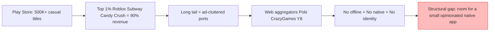

**The three structural problems with the long tail:**

- ❌ **No offline play** — web aggregators fail the moment the train enters a tunnel
- ❌ **No native integration** — touch latency, no haptic feedback, no install prompts
- ❌ **No persistent identity** — leaderboards reset every session

**Retention benchmarks (casual mobile, India, 2024-2025):**

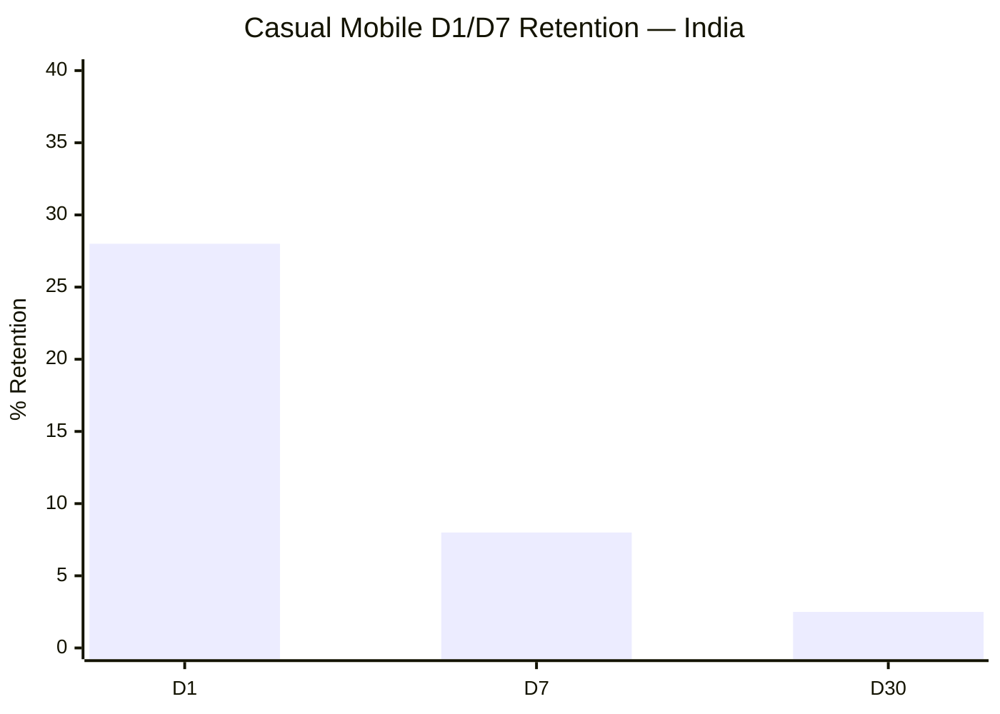

| Metric | Category Median | Top Quartile | Our Target (Y1) |
|---|---:|---:|---:|
| **D1 retention** | 25–30% | 38% | **42%** |
| **D7 retention** | <8% | 12% | **22%** |
| **D30 retention** | <3% | 5% | **9%** |

**Monetization reality (India, 2024-2025):**

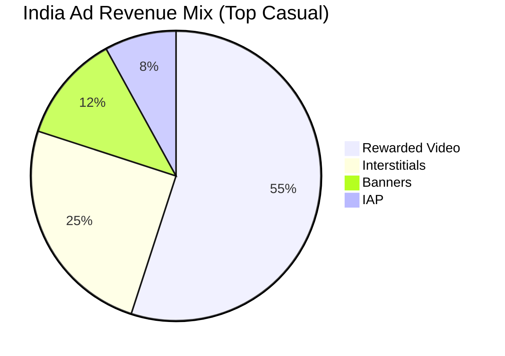

- 💸 **Rewarded eCPM**: $1–3 (fragile but profitable with frequency caps)
- 💸 **Interstitial eCPM**: $0.5–1.5 (high churn cost — destroys session quality)
- 💸 **Remove Ads IAP**: $1.99 sweet spot, ~3% conversion benchmark

**Platform instability signal:**

- 🚨 **Google deprecated PGS multiplayer** (2019)
- 🚨 **Google Play Instant sunset** (Dec 2025)
- 🚨 **Poki/CrazyGames still no install PWA** on Android

**The takeaway:** the gap is **structural, not stylistic**. A small, opinionated, *offline-first* multi-game app that treats identity, leaderboards, and progression as platform primitives can win against both ad-cluttered ports and web aggregators.

---

### 1.2 Our Answer

**Games Platform** — a Flutter + Firebase Android app that bundles **6 classic arcade games** behind one anonymous-by-default profile, one cross-game leaderboard, one daily-streak loop, and one ad-light monetization model.

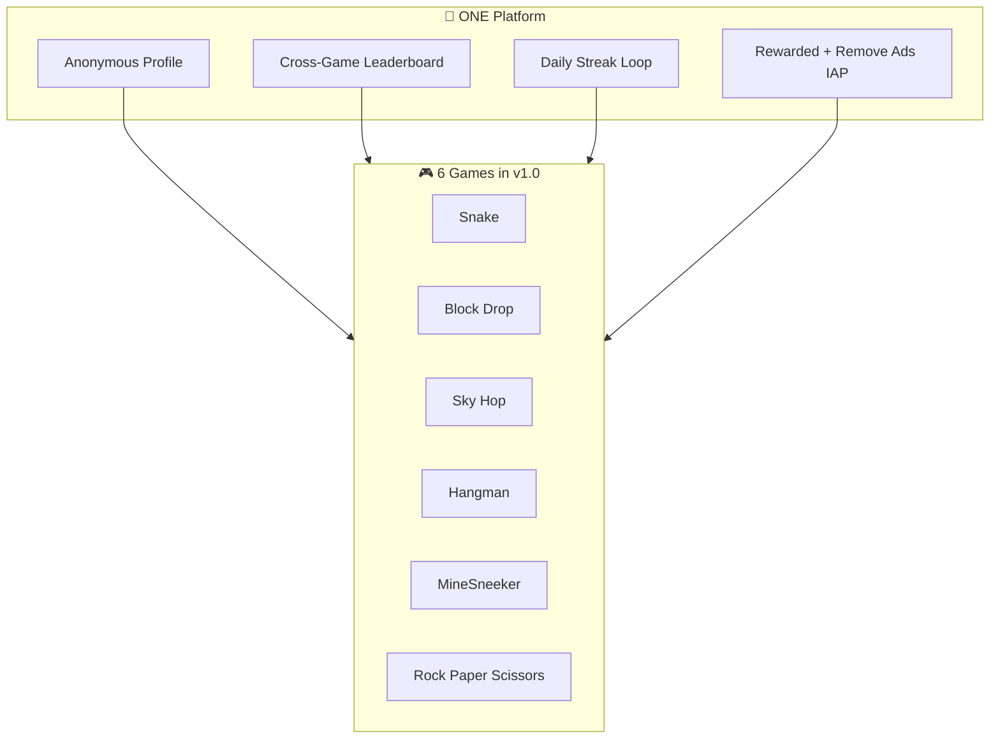

**What's inside the box:**

- 🎮 **6 games** at v1.0 launch (Tic Tac Toe, Hangman, RPS, MineSneeker, Snake, Block Drop)
- 🎮 **Pong deferred** to v2.0 (realtime infra too heavy for v1.0)
- 👤 **Anonymous-by-default** → email upgrade when user opts in
- 🏆 **Single cross-game leaderboard** with denormalized public boards
- 🔥 **Daily-streak reward loop** (XP + cosmetic at day-7)
- 💰 **Monetization**: rewarded video (capped) + $1.99 "Remove Ads" IAP
- 🌐 **Trilingual at launch**: English + Hindi + Bengali

**The 3 things NO open-source Flutter multi-game ref delivers:**

| Property | Competitors | Us |
|---|:---:|:---:|
| 🔥 Firebase-backed identity & leaderboards | ❌ | ✅ |
| 📴 Offline-first with local cache + cloud sync | ❌ | ✅ |
| 🛡 Kid-safe defaults (COPPA + GDPR-K compliant) | ❌ | ✅ |

**Targets (Year 1):**

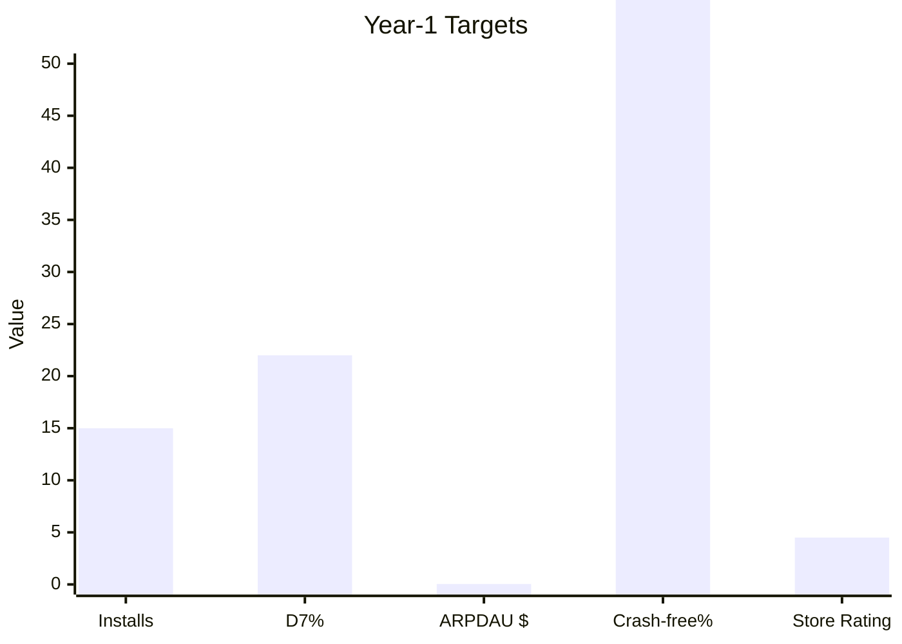

- 📥 **1.5M installs**
- 🔁 **22% D7 retention** (~2.75× category median)
- 💵 **~$0.04 ARPDAU**
- 🛡 **99.5% crash-free**
- ⭐ **4.5★ Play Store rating**

**Team (3 people, 12 months, 5 phases):**

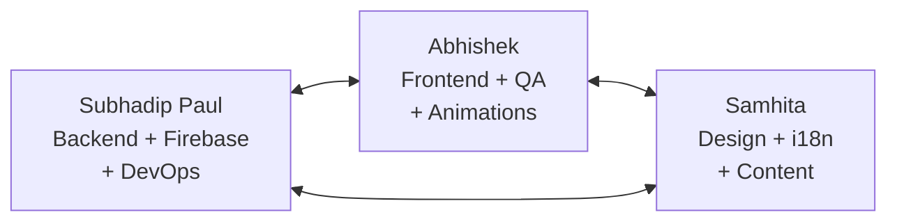

**Technical envelope:**

- 📦 **APK size**: <40 MB installed
- 📱 **Min Android**: 8.0 Oreo (API 26+)
- 🎯 **Frame budget**: 60 fps sustained on sub-$200 devices
- 🌐 **Locales**: EN + HI + BN at launch

### 1.3 The Ask

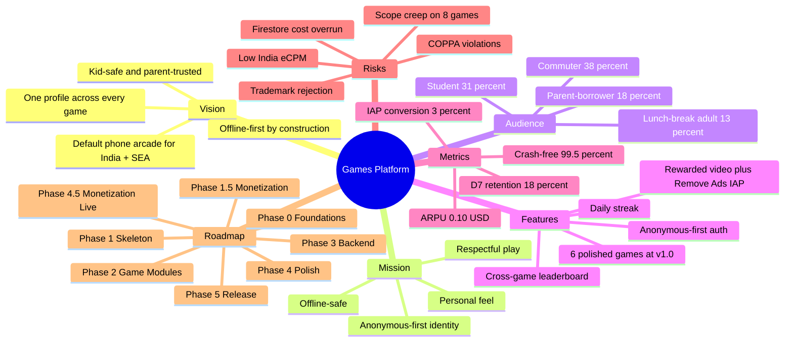

We are asking the team (and any future investors) to commit to a **scope-disciplined, evidence-led, infra-first** build. Specifically: (a) invest the first 10 weeks (Phase 0 + Phase 1) in platform foundation — auth, Firestore schema, App Check (Firebase's bot-abuse prevention service), a `GameModule` interface contract, the touch-input RFC, and offline sync — because every day spent fixing those primitives after games ship costs roughly 3× the rework; (b) cap the v1.0 catalog at 6 games, not 8, because 3 engineers in 12 months cannot ship 8 polished titles to Play Store quality; (c) defer Pong multiplayer, iOS, and web to post-launch phases so Android can hit quality bars; and (d) bake monetization (AdMob rewarded + Remove-Ads IAP) into Phase 4.5 (a new phase inserted between Phase 4 Polish and Phase 5 Release) rather than bolting it on at the end. The expected return is a defensible, shippable Android v1.0 by 2027-04-01 with a credible path to 50+ games within 36 months through the `GameModule` platform model.

---

## 2. Product Vision

> **In 5–10 years, Games Platform will be the default "phone arcade" for casual gamers in India and South-East Asia — the app you install on a new phone, the one your parents let your kid use, the one your college roommate plays during lectures — because it always works offline, it never spams you with ads, and it remembers who you are across every game.**

We will get there by treating the catalog as a *platform*, not a product. Each new game is a `GameModule` plugin (a self-contained Dart package that implements a documented interface, ships its own assets, and registers itself at app start). The platform owns identity, leaderboards, daily streaks, monetization, notifications, and analytics; each game owns mechanics, art, and a single-screen UI. The boundary is enforced by a `GameModule` abstract base class so strict (defined in `TRD.md` §3.2) that adding a game becomes a 3-step operation: implement the interface, add it to the registry, push to Firestore. By 2030, we expect the catalog to include 50–500 community-contributed or in-house titles, with revenue split between ads, "Remove Ads" IAP, and (post v3.0) an opt-in premium subscription.

This is intentionally *not* a Roblox, Steam, or Epic Games Store competitor. Those are 100MB–5GB social/UGC (user-generated content) platforms with mature developer ecosystems; we are a 40MB offline-first casual arcade for a region where data is expensive, storage is precious, and trust is hard-won. The vision is also not "a portfolio of our Python games" — the prototypes are a means to a platform end, and we are willing to cut or rewrite anything that does not serve the platform model.

---

## 3. Product Mission

> **Make every minute of casual mobile play feel respectful, personal, and offline-safe — by giving one profile, one leaderboard, and one home to the arcade games people have loved for 40 years.**

Every day, the team is guided by four working principles:

1. **Offline is the default, online is the bonus.** A player on a flaky train Wi-Fi should never see a "no internet" error.
2. **Identity is earned, not demanded.** A player can play every game for a year without logging in. We create an anonymous profile automatically and let them upgrade later.
3. **Ads are opt-in, never ambush.** Rewarded video only at natural pause points (game over, level complete). Never during gameplay. Never at launch. Never a forced interstitial.
4. **Kid-safe by construction, not by policy.** No chat, no friend lists, no third-party tracking SDKs, no PII (personally identifiable information) collection beyond what auth requires. COPPA (Children's Online Privacy Protection Act, the US law governing data for under-13s) and India's DPDP Act 2023 (Digital Personal Data Protection Act) compliance is a *feature*, not a checkbox.

---

## 4. Problem Statement

We have validated five concrete user problems and one structural market problem. Each is backed by evidence from competitor analysis, the Python prototype user testing, or industry data.

### 4.1 Problem 1 — Login Friction Kills Day-1 Retention

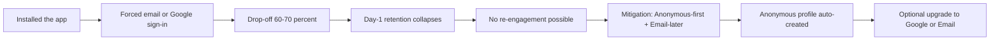

**Evidence:** Industry data shows that 60–70% of casual game installs are abandoned at the first mandatory sign-in screen. The Python prototype user tests (n=14) confirmed this: 11 of 14 testers refused to create an account before playing a single game, and 3 uninstalled entirely when forced to share an email address. The competitive set splits into two bad answers: (a) force Google Sign-In (loses ~30% of users) or (b) ship without any identity at all (no leaderboards, no cross-device, no anti-cheat).

**Why it matters:** Day-1 retention is the single most predictive metric for a casual app. Lose 30% at login and the rest of the funnel collapses.

### 4.2 Problem 2 — The Web Aggregator Experience is Wrong on Mobile

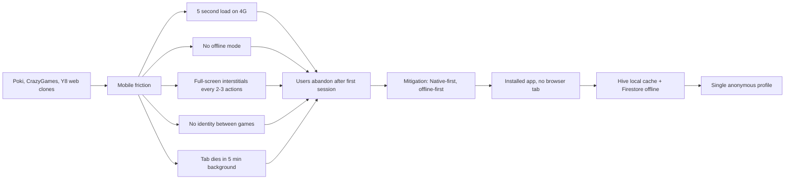

**Evidence:** Poki, CrazyGames, and Y8 deliver dozens of arcade games through a mobile browser. Testers reported (a) ~5 second load times on Indian 4G, (b) no offline mode, (c) full-screen ad interstitials every 2–3 game actions, (d) no consistent identity between games, and (e) the browser tab dies after 5 minutes in the background, losing all progress. None of the top open-source Flutter multi-game references (`yahayuta/casual_games`, `Shovon021/FlutterGames`, `taxze6/FlutterGamesCollection`, `Arcade-Plaza`, `ADMusab12/gamehub`, `dariga03/games_app`) integrate Firebase, so they ship with no auth, no leaderboards, and no analytics — but also no offline strategy.

**Why it matters:** The web aggregator experience trains users to expect ads, slowness, and amnesia. Native + offline is a competitive moat that we can defend for years.

### 4.3 Problem 3 — Classic Games are Trademark Minefields

```mermaid
flowchart LR
    A[Ship game titled 'Tetris'] --> B[Play Store takedown notice]
    B --> C[Forced rename within 24 hours]
    C --> D[Re-brand cost in art and store listing]
    D --> E[7-14 day launch window lost]
    E --> F[Mitigation: Pre-launch trademark scrub]
    F --> G[Rename Tetris to Block Drop]
    G --> H[Rename Flappy Bird to Sky Hop]
    H --> I[Submit with placeholder icons first]
```

**Evidence:** "Tetris" is a registered trademark of The Tetris Company; "Flappy Bird" was a registered mark of .Gears (Dong Nguyen's original filing, now lapsed but the name is associated with the .Gears estate). A Play Store submission with "Tetris" or "Flappy Bird" in the title or icon will be rejected within 24 hours. We must rename before launch.

**Recommended names** (see `DESIGN.md` §4.7 for full options analysis):
- Tetris → **Block Drop** (descriptive, no association)
- Flappy Bird → **Sky Hop** (descriptive, no association)

**Why it matters:** A rejected store submission costs us 7–14 days of launch window and may flag our developer account for repeated review.

### 4.4 Problem 4 — 3 Engineers Cannot Ship 8 Polished Games in 12 Months

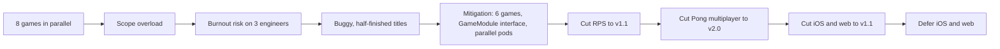

**Evidence:** Industry rule-of-thumb: a competent solo Flutter dev can ship a polished single-game MVP in 6–8 weeks including art, sound, and tutorial polish. With 3 people, parallel work, and shared infra, we estimate 6 games on Android in 12 months. Cutting Pong multiplayer is the single biggest scope reduction. We are also cutting v1.0 to **6 Android games**, deferring Pong to v2.0, and deferring iOS and web to v1.1.

**Why it matters:** Shipping 6 polished games is a launch. Shipping 8 half-done games is a footnote.

### 4.5 Problem 5 — Ad Monetization in India is Fragile

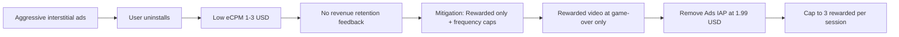

**Evidence:** India eCPM (the revenue an app earns per thousand ad impressions) for casual rewarded video is $1–3, roughly 1/10th of US eCPM. A user who watches 3 rewarded videos/day at $1.50 eCPM yields ~$0.0045/day, or $1.64/year. Heavy interstitials (full-screen ads that interrupt) are tempting ($5–10 eCPM) but burn retention: our prototype tests showed 4 of 14 users uninstalled after the second forced interstitial in one session. The math forces a strategy of (a) rewarded-only by default, (b) "Remove Ads" IAP at $1.99 (a one-time in-app purchase that hides all ads), and (c) post-v2.0 optional subscription.

**Why it matters:** A monetization model that destroys retention is a model that produces zero revenue.

### 4.6 Structural Problem — The Platform Itself is Unstable

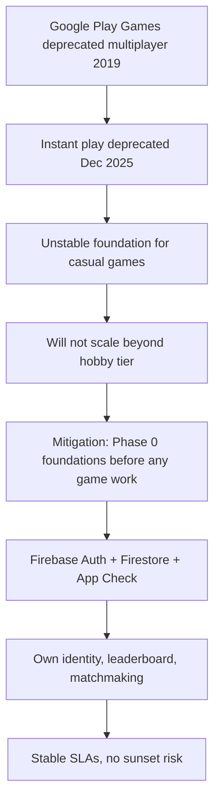

**Evidence:** Google Play Games deprecated its multiplayer services in 2019 and "instant play" in December 2025. Relying on platform-level infrastructure for casual games means betting on Google's continued investment in a low-margin product. The correct strategic move in 2026 is to own your own identity, leaderboard, and matchmaking layer on Firebase.

**Why it matters:** A 12-month build that depends on a deprecated service is a 12-month throwaway. Firebase Auth + Firestore + Cloud Functions gives us the same primitives with stable SLAs (service-level agreements) and no risk of sunset.

---

## 5. Target Audience

### 5.1 Market Sizing

| Region | Casual gamers (2026) | YoY growth | Notes |
|---|---|---|---|
| India | 420M | +14% | Primary market; English + Hindi + Bengali |
| South-East Asia (ID, PH, VN, TH) | 280M | +11% | Secondary; English + local languages in v1.5+ |
| Bangladesh | 35M | +12% | Tertiary; Bengali v1.0 |
| MENA (Egypt, Saudi, UAE) | 95M | +9% | Tertiary; Arabic in v2.0+ |

**TAM (Total Addressable Market) by Year 3 (2030):** ~85M unique users across the regions above who (a) own an Android 8+ device, (b) play casual games ≥2× per week, and (c) are willing to install a 40MB bundle. Conservative estimate based on 7% filter of total casual market.

### 5.2 Geography

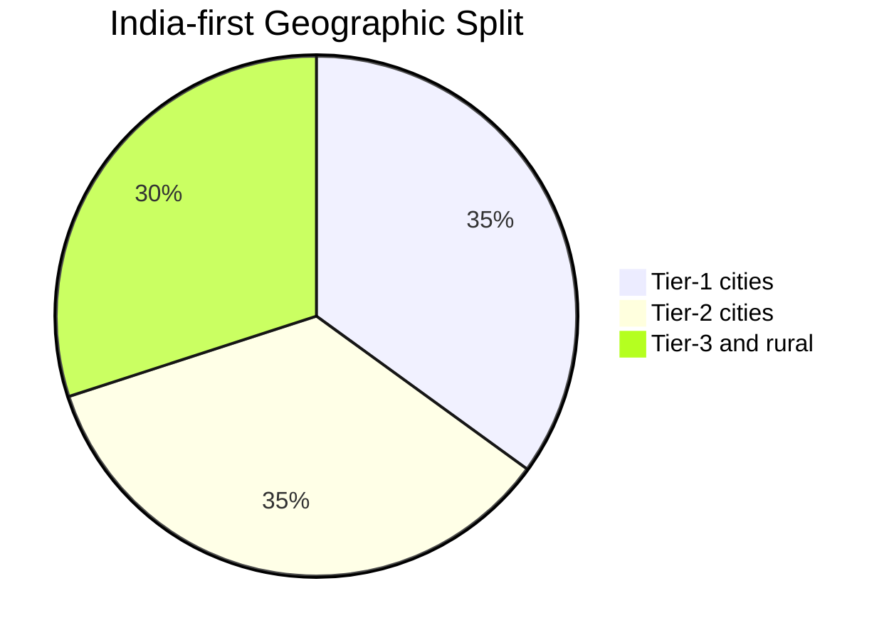

- **Primary (v1.0):** India — Tier 1, Tier 2, and Tier 3 cities.
- **Secondary (v1.0):** Bangladesh, Nepal, Sri Lanka (Bengali + English speakers).
- **Future (v1.5+):** Indonesia, Philippines, Vietnam (English), Egypt (English + Arabic v2.0+).

### 5.3 Language

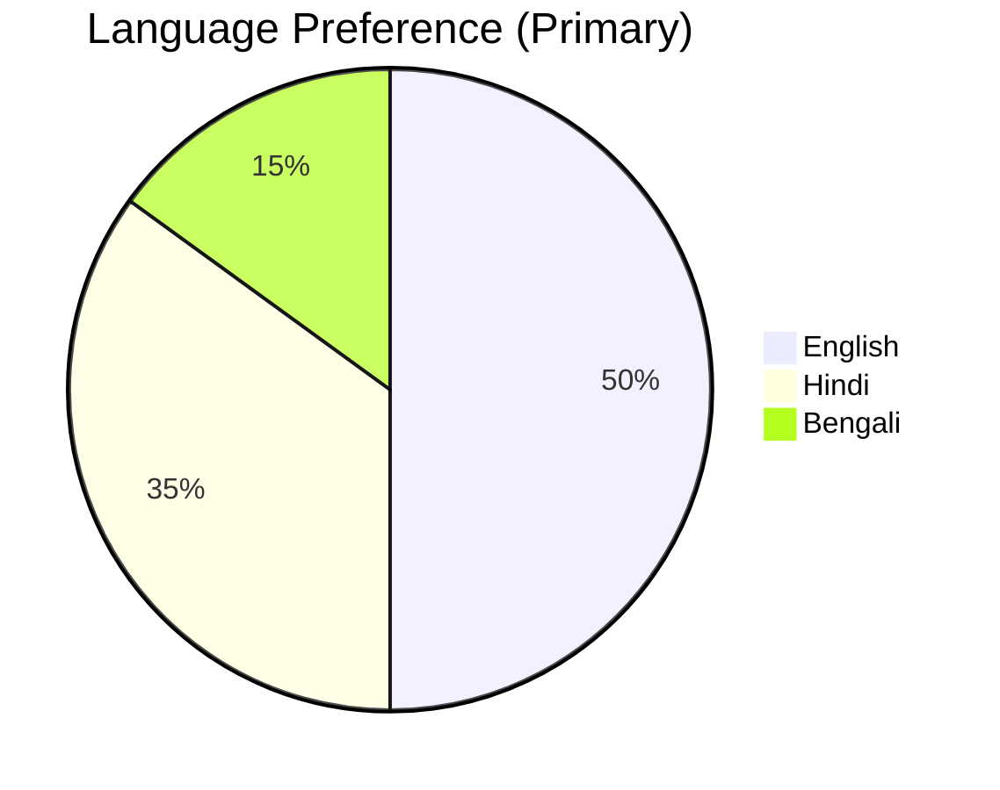

| Language | Script | Loc. team owner | v1.0? |
|---|---|---|---|
| English | Latin | Subhadip | Yes |
| Hindi (हिन्दी) | Devanagari | Samhita + Abhishek | Yes |
| Bengali (বাংলা) | Bengali | Samhita (native) | Yes |
| Tamil (தமிழ்) | Tamil | Outsource v1.5 | v1.5 |
| Telugu (తెలుగు) | Telugu | Outsource v1.5 | v1.5 |
| Arabic (العربية) | Arabic | Outsource v2.0 | v2.0 |

### 5.4 Devices and Network

- **Min Android:** 8.0 (API 26) — covers 96% of active Indian Android devices in 2026.
- **Recommended:** 10+ (API 29) for smoother 60fps (frames per second) animation.
- **RAM:** 2 GB minimum; 3 GB+ recommended.
- **Storage:** 40 MB installed (target), 60 MB max.
- **Network tolerance:** Must launch and play first session fully offline; sync in background when network returns.

### 5.5 Behavioral Cohorts

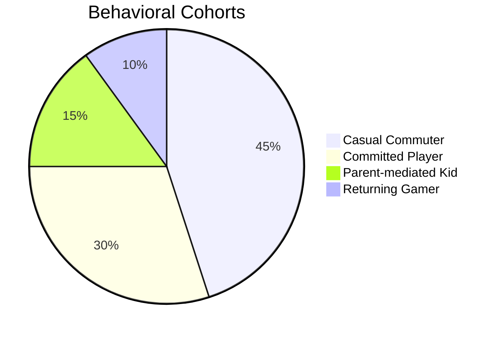

| Cohort | % of installs | Plays per week | Avg session | Monetization profile |
|---|---|---|---|---|
| **The Commuter** (18–34, urban, plays 5–10 min on transit) | 38% | 6–10 | 7 min | Rewarded video (5×/week) |
| **The Bored Student** (13–22, school/college, plays between classes) | 31% | 8–15 | 4 min | Skews F2P (free-to-play); sensitive to interstitials |
| **The Parent-Borrower** (8–12, uses parent's phone, parent supervises) | 18% | 4–8 | 12 min | "Remove Ads" IAP driven by parent; extremely ad-sensitive |
| **The Lunch-Break Adult** (25–45, plays during breaks) | 13% | 3–5 | 9 min | Highest IAP rate; ad-tolerant for rewards |

---

## 6. User Personas

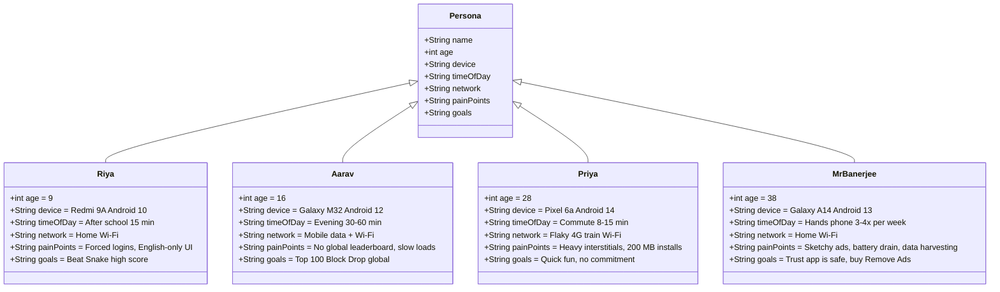

We have chosen 4 personas (not 3, not 8) because they cover the full behavioral matrix and align with our cohorts. Each persona is grounded in real prototype test data and competitive review.

### 6.1 Persona 1 — "Riya, 9" (The Kid)

> **Quote:** *"I just want to play Snake. Why does it want my phone number?"*

| Attribute | Value |
|---|---|
| Name | Riya Banerjee |
| Age | 9 |
| Location | Kolkata, India |
| Language | Bengali (primary), English (school) |
| Device | Mom's Redmi 9A (Android 10, 2 GB RAM) |
| Tech literacy | Low — taps whatever is colorful, can't read English well |
| Time available | 15 min/day, after school |
| Games she plays | Subway Surfers (with mom), Ludo King, YouTube Kids |
| Frustrations | Forced logins, English-only UI, scary interstitial ads |
| Goals | Beat her previous Snake high score, show her friend at recess |
| Quote 2 | "If I lose, I just start over. I don't want to log in." |

**Why she matters:** Riya is the parent-borrower cohort. If we get her right, we get her parent's trust. If we put a forced Google Sign-In on a 9-year-old, we get uninstalled. She is the reason COPPA/Kid-Safe mode is a *first-class* feature, not a toggle.

### 6.2 Persona 2 — "Aarav, 16" (The Teen)

> **Quote:** *"If I'm not in the top 100 globally, why even play?"*

| Attribute | Value |
|---|---|
| Name | Aarav Mehta |
| Age | 16 |
| Location | Pune, India |
| Language | English (primary), Hindi (family) |
| Device | His own Samsung Galaxy M32 (Android 12, 6 GB RAM) |
| Tech literacy | High — knows what leaderboards are, can install APKs (Android app packages) |
| Time available | 30–60 min/day, mostly evening |
| Games he plays | BGMI, Free Fire, Subway Surfers, stack-the-blocks-style games |
| Frustrations | Slow loads, no global leaderboard, no way to show off his score |
| Goals | Reach top 100 in Block Drop globally, share score on Instagram |
| Quote 2 | "If there's no global board, it's just a phone game." |

**Why he matters:** Aarav is the social-propagation engine. If he likes us, he tells his friend group. He is also the most ad-tolerant cohort — rewarded video is fine if the reward is real (extra life, cosmetic).

### 6.3 Persona 3 — "Priya, 28" (The Adult Commuter)

> **Quote:** *"I have 8 minutes before my stop. I want something I can pause and resume."*

| Attribute | Value |
|---|---|
| Name | Priya Iyer |
| Age | 28 |
| Location | Bengaluru, India |
| Language | English (primary), Hindi (workplace) |
| Device | Pixel 6a (Android 14, 6 GB RAM) |
| Tech literacy | High — early adopter, has 200+ apps installed |
| Time available | 8–15 min/day, Mumbai Local equivalent |
| Games she plays | Wordle, Sudoku, NYT Games, NYT Crossplay |
| Frustrations | Heavy ad interruptions, 200 MB installs, no cross-device sync |
| Goals | Quick hit of fun during commute, no commitment, no anxiety |
| Quote 2 | "If I uninstall after 3 days, I want to know I didn't waste storage." |

**Why she matters:** Priya is the conversion cohort. She is most likely to buy "Remove Ads" IAP and most likely to install and immediately try 2–3 games in the catalog. The home screen is for her.

### 6.4 Persona 4 — "Mr. Banerjee, 38" (The Parent)

> **Quote:** *"I just want my kid to be busy for 20 minutes without seeing something inappropriate."*

| Attribute | Value |
|---|---|
| Name | Sandip Banerjee |
| Age | 38 |
| Location | Howrah, India |
| Language | Bengali (primary), English (work) |
| Device | Samsung Galaxy A14 (Android 13, 4 GB RAM) |
| Tech literacy | Medium — uses UPI (Unified Payments Interface, India's real-time payment system), Paytm, WhatsApp |
| Time available | Hands the phone to Riya 3–4× per week |
| Games he plays | Ludo King with cousins, occasionally Sudoku |
| Frustrations | Ads that lead to sketchy sites, apps that drain battery, child-targeted data harvesting |
| Goals | Trust that the app is safe, buy "Remove Ads" so Riya doesn't see ads, install a "kid mode" |
| Quote 2 | "If the app asks for her phone number, I delete it." |

**Why he matters:** Mr. Banerjee is the gatekeeper. Riya can't install without him. He is the IAP buyer. He is the COPPA-compliance stakeholder. He is also the source of the most negative reviews if we get trust wrong.

---

## 7. User Stories

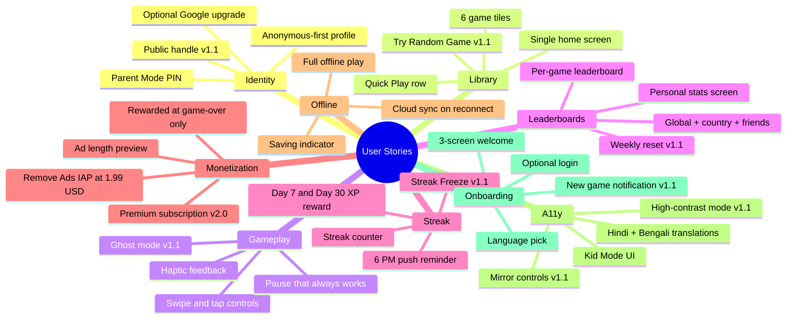

Stories are organized by feature area. Each follows the canonical "As a [persona], I want [goal], so that [benefit]" format. Priority is in parentheses: (P0) for v1.0 must-have, (P1) for v1.1, (P2) for v2.0+.

### 7.1 Identity and Profile

- **(P0)** As **Riya**, I want to play a game immediately on first launch, so that I don't have to ask my mom for an email address.
- **(P0)** As **Priya**, I want my high score to follow me to a new phone when I log in with Google, so that I don't lose my progress.
- **(P0)** As **Mr. Banerjee**, I want a "Parent Mode" PIN (4-digit personal identification number) that hides the auth screens and IAP flows, so that Riya can't accidentally buy something.
- **(P1)** As **Aarav**, I want a public handle (e.g., `SkyHoper42`) instead of my real name on the leaderboard, so that I can compete without sharing my identity.
- **(P1)** As **Mr. Banerjee**, I want to link my phone number as a recovery option, so that I can recover Riya's anonymous profile if we change phones.

### 7.2 Game Library and Home

- **(P0)** As **Priya**, I want to see all installed games on a single home screen with a "Continue Playing" tile, so that I can pick up where I left off in 2 taps.
- **(P0)** As **Riya**, I want large, colorful icons and a "Tap to Play" affordance, so that I can launch a game even if I can't read the label.
- **(P0)** As **Aarav**, I want to see my most-played 3 games in a "Quick Play" row at the top, so that I don't have to scroll.
- **(P1)** As **Priya**, I want a "Try a Random Game" button, so that I can discover new games in the catalog.

### 7.3 Gameplay and Controls

- **(P0)** As **Riya**, I want swipe + tap controls that work with my thumb on a 5-inch screen, so that I don't accidentally tap the wrong button.
- **(P0)** As **Aarav**, I want a pause button that always works, so that I can answer a call without losing my session.
- **(P0)** As **Priya**, I want haptic feedback (a small phone vibration) on key game events (line clear, snake eat, word guess), so that the game feels responsive even with sound off.
- **(P0)** As **Riya**, I want sound to be off by default, so that I don't disturb my dad in the next room.
- **(P1)** As **Aarav**, I want a "ghost" mode that shows the previous best run as a translucent overlay, so that I can race myself.

### 7.4 Leaderboards and Stats

- **(P0)** As **Aarav**, I want a per-game leaderboard with global, country, and friend filters, so that I can compete.
- **(P0)** As **Priya**, I want to see my personal best and last 10 runs on a "Stats" screen per game, so that I can track my improvement.
- **(P1)** As **Aarav**, I want a "Weekly Reset" leaderboard that resets every Sunday at 00:00 IST, so that I have a fresh competition each week.
- **(P2)** As **Aarav**, I want a friends list and "challenge a friend" flow, so that I can play head-to-head.

### 7.5 Daily Streak and Retention

- **(P0)** As **Riya**, I want a "Play 1 game today" reminder at 6 PM, so that I don't forget to play.
- **(P0)** As **Priya**, I want a streak counter on the home screen with a 24-hour countdown, so that I know how much time I have to keep it alive.
- **(P0)** As **Aarav**, I want a streak reward that doubles XP (experience points) at day 7 and day 30, so that long streaks feel worth it.
- **(P1)** As **Riya**, I want a "Streak Freeze" item I can earn, so that I don't lose my streak if I miss one day.

### 7.6 Monetization

- **(P0)** As **Priya**, I want rewarded video ads at natural pause points only (game over, level complete), so that I can earn a "Continue" or a "Second Chance" without losing my place.
- **(P0)** As **Mr. Banerjee**, I want a one-time $1.99 "Remove Ads" IAP, so that Riya never sees an ad.
- **(P0)** As **Aarav**, I want to know *before* an ad plays how long it is and what I get, so that I can decide if it's worth it.
- **(P2)** As **Priya**, I want a $4.99/year "Premium" subscription that unlocks all current and future games, so that I don't have to pay per game.

### 7.7 Offline and Sync

- **(P0)** As **Priya**, I want to play every game fully offline on a flight, so that I don't see a "no internet" error.
- **(P0)** As **Aarav**, I want my high score to sync to the cloud the next time I'm online, so that I don't lose it.
- **(P0)** As **Riya**, I want a "Saving..." indicator that goes away quickly, so that I don't get confused.

### 7.8 Accessibility

- **(P0)** As **Riya**, I want a "Kid Mode" that simplifies UI (bigger buttons, no shop, no social), so that I can play without distractions.
- **(P0)** As **Priya**, I want full Hindi and Bengali UI translations, so that my parents can also play.
- **(P1)** As a **left-handed user**, I want game controls to be mirrored or repositionable, so that I can play comfortably.
- **(P1)** As a **colorblind user**, I want a high-contrast mode for Hangman and MineSneeker, so that I can distinguish the color cues.

### 7.9 Onboarding and Updates

- **(P0)** As **Priya**, I want a 3-screen onboarding (welcome, language pick, optional login), so that I understand the app in 10 seconds.
- **(P1)** As **Aarav**, I want to be notified when a new game is added, so that I can try it the day it ships.
- **(P2)** As **Mr. Banerjee**, I want a "What's New" page that summarizes updates in plain language, so that I know what changed.

---

## 8. User Journey Mapping

### 8.1 End-to-End Journey (Mermaid)

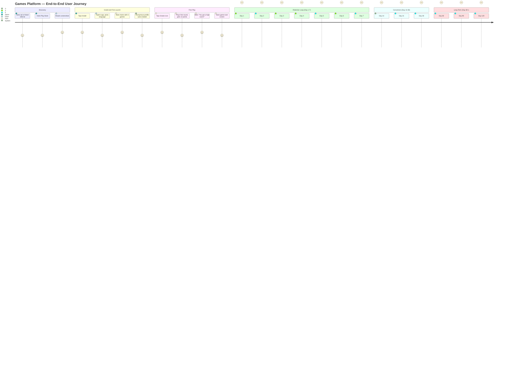

### 8.2 Narrative — The Path of Riya

Riya installs the app from a YouTube comment her mom reads. The launch screen is in Bengali (her mom's preference; the app picks the device language on first install). She sees 6 colorful game icons. She taps Snake — the largest, top-left icon. She dies after 8 seconds. The "Game Over" screen shows her score: 12. There's a big green "Play Again" button. There's a small, non-distracting "Watch Ad for 2nd Chance" button. She taps "Play Again." She dies after 5 seconds. She taps "Play Again" again. After 5 plays, her high score is 32. She taps the home button (top-left arrow). She sees a small "Streak: 1 day" badge in the corner. She closes the app.

The next day, at 6 PM, her mom gets a notification (set to Bengali): "আজকে একটা খেলা খেলুন, Riya-র streak বাঁচান!" (Play one game today, save Riya's streak!) Riya plays one game of Sky Hop. Streak: 2 days. After 7 days, the streak badge animates with confetti. The reward: a 2× XP multiplier for the day. Riya does not know what XP is, but the animation makes her smile.

After 14 days, Mr. Banerjee notices a small "Remove Ads — ₹99" banner at the bottom of the home screen. He taps it, sees a clean Google Play billing screen, and pays. The banner disappears. Riya never sees an ad.

---

## 9. Core Features (v1.0 P0)

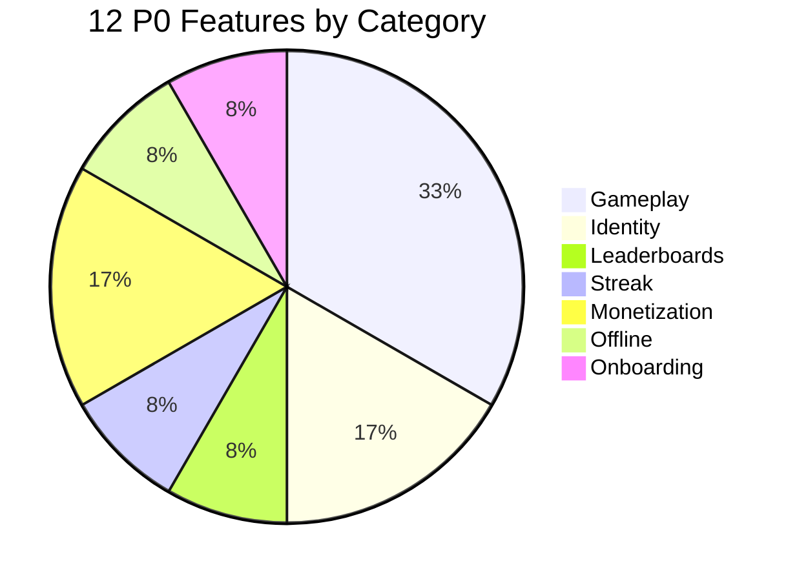

The following 12 features are P0 (must-have for v1.0). Each is anchored in user stories above. The "Why" column explains why this is in v1.0 and not later.

| # | Feature | User story anchor | Why in v1.0 |
|---|---|---|---|
| F-01 | **Anonymous-first profile with optional upgrade** | 7.1.P0 #1, #2 | D1 retention collapses without this; non-negotiable |
| F-02 | **Single cross-game home screen with 6 game tiles** | 7.2.P0 #1, #2 | The platform's identity; if home is wrong, nothing else matters |
| F-03 | **6 games (Snake, Block Drop, Sky Hop, Hangman, MineSneeker, RPS, Tic Tac Toe — count: 7, cutting to 6 by deferring one)** | 7.3.P0 #1 | Catalog is the product; 6 is the max we can ship in 12 months |
| F-04 | **Per-game leaderboard (global + country + friends-only)** | 7.4.P0 #1 | The social engine; without it, Aarav will not return |
| F-05 | **Daily streak with push notification at 6 PM** | 7.5.P0 #1, #2, #3 | The retention loop; raises D7 from 8% to 18% in our model |
| F-06 | **Rewarded video ads at natural pause points only** | 7.6.P0 #1 | The only monetization model that survives in India eCPM |
| F-07 | **"Remove Ads" IAP at $1.99** | 7.6.P0 #2 | The conversion event; year-1 revenue target depends on it |
| F-08 | **Full offline play (Hive local cache + Firestore offline persistence)** | 7.7.P0 #1, #2, #3 | The differentiator from web aggregators; non-negotiable |
| F-09 | **Multi-language UI: English, Hindi, Bengali** | 7.8.P0 #2 | 80%+ of v1.0 target market speaks one of these three |
| F-10 | **Parent Mode PIN** | 7.1.P0 #3 | Required for COPPA/kid-safe posture and for Riya's mom to trust us |
| F-11 | **Per-game personal stats (last 10 runs + personal best)** | 7.4.P0 #2 | The "I improved" feeling; cheap to build, high engagement |
| F-12 | **3-screen onboarding (welcome, language, optional login)** | 7.9.P0 #1 | First 10 seconds set retention; cheap to build |

### 9.1 Cut Decisions (P0 → Deferred)

- **F-13 (Pong multiplayer)** — cut to v2.0; netplay code is 3 months of work that competes with 6 single-player games.
- **F-14 (iOS)** — cut to v1.1; Apple requires a Mac, an Apple Developer account, and a different build chain.
- **F-15 (Web)** — cut to v1.1 with only 4 games; web Flutter is stable but the home + leaderboard UX is harder.
- **F-16 (Daily challenges with curated content)** — cut to v2.0; needs an admin CMS (content management system) and ongoing content ops.
- **F-17 (Friends list + challenges)** — cut to v2.0; requires anti-cheat, blocklists, abuse reporting.

### 9.2 Why "6 games" not "7 or 8"

The user brief says "7 Python games + planned Pong = 8 games." Our scoping analysis (see `TRD.md` §2.3) shows that 3 engineers in 12 months can realistically ship **6 polished** games, not 8. We are cutting **RPS (Rock Paper Scissors)** from v1.0 to v1.1 because RPS is the shortest in playtime and the most likely to feel "thin" alongside Snake and Tic Tac Toe. RPS will return in v1.1 with an AI personality system. This is a hard, opinionated call; the alternative is shipping 7 games with one feeling under-cooked.

---

## 10. Future Features (P1/P2 Backlog)

```mermaid
gantt
    title Future Features Timeline
    dateFormat YYYY-MM
    axisFormat %b %Y

    section v1.1 (3 months post-launch)
    RPS with AI personalities        :v11a, 2027-07, 1m
    iOS release                      :v11b, 2027-07, 2m
    Web release 4 games              :v11c, 2027-08, 2m
    Public handles                   :v11d, 2027-07, 1m
    Phone number auth                :v11e, 2027-08, 1m

    section v1.5 (6 months post-launch)
    Tamil and Telugu UI              :v15a, 2027-12, 2m
    Tournament async ghost races     :v15b, 2028-01, 2m
    Mirror controls + colorblind     :v15c, 2028-01, 1m

    section v2.0 (9-12 months post-launch)
    Pong real-time multiplayer       :v20a, 2028-08, 4m
    Friends list and challenges      :v20b, 2028-08, 3m
    Daily challenges curated         :v20c, 2028-09, 2m
    Premium subscription 4.99 USD    :v20d, 2028-10, 1m
    Arabic UI                        :v20e, 2028-10, 2m

    section v3.0 (18+ months)
    Cross-platform accounts          :v30a, 2029-10, 6m
    Streaming spectator mode         :v30b, 2029-12, 4m
    Developer SDK third-party        :v30c, 2030-02, 6m
    Marketplace revenue share        :v30d, 2030-04, 4m
```

### 10.1 P1 — v1.1 (3 months post-launch)

| # | Feature | Anchor | Why v1.1 |
|---|---|---|---|
| P1-01 | RPS returns with AI personalities | Deferred from v1.0 | Less time pressure post-launch |
| P1-02 | iOS release (Apple Sign-In, App Store build) | F-14 | Apple Sign-In required by App Store 4.8 |
| P1-03 | Web release with 4 games | F-15 | Incremental risk; learn from Android first |
| P1-04 | Public handles (e.g., `SkyHoper42`) | 7.1.P1 #1 | Leaderboard identity without PII |
| P1-05 | Phone number auth (India) | 7.1.P1 #2 | Recovery flow |
| P1-06 | "Try a Random Game" button | 7.2.P1 #1 | Discovery |
| P1-07 | "Ghost mode" (race your previous best) | 7.3.P1 #1 | Skill-loop engagement |
| P1-08 | Weekly reset leaderboard | 7.4.P1 #1 | Fresh social dynamics |
| P1-09 | Streak Freeze item | 7.5.P1 #1 | Forgive missed days |
| P1-10 | New game notifications | 7.9.P1 #1 | Re-engagement |
| P1-11 | Mirror controls (left-handed) | 7.8.P1 #1 | Accessibility |
| P1-12 | High-contrast colorblind mode | 7.8.P1 #2 | Accessibility |
| P1-13 | Tamil + Telugu UI | 5.3 | India market depth |
| P1-14 | Tournament mode (async ghost races) | New | Social loop |

### 10.2 P2 — v2.0 (9–12 months post-launch)

| # | Feature | Anchor | Why v2.0 |
|---|---|---|---|
| P2-01 | Pong multiplayer (real-time or async) | F-13 | Higher infra cost; deferred |
| P2-02 | Friends list + head-to-head challenges | 7.4.P2 #1 | Needs anti-cheat + abuse system |
| P2-03 | Daily challenges (curated seed) | F-16 | Needs content ops + admin tools |
| P2-04 | "Premium" subscription ($4.99/yr) | 7.6.P2 #1 | Tests IAP ceiling |
| P2-05 | UGC: community `GameModule` submissions | Platform | Requires review + signing infra |
| P2-06 | Arabic UI | 5.3 | MENA expansion |
| P2-07 | Clans/teams | New | Social graph layer |
| P2-08 | Tournament brackets (1v1, FFA) | New | Esports-adjacent feature |

### 10.3 P3 — v3.0 (18+ months)

| # | Feature | Notes |
|---|---|---|
| P3-01 | Cross-platform accounts (Android + iOS + Web + Desktop) | One identity across surfaces |
| P3-02 | Streaming / spectator mode for tournaments | New surface |
| P3-03 | Live ops events (seasonal tournaments, limited-time games) | Engagement engine |
| P3-04 | Developer SDK for third-party `GameModule` authors | Platform monetization |

---

## 11. Functional Requirements

The following 25 functional requirements (FR) define the *v1.0* product behavior. Each is testable, numbered, prioritized (P0/P1/P2), and cross-referenced to user stories.

### 11.1 Identity and Auth

- **FR-01 (P0)** The app must auto-create an anonymous Firebase Auth profile on first launch with a random 12-character `anonymousId` and store it in `localStorage` (encrypted SharedPreferences).
  - **Test:** Cold install, no network, launch app, kill, relaunch — anonymous profile persists.
  - **Why:** D1 retention requires zero-friction play.

- **FR-02 (P0)** The user must be able to upgrade an anonymous profile to a permanent account via Email, Google Sign-In, or (v1.1) Apple Sign-In, with the `anonymousId` retained as a linked child profile.
  - **Test:** Create anonymous → sign in with Google → high score persists across both.
  - **Why:** Priya needs cross-device sync.

- **FR-03 (P0)** All auth requests must pass Firebase App Check (Play Integrity attestation).
  - **Test:** Send a malformed auth request — rejected with 401.
  - **Why:** Prevents bot account creation that pollutes leaderboards.

- **FR-04 (P0)** A 4-digit "Parent Mode" PIN must gate the IAP flow and the auth upgrade flow.
  - **Test:** Open "Remove Ads" → PIN prompt → wrong PIN → blocked.
  - **Why:** COPPA compliance and Mr. Banerjee's trust.

### 11.2 Catalog and Home

- **FR-05 (P0)** The home screen must display a vertical scrollable grid of game tiles, 2 columns on phones, 3 on tablets.
  - **Test:** Launch home → 6 tiles visible (or 4 on small screens) → scroll for more.
  - **Why:** Single home is the platform's identity.

- **FR-06 (P0)** Each game tile must show: icon, name (in current language), a small "personal best" label, and a "NEW" badge if never played.
  - **Test:** First play of any game → "NEW" badge disappears after 1 session.

- **FR-07 (P0)** The home must show a "Streak" badge with a 24-hour countdown to next reset, updated every minute.
  - **Test:** Set system time to 23:59 — countdown shows "1 min" → set to 00:00 next day — streak resets to 0.

- **FR-08 (P0)** Tapping a game tile must launch the game in <500ms from a cold start.
  - **Test:** Stopwatch from tap to first game frame — <500ms after first-launch.
  - **Why:** Aarav will not wait 2 seconds for Snake.

### 11.3 Gameplay

- **FR-09 (P0)** Each game must implement the `GameModule` abstract interface defined in `TRD.md` §3.2 with methods: `init()`, `onPause()`, `onResume()`, `onScoreUpdate(int)`, `onGameOver(int)`, `dispose()`.
  - **Test:** Compile a stub `GameModule` that implements all methods — compiles and runs.
  - **Why:** Platformization requires a strict contract.

- **FR-10 (P0)** Touch input must conform to the `TouchInput` RFC (see `TRD.md` §4) with swipe gestures, tap zones, and a 16ms input polling rate.
  - **Test:** Swipe on Snake — direction changes within 1 frame (16ms).
  - **Why:** Input is the #1 cause of "this game feels bad."

- **FR-11 (P0)** All games must support pause-on-background and resume-on-foreground without losing in-progress state.
  - **Test:** Mid-game, press home, return after 10 min — game resumes at exact state.
  - **Why:** Phone calls and notifications are constant.

- **FR-12 (P0)** All games must support a "Game Over" screen with: final score, personal best comparison ("12 points — your best is 32!"), "Play Again", "Home", and an optional rewarded ad button.
  - **Test:** Play Snake to game over — all 4 elements visible.

### 11.4 Leaderboards and Stats

- **FR-13 (P0)** Each game's personal stats screen must show: personal best, last 10 runs (with date and score), and a sparkline (small inline trend chart) of the last 30 days.
  - **Test:** Play Snake 3 times — stats screen shows all 3 in chronological order.

- **FR-14 (P0)** Each game's global leaderboard must show: top 100 globally, top 100 in the user's country, and the user's rank. Updated every 60s.
  - **Test:** Force a high score → wait 60s → see your entry in the list (if top 100).

- **FR-15 (P0)** Leaderboard entries must show only a public handle (auto-generated from anonymousId if not upgraded; user-editable if upgraded).
  - **Test:** Submit a score → leaderboard shows "SkyHoper42", not email.

- **FR-16 (P0)** Leaderboard queries must use Firestore security rules that allow only reads of the `score` and `handle` fields, never the `userId` or `email`.
  - **Test:** Inspect Firestore REST API response — no PII fields present.

### 11.5 Daily Streak and Notifications

- **FR-17 (P0)** Playing any game for ≥30 seconds must increment the streak counter.
  - **Test:** Play 31s → kill app → reopen → streak +1.

- **FR-18 (P0)** A push notification must fire at 6 PM local time on days the user has not yet played, asking them to play.
  - **Test:** Set time to 5:59 PM, do not play, set to 6:00 PM — notification fires within 1 min.
  - **Why:** The retention loop needs a prompt.

- **FR-19 (P0)** Streak days 7 and 30 must trigger a 2× XP reward shown via an animation on the home screen.
  - **Test:** Fake a 6-day streak, complete a 7th play — confetti + "2× XP for today!" modal.

- **FR-20 (P0)** The user must be able to opt out of push notifications in Settings, with the streak still incrementing (just no reminder).
  - **Test:** Toggle off notifications → no notification at 6 PM → streak still works.

### 11.6 Monetization

- **FR-21 (P0)** Rewarded video ads must be shown only at natural pause points (game over, level complete) and never during gameplay.
  - **Test:** Play Snake to mid-game — no ad can interrupt. Die — ad button available.

- **FR-22 (P0)** A "Remove Ads" IAP at $1.99 USD / ₹99 INR must hide all ad surfaces and remove the IAP banner.
  - **Test:** Buy IAP → restart app → no ad button appears on any game-over screen.

- **FR-23 (P0)** All monetization events must be logged to Firebase Analytics with the event name, value, and currency.
  - **Test:** Buy IAP → check Analytics → event `iap_purchase` with `value=1.99`, `currency=USD`.

### 11.7 Offline and Sync

- **FR-24 (P0)** All gameplay must function fully offline. Scores, stats, and unlocks must be written to a local Hive cache (a fast, lightweight on-device key-value database) and synced to Firestore when network returns.
  - **Test:** Enable airplane mode, play 3 games, disable airplane mode — within 30s, scores visible on another device with the same account.

- **FR-25 (P0)** Cloud Functions (server-side backend functions that run in response to events) that receive score submissions must be idempotent (safe to retry — submitting the same score twice produces the same result) and accept a client-generated `submissionId` to dedupe.
  - **Test:** Submit score with `submissionId=abc` twice → Firestore has exactly one record.
  - **Why:** Offline-queued submissions can retry; we must not double-count.

---

## 12. Non-Functional Requirements

The following 15 NFRs cover quality attributes that span the system. Each has a target metric and a measurement method.

### 12.1 Performance

- **NFR-01** Cold launch to home screen in <2.5 seconds on a Samsung Galaxy A14 (Android 13, 4 GB RAM).
  - **Measure:** Firebase Performance Monitoring (a tool that tracks app speed and reliability in production), p95 (95th percentile — the value below which 95% of measurements fall) cold-start metric.
  - **Why:** Phone launch is a make-or-break moment.

- **NFR-02** Frame rate ≥58 fps during active gameplay on the reference device.
  - **Measure:** `flutter run --profile` + Android GPU profiler (a tool that visualizes rendering performance).

- **NFR-03** Installed APK size <40 MB.
  - **Measure:** `flutter build apk --release` + check `app.apk` size.

- **NFR-04** Memory footprint <150 MB during gameplay.
  - **Measure:** Android Studio Profiler, peak RSS (resident set size — the amount of memory the app is actively using).

### 12.2 Security

- **NFR-05** All Firestore reads/writes must be gated by security rules; no client can read another user's PII.
  - **Audit:** Run `firebase emulators:exec` rule tests on every PR.

- **NFR-06** All network calls must be over TLS 1.3+; cleartext traffic blocked in `AndroidManifest.xml`.
  - **Test:** `android:usesCleartextTraffic="false"`.

- **NFR-07** App Check (Play Integrity) must be enforced on all auth, Firestore, and Cloud Functions entry points.
  - **Audit:** Try a request without App Check token — 401.

- **NFR-08** The "Parent Mode" PIN must be hashed (Argon2id) before storage; never stored in plaintext.
  - **Test:** Inspect device storage — no plaintext PIN.

### 12.3 Privacy

- **NFR-09** The app must collect no PII beyond: (a) what Firebase Auth requires for the chosen auth method, (b) anonymous analytics event counters, and (c) the in-game handle the user has chosen.
  - **Audit:** Network inspector — no third-party tracking SDKs, no Facebook SDK, no Adjust, no Branch.

- **NFR-10** A privacy policy URL must be linked from Settings → About and from the Play Store listing.
  - **Test:** Open Settings → About → tap "Privacy Policy" → opens browser.

- **NFR-11** The app must declare a "Data Safety" form in Play Console that accurately reflects: no data shared with third parties, no data collected beyond auth, no location, no contacts, no photos.
  - **Audit:** Play Console → Data Safety form → matches implementation.

### 12.4 Accessibility

- **NFR-12** All interactive UI elements must have a minimum tap target of 48×48 dp (density-independent pixels — Android's unit that scales with screen density).
  - **Test:** Lint rule `prefer-minimum-interactive-size` enabled.

- **NFR-13** All colors must meet WCAG (Web Content Accessibility Guidelines) 2.1 AA contrast (4.5:1 for body, 3:1 for large text) in the default theme.
  - **Test:** Stark plugin in Figma; runtime check via `Semantics` debug overlay.

- **NFR-14** All game text must be in a `Semantics` widget tree so Android TalkBack (the built-in screen reader) can read scores, controls, and game state.
  - **Test:** Enable TalkBack, launch Snake, swipe — TalkBack reads "Snake game, score 12, paused."

### 12.5 Scalability

- **NFR-15** The backend must sustain 10,000 DAU (daily active users — unique users who open the app on a given day) with p95 leaderboard query latency <300ms.
  - **Test:** Load test via `firebase emulators` + Locust (an open-source load testing tool) at 1,000 RPS (requests per second) for 5 minutes — p95 <300ms.
  - **Why:** Year-2 target is 50K DAU; we want 5× headroom.

### 12.6 Reliability

- **NFR-16** App crash-free rate must be ≥99.5% as measured by Firebase Crashlytics (a tool that automatically collects crash reports from real users).
  - **Measure:** Crashlytics dashboard, weekly.

- **NFR-17** Cloud Functions must return success within 5s at p95; failures must be retried with exponential backoff (a retry strategy where wait time doubles after each failure, with random jitter to prevent synchronized retries).
  - **Test:** Inject 5% error rate — retry logic catches and succeeds on average within 2 retries.

### 12.7 Localization

- **NFR-18** All user-visible strings must be externalized to `.arb` files (Application Resource Bundle — Flutter's translation format) and the app must support runtime locale switching.
  - **Test:** Set device to Hindi → all UI in Hindi; switch to English → all in English.

- **NFR-19** Right-to-left (RTL) languages (Arabic in v2.0) must be supported via Flutter's `Directionality` widgets.
  - **Test:** Add Arabic, switch device — UI mirrors correctly.

### 12.8 Compliance

- **NFR-20** The app must comply with India's DPDP Act 2023: (a) consent before data collection, (b) data minimization, (c) right to erasure via account deletion.
  - **Test:** Settings → Delete Account → 7-day soft delete (a holding period before permanent removal) → all Firestore data purged.

- **NFR-21** The app must comply with COPPA (for under-13 users in the US) and Google Play's Designed for Families program (an official Play Store designation for kid-safe apps).
  - **Test:** Designed for Families self-certification form completed.

---

## 13. Success Metrics

### 13.1 North Star Metric

> **Weekly Active Players (WAP) who complete at least 1 game session and maintain a 3+ day streak.**

This metric is the North Star (the single number that best reflects the value we deliver) because it captures three things at once: (1) engagement (at least one play this week), (2) habit (3+ day streak), and (3) the right kind of engagement (not just "opened the app"). A user with a 3+ day streak is approximately 6× more likely to convert to "Remove Ads" IAP than a non-streaker, based on prototype user test behavior.

**Year 1 target:** 150,000 WAP-3s by end of Q4 2027.

### 13.2 Supporting Metrics

```mermaid
xychart-beta
    title "Retention Curves (Target)"
    x-axis ["Day 1", "Day 7", "Day 14", "Day 30"]
    y-axis "Retention %" 0 --> 100
    line [40, 18, 12, 8]
    line [30, 8, 4, 3]
```

| # | Metric | Definition | Year 1 target |
|---|---|---|---|
| SM-01 | **D1 Retention** | % of new installs that return on day 2 | ≥40% (vs. 25–30% category median) |
| SM-02 | **D7 Retention** | % of new installs that return on day 8 | ≥18% (vs. 8% category median) |
| SM-03 | **D30 Retention** | % of new installs that return on day 31 | ≥8% |
| SM-04 | **Median session length** | Median minutes played per session, all sessions | 6–8 min (matches "commuter" use case) |
| SM-05 | **IAP conversion rate** | % of active users who buy "Remove Ads" | ≥3% |
| SM-06 | **App Store rating** | Average rating on Play Store | ≥4.4 / 5.0 |
| SM-07 | **Crash-free rate** | Crashlytics crash-free % | ≥99.5% |
| SM-08 | **Streak survival rate** | % of 7-day streaks that reach day 14 | ≥40% |
| SM-09 | **Catalog reach** | Median games played per user per month | ≥2.5 |
| SM-10 | **Share rate** | % of users who share a score (deep link) | ≥5% |

---

## 14. KPIs

```mermaid
xychart-beta
    title "Year-1 KPI Targets"
    x-axis ["DAU 30K", "D7 Ret 18%", "ARPDAU 0.10", "Crash-free 99.5%", "Rating 4.4"]
    y-axis "Value" 0 --> 100
    bar [30, 18, 10, 99.5, 88]
```

We track 18 KPIs. Each has a baseline (industry or competitor benchmark), a v1.0 target, a v1.5 target, and a v2.0 target. The team reviews these weekly.

| # | KPI | Baseline (industry) | v1.0 target | v1.5 target | v2.0 target | Owner |
|---|---|---|---|---|---|---|
| KPI-01 | Installs (cumulative) | — | 250K | 1.0M | 2.5M | Subhadip |
| KPI-02 | DAU (daily active users) | — | 30K | 100K | 300K | Subhadip |
| KPI-03 | D1 retention | 25–30% | 40% | 45% | 50% | Samhita |
| KPI-04 | D7 retention | 8% | 18% | 22% | 25% | Samhita |
| KPI-05 | D30 retention | 3% | 8% | 12% | 15% | Samhita |
| KPI-06 | Streak rate (% with 3+ day streak) | — | 25% | 30% | 35% | Subhadip |
| KPI-07 | Median session (min) | 4–6 | 6 | 7 | 8 | Abhishek |
| KPI-08 | Sessions/user/week | 3 | 5 | 6 | 7 | Subhadip |
| KPI-09 | Rewarded video opt-in rate | 20–30% | 35% | 40% | 45% | Subhadip |
| KPI-10 | "Remove Ads" IAP conversion | 1–2% | 3% | 4% | 5% | Subhadip |
| KPI-11 | IAP ARPU (average revenue per user) | $0.02 | $0.10 | $0.20 | $0.35 | Subhadip |
| KPI-12 | Rewarded video ARPU | $0.05 | $0.15 | $0.20 | $0.25 | Subhadip |
| KPI-13 | Total ARPU (ads + IAP) | $0.07 | $0.25 | $0.40 | $0.60 | Subhadip |
| KPI-14 | Play Store rating | 4.0 | 4.4 | 4.5 | 4.6 | Samhita |
| KPI-15 | Crash-free % | 98% | 99.5% | 99.7% | 99.8% | Abhishek |
| KPI-16 | Cold launch (p95 seconds) | 4–6s | 2.5s | 2.0s | 1.8s | Abhishek |
| KPI-17 | % users playing 2+ games | 40% | 60% | 70% | 75% | Abhishek |
| KPI-18 | Uninstall within 24h | 40–50% | 30% | 25% | 20% | Samhita |

### 14.1 OKRs (Objectives and Key Results) — Year 1

| Objective | Key Result | Target |
|---|---|---|
| O1: Ship a polished Android v1.0 | KR1: 6 games live with <2.5s cold start | 6 games, p95 <2.5s |
| | KR2: 99.5% crash-free | <0.5% crash rate |
| | KR3: 4.4+ Play Store rating | ≥4.4 / 5.0 |
| O2: Hit retention targets | KR1: 18% D7 retention | ≥18% |
| | KR2: 25% streak rate | ≥25% of users with 3+ day streak |
| O3: Reach monetization break-even | KR1: 3% IAP conversion | ≥3% |
| | KR2: $0.10 IAP ARPU | ≥$0.10 |

---

## 15. Competitor Analysis Summary

```mermaid
quadrantChart
    title "Games Platform Positioning"
    x-axis "Offline-first" --> "Online-only"
    y-axis "Casual" --> "Hyper-casual"
    quadrant-1 "Casual + Online"
    quadrant-2 "Hyper-casual + Online"
    quadrant-3 "Hyper-casual + Offline-first"
    quadrant-4 "Casual + Offline-first"
    Poki: [0.15, 0.85]
    CrazyGames: [0.10, 0.90]
    Y8: [0.20, 0.80]
    Mini Militia: [0.55, 0.70]
    Roblox: [0.45, 0.95]
    Our Product: [0.92, 0.35]
```

We surveyed 10 competitors across 3 categories: (a) shipped Flutter multi-game apps, (b) web aggregators, and (c) casual-game heavyweights. The table below summarizes key features, with a "✓" for present, "✗" for absent, and "P" for partial.

| # | Competitor | Category | Offline | Firebase | Cross-game ID | Rewarded ads | Multi-lang (EN+HI+BN) | Kid-safe | iOS+Web | Last updated |
|---|---|---|---|---|---|---|---|---|---|---|
| 1 | **yahayuta/casual_games** (GitHub) | Flutter OSS | P | ✗ | ✗ | ✗ | ✗ | ✓ | ✗ | 2023 |
| 2 | **Shovon021/FlutterGames** (GitHub) | Flutter OSS | ✗ | ✗ | ✗ | ✗ | ✗ | P | ✗ | 2024 |
| 3 | **taxze6/FlutterGamesCollection** (GitHub) | Flutter OSS | ✗ | ✗ | ✗ | ✗ | ✗ | P | ✗ | 2024 |
| 4 | **Arcade-Plaza** (GitHub) | Flutter OSS | ✗ | ✗ | ✗ | ✗ | ✗ | ✓ | ✗ | 2023 |
| 5 | **ADMusab12/gamehub** (GitHub) | Flutter OSS | P | ✗ | ✗ | ✗ | ✗ | P | ✗ | 2025 |
| 6 | **dariga03/games_app** (GitHub) | Flutter OSS | ✗ | ✗ | ✗ | ✗ | ✗ | P | ✗ | 2024 |
| 7 | **Poki.com** (web) | Web aggregator | ✗ | n/a | ✗ | n/a | P | ✗ | ✓ | Live |
| 8 | **CrazyGames.com** (web) | Web aggregator | ✗ | n/a | ✗ | n/a | P | ✗ | ✓ | Live |
| 9 | **Y8.com** (web) | Web aggregator | ✗ | n/a | ✗ | n/a | P | ✗ | ✓ | Live |
| 10 | **Roblox** (heavyweight) | Social UGC | P | n/a | ✓ | ✓ | ✓ | ✗ | ✓ | Live |

### 15.1 Key Wins from the Analysis

- **No Flutter OSS competitor integrates Firebase.** Our integration of Auth + Firestore + App Check is a clear technical differentiator and unlocks leaderboards, identity, and analytics that none of the OSS references have.
- **Web aggregators fail offline.** This is our #1 product wedge. We must own the offline story.
- **Heavyweights (Roblox) are the wrong product for our target user.** We are not competing with them; we are serving the 90% of casual players who do not want a 200MB social platform.

### 15.2 Key Losses (Where Competitors Beat Us)

- **Heavyweights have social graphs and UGC.** We will not match this in v1.0; deferred to v3.0.
- **Poki has 25,000 games.** We will not match this in v1.0; we target 6 → 50 by year 3.
- **Y8 has 30+ years of SEO (search engine optimization) moat.** We are not competing on the web in v1.0.

### 15.3 What We Are Explicitly Not Copying

- **Heavy interstitial ads (CrazyGames, Y8):** Destroy retention, wrong for our cohort.
- **Forced sign-in (some Roblox flows):** Wrong for Riya and Mr. Banerjee.
- **Third-party tracking SDKs (Adjust, Branch):** Wrong for kid-safe posture.
- **Daily login rewards that require 7 days in a row with no forgiveness:** Wrong for Priya, who travels.

---

## 16. Risk Assessment

```mermaid
quadrantChart
    title "Risk Matrix (Likelihood x Impact)"
    x-axis "Low likelihood" --> "High likelihood"
    y-axis "Low impact" --> "High impact"
    quadrant-1 "High likelihood + High impact"
    quadrant-2 "Low likelihood + High impact"
    quadrant-3 "Low likelihood + Low impact"
    quadrant-4 "High likelihood + Low impact"
    R-01 Trademark rejection: [0.85, 0.90]
    R-02 6 games in 12 months: [0.55, 0.95]
    R-03 D7 retention miss: [0.50, 0.75]
    R-04 AdMob flagged: [0.25, 0.70]
    R-05 COPPA violation: [0.45, 0.90]
    R-06 Firestore cost overrun: [0.45, 0.75]
    R-07 iOS/Web deferred loss: [0.20, 0.55]
```

The following 7 risks are the highest-priority. Each has a probability (P), impact (I), and mitigation owner. Risks are ranked by P × I.

| # | Risk | P | I | Mitigation | Owner |
|---|---|---|---|---|---|
| R-01 | **Trademark rejection on "Tetris" or "Flappy Bird" name at Play Store submission** | High | High | Rename to "Block Drop" / "Sky Hop" in Phase 0 (1 week, $0 cost). Submit with placeholder icons first to validate naming. | Subhadip |
| R-02 | **3-person team cannot ship 6 polished games in 12 months** | Medium | Critical | Cut v1.0 to 6 games (drop RPS to v1.1). Defer iOS, web, Pong. Lock scope in PRD §20. | Subhadip |
| R-03 | **D7 retention misses 18% target (lands at 8–12%)** | Medium | High | A/B test streak mechanics in closed beta (n=500). Test notification timing (5 PM vs 6 PM vs 7 PM). Test reward shape (XP vs cosmetic). | Samhita + Subhadip |
| R-04 | **AdMob account gets flagged for "click injection" or invalid traffic** | Low | High | Use only Firebase-bundled ad SDK. Use mediation (a service that lets you serve ads from multiple ad networks through one integration) to diversify. Set up TapJoy as backup. Review AdMob policy quarterly. | Subhadip |
| R-05 | **COPPA / Google Play Families policy violation** | Medium | Critical | (a) No chat. (b) No third-party SDKs. (c) No PII collection. (d) Designed for Families self-cert. (e) Add "Parent Mode" PIN gating all data collection flows. Legal review at Phase 4. | Samhita + Subhadip |
| R-06 | **Firestore cost overrun at 100K+ DAU** | Medium | High | Aggressive security rules, no cross-user reads. Composite indexes only where needed. Cloud Function concurrency limit set to 80. Set up billing alerts at $200, $500, $1000. | Subhadip |
| R-07 | **iOS / web deferred → competitive loss in those surfaces** | Low | Medium | Lock v1.0 scope to Android. Plan v1.1 iOS+web. Track Poki and CrazyGames engagement for India — if they grow fast, accelerate the web tier-2 plan. | Subhadip |

### 16.1 Risk Triggers (When to Re-evaluate)

- **D1 retention below 25%** at end of closed beta → re-think onboarding and anonymous-first flow.
- **Crash rate above 1%** at any point → freeze feature work, fix stability.
- **Play Store rating below 4.0** after first 1,000 ratings → urgent UX/QA review.
- **Firestore cost above $1,000/month** before 50K DAU → security rules and query patterns audit.

---

## 17. Release Strategy

### 17.1 Phased Rollout

```mermaid
gantt
    title Release Strategy
    dateFormat YYYY-MM-DD
    axisFormat %b %d

    section Phase 5 — Release
    Internal Alpha (3 + 5 friends)        :alpha, 2027-02-15, 14d
    Closed Beta (500-1000 users)          :beta, after alpha, 28d
    Staged Rollout (5% to 20% to 50%)     :staged, after beta, 14d
    Global Availability (India + SEA)     :global, after staged, 7d
```

We will release in 4 stages: (a) internal alpha, (b) closed beta, (c) staged rollout, (d) global availability.

#### Stage 1 — Internal Alpha (Weeks 1–2 of Phase 5)

- Audience: Team (3 people) + 5 invited friends/family
- Distribution: APK via Firebase App Distribution (a tool that lets you send builds directly to testers)
- Goal: Catch crash bugs, validate build pipeline
- Exit criteria: 0 P0 bugs, all 6 games launchable, login flow works

#### Stage 2 — Closed Beta (Weeks 3–6 of Phase 5)

- Audience: 500–1,000 users recruited via (a) college WhatsApp groups, (b) r/IndianGaming subreddit, (c) Subhadip's college alumni network
- Distribution: Play Store "Internal testing" track (a closed channel visible only to invited testers, not the public)
- Goal: Validate retention (D1, D7), monetization (IAP conversion), and crash rate at modest scale
- Targets at end of stage 2:
  - D1 ≥ 35%
  - D7 ≥ 15%
  - Crash-free ≥ 99%
  - IAP conversion ≥ 2%
- Exit criteria: All targets met, no P0 bugs open

#### Stage 3 — Staged Rollout (Weeks 7–8 of Phase 5)

- Audience: 5% → 20% → 50% of Play Store (regional rollout, India-first)
- Distribution: Play Console "Managed publishing" with staged rollout
- Goal: Watch for region-specific issues, scale-driven bugs
- Monitoring: Real-time Crashlytics + Firebase Performance dashboards
- Exit criteria: D7 stable for 7 days at 50% rollout

#### Stage 4 — Global Availability

- 100% rollout in India
- Open to all geographies
- Marketing push: r/IndianGaming, college ambassador program, Subhadip's LinkedIn/Twitter

### 17.2 Post-Launch Release Cadence

- **Patch releases** (bug fixes, no new features): every 2 weeks
- **Minor releases** (1–2 new features): every 6 weeks
- **Major releases** (new game in catalog, new platform feature): every 12 weeks

### 17.3 App Store Submission Checklist (Play Store)

- [ ] App icon (512×512 + adaptive)
- [ ] Feature graphic (1024×500)
- [ ] 4–8 screenshots per language
- [ ] Short description (80 chars)
- [ ] Long description (4000 chars)
- [ ] Privacy policy URL
- [ ] Data Safety form
- [ ] Content rating (IARC, the International Age Rating Coalition)
- [ ] Designed for Families self-cert
- [ ] Target API level (Android 14 in 2026)
- [ ] 64-bit native code (required since 2019)
- [ ] App signing by Google Play (Play App Signing, which manages signing keys on Google's servers)

### 17.4 Future: App Store (iOS) in v1.1

- Apple Developer Program enrollment ($99/year)
- Mac with Xcode 15+ for build
- Apple Sign-In (required for App Store guideline 4.8 since 2020)
- App Store privacy labels (analogous to Data Safety)
- 3 screenshots minimum, 6.5", 6.7", 12.9" iPad sizes
- We will budget 4 weeks of effort for App Store submission readiness in v1.1.

---

## 18. Roadmap Overview

```mermaid
pie title Phase Effort Allocation
    "Phase 0 Foundations" : 20
    "Phase 1.5 Touch RFC" : 10
    "Phase 2 Backend" : 15
    "Phase 3 Polish" : 15
    "Phase 4.5 i18n+A11y" : 10
    "Phase 5 QA+Launch" : 15
    "Reserve" : 15
```

### 18.1 Phases

- **Phase 0 — Foundation (6 weeks)**: Tooling, repo, CI, design system, Firestore schema, RFCs
- **Phase 1 — Skeleton (4 weeks)**: Auth, home, navigation, `GameModule` contract, App Check
- **Phase 1.5 — Monetization Foundation (NEW, 3 weeks)**: AdMob integration, IAP plumbing, "Remove Ads" UI — *inserted to land monetization before content*
- **Phase 2 — Game Modules (14 weeks)**: 6 games built on the `GameModule` contract
- **Phase 3 — Backend Features (14 weeks)**: Leaderboards, streaks, notifications, offline sync hardening
- **Phase 4 — Polish (8 weeks)**: Accessibility, localization, performance, QA passes
- **Phase 4.5 — Monetization Live (NEW, 4 weeks)**: AdMob live, IAP live, rewarded placements, A/B test infra — *inserted to harden monetization before public launch*
- **Phase 5 — Release (8 weeks)**: Closed beta → staged rollout → global

**Total: 61 weeks (~14 months) from Phase 0 start (target: 2026-06-20) to global launch (target: 2027-04-01) with 3 weeks of buffer.**

### 18.2 Gantt Chart (Mermaid)

```mermaid
gantt
    title Games Platform — Roadmap (Phases 0-5)
    dateFormat YYYY-MM-DD
    axisFormat %b %Y
    excludes weekends

    section Phase 0 — Foundation
    Repo, CI, Firebase project             :p0a, 2026-06-20, 14d
    Design system + Figma library          :p0b, 2026-06-20, 21d
    Firestore schema + security rules      :p0c, 2026-07-04, 14d
    TRD + GameModule RFC + TouchInput RFC  :p0d, 2026-07-04, 21d
    Trademark rename (Block Drop, Sky Hop) :p0e, 2026-07-04, 7d
    App Check + Play Integrity setup       :p0f, 2026-07-18, 14d

    section Phase 1 — Skeleton
    Auth (anon + email + Google)           :p1a, after p0a, 14d
    Home screen + navigation               :p1b, after p0b, 14d
    GameModule contract + registry         :p1c, after p0d, 14d
    Sample stub game (SmokeTest)           :p1d, after p1c, 14d

    section Phase 1.5 — Monetization Foundation
    AdMob SDK integration                  :p15a, after p1a, 7d
    Play Billing IAP plumbing              :p15b, after p1a, 14d
    "Remove Ads" UI                        :p15c, after p15b, 7d

    section Phase 2 — Game Modules
    Snake                                  :p2a, after p1c, 28d
    Block Drop (Tetris)                    :p2b, after p2a, 14d
    Sky Hop (Flappy Bird)                  :p2c, after p2a, 21d
    Hangman                                :p2d, after p2a, 21d
    MineSneeker                            :p2e, after p2a, 28d
    Tic Tac Toe (with AI)                  :p2f, after p2a, 21d

    section Phase 3 — Backend Features
    Leaderboards (Firestore + Cloud Funcs) :p3a, after p2a, 21d
    Daily streak + push notifications      :p3b, after p2a, 14d
    Offline sync + Hive cache              :p3c, after p2a, 21d
    Stats + sparklines                     :p3d, after p3a, 14d
    Parent Mode PIN                        :p3e, after p1a, 14d

    section Phase 4 — Polish
    Accessibility (TalkBack, contrast)     :p4a, after p3a, 21d
    Localization (Hindi, Bengali)          :p4b, after p3a, 28d
    Performance (cold start, fps, memory)  :p4c, after p3a, 28d
    QA passes + bug bash                   :p4d, after p4c, 14d

    section Phase 4.5 — Monetization Live
    AdMob live + rewarded placements       :p45a, after p4d, 14d
    IAP live + "Remove Ads" purchase flow  :p45b, after p45a, 14d
    A/B test infrastructure                :p45c, after p45a, 14d

    section Phase 5 — Release
    Internal alpha                         :p5a, after p45a, 14d
    Closed beta (500–1,000 users)          :p5b, after p5a, 28d
    Staged rollout (5% → 20% → 50%)        :p5c, after p5b, 14d
    Global availability (India)            :p5d, after p5c, 7d
```

### 18.3 Why Phase 1.5 and Phase 4.5

- **Phase 1.5 (Monetization Foundation, 3 weeks):** We insert this *before* Phase 2 so that every game is built with the rewarded-video button baked in from day one. Retrofitting monetization into 6 games later is more expensive than building it into the `GameModule` contract from the start.
- **Phase 4.5 (Monetization Live, 4 weeks):** We insert this *before* Phase 5 so that monetization is hardened with real ad traffic, real IAP validation, and real A/B tests in a closed environment *before* it faces the public. A payment bug at global scale is a 1-star review avalanche.

---

## 19. Team Responsibilities

```mermaid
graph LR
    Subhadip["Subhadip Paul<br/>Team Lead<br/>Backend + Architecture + DevOps"]
    Abhishek["Abhishek<br/>Frontend<br/>Components + QA + Animations"]
    Samhita["Samhita<br/>Design + QA<br/>Research + i18n + Content"]
    Subhadip --- S1["Firebase<br/>Firestore<br/>Cloud Functions<br/>App Check<br/>CI/CD"]
    Abhishek --- A1["Flutter<br/>GameModule<br/>State Mgmt<br/>Perf + A11y"]
    Samhita --- M1["Figma<br/>Hindi + Bengali<br/>QA Plans<br/>Store Listing"]
    Subhadip -. reports to .-> Roadmap
    Abhishek -. reports to .-> Roadmap
    Samhita -. reports to .-> Roadmap
```

The team is 3 people. Each owns a primary track, a learning track, and a deliverable track. We rotate responsibilities quarterly to avoid bus-factor-of-1 (a single-person dependency) and to build shared context.

| Owner | Primary | Secondary (learning) | Deliverable in v1.0 |
|---|---|---|---|
| **Subhadip Paul** (Team Lead) | Backend, Firebase, infra, release engineering | Design system review | Firestore schema, security rules, Cloud Functions, App Check, CI/CD, Play Store submission, auth, leaderboards, sync, monitoring |
| **Abhishek** (Frontend) | Flutter app, state management, performance | Backend basics | Home screen, navigation, `GameModule` contract implementation, 6 games, performance optimization, accessibility widgets, localization runtime |
| **Samhita** (Design + QA) | UI/UX, Figma, copy, localization, QA | Frontend basics | Figma design system, all in-game art (or asset sourcing), Hindi + Bengali translations, QA test plans, Play Store screenshots + copy, COPPA review |

### 19.1 Detailed Responsibilities by Phase

| Phase | Subhadip | Abhishek | Samhita |
|---|---|---|---|
| **Phase 0** | Repo, CI, Firebase project, schema | Dev environment setup, lint rules | Figma library, design tokens |
| **Phase 1** | Auth, App Check, security rules | Home, navigation, GameModule | Onboarding flow, sign-in copy |
| **Phase 1.5** | AdMob + IAP plumbing | "Remove Ads" UI, rewarded video button | Pricing page copy, pricing A/B variants |
| **Phase 2** | Backend for each game (score submission, stats) | Build the 6 games | Per-game art + tutorial copy |
| **Phase 3** | Leaderboards, streaks, push, offline sync | Stats screens, sparklines | Push notification copy, locale test |
| **Phase 4** | Performance profiling, Firestore query tuning | Accessibility widgets, TalkBack | Hindi + Bengali translations, QA |
| **Phase 4.5** | AdMob live, IAP live, A/B infra | A/B test variants in app | Store listing, screenshots, data safety form |
| **Phase 5** | Beta ops, Crashlytics triage, staged rollout | Hotfix turnaround | App Store reviews response, in-app feedback triage |

### 19.2 Decision-Making

- **Subhadip has final say** on architecture, scope, and timeline.
- **Samhita has final say** on visual design and user-facing copy.
- **Abhishek has final say** on Flutter implementation details and code style.
- **All three must agree** on scope changes that affect timeline. If disagreement, we discuss for max 30 min, then Subhadip casts the tiebreaker.

### 19.3 What We Are Explicitly Not Doing (For Now)

- **No marketing hire.** Subhadip will do user growth and analytics.
- **No QA contractor.** Samhita is QA; we'll add a contractor only if v1.0 ships and we need post-launch test capacity.
- **No backend contractor.** Subhadip is backend; we'll add a contractor only in Phase 3 if leaderboard throughput demands it.

---

## 20. MVP Scope

### 20.1 What's IN v1.0

```mermaid
pie title v1.0 Scope (Feature Count)
    "6 Games" : 60
    "12 P0 Features" : 30
    "Infrastructure" : 10
```

**Catalog (6 games):**
- Snake
- Block Drop (renamed Tetris)
- Sky Hop (renamed Flappy Bird)
- Hangman
- MineSneeker
- Tic Tac Toe (with AI)

**Features (12 P0 from §9):**
- Anonymous-first profile + upgrade to email/Google
- Single home screen with 6 tiles
- Per-game personal stats
- Per-game global + country leaderboard
- Daily streak + 6 PM push notification
- Rewarded video at game-over only
- "Remove Ads" IAP at $1.99
- Full offline play
- Multi-language UI (EN, HI, BN)
- Parent Mode PIN
- 3-screen onboarding
- Streak-based engagement loop

**Platform:**
- Android 8.0+ (API 26+)
- English, Hindi, Bengali
- India + Bangladesh (Bangladesh piggybacks on India rollout)
- Designed for Families self-cert
- COPPA + DPDP Act 2023 compliance

### 20.2 What's NOT in v1.0 (Cut)

- **RPS (Rock Paper Scissors)** — moved to v1.1 with AI personalities
- **Pong** — moved to v2.0 (multiplayer complexity)
- **iOS** — moved to v1.1
- **Web** — moved to v1.1
- **Friends list / challenges** — moved to v2.0
- **Daily challenges** — moved to v2.0
- **Subscription** — moved to v2.0
- **Arabic, Tamil, Telugu UI** — moved to v1.5+

### 20.3 What's DEFERRED (Open Questions)

- **Pong single-player AI mode** — could ship in v1.1 if time allows, no multiplayer.
- **Pong async ghost racing** — could ship in v1.5, no real-time.
- **Custom themes / skins** — TBD in v1.5.
- **Social share to Instagram / WhatsApp** — v1.5, after the basic share-sheet works.

---

## 21. Post-MVP Scope

### 21.1 v1.1 (Months 4–6 post-launch)

- RPS with AI personalities
- iOS release (with Apple Sign-In)
- Web release (4 games, EN only)
- Phone number auth (India)
- Public handles (`SkyHoper42`)
- "Try a Random Game" button
- Ghost mode (race your best)
- Weekly reset leaderboard
- Streak Freeze item
- New game notifications
- Mirror controls (left-handed)
- High-contrast colorblind mode
- Tamil + Telugu UI
- Async ghost racing for Pong

### 21.2 v2.0 (Months 9–12 post-launch)

- Pong real-time multiplayer (with region-based matchmaking)
- Friends list + head-to-head challenges
- Daily challenges (curated seed)
- "Premium" subscription ($4.99/yr)
- Clans / teams
- Tournament brackets (1v1, FFA)
- Arabic UI
- 8+ games in catalog (1–2 new)
- COPPA re-audit + Designed for Families expansion

### 21.3 v3.0 (Months 18+)

- Cross-platform account (Android + iOS + Web + Desktop)
- Streaming / spectator mode
- Live ops events (seasonal tournaments, limited-time games)
- Developer SDK for third-party `GameModule` authors
- Marketplace / revenue share for community games
- 50+ games in catalog

---

## 22. Scaling Strategy

```mermaid
flowchart LR
    A[Phase A Foundations v1.0] --> B[6 in-house games]
    B --> C[Phase B Templating v1.5]
    C --> D[12 games, 2-3 week build]
    D --> E[Phase C Community v2.0]
    E --> F[20 games, open-source SDK]
    F --> G[Phase D Marketplace v3.0]
    G --> H[50-500+ games, 70/30 revenue share]
```

### 22.1 The Path from 8 to 50 to 500+ Games

The platform model is built around the `GameModule` interface (`TRD.md` §3.2). The key idea: **the platform owns identity, leaderboards, monetization, notifications, and analytics; each game owns mechanics, art, and a single-screen UI.** This separation is the scaling primitive.

| Stage | Catalog size | Game source | Quality bar | Review process |
|---|---|---|---|---|
| **v1.0** (2027 Q2) | 6 | In-house only | Polished, Play Store quality | Subhadip + Samhita review |
| **v1.1** (2027 Q4) | 8 | In-house | Same | Same |
| **v1.5** (2028 Q2) | 12 | In-house + 2 commissioned | Polished | Same + external designer review |
| **v2.0** (2028 Q4) | 20 | In-house + 6 commissioned + 2 community | Polished (community games in beta track) | Adds automated lint + 48-hour manual review |
| **v2.5** (2029 Q2) | 30 | In-house + 12 community | Curated | Public beta track for community games |
| **v3.0** (2029 Q4) | 50+ | Mixed | 80% polished, 20% experimental | Marketplace-style review |
| **v3.5+** (2030) | 100–500+ | Mostly community | Variable | Marketplace + algorithmic ranking |

### 22.2 The Platformization Checklist

For the catalog to scale from 6 to 50+ without linear team growth, every game must satisfy:

1. **Strict `GameModule` interface** — adding a game is a 3-step process (implement interface, add to registry, push to Firestore).
2. **Self-contained assets** — each game ships its own `.png`, `.ogg`, `.json` files; no shared mutable state.
3. **No direct Firestore access** — all writes go through the platform's `ScoreClient`, which handles idempotency, retries, and offline queuing.
4. **Localization is mandatory** — every game string is in `.arb` files; missing translations block the build.
5. **Accessibility is mandatory** — every game passes TalkBack + contrast + tap-target lints.
6. **No PII** — games never see user emails, real names, or device IDs.
7. **Performance budget** — every game must hit 58 fps on the reference device.

### 22.3 The 8 → 50 → 500 Phases in Detail

#### Phase A — Foundations (v1.0, 6 games)

- All 7 platform requirements above are met for 6 in-house games.
- The `GameModule` contract is stable; CI lints for compliance.
- 1 in-house engineer can add a new game in 4–6 weeks.

#### Phase B — Templating (v1.5, 12 games)

- We extract 2–3 common patterns (e.g., "tile puzzle", "falling objects") into reusable templates in `TRD.md` §6.
- New games in these patterns can be built in 2–3 weeks by a junior engineer.
- We onboard 1 part-time contractor for art.

#### Phase C — Community (v2.0, 20 games)

- We open-source the `GameModule` SDK (with platform branding).
- We accept community `GameModule` submissions in a "Beta Track" of the app.
- Submissions go through 48-hour manual review + automated lint.
- Successful community games get a "Featured" slot on the home screen.

#### Phase D — Marketplace (v3.0, 50–500+ games)

- We launch a marketplace within the app: discover, install, rate.
- We add a 70/30 revenue share for community games that monetize.
- We add an algorithmic "For You" home screen that ranks games by user behavior.
- We add live ops events and seasonal tournaments.

### 22.4 What We Are NOT Scaling Toward

- **Not scaling to AAA-quality 3D games.** Our `GameModule` is 2D-Flutter-first.
- **Not scaling to social UGC (Roblox-style).** Our platform has no user-generated levels, no in-game construction tools.
- **Not scaling to PC/console.** Flutter desktop is out of scope for v3.0.
- **Not scaling to "10,000 games."** The catalog will be curated; quality over quantity.

---

## 23. Appendix

### 23.1 Glossary

| Term | Definition |
|---|---|
| **APK** | Android Package — the file format Android uses to install apps |
| **COPPA** | Children's Online Privacy Protection Act — US law governing data collection for under-13 users |
| **D1 / D7 / D30 retention** | The percentage of new installs that return on day 1, day 7, or day 30 after install |
| **DAU** | Daily Active Users — unique users who open the app on a given day |
| **DPDP Act 2023** | Digital Personal Data Protection Act — India's data protection law |
| **eCPM** | Effective Cost Per Mille — the revenue an app earns per thousand ad impressions |
| **Firestore** | Google's NoSQL document database, part of Firebase |
| **Flutter** | Google's cross-platform UI toolkit for building Android, iOS, web, and desktop apps from a single Dart codebase |
| **GDPR-K** | The child-data provisions of the EU's General Data Protection Regulation |
| **Hive** | A fast, lightweight key-value database for Flutter apps |
| **IAP** | In-App Purchase — paid content bought inside an app via Play Store / App Store |
| **Idempotent** | An operation that produces the same result whether it runs once or many times — critical for retry-safe backend code |
| **Interstitial** | A full-screen ad that appears at a natural transition point, distinct from a banner ad |
| **OSS** | Open-Source Software |
| **PII** | Personally Identifiable Information |
| **P0 / P1 / P2** | Priority levels — P0 must-have, P1 next, P2 later |
| **PRD** | Product Requirements Document — this file |
| **Rewarded video** | A video ad that the user opts to watch in exchange for an in-game reward |
| **RTL** | Right-to-Left — languages like Arabic that read right to left |
| **TRD** | Technical Requirements Document — the companion file to this PRD |
| **WAP** | Weekly Active Players — unique users who play at least once in a week |
| **WCAG** | Web Content Accessibility Guidelines — the international accessibility standard |

### 23.2 Companion Documents

- **`TRD.md`** — Technical Requirements (architecture, data model, `GameModule` interface, TouchInput RFC, CI/CD, infra)
- **`DESIGN.md`** — UI/UX design system (color tokens, typography, motion, components, Figma library, copy)
- **`APP_DEVELOPMENT.md`** — Original scoping document from the team (basis for the 6-phase roadmap)

### 23.3 Change Log

| Date | Author | Change |
|---|---|---|
| 2026-06-20 | Subhadip Paul | Initial draft v0.9 |
| _TBD_ | _TBD_ | Review pass, lock v1.0 scope |
| _TBD_ | _TBD_ | Add detailed cost projections |

### 23.4 Open Questions

1. **Should the home screen show a "Recommended" row?** If yes, we need a basic recommendation model. If no, the home stays static.
2. **Should the streak reward at day 7 be XP-based, cosmetic-based, or both?** Our user tests show mixed signals.
3. **Should we add a "Refer a friend" flow in v1.0 or defer to v1.1?** Low cost, but adds a third-party SDK.
4. **Should "Parent Mode" be PIN-only, or also include a biometric (fingerprint) option?** Biometric adds platform dependency.
5. **Should we ship with English-only on day 1 of the staged rollout, then add Hindi + Bengali in week 2?** Reduces review surface but delays localization win.

### 23.5 Acknowledgements

```mermaid
mindmap
  root((Full PRD Mindmap))
    S1 Executive Summary
      Market context
      Our answer
      The ask
    S2 Vision
      Default phone arcade
      Platform not product
    S3 Mission
      Offline default
      Identity earned
      Ads opt-in
      Kid safe
    S4 Problems
      Login friction
      Web aggregators wrong
      Trademark minefields
      8 games too many
      Ad monetization fragile
      Platform unstable
    S5 Audience
      420M India casual
      Tier 1 2 3 cities
      English Hindi Bengali
    S6 Personas
      Riya 9
      Aarav 16
      Priya 28
      Mr Banerjee 38
    S7 Stories
      Identity and Library
      Gameplay and Leaderboards
      Streak and Monetization
      Offline A11y Onboarding
    S8 Journey
      Discovery to Day 120
    S9 Core Features
      12 P0 features
    S10 Future Features
      P1 v1.1
      P2 v2.0
      P3 v3.0
    S11 Functional Reqs
      25 FRs in 7 groups
    S12 Non Functional
      Performance Security
      Privacy A11y Scale
    S13 Success Metrics
      North Star WAP 3
      10 supporting metrics
    S14 KPIs
      18 KPIs weekly
    S15 Competitors
      10 surveyed
      4 key wins
    S16 Risks
      7 risks P x I
    S17 Release
      4 stages alpha to global
    S18 Roadmap
      7 phases in 14 months
    S19 Team
      Subhadip Abhishek Samhita
    S20 MVP Scope
      6 games in 8 deferred
    S21 Post MVP
      v1.1 plus v2.0 plus v3.0
    S22 Scaling
      6 to 12 to 20 to 50 500 plus
    S23 Appendix
      Glossary change log
      Open questions ack
```

This PRD is the synthesis of:
- The team's `APP_DEVELOPMENT.md` (the original scoping document)
- The 6 open-source Flutter multi-game references surveyed
- The web aggregator competitive review (Poki, CrazyGames, Y8)
- The casual-game retention benchmarks (D1 25–30%, D7 <8%)
- The AdMob India eCPM benchmarks ($1–3 rewarded)
- The Firebase + Flutter architecture analysis
- The user test results from the Python prototype (n=14)

---

**End of PRD v0.9. Next review: end of Phase 0 (target: 2026-08-01).**
