# 🎮 Games Using Python — Application Platform

<p align="center">
  
  
  
  
  
</p>

<p align="center">
  <strong>A unified cross-platform Flutter + Firebase application that bundles classic casual games (Snake, Block Drop, Sky Hop, Hangman, MineSneeker, Tic Tac Toe, RPS) behind one anonymous-first identity, one cross-game leaderboard, one daily-streak loop, and one ad-light monetization model.</strong>
</p>

---

## 📖 Table of Contents

1. [About the Project](#-about-the-project)
2. [🎮 Game Logic Repository](#-game-logic-repository)
3. [🧰 Tech Stack](#-tech-stack)
4. [🏗️ Architecture Overview](#-architecture-overview)
5. [🚀 Step-by-Step Procedure](#-step-by-step-procedure)
6. [📊 Visual Diagrams](#-visual-diagrams)
7. [🛠️ Installation & Setup](#-installation--setup)
8. [▶️ Running the Project](#-running-the-project)
9. [🧪 Testing Strategy](#-testing-strategy)
10. [👥 Team & Roles](#-team--roles)
11. [🗺️ Project Roadmap](#-project-roadmap)
12. [📚 Companion Documentation](#-companion-documentation)
13. [🛠️ Installing Flutter SDK (Step-by-Step)](#-installing-flutter-sdk-step-by-step)
14. [🤝 Open Source Contributing](#-open-source-contributing)
15. [📜 License](#-license)
16. [🙏 Acknowledgements](#-acknowledgements)

---

## 📖 About the Project

**Games Platform** is a 14-month, 3-engineer effort to transform a collection of standalone Python game prototypes into a **single, polished, offline-first Android application** powered by **Flutter** and **Firebase**.

The platform's purpose is to give casual mobile gamers (kids, teens, commuters, parents) in India and South-East Asia **one safe, beautifully crafted home** for classic arcade games — without forced logins, without heavy interstitials, and without losing progress on flaky train Wi-Fi.

### ✨ Core Promises

| UVP Claim | Design Promise |
|---|---|
| **One app** | A unified shell with consistent IA across all 6 games |
| **Six games** | Each game gets equal, distinct visual treatment |
| **Zero friction** | Tap-to-play in ≤ 3 taps from cold launch |
| **Offline-first** | Play any game without network; sync in the background |
| **Kid-safe** | No chat, no tracking SDKs, no third-party data harvesters |

### 🎯 Year-1 Targets

- 📥 **1.5M installs**
- 🔁 **22% D7 retention** (~2.75× category median)
- 💵 **~$0.04 ARPDAU**
- 🛡 **99.5% crash-free**
- ⭐ **4.5★ Play Store rating**

---

## 🎮 Game Logic Repository

> **All the underlying game logic (snake, tetris, hangman, minesweeper, RPS, tic-tac-toe, flappy bird, pong) is written in Python and lives in the original repository.**

👉 **Game Logic Source:** [https://github.com/Subhadip-Paul2006/Games-Using-Python](https://github.com/Subhadip-Paul2006/Games-Using-Python)

The Python prototypes serve as the **logic reference layer** for the Flutter ports. Samhita (Design + QA) is responsible for translating each Python implementation into a pure-Dart use-case that the Flutter UI can consume.

---

## 🧰 Tech Stack

### 🧑‍💻 Core Languages & Frameworks

| Layer | Technology | Purpose |
|-------|------------|---------|
| **Game Logic (reference)** | **Python 3.x** | Original prototypes: Snake, Tetris, Hangman, etc. |
| **Application Frontend** | Flutter 3.x | Cross-platform UI (Android / iOS / Web) |
| **Application Language** | Dart 3.x | App + game logic ported from Python |
| **State Management** | Riverpod 2.x (`AsyncNotifier`) | Compile-time DI, async streams |
| **Game Loop** | Flame 1.x | 2D game engine for arcade titles |
| **Animations** | Rive, Lottie | Micro-interactions |

### ☁️ Firebase Services (Backend)

| Service | Purpose |
|---------|---------|
| 🔐 **Firebase Authentication** | Anonymous + Email + Google (App Check enforced) |
| 🗄️ **Cloud Firestore** | Profiles, scores, leaderboards, streaks |
| ⚡ **Cloud Functions (Gen 2)** | Score validation, leaderboard rollup, IAP verify |
| 📁 **Firebase Storage** | Avatars, replay files (v1.1) |
| 📲 **Cloud Messaging (FCM)** | 6 PM streak reminder, new-game notification |
| 📊 **Firebase Analytics** | Funnels + retention |
| 🐞 **Crashlytics** | Crash + non-fatal error reporting |
| 🛡️ **App Check** | Play Integrity attestation (anti-bot) |
| 🧪 **Remote Config** | Feature flags, A/B test variants |
| 🌐 **Firebase Hosting** | Privacy policy + static marketing pages |

### 🛠️ Dev & Ops Tooling

| Tool | Use |
|------|-----|
| **Android Studio / VS Code** | IDE + Flutter plugins |
| **Figma** | UI/UX design system + prototyping |
| **GitHub + GitHub Actions** | Version control + CI/CD |
| **Codemagic / Fastlane** | Release builds, store publishing |
| **Postman** | Cloud Function endpoint testing |
| **Jira / GitHub Projects** | Sprint & task tracking |

---

## 🏗️ Architecture Overview

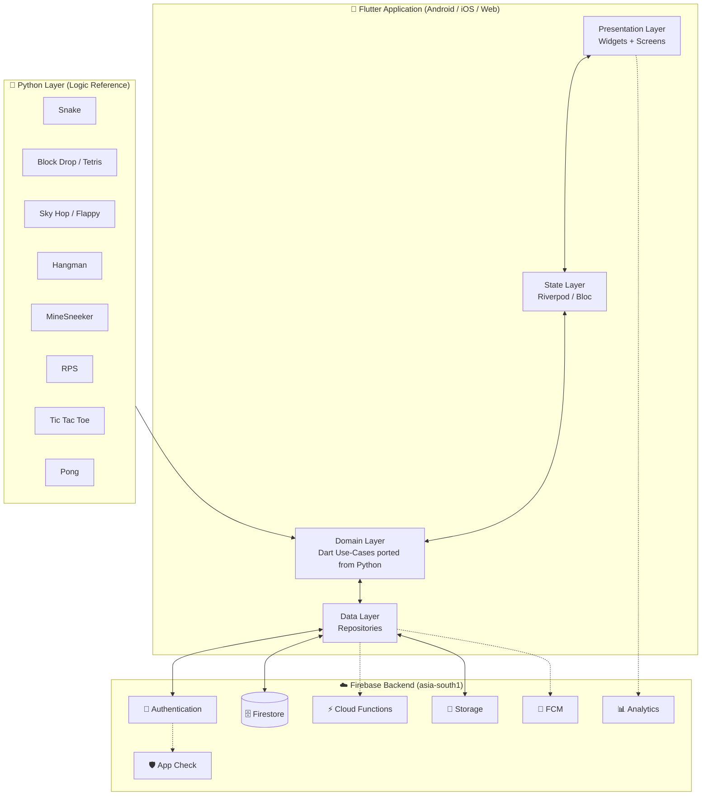

### Clean Architecture Layers

```text
lib/
├── core/                # constants, themes, utils, routing
├── data/                # Firebase repositories & DTOs
├── domain/              # entities, use-cases (Dart ports of Python)
├── presentation/        # screens, widgets, controllers
│   ├── auth/
│   ├── home/
│   ├── games/
│   │   ├── snake/
│   │   ├── block_drop/
│   │   ├── sky_hop/
│   │   ├── hangman/
│   │   ├── minesneeker/
│   │   ├── rps/
│   │   └── tic_tac_toe/
│   ├── leaderboard/
│   └── profile/
└── main.dart
```

---

## 🚀 Step-by-Step Procedure

This is the **end-to-end workflow** every contributor follows — from cold clone to Play Store submission.

### Step 1 — Clone & Bootstrap the Repo

```bash
# Clone the platform repo
git clone https://github.com/Subhadip-Paul2006/Games-Using-Python-Application.git
cd Games-Using-Python-Application

# Clone the Python game logic reference repo (separate)
git clone https://github.com/Subhadip-Paul2006/Games-Using-Python
```

### Step 2 — Install Toolchain

| Tool | Command |
|------|---------|
| Flutter SDK 3.x | `flutter doctor` |
| Android Studio | Install emulator + SDK 26+ |
| Firebase CLI | `npm install -g firebase-tools` |
| Dart | bundled with Flutter |

### Step 3 — Configure Firebase

```bash
# Login
firebase login

# Add the Firebase project
firebase use --add

# Configure Android app (gets google-services.json)
flutterfire configure
```

### Step 4 — Install Dependencies

```bash
flutter pub get
```

### Step 5 — Port Python Logic → Dart Use-Cases

For each Python game (e.g., `Snake Game/snake.py`):

1. Read the Python source to extract the pure logic.
2. Write an equivalent Dart class in `lib/domain/games/<game>/`.
3. Cover with unit tests (`test/domain/games/<game>/`).
4. Wrap the Dart logic in a Flame component for arcade titles, or plain widgets for board games.

### Step 6 — Build the UI Shell

Per-game UI lives in `lib/presentation/games/<game>/`:

- HUD (score, pause, level)
- Pause / Game-Over overlays
- Settings drawer
- Tutorial overlay

### Step 7 — Wire the Platform Layer

Each game implements the `GameModule` abstract class so the platform can:

- Submit scores via `ScoreClient` (idempotent + offline-outbox).
- Log analytics events.
- Show the rewarded-ad button at game-over.
- Gate IAP behind the Parent PIN.

### Step 8 — Run on Device / Emulator

```bash
flutter run                    # debug
flutter run --release          # release build
flutter run -d chrome          # web (v1.1)
```

### Step 9 — Test

```bash
flutter test                   # unit + widget
flutter test --coverage        # coverage report
firebase emulators:exec --only firestore "flutter test integration_test/"
```

### Step 10 — Open a Pull Request

1. Branch from `develop`: `git checkout -b feature/<name>`
2. Conventional commits: `feat(snake): add pause overlay`
3. Open PR, link the issue (`Closes #123`), tag reviewer.
4. CI runs lint + tests + golden tests.
5. Squash-merge to `develop`.

### Step 11 — Release

1. `develop` → manual QA → `main`.
2. Tag `v*` triggers Codemagic release build.
3. Upload signed AAB to Play Console.
4. Staged rollout: 5 % → 20 % → 50 % → 100 %.

---

## 📊 Visual Diagrams

### 1️⃣ End-to-End System Architecture


### 2️⃣ User Journey — From Install to Day-7 Streak

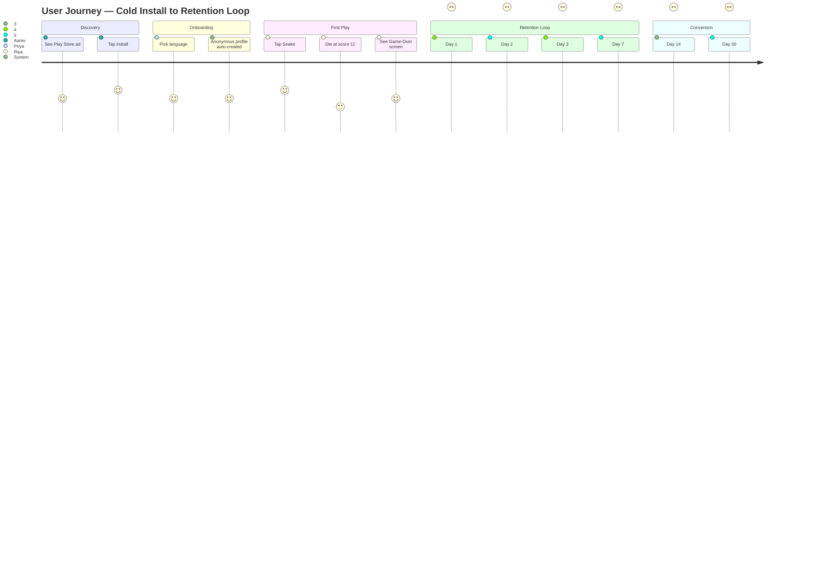

### 3️⃣ Offline-First Score Submission Flow

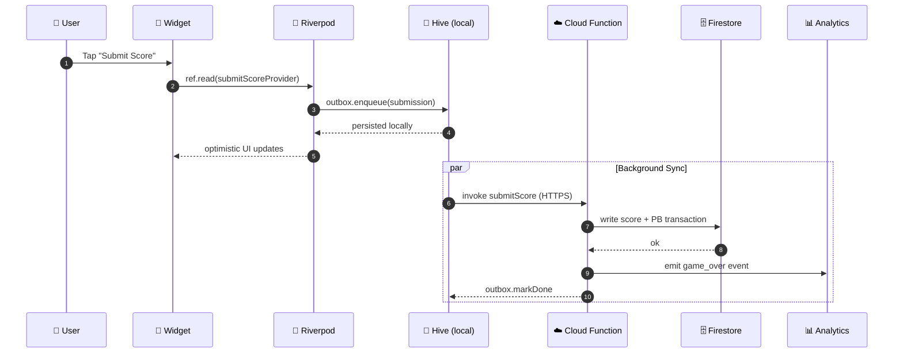

### 4️⃣ Anonymous → Google Sign-In Upgrade

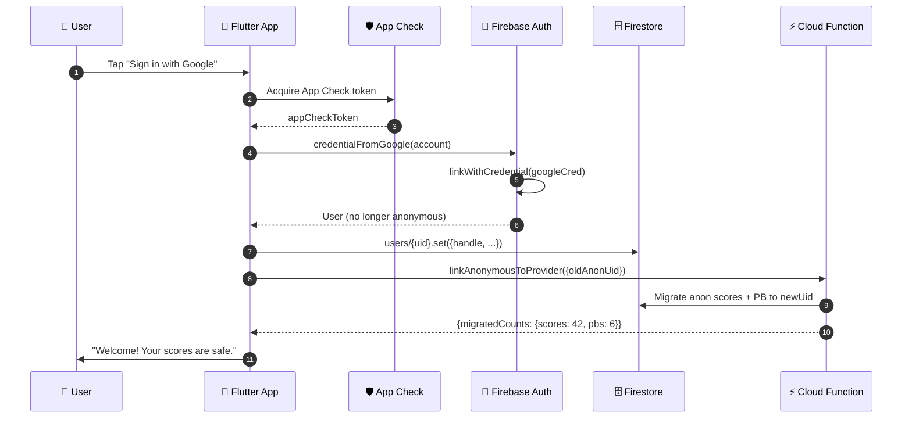

### 5️⃣ Firestore Data Model (ER Diagram)

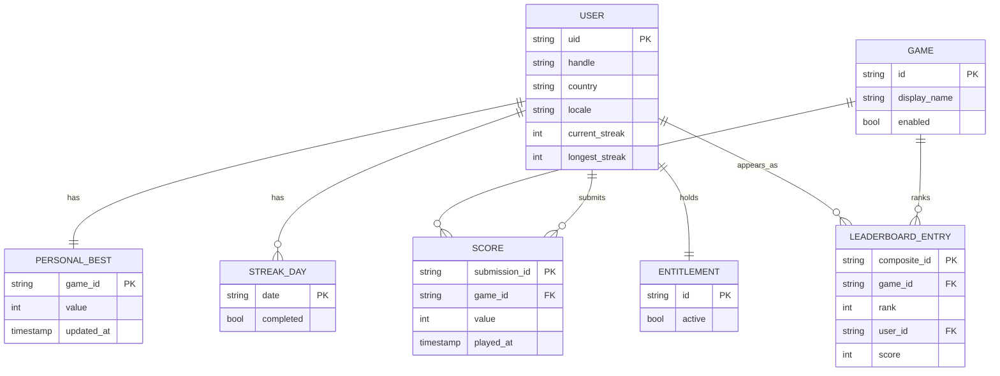

### 6️⃣ Game Module Contract (Class Diagram)

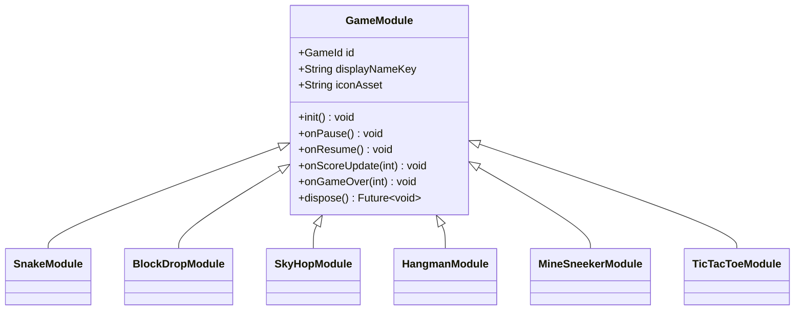

### 7️⃣ Phased Development Roadmap (Gantt)

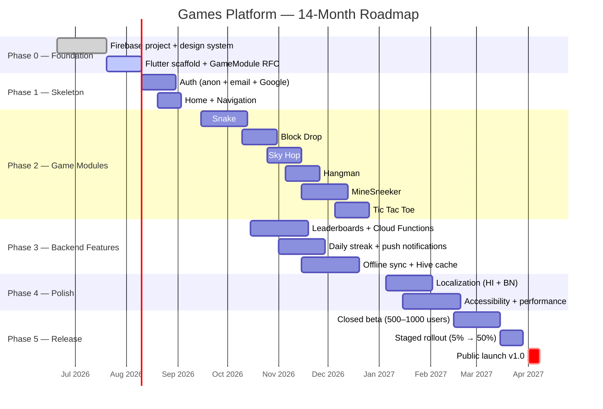

### 8️⃣ Team Workflow (PR + Code Review Loop)

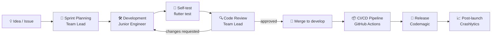

### 9️⃣ Auth State Machine

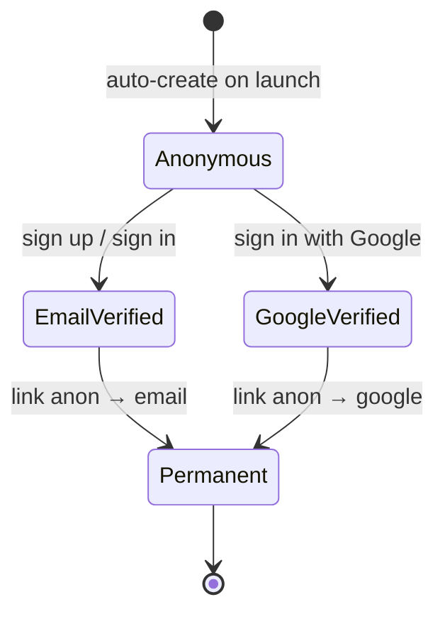

### 🔟 Daily Streak & Notification Loop

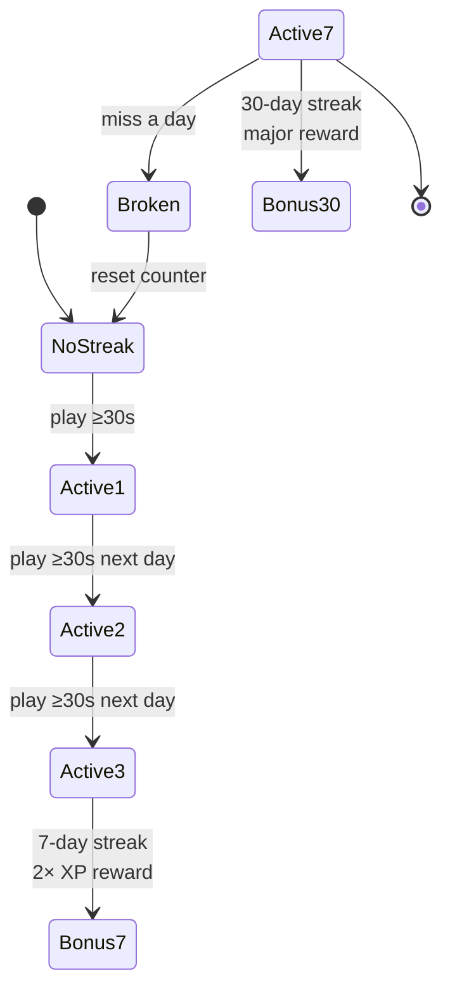

---

## 🛠️ Installation & Setup

### Prerequisites

| Tool | Version | Download |
|------|---------|----------|
| **Git** | latest | https://git-scm.com |
| **Flutter SDK** | 3.x | https://docs.flutter.dev/get-started/install |
| **Android Studio** | latest | https://developer.android.com/studio |
| **VS Code** (optional) | latest | https://code.visualstudio.com |
| **Firebase CLI** | latest | `npm install -g firebase-tools` |
| **JDK** | 17 | https://adoptium.net |
| **Python 3** (only to read the game logic source) | 3.10+ | https://python.org |

### First-Time Setup

```bash
# 1. Verify toolchain
flutter doctor
firebase --version

# 2. Clone the application repo
git clone https://github.com/Subhadip-Paul2006/Games-Using-Python-Application.git
cd Games-Using-Python-Application

# 3. Clone the Python game logic reference (read-only)
git clone https://github.com/Subhadip-Paul2006/Games-Using-Python ../Games-Using-Python

# 4. Get Flutter packages
flutter pub get

# 5. Configure Firebase (ask team lead for project access)
flutterfire configure
```

For detailed Flutter SDK installation walkthroughs, jump to **[🛠️ Installing Flutter SDK (Step-by-Step)](#-installing-flutter-sdk-step-by-step)** below.

---

## 🛠️ Installing Flutter SDK (Step-by-Step)

> Choose **one** of the three platforms below. All three end with `flutter doctor` reporting a green check ✅.

### 🪟 Step A — Windows Installation

#### A1. System Requirements

| Requirement | Minimum |
|-------------|---------|
| OS | Windows 10 (64-bit) or later |
| Disk space | ~10 GB (Flutter SDK + Android SDK + emulator) |
| RAM | 8 GB |
| Git for Windows | https://git-scm.com/download/win |

#### A2. Install Git for Windows

Download the installer from https://git-scm.com/download/win and run it with the default options.

#### A3. Download the Flutter SDK

```powershell
# Option 1 — Official ZIP (recommended for first install)
# Download the latest stable Flutter SDK bundle from
#   https://docs.flutter.dev/get-started/install/windows/mobile
# Extract the zip to:  C:\src\flutter
# (Do NOT install in C:\Program Files — it requires admin & causes permission issues)

# Option 2 — Using git clone (lets you switch channels later)
cd C:\src
git clone https://github.com/flutter/flutter.git -b stable
```

#### A4. Add Flutter to PATH

1. Press **Win + S** → type `env` → open **Edit the system environment variables**.
2. Click **Environment Variables…** → under **User variables** select **Path** → **Edit…**.
3. **New** → paste `C:\src\flutter\bin` → **OK** → **OK** → **OK**.
4. **Close & reopen** any open terminals.

#### A5. Verify the Install

```powershell
flutter --version
flutter doctor
```

#### A6. Install Android Studio

1. Download Android Studio from https://developer.android.com/studio.
2. Run the installer → choose **Custom** setup → tick:
   - ✅ Android SDK
   - ✅ Android SDK Platform (API 35)
   - ✅ Android Virtual Device
   - ✅ Performance (Intel HAXM) — only on Intel CPUs
3. Launch Android Studio → open **More Actions → SDK Manager**:
   - Install **Android 14 (API 34)** + **Android 15 (API 35)**.
   - Install **Android SDK Command-line Tools (latest)**.
   - Under **SDK Tools**, tick **Google Play Services** and **Intel x86 Emulator Accelerator (HAXM)**.
4. Accept all licences:
   ```powershell
   flutter doctor --android-licenses
   ```
   Press `y` until it exits.

#### A7. Install JDK 17 (required by Gradle 8+)

Download **Temurin 17 (LTS)** from https://adoptium.net and install with defaults.

#### A8. Re-run `flutter doctor`

```powershell
flutter doctor
```

Expected output (all green ✅):
```
[√] Flutter (Channel stable, 3.x.x)
[√] Android toolchain - develop for Android devices
[√] Chrome - develop for the web
[√] Android Studio
[√] Connected device (1 available)
[√] Network resources
```

#### A9. Configure Android Studio for Flutter

1. Open Android Studio → **Plugins** → search **Flutter** → **Install** (this also installs the Dart plugin).
2. Restart Android Studio.
3. Verify **File → New → New Flutter Project** appears in the menu.

---

### 🍎 Step B — macOS Installation

#### B1. System Requirements

| Requirement | Minimum |
|-------------|---------|
| OS | macOS 12 (Monterey) or later, Intel or Apple Silicon |
| Disk space | ~10 GB |
| RAM | 8 GB |
| Xcode (for iOS) | latest stable |
| Homebrew (recommended) | https://brew.sh |

#### B2. Install Rosetta 2 (Apple Silicon only)

```bash
softwareupdate --install-rosetta
```

#### B3. Install Xcode Command Line Tools

```bash
xcode-select --install
```

#### B4. Install via Homebrew (recommended)

```bash
# 1. Install Homebrew if you don't have it
/bin/bash -c "$(curl -fsSL https://raw.githubusercontent.com/Homebrew/install/HEAD/install.sh)"

# 2. Install Flutter + dependencies
brew install --cask flutter
brew install --cask android-studio
brew install openjdk@17
```

#### B5. Configure Environment Variables

Add to your `~/.zshrc` (or `~/.bash_profile`):

```bash
# Flutter
export PATH="$PATH:`brew --prefix flutter`/bin"
# Android SDK (auto-installed by Android Studio)
export ANDROID_HOME="$HOME/Library/Android/sdk"
export PATH="$PATH:$ANDROID_HOME/emulator:$ANDROID_HOME/platform-tools"
# JDK 17
export JAVA_HOME="`brew --prefix openjdk@17`"
```

Reload:

```bash
source ~/.zshrc
```

#### B6. Install Android Studio Components

1. Launch **Android Studio** → **More Actions → SDK Manager**.
2. Install **Android 14 (API 34)** + **Android 15 (API 35)** + **Android SDK Command-line Tools**.
3. Accept licences:
   ```bash
   flutter doctor --android-licenses
   ```
4. (Optional) Install iOS toolchain:
   ```bash
   sudo xcode-select --switch /Applications/Xcode.app/Contents/Developer
   sudo xcodebuild -runFirstLaunch
   ```

#### B7. Verify Everything

```bash
flutter doctor
```

You should see green checks for Flutter, Android toolchain, Xcode (if installed), and Chrome.

---

### 🐧 Step C — Linux Installation (Ubuntu / Debian)

#### C1. System Requirements

| Requirement | Minimum |
|-------------|---------|
| OS | Ubuntu 22.04+ / Debian 12+ (64-bit) |
| Disk space | ~10 GB |
| RAM | 8 GB |

#### C2. Install System Dependencies

```bash
sudo apt update
sudo apt install -y curl git unzip xz-utils zip libglu1-mesa \
                    openjdk-17-jdk wget clang cmake ninja-build \
                    pkg-config libgtk-3-dev liblzma-dev
```

#### C3. Download & Extract Flutter

```bash
cd ~
wget https://storage.googleapis.com/flutter_infra_release/releases/stable/linux/flutter_linux_3.24.0-stable.tar.xz
tar xf flutter_linux_3.24.0-stable.tar.xz
```

#### C4. Add Flutter to PATH

Add to `~/.bashrc` (or `~/.zshrc`):

```bash
export PATH="$PATH:$HOME/flutter/bin"
export ANDROID_HOME="$HOME/Android/Sdk"
export PATH="$PATH:$ANDROID_HOME/cmdline-tools/latest/bin"
export PATH="$PATH:$ANDROID_HOME/platform-tools"
```

Reload:

```bash
source ~/.bashrc
```

#### C5. Install Android SDK Command-Line Tools

```bash
mkdir -p $ANDROID_HOME/cmdline-tools
cd $ANDROID_HOME/cmdline-tools
wget https://dl.google.com/android/repository/commandlinetools-linux-11076708_latest.zip
unzip commandlinetools-linux-*.zip
mv cmdline-tools latest
```

Accept licences and install required SDK packages:

```bash
yes | sdkmanager --licenses
sdkmanager "platform-tools" "platforms;android-35" "build-tools;35.0.0"
```

#### C6. Verify Everything

```bash
flutter doctor
flutter doctor --android-licenses
```

You should now see green checks for Flutter and Android toolchain.

---

### ✅ Step D — Sanity-Check Across All Platforms

Run these commands in any platform to confirm the toolchain works:

```bash
flutter doctor -v           # verbose report
flutter create hello_world   # smoke-test the toolchain
cd hello_world
flutter run                 # launches on the first connected device
```

If the hello-world app launches, your Flutter installation is complete.

### 📊 Flutter SDK Installation Flow

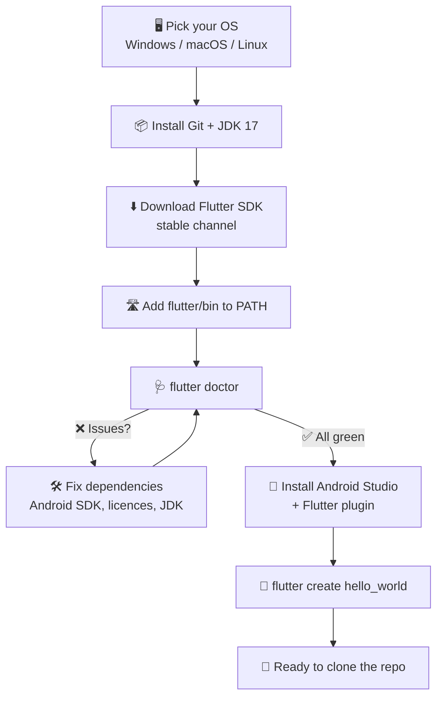

---

## ▶️ Running the Project

```bash
# Run on a connected Android device or emulator
flutter run

# Run on web (v1.1 — 4 games only)
flutter run -d chrome

# Run in profile mode (for performance profiling)
flutter run --profile

# Build a release APK
flutter build apk --release

# Build an Android App Bundle (recommended for Play Store)
flutter build appbundle --release
```

### Useful Daily Commands

```bash
flutter clean              # clean build artifacts
flutter pub get            # refresh dependencies
flutter analyze            # static analysis (lint)
flutter test               # unit + widget tests
flutter test --coverage    # generate coverage report
dart format lib/ test/     # auto-format Dart code
```

---

## 🧪 Testing Strategy

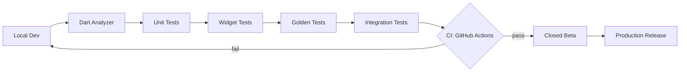

| Layer | Tooling | Target Coverage |
|-------|---------|----------------|
| **Lint** | `flutter_lints` + custom rules | n/a |
| **Unit** | `flutter_test` + `mocktail` | ≥ 80 % on `domain/` |
| **Widget** | `flutter_test` | ≥ 70 % on `presentation/` |
| **Golden** | `flutter_test` golden files | 1 per screen |
| **Integration** | `integration_test` + Firebase emulators | Smoke for happy path |
| **Firestore Rules** | `@firebase/rules-unit-testing` | 100 % of rules covered |

---

## 👥 Team & Roles

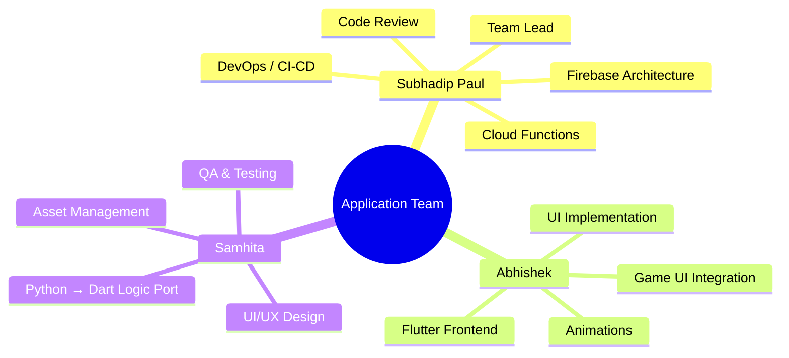

| Role | Owner | Responsibilities |
|------|-------|------------------|
| 🧑‍✈️ **Team Lead** | **Subhadip Paul** | Architecture, Firebase, Cloud Functions, CI/CD, Play Store submission, code review |
| 🧑‍💻 **Flutter Engineer** | **Abhishek** | Screens, widgets, navigation, animations, theming, per-game UI shells |
| 🧪 **Design + QA Lead** | **Samhita** | Figma design system, Python→Dart logic ports, QA test plans, localisation |

---

## 🗺️ Project Roadmap

| Phase | Goal | Duration | Status |
|-------|------|----------|--------|
| **Phase 0** — Foundation | Firebase project, design system, GameModule RFC | Jun–Jul 2026 | 🟡 In Progress |
| **Phase 1** — Skeleton | Routing, theming, auth (anon + email + Google) | Aug 2026 | ⏳ Planned |
| **Phase 1.5** — Monetization | AdMob + IAP plumbing | Sep 2026 | ⏳ Planned |
| **Phase 2** — Game Modules | 6 games built on `GameModule` contract | Sep–Dec 2026 | ⏳ Planned |
| **Phase 3** — Backend Features | Leaderboards, streaks, offline sync | Sep–Dec 2026 | ⏳ Planned |
| **Phase 4** — Polish | A11y, localization, performance | Jan–Feb 2027 | ⏳ Planned |
| **Phase 4.5** — Monetization Live | Live AdMob + IAP, A/B infra | Feb 2027 | ⏳ Planned |
| **Phase 5** — Release | Closed beta → staged rollout → global | Feb–Apr 2027 | ⏳ Planned |

**🎯 Public launch target:** 2027-04-01

---

## 📚 Companion Documentation

This application sits on top of three detailed companion docs:

| Doc | Purpose | Audience |
|-----|---------|----------|
| 📄 **[`PRD.md`](./PRD.md)** | Product Requirements — vision, personas, features, KPIs | Product, design, leadership |
| 📄 **[`TRD.md`](./TRD.md)** | Technical Requirements — architecture, APIs, infra, security | Engineers, architects |
| 📄 **[`DESIGN.md`](./DESIGN.md)** | UI/UX specification — components, tokens, screens, a11y | Designers, frontend engineers |
| 📄 **[`APP_DEVELOPMENT.md`](./APP_DEVELOPMENT.md)** | Original scoping doc + team workflow | Everyone |

---

## 🤝 Open Source Contributing

> 🌟 **Contributions are absolutely welcome!** Whether you're fixing a typo, porting a new Python game into Dart, designing a screen, or hunting down a crash — we'd love your help. Read on to learn how to fork the repo and open your first Pull Request.

### 💖 Code of Conduct

By participating, you agree to:

- Be respectful and inclusive. We're building a **kid-safe** product — that energy carries into our community.
- Assume good faith. Ask before assuming malice.
- Keep PRs focused. One feature or fix per PR is easier to review.
- Never commit secrets (`google-services.json`, Firebase keys, signing keys).

### 🌱 Good First Issues

New to the project? Look for issues tagged:

| Label | Meaning |
|-------|---------|
| 🟢 `good first issue` | Beginner-friendly — clear scope, mentored review |
| 🟡 `help wanted` | We need your expertise here |
| 🔵 `documentation` | Docs, comments, README polish |
| 🟣 `port-python-to-dart` | Port a Python game into Dart use-cases |
| 🔴 `bug` | Confirmed defect waiting for a fix |

### 🍴 Fork, Clone, Branch — the PR Workflow

Here's the **complete step-by-step process** to get your first PR merged.

#### 1️⃣ Fork the Repository

1. Open https://github.com/Subhadip-Paul2006/Games-Using-Python-Application in your browser.
2. Click the **Fork** button (top-right). This creates a copy under **your** GitHub account:
   `https://github.com/<your-username>/Games-Using-Python-Application`.

#### 2️⃣ Clone Your Fork Locally

```bash
# Replace <your-username> with your GitHub handle
git clone https://github.com/<your-username>/Games-Using-Python-Application.git
cd Games-Using-Python-Application

# Add the upstream remote so you can sync later
git remote add upstream https://github.com/Subhadip-Paul2006/Games-Using-Python-Application.git
git remote -v   # should show both origin and upstream
```

#### 3️⃣ Sync with Upstream (do this every time you start a new PR)

```bash
git checkout develop
git fetch upstream
git merge upstream/develop
git push origin develop
```

#### 4️⃣ Create a Feature Branch

Always branch from `develop`. **Never** branch from `main`.

```bash
git checkout develop
git checkout -b feature/snake-pause-overlay       # new feature
git checkout -b fix/leaderboard-cap-100           # bug fix
git checkout -b docs/update-readme-setup          # documentation
git checkout -b port/port-hangman-to-dart         # Python → Dart port
```

Branch-naming convention:

```
<type>/<short-kebab-description>

types: feature | fix | docs | refactor | test | port | chore
```

#### 5️⃣ Make Your Changes

```bash
# 1. Install dependencies (first time only)
flutter pub get

# 2. Make your edits in lib/, test/, docs/, etc.

# 3. Run the analyzer + tests locally before committing
flutter analyze
flutter test

# 4. Format your code
dart format lib/ test/
```

#### 6️⃣ Commit Using Conventional Commits

```bash
git add .
git commit -m "feat(snake): add swipe-to-pause gesture overlay"
```

Conventional Commit types:

| Type | When to use |
|------|-------------|
| `feat` | A new user-visible feature |
| `fix` | A bug fix |
| `docs` | Documentation-only changes |
| `style` | Formatting / whitespace (no logic change) |
| `refactor` | Code change that neither fixes a bug nor adds a feature |
| `test` | Adding or fixing tests |
| `chore` | Build / CI / tooling / dependency bumps |
| `port` | Python → Dart logic port |

Examples:

```text
feat(hangman): add Hindi word list with Devanagari support
fix(leaderboard): cap query at 100 docs to avoid Firestore cost spike
docs: add Flutter SDK install walkthrough for Windows
port(sky_hop): port Sky Hop collision logic from Python to Dart
test(snake): add unit tests for board wrap-around behaviour
```

#### 7️⃣ Push to Your Fork

```bash
git push origin feature/snake-pause-overlay
```

GitHub will print a link like:

```
remote: Create a PR: https://github.com/<your-username>/Games-Using-Python-Application/pull/new/feature/snake-pause-overlay
```

#### 8️⃣ Open the Pull Request

1. Open that URL (or click **Compare & pull request** on your fork's GitHub page).
2. Set the base branch to **`develop`** (not `main`).
3. Fill out the PR template:

   ```markdown
   ## What does this PR do?
   <!-- 1-3 sentences -->

   ## Why is it needed?
   <!-- link the issue: Closes #123 -->

   ## How was it tested?
   <!-- flutter test output, screenshots, manual steps -->

   ## Checklist
   - [ ] `flutter analyze` is clean
   - [ ] `flutter test` is green
   - [ ] Added/updated tests
   - [ ] Followed Conventional Commits
   - [ ] Updated docs (if behaviour changed)
   ```

4. Click **Create pull request**.

#### 9️⃣ Respond to Review

- A maintainer will review within **2 business days**.
- Address feedback by pushing new commits to the same branch — the PR updates automatically.
- Once approved, the maintainer will **squash-merge** into `develop`.
- 🎉 Your branch auto-deletes on merge; you'll be listed in the contributors graph.

### 🔁 Visual: The Pull Request Lifecycle

```mermaid
flowchart LR
    A[🐛 Issue / 💡 Idea] --> B[🍴 Fork Repo]
    B --> C[📥 Clone Locally]
    C --> D[🌿 Branch from develop]
    D --> E[🛠️ Make Changes]
    E --> F[🧪 flutter analyze + test]
    F -->|❌ fails| E
    F -->|✅ passes| G[📝 Conventional Commit]
    G --> H[📤 Push to fork]
    H --> I[🔗 Open PR → develop]
    I --> J[🔍 Code Review]
    J -->|changes requested| E
    J -->|approved| K[✅ Squash-merge]
    K --> L[🚀 CI/CD pipeline]
    L --> M[🎉 Contributor!]
```

### 🧪 Local Quality Gate (must pass before opening a PR)

```bash
flutter pub get
flutter analyze                                # 0 warnings
flutter test                                   # all green
flutter test --coverage                        # coverage diff visible
dart format --set-exit-if-changed lib/ test/   # no diff
```

Optional but encouraged:

```bash
flutter test integration_test/                 # smoke test happy path
firebase emulators:exec --only firestore \
  "flutter test integration_test/"             # with local Firebase
```

### 🧭 Where to Contribute

| Area | Where in the repo | Difficulty |
|------|-------------------|------------|
| 🐍 Port a Python game to Dart | `lib/domain/games/<game>/` + `test/domain/games/<game>/` | 🟡 Intermediate |
| 🎨 Implement a new screen from Figma | `lib/presentation/<screen>/` | 🟢 Beginner |
| 🐞 Fix a bug | Search `good first issue` / `bug` labels | 🟢 Beginner |
| 🌐 Translation (Hindi / Bengali) | `lib/l10n/app_hi.arb`, `app_bn.arb` | 🟢 Beginner |
| 📊 Add analytics events | `lib/core/analytics/` | 🟡 Intermediate |
| ⚡ Write a Cloud Function | `functions/src/<feature>.ts` | 🔴 Advanced |
| 🧪 Add tests | `test/` | 🟢 Beginner |
| 📚 Improve docs | `*.md` files | 🟢 Beginner |

### 🙋 Getting Help

Stuck? Reach out!

- 💬 Open a **Discussion** on GitHub: https://github.com/Subhadip-Paul2006/Games-Using-Python-Application/discussions
- 🐞 File an **Issue**: https://github.com/Subhadip-Paul2006/Games-Using-Python-Application/issues
- 📧 Email the maintainers: see [`CODEOWNERS`](./CODEOWNERS) (coming soon)

### ⭐ Show Your Support

If you find this project useful, please **star ⭐ the repo** — it helps more people discover it.

Thank you for contributing! 💙

---

## 📜 License

Distributed under the **MIT License**. See [`LICENSE`](./LICENSE) for the full text.

> The Python game logic in the reference repository is also MIT-licensed.

---

## 🙏 Acknowledgements

- **Subhadip Paul** — Project Lead, Backend, Firebase, DevOps
- **Abhishek** — Frontend, Animations, Game UI
- **Samhita** — Design, QA, Python→Dart porting, i18n
- **Python open-source community** — The original game logic prototypes
- **Flutter & Firebase teams** — The platforms that make this possible
- **User testers (n=14)** — Whose feedback shaped the kid-safe, offline-first posture

---

<p align="center">
  <strong>Crafted with 💙 by the Games-Using-Python Application Team</strong><br/>
  <a href="https://github.com/Subhadip-Paul2006">Subhadip Paul</a> · Abhishek · Samhita<br/>
  <sub>Game logic written in Python:</sub><br/>
  <a href="https://github.com/Subhadip-Paul2006/Games-Using-Python">🐍 https://github.com/Subhadip-Paul2006/Games-Using-Python</a>
</p>