# 🎮 Games Using Python — Application Platform

<p align="center">
  
  
  
  
  
</p>

<p align="center">
  <strong>A unified cross-platform Flutter + Firebase application that bundles classic casual games (Snake, Block Drop, Sky Hop, Hangman, MineSneeker, Tic Tac Toe, RPS) behind one anonymous-first identity, one cross-game leaderboard, one daily-streak loop, and one ad-light monetization model.</strong>
</p>

---

## 📖 Table of Contents

1. [About the Project](#-about-the-project)
2. [🎮 Game Logic Repository](#-game-logic-repository)
3. [🧰 Tech Stack](#-tech-stack)
4. [🏗️ Architecture Overview](#-architecture-overview)
5. [🚀 Step-by-Step Procedure](#-step-by-step-procedure)
6. [📊 Visual Diagrams](#-visual-diagrams)
7. [🛠️ Installation & Setup](#-installation--setup)
8. [▶️ Running the Project](#-running-the-project)
9. [🧪 Testing Strategy](#-testing-strategy)
10. [👥 Team & Roles](#-team--roles)
11. [🗺️ Project Roadmap](#-project-roadmap)
12. [📚 Companion Documentation](#-companion-documentation)
13. [🤝 Contributing](#-contributing)
14. [📜 License](#-license)
15. [🙏 Acknowledgements](#-acknowledgements)

---

## 📖 About the Project

**Games Platform** is a 14-month, 3-engineer effort to transform a collection of standalone Python game prototypes into a **single, polished, offline-first Android application** powered by **Flutter** and **Firebase**.

The platform's purpose is to give casual mobile gamers (kids, teens, commuters, parents) in India and South-East Asia **one safe, beautifully crafted home** for classic arcade games — without forced logins, without heavy interstitials, and without losing progress on flaky train Wi-Fi.

### ✨ Core Promises

| UVP Claim | Design Promise |
|---|---|
| **One app** | A unified shell with consistent IA across all 6 games |
| **Six games** | Each game gets equal, distinct visual treatment |
| **Zero friction** | Tap-to-play in ≤ 3 taps from cold launch |
| **Offline-first** | Play any game without network; sync in the background |
| **Kid-safe** | No chat, no tracking SDKs, no third-party data harvesters |

### 🎯 Year-1 Targets

- 📥 **1.5M installs**
- 🔁 **22% D7 retention** (~2.75× category median)
- 💵 **~$0.04 ARPDAU**
- 🛡 **99.5% crash-free**
- ⭐ **4.5★ Play Store rating**

---

## 🎮 Game Logic Repository

> **All the underlying game logic (snake, tetris, hangman, minesweeper, RPS, tic-tac-toe, flappy bird, pong) is written in Python and lives in the original repository.**

👉 **Game Logic Source:** [https://github.com/Subhadip-Paul2006/Games-Using-Python](https://github.com/Subhadip-Paul2006/Games-Using-Python)

The Python prototypes serve as the **logic reference layer** for the Flutter ports. Samhita (Design + QA) is responsible for translating each Python implementation into a pure-Dart use-case that the Flutter UI can consume.

---

## 🧰 Tech Stack

### 🧑‍💻 Core Languages & Frameworks

| Layer | Technology | Purpose |
|-------|------------|---------|
| **Game Logic (reference)** | **Python 3.x** | Original prototypes: Snake, Tetris, Hangman, etc. |
| **Application Frontend** | Flutter 3.x | Cross-platform UI (Android / iOS / Web) |
| **Application Language** | Dart 3.x | App + game logic ported from Python |
| **State Management** | Riverpod 2.x (`AsyncNotifier`) | Compile-time DI, async streams |
| **Game Loop** | Flame 1.x | 2D game engine for arcade titles |
| **Animations** | Rive, Lottie | Micro-interactions |

### ☁️ Firebase Services (Backend)

| Service | Purpose |
|---------|---------|
| 🔐 **Firebase Authentication** | Anonymous + Email + Google (App Check enforced) |
| 🗄️ **Cloud Firestore** | Profiles, scores, leaderboards, streaks |
| ⚡ **Cloud Functions (Gen 2)** | Score validation, leaderboard rollup, IAP verify |
| 📁 **Firebase Storage** | Avatars, replay files (v1.1) |
| 📲 **Cloud Messaging (FCM)** | 6 PM streak reminder, new-game notification |
| 📊 **Firebase Analytics** | Funnels + retention |
| 🐞 **Crashlytics** | Crash + non-fatal error reporting |
| 🛡️ **App Check** | Play Integrity attestation (anti-bot) |
| 🧪 **Remote Config** | Feature flags, A/B test variants |
| 🌐 **Firebase Hosting** | Privacy policy + static marketing pages |

### 🛠️ Dev & Ops Tooling

| Tool | Use |
|------|-----|
| **Android Studio / VS Code** | IDE + Flutter plugins |
| **Figma** | UI/UX design system + prototyping |
| **GitHub + GitHub Actions** | Version control + CI/CD |
| **Codemagic / Fastlane** | Release builds, store publishing |
| **Postman** | Cloud Function endpoint testing |
| **Jira / GitHub Projects** | Sprint & task tracking |

---

## 🏗️ Architecture Overview

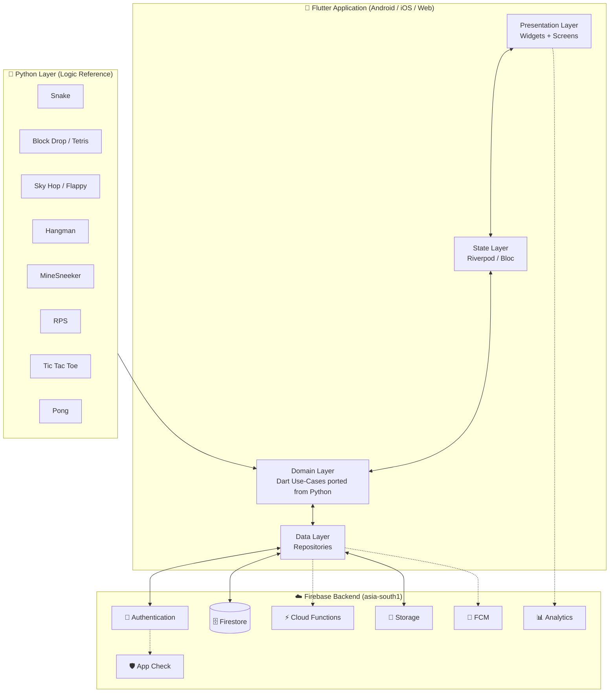

### Clean Architecture Layers

```text
lib/
├── core/                # constants, themes, utils, routing
├── data/                # Firebase repositories & DTOs
├── domain/              # entities, use-cases (Dart ports of Python)
├── presentation/        # screens, widgets, controllers
│   ├── auth/
│   ├── home/
│   ├── games/
│   │   ├── snake/
│   │   ├── block_drop/
│   │   ├── sky_hop/
│   │   ├── hangman/
│   │   ├── minesneeker/
│   │   ├── rps/
│   │   └── tic_tac_toe/
│   ├── leaderboard/
│   └── profile/
└── main.dart
```

---

## 🚀 Step-by-Step Procedure

This is the **end-to-end workflow** every contributor follows — from cold clone to Play Store submission.

### Step 1 — Clone & Bootstrap the Repo

```bash
# Clone the platform repo
git clone https://github.com/Subhadip-Paul2006/Games-Using-Python-Application.git
cd Games-Using-Python-Application

# Clone the Python game logic reference repo (separate)
git clone https://github.com/Subhadip-Paul2006/Games-Using-Python
```

### Step 2 — Install Toolchain

| Tool | Command |
|------|---------|
| Flutter SDK 3.x | `flutter doctor` |
| Android Studio | Install emulator + SDK 26+ |
| Firebase CLI | `npm install -g firebase-tools` |
| Dart | bundled with Flutter |

### Step 3 — Configure Firebase

```bash
# Login
firebase login

# Add the Firebase project
firebase use --add

# Configure Android app (gets google-services.json)
flutterfire configure
```

### Step 4 — Install Dependencies

```bash
flutter pub get
```

### Step 5 — Port Python Logic → Dart Use-Cases

For each Python game (e.g., `Snake Game/snake.py`):

1. Read the Python source to extract the pure logic.
2. Write an equivalent Dart class in `lib/domain/games/<game>/`.
3. Cover with unit tests (`test/domain/games/<game>/`).
4. Wrap the Dart logic in a Flame component for arcade titles, or plain widgets for board games.

### Step 6 — Build the UI Shell

Per-game UI lives in `lib/presentation/games/<game>/`:

- HUD (score, pause, level)
- Pause / Game-Over overlays
- Settings drawer
- Tutorial overlay

### Step 7 — Wire the Platform Layer

Each game implements the `GameModule` abstract class so the platform can:

- Submit scores via `ScoreClient` (idempotent + offline-outbox).
- Log analytics events.
- Show the rewarded-ad button at game-over.
- Gate IAP behind the Parent PIN.

### Step 8 — Run on Device / Emulator

```bash
flutter run                    # debug
flutter run --release          # release build
flutter run -d chrome          # web (v1.1)
```

### Step 9 — Test

```bash
flutter test                   # unit + widget
flutter test --coverage        # coverage report
firebase emulators:exec --only firestore "flutter test integration_test/"
```

### Step 10 — Open a Pull Request

1. Branch from `develop`: `git checkout -b feature/<name>`
2. Conventional commits: `feat(snake): add pause overlay`
3. Open PR, link the issue (`Closes #123`), tag reviewer.
4. CI runs lint + tests + golden tests.
5. Squash-merge to `develop`.

### Step 11 — Release

1. `develop` → manual QA → `main`.
2. Tag `v*` triggers Codemagic release build.
3. Upload signed AAB to Play Console.
4. Staged rollout: 5 % → 20 % → 50 % → 100 %.

---

## 📊 Visual Diagrams

### 1️⃣ End-to-End System Architecture

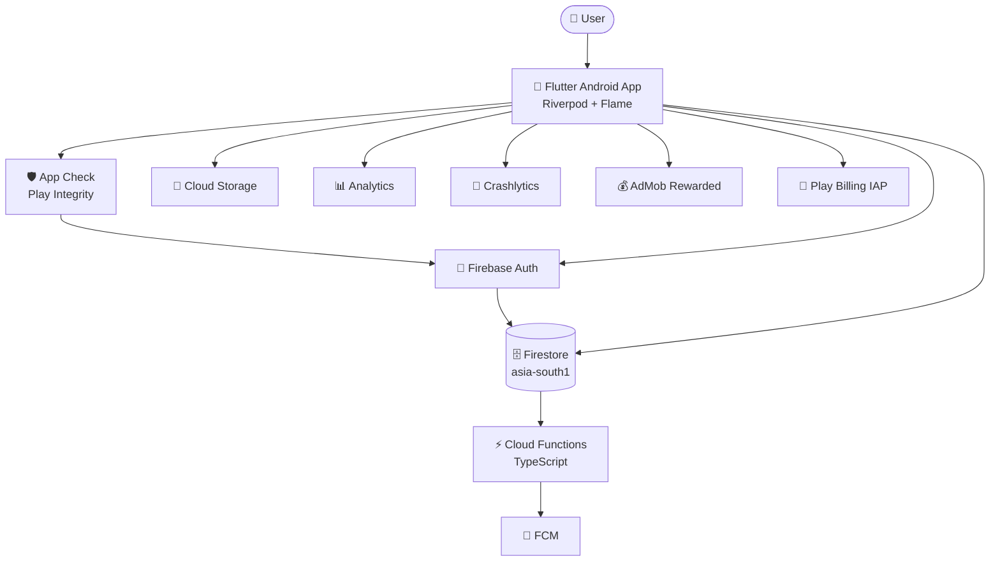

### 2️⃣ User Journey — From Install to Day-7 Streak

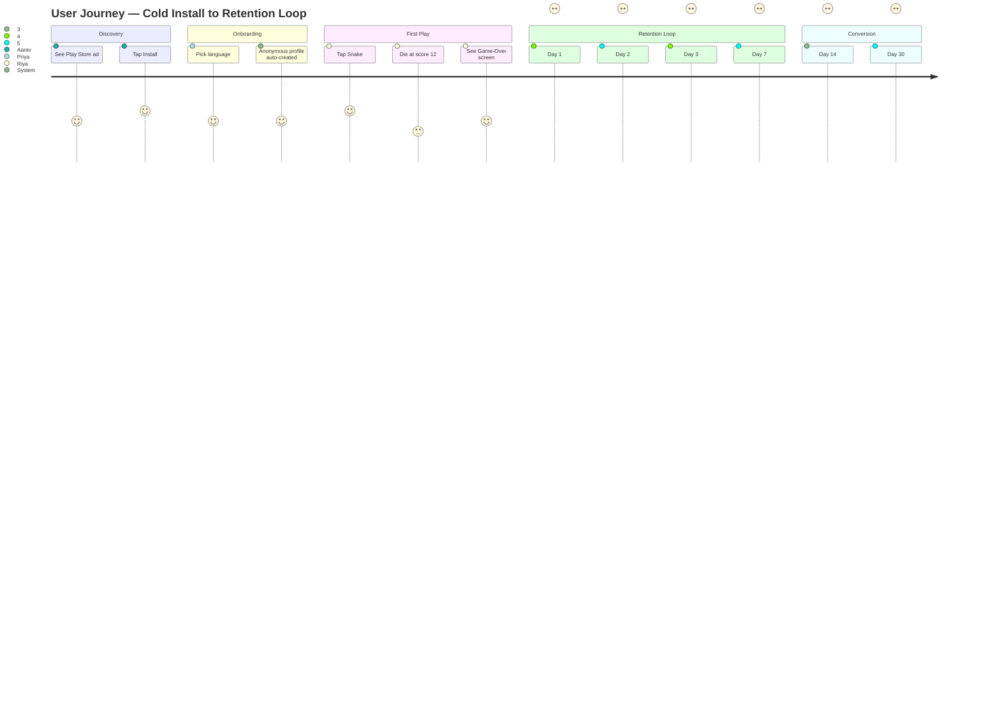

### 3️⃣ Offline-First Score Submission Flow

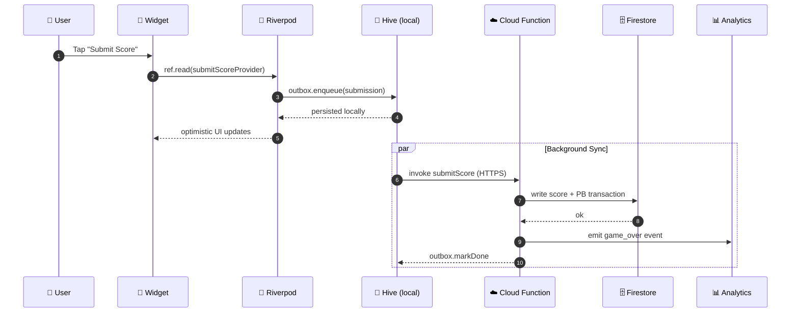

### 4️⃣ Anonymous → Google Sign-In Upgrade

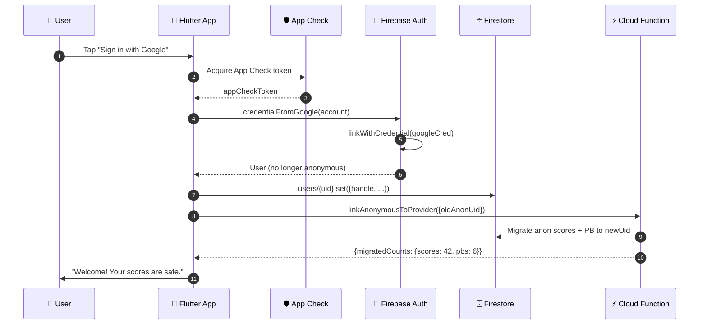

### 5️⃣ Firestore Data Model (ER Diagram)

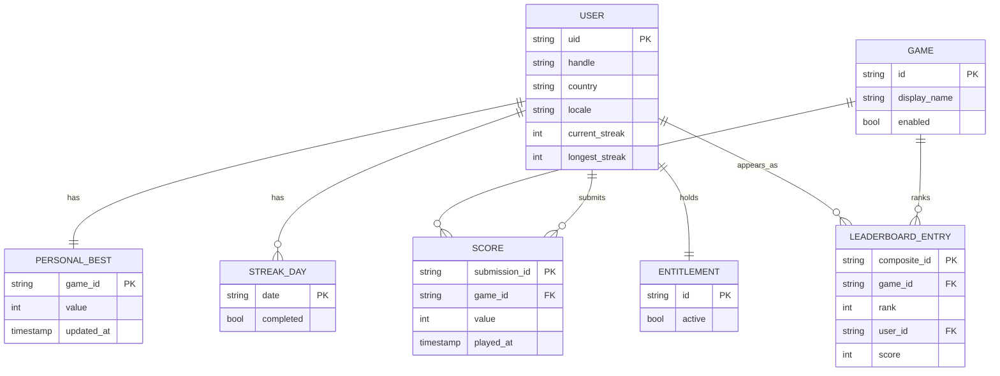

### 6️⃣ Game Module Contract (Class Diagram)

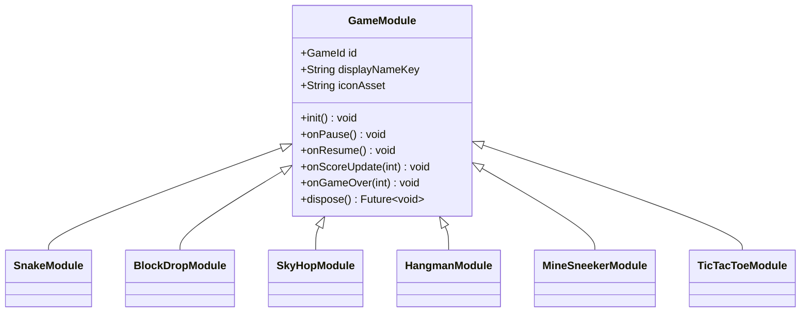

### 7️⃣ Phased Development Roadmap (Gantt)

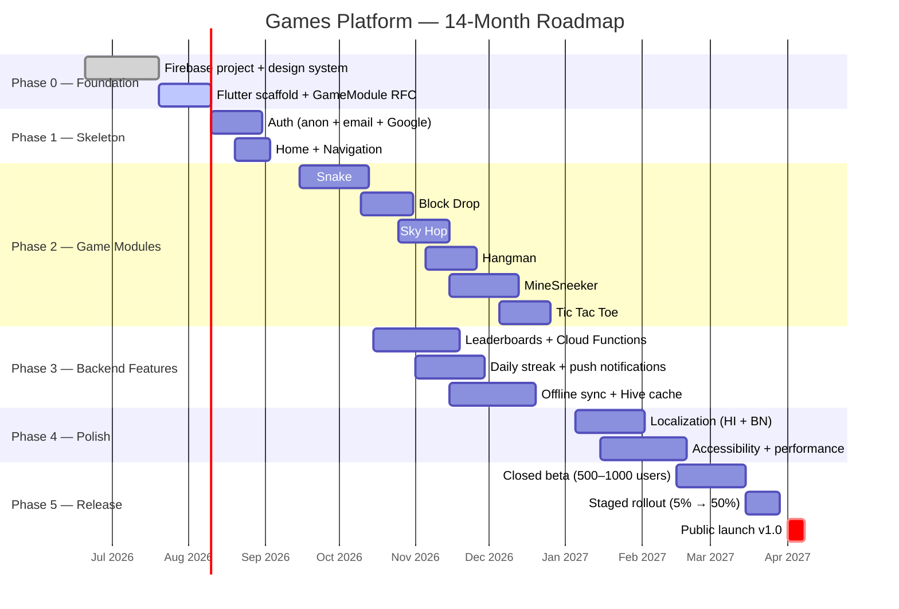

### 8️⃣ Team Workflow (PR + Code Review Loop)

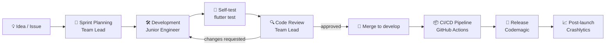

### 9️⃣ Auth State Machine

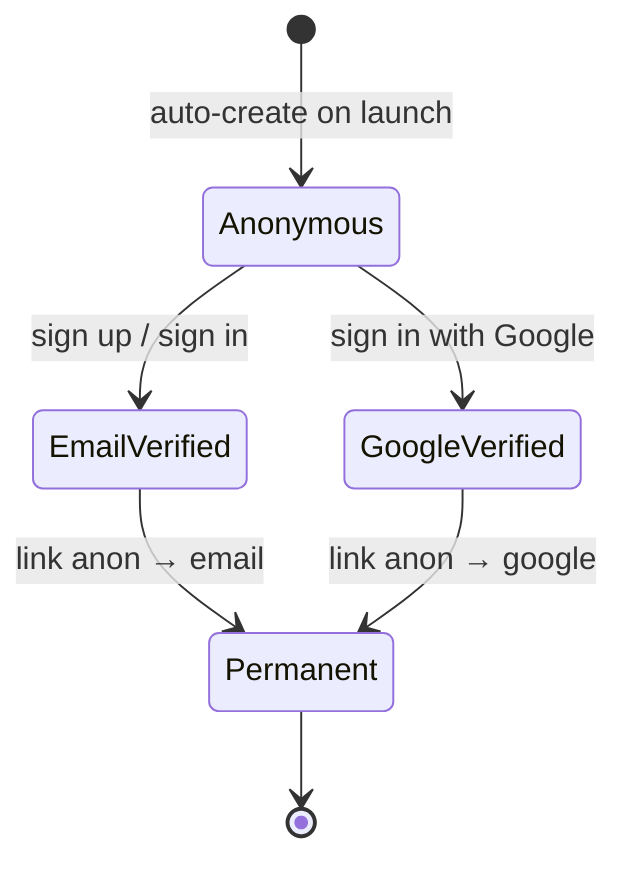

### 🔟 Daily Streak & Notification Loop

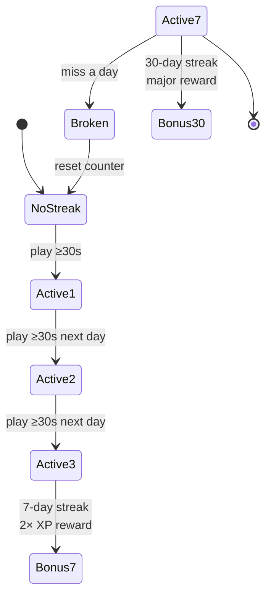

---

## 🛠️ Installation & Setup

### Prerequisites

| Tool | Version | Download |
|------|---------|----------|
| **Git** | latest | https://git-scm.com |
| **Flutter SDK** | 3.x | https://docs.flutter.dev/get-started/install |
| **Android Studio** | latest | https://developer.android.com/studio |
| **VS Code** (optional) | latest | https://code.visualstudio.com |
| **Firebase CLI** | latest | `npm install -g firebase-tools` |
| **JDK** | 17 | https://adoptium.net |
| **Python 3** (only to read the game logic source) | 3.10+ | https://python.org |

### First-Time Setup

```bash
# 1. Verify toolchain
flutter doctor
firebase --version

# 2. Clone the application repo
git clone https://github.com/Subhadip-Paul2006/Games-Using-Python-Application.git
cd Games-Using-Python-Application

# 3. Clone the Python game logic reference (read-only)
git clone https://github.com/Subhadip-Paul2006/Games-Using-Python ../Games-Using-Python

# 4. Get Flutter packages
flutter pub get

# 5. Configure Firebase (ask team lead for project access)
flutterfire configure
```

---

## ▶️ Running the Project

```bash
# Run on a connected Android device or emulator
flutter run

# Run on web (v1.1 — 4 games only)
flutter run -d chrome

# Run in profile mode (for performance profiling)
flutter run --profile

# Build a release APK
flutter build apk --release

# Build an Android App Bundle (recommended for Play Store)
flutter build appbundle --release
```

### Useful Daily Commands

```bash
flutter clean              # clean build artifacts
flutter pub get            # refresh dependencies
flutter analyze            # static analysis (lint)
flutter test               # unit + widget tests
flutter test --coverage    # generate coverage report
dart format lib/ test/     # auto-format Dart code
```

---

## 🧪 Testing Strategy

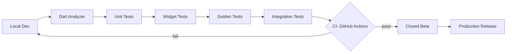

| Layer | Tooling | Target Coverage |
|-------|---------|----------------|
| **Lint** | `flutter_lints` + custom rules | n/a |
| **Unit** | `flutter_test` + `mocktail` | ≥ 80 % on `domain/` |
| **Widget** | `flutter_test` | ≥ 70 % on `presentation/` |
| **Golden** | `flutter_test` golden files | 1 per screen |
| **Integration** | `integration_test` + Firebase emulators | Smoke for happy path |
| **Firestore Rules** | `@firebase/rules-unit-testing` | 100 % of rules covered |

---

## 👥 Team & Roles

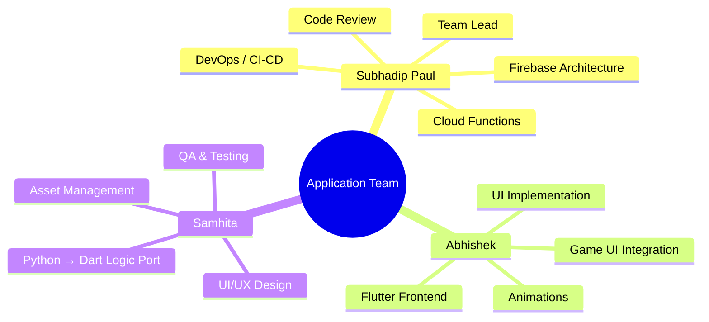

| Role | Owner | Responsibilities |
|------|-------|------------------|
| 🧑‍✈️ **Team Lead** | **Subhadip Paul** | Architecture, Firebase, Cloud Functions, CI/CD, Play Store submission, code review |
| 🧑‍💻 **Flutter Engineer** | **Abhishek** | Screens, widgets, navigation, animations, theming, per-game UI shells |
| 🧪 **Design + QA Lead** | **Samhita** | Figma design system, Python→Dart logic ports, QA test plans, localisation |

---

## 🗺️ Project Roadmap

| Phase | Goal | Duration | Status |
|-------|------|----------|--------|
| **Phase 0** — Foundation | Firebase project, design system, GameModule RFC | Jun–Jul 2026 | 🟡 In Progress |
| **Phase 1** — Skeleton | Routing, theming, auth (anon + email + Google) | Aug 2026 | ⏳ Planned |
| **Phase 1.5** — Monetization | AdMob + IAP plumbing | Sep 2026 | ⏳ Planned |
| **Phase 2** — Game Modules | 6 games built on `GameModule` contract | Sep–Dec 2026 | ⏳ Planned |
| **Phase 3** — Backend Features | Leaderboards, streaks, offline sync | Sep–Dec 2026 | ⏳ Planned |
| **Phase 4** — Polish | A11y, localization, performance | Jan–Feb 2027 | ⏳ Planned |
| **Phase 4.5** — Monetization Live | Live AdMob + IAP, A/B infra | Feb 2027 | ⏳ Planned |
| **Phase 5** — Release | Closed beta → staged rollout → global | Feb–Apr 2027 | ⏳ Planned |

**🎯 Public launch target:** 2027-04-01

---

## 📚 Companion Documentation

This application sits on top of three detailed companion docs:

| Doc | Purpose | Audience |
|-----|---------|----------|
| 📄 **[`PRD.md`](./PRD.md)** | Product Requirements — vision, personas, features, KPIs | Product, design, leadership |
| 📄 **[`TRD.md`](./TRD.md)** | Technical Requirements — architecture, APIs, infra, security | Engineers, architects |
| 📄 **[`DESIGN.md`](./DESIGN.md)** | UI/UX specification — components, tokens, screens, a11y | Designers, frontend engineers |
| 📄 **[`APP_DEVELOPMENT.md`](./APP_DEVELOPMENT.md)** | Original scoping doc + team workflow | Everyone |

---

## 🤝 Contributing

We welcome contributions from anyone aligned with the project's principles. Please read the per-phase role tables in [`APP_DEVELOPMENT.md`](./APP_DEVELOPMENT.md) before opening an issue or PR.

### Pull Request Process

1. Branch from `develop`: `<type>/<short-kebab-description>` (e.g., `feature/snake-pause-overlay`)
2. Conventional commits: `feat(snake): add pause overlay`
3. PR must link an issue (`Closes #123`) and follow the PR template.
4. ≥ 1 approval + all CI checks green → squash-merge.
5. Branch auto-deleted on merge.

### Commit Convention

```
feat(snake): add 60 fps swipe input
fix(leaderboard): cap query at 100 docs
docs: update onboarding checklist
chore: bump flutter to 3.24.0
test(snake): add unit tests for collision logic
```

---

## 📜 License

Distributed under the **MIT License**. See [`LICENSE`](./LICENSE) for the full text.

> The Python game logic in the reference repository is also MIT-licensed.

---

## 🙏 Acknowledgements

- **Subhadip Paul** — Project Lead, Backend, Firebase, DevOps
- **Abhishek** — Frontend, Animations, Game UI
- **Samhita** — Design, QA, Python→Dart porting, i18n
- **Python open-source community** — The original game logic prototypes
- **Flutter & Firebase teams** — The platforms that make this possible
- **User testers (n=14)** — Whose feedback shaped the kid-safe, offline-first posture

---

<p align="center">
  <strong>Crafted with 💙 by the Games-Using-Python Application Team</strong><br/>
  <a href="https://github.com/Subhadip-Paul2006">Subhadip Paul</a> · Abhishek · Samhita<br/>
  <sub>Game logic written in Python:</sub><br/>
  <a href="https://github.com/Subhadip-Paul2006/Games-Using-Python">🐍 https://github.com/Subhadip-Paul2006/Games-Using-Python</a>
</p>