# Games Platform — Technical Requirements Document (TRD)

> **Status:** Draft v0.9 (companion to PRD v0.9)
> **Owner:** Subhadip Paul (Team Lead, Backend, Firebase)
> **Co-owners:** Abhishek (Frontend), Samhita (Design + QA)
> **Last updated:** 2026-06-20
> **Target launch:** 2027-04-01
> **Companion docs:** `PRD.md` (Product Requirements), `DESIGN.md` (UI/UX), `APP_DEVELOPMENT.md` (original scoping)

---

## Table of Contents

1. [System Overview](#1-system-overview)
2. [Technical Architecture](#2-technical-architecture)
3. [Frontend Architecture](#3-frontend-architecture)
4. [Backend Architecture](#4-backend-architecture)
5. [Database Design](#5-database-design)
6. [API Design](#6-api-design)
7. [Authentication Flow](#7-authentication-flow)
8. [Security Architecture](#8-security-architecture)
9. [File Storage Strategy](#9-file-storage-strategy)
10. [Analytics Strategy](#10-analytics-strategy)
11. [Testing Strategy](#11-testing-strategy)
12. [CI/CD Strategy](#12-cicd-strategy)
13. [Deployment Strategy](#13-deployment-strategy)
14. [Android Build Strategy](#14-android-build-strategy)
15. [Future Cloud Migration Plan](#15-future-cloud-migration-plan)
16. [Scalability Plan](#16-scalability-plan)
17. [Performance Requirements](#17-performance-requirements)
18. [Monitoring & Logging](#18-monitoring--logging)
19. [Risk Analysis](#19-risk-analysis)
20. [Technology Justification](#20-technology-justification)
21. [Appendix — ADRs and Glossary](#21-appendix--adrs-and-glossary)

> **Audience note:** This document is written for a mixed audience: the 3-person dev team (Subhadip, Abhishek, Samhita), a future hire onboarding at week 6, a Firebase solutions architect doing a free consultation review, and the team lead 6 months from now wondering why we chose X over Y. Every technical term is either defined inline or in the [Glossary](#213-glossary). Every nontrivial choice has a corresponding [ADR (Architecture Decision Record)](#211-architecture-decision-records-adrs).

---

## 1. System Overview

### 1.1 What We're Building

**Games Platform** is a unified Flutter + Firebase Android app that hosts 6 classic casual arcade games behind a single identity, a single leaderboard, a single daily-streak loop, and a single ad-light monetization model (rewarded video + "Remove Ads" IAP). It is the platform implementation of the product described in `PRD.md`.

In one sentence: **one anonymous-first profile, one offline-first play layer, six polished single-player games, one subscription to "no ads," and one regional launch in India.**

### 1.2 Target Users

The primary user personas (see `PRD.md` §6 for the full persona profiles) are:

| Persona | Age | Primary surface | Key need |
|---|---|---|---|
| Riya (Kid) | 9 | Mom's Android | Plays without an account; kid-safe |
| Aarav (Teen) | 16 | His own Android | Global leaderboard, social proof |
| Priya (Adult Commuter) | 28 | Pixel-class Android | Cross-device sync, ad-light, quick sessions |
| Mr. Banerjee (Parent) | 38 | Family Android | COPPA trust, "Remove Ads" IAP |

All four personas converge on **one technical reality: the app must work fully offline on a low-end Android 8+ device with sub-2.5-second cold start and a 40 MB install footprint.**

### 1.3 Deployment Targets

| Surface | Status | Notes |
|---|---|---|
| Android (API 26+) | P0 — v1.0 launch target | Flutter 3.x, Play Store IN primary |
| iOS | Deferred to v1.1 | Requires Mac, Apple Developer acct, Apple Sign-In |
| Web (Flutter) | Deferred to v1.1 | 4 games only at first |
| Desktop | Out of scope for v3.0 | Flutter desktop is unstable for our use case |
| Backend region | asia-south1 (Mumbai) | See [§4 Backend Architecture](#4-backend-architecture) |
| Distribution | Play Store + Firebase App Distribution for beta | See [§13 Deployment Strategy](#13-deployment-strategy) |

### 1.4 Scope Boundaries (v1.0)

| In scope | Out of scope (v1.0) |
|---|---|
| 6 Android games (Snake, Block Drop, Sky Hop, Hangman, MineSneeker, Tic Tac Toe) | RPS (deferred to v1.1) |
| Email + Google + Anonymous auth | Apple + Phone auth (v1.1) |
| EN + HI + BN localization | Other Indian languages (v1.5+) |
| Offline-first play with Firestore sync | Real-time multiplayer (Pong → v2.0) |
| Rewarded video ads at game-over | Interstitial/banner ads during play |
| "Remove Ads" IAP | Subscription (v2.0) |
| COPPA + DPDP Act 2023 + Designed for Families | UGC, social graph, chat (deferred indefinitely) |
| Firebase Auth + Firestore + Cloud Functions + App Check | Self-hosted backend, GraphQL |

### 1.5 Document Conventions

- **P0 / P1 / P2:** Priority — must-have / next / later.
- **FR / NFR:** Functional / Non-Functional Requirement (cross-referenced to `PRD.md` §11, §12).
- **ADR:** Architecture Decision Record. See [§21.1](#211-architecture-decision-records-adrs).
- **Code blocks:** Anything inside triple backticks is either a real file excerpt, a planned interface, a security rule, or a Cloud Function signature. Future code is marked with the `// FUTURE:` prefix.
- **Diagram labels:** All Mermaid diagrams use plain-English labels so a non-technical reviewer can follow them.

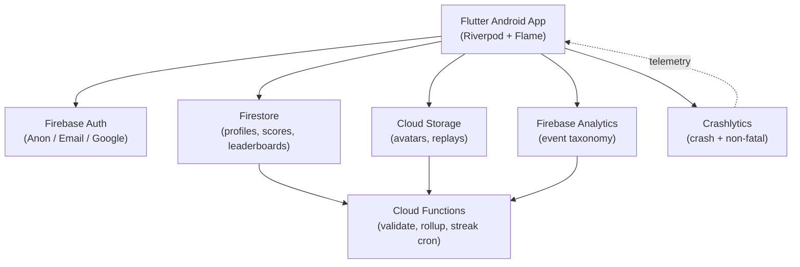

---

## 2. Technical Architecture

### 2.1 System Diagram (Mermaid)

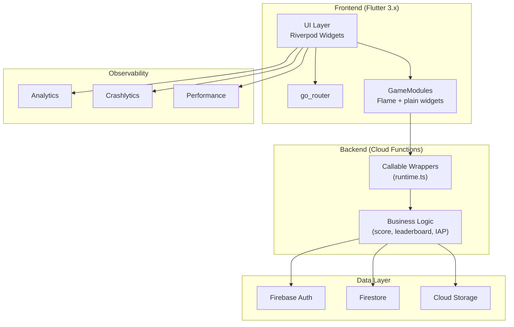

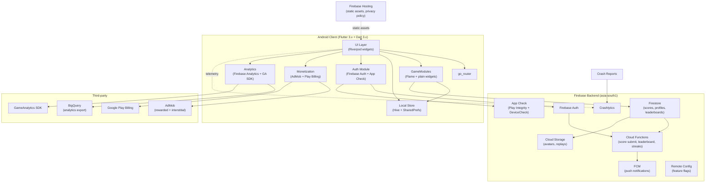

### 2.2 Component Responsibilities

| Component | Responsibility | Owner |
|---|---|---|
| **UI Layer** | All widgets, screens, dialogs, navigation | Abhishek |
| **go_router** | Declarative routing, deep links | Abhishek |
| **GameModules** | Per-game logic (Snake, Block Drop, Sky Hop, Hangman, MineSneeker, Tic Tac Toe) | Abhishek + Samhita (art) |
| **Auth Module** | Anonymous + Email + Google; App Check attestation; session persistence | Subhadip |
| **Local Store** | Hive cache for offline play; SharedPreferences for settings; encrypted storage for Parent PIN | Subhadip + Abhishek |
| **Analytics** | Firebase Analytics events; GameAnalytics SDK; PII redaction | Subhadip |
| **Monetization** | AdMob rewarded/inline banners; Play Billing IAP flow; "Remove Ads" gate | Subhadip |
| **Firebase Auth** | Identity provider | Subhadip |
| **Firestore** | Profiles, scores, leaderboards, streaks, IAP receipts | Subhadip |
| **Cloud Functions** | Server-side validation, leaderboard recompute, streak awarding, IAP verification | Subhadip |
| **Cloud Storage** | Avatar uploads (v1.1), replay files (v1.1) | Subhadip |
| **FCM** | 6 PM streak reminder, new-game notification | Subhadip |
| **Remote Config** | Feature flags, A/B test variants | Subhadip |
| **App Check** | Bot/abuse attestation (Play Integrity on Android) | Subhadip |
| **Crashlytics** | Crash reports, non-fatal error breadcrumbs | Subhadip + Abhishek |
| **AdMob** | Rewarded video at game-over, banner on home | Subhadip |
| **Play Billing** | "Remove Ads" IAP | Subhadip |
| **BigQuery** | Analytics warehouse, D1/D7 cohort math | Subhadip |
| **GameAnalytics** | Game-session-level events (cross-reference) | Subhadip |
| **Firebase Hosting** | Privacy policy, public marketing pages, asset CDN | Subhadip |

### 2.3 Architecture Style

We use **Clean Architecture** at the app layer with three concentric layers — Presentation, Application (use-cases + Riverpod providers), and Domain/Infrastructure (data sources + repositories). The platform (`/lib/platform/`) is shared by all games; each `GameModule` is a self-contained package in `/lib/games/<name>/`.

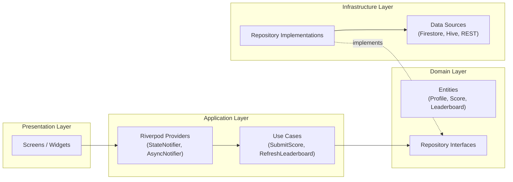

**Why Clean Architecture:** A 3-person team that plans to live with this codebase for 36+ months cannot afford a "widgets-call-Firestore" architecture. Clean Architecture enforces a one-way dependency rule so we can swap Firestore for BigQuery, or Hive for Drift, or Riverpod for Bloc, without rewriting UI. See [ADR-003](#adr-003-clean-architecture-over-feature-first).

### 2.4 Data Flow

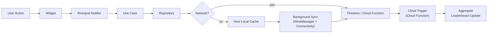

The offline-first flow guarantees the user sees their score immediately, even on a flight. The sync is idempotent (see [§6 API Design](#6-api-design) for `submissionId`).

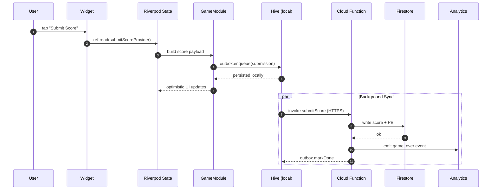

---

## 3. Frontend Architecture

### 3.1 Project Structure

```text
games_platform/
├── android/                         # Android shell (Gradle, manifest, signing config)
├── ios/                             # (scaffolded only; v1.1)
├── lib/
│   ├── main.dart                    # App entrypoint, ProviderScope
│   ├── app.dart                     # MaterialApp.router, theme, locale
│   ├── core/                        # Cross-cutting: logging, errors, env
│   │   ├── env/
│   │   │   └── env.dart             # flutter_dotenv wrapper
│   │   ├── error/
│   │   │   ├── failure.dart         # Failure types (sealed class)
│   │   │   └── exception.dart       # Custom exceptions
│   │   └── logging/
│   │       └── logger.dart          # Logger + Crashlytics bridge
│   ├── platform/                    # Shared platform layer
│   │   ├── auth/
│   │   │   ├── auth_repository.dart
│   │   │   ├── auth_state.dart      # Riverpod AuthState
│   │   │   └── app_check.dart       # App Check integration
│   │   ├── data/
│   │   │   ├── firestore_client.dart
│   │   │   ├── hive_cache.dart      # Box names, type adapters
│   │   │   └── sync_queue.dart      # Offline outbox
│   │   ├── games/
│   │   │   ├── game_module.dart     # GameModule abstract class (see §3.2)
│   │   │   ├── game_registry.dart   # Game registry (Map<GameId, GameModule>)
│   │   │   ├── game_routes.dart     # go_router routes per game
│   │   │   ├── score_client.dart    # ScoreClient (idempotent submission)
│   │   │   └── touch_input.dart     # TouchInput RFC impl
│   │   ├── leaderboard/
│   │   │   └── leaderboard_repository.dart
│   │   ├── streak/
│   │   │   ├── streak_repository.dart
│   │   │   └── streak_notifier.dart
│   │   ├── monetize/
│   │   │   ├── ads_manager.dart     # AdMob wrapper
│   │   │   ├── iap_manager.dart     # Play Billing wrapper
│   │   │   └── remove_ads_gate.dart
│   │   ├── analytics/
│   │   │   ├── analytics_client.dart
│   │   │   └── event_taxonomy.dart  # Event names + params
│   │   ├── i18n/
│   │   │   ├── app_en.arb
│   │   │   ├── app_hi.arb
│   │   │   └── app_bn.arb
│   │   └── routing/
│   │       └── app_router.dart      # go_router config
│   ├── ui/                          # Widgets, screens, design system
│   │   ├── theme/
│   │   │   ├── colors.dart
│   │   │   ├── typography.dart
│   │   │   └── theme_data.dart
│   │   ├── components/              # Reusable widgets (see DESIGN.md)
│   │   │   ├── primary_button.dart
│   │   │   ├── game_tile.dart
│   │   │   ├── score_card.dart
│   │   │   └── parent_pin_prompt.dart
│   │   └── screens/
│   │       ├── onboarding/
│   │       ├── home/
│   │       ├── stats/
│   │       ├── settings/
│   │       └── leaderboard/
│   └── games/                       # GameModule implementations
│       ├── snake/
│       ├── block_drop/
│       ├── sky_hop/
│       ├── hangman/
│       ├── minesneeker/
│       └── tic_tac_toe/
├── assets/
│   ├── audio/                       # Cross-game SFX (shared)
│   ├── images/                      # App icon, splash
│   └── fonts/                       # Noto Sans + Noto Sans Devanagari + Noto Sans Bengali
├── test/
│   ├── unit/
│   ├── widget/
│   ├── golden/
│   └── integration/
├── functions/                       # Firebase Cloud Functions (TypeScript)
│   ├── src/
│   │   ├── index.ts
│   │   ├── score/
│   │   ├── leaderboard/
│   │   ├── streak/
│   │   └── iap/
│   ├── package.json
│   └── tsconfig.json
├── firestore/
│   ├── firestore.rules
│   ├── firestore.indexes.json
│   └── storage.rules
├── .github/
│   └── workflows/
│       ├── pr-checks.yml
│       └── nightly.yml
├── codemagic.yaml                   # Release builds
├── l10n.yaml                        # gen_l10n config
├── pubspec.yaml
└── analysis_options.yaml
```

### 3.2 The GameModule Interface (ADR-001)

The `GameModule` is the single most important abstraction in this codebase. Every game in the catalog must implement this contract. The contract is intentionally minimal so a junior engineer can add a new game in 4–6 weeks.

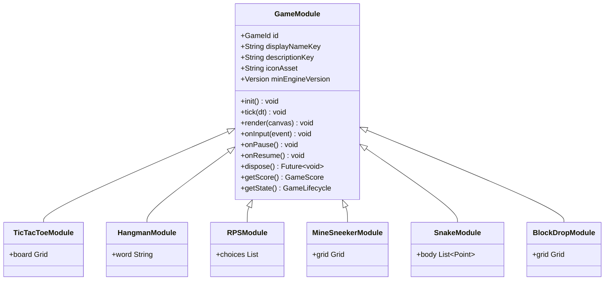

```dart
// lib/platform/games/game_module.dart

import 'package:flutter/widgets.dart';
import 'package:flutter_riverpod/flutter_riverpod.dart';

/// Stable identifier for a game. Snake = 'snake', Block Drop = 'block_drop', etc.
/// This string is the public-facing key (used in URLs, Firestore fields, and analytics).
typedef GameId = String;

/// Lifecycle states the platform drives for every game.
enum GameLifecycle { idle, loading, ready, paused, completed, disposed }

/// Standard score object (most games can override with a subclass).
class GameScore {
  final int value;
  final int durationMs;
  final Map<String, dynamic> extras; // game-specific extras (lines, level, etc.)
  const GameScore({required this.value, required this.durationMs, this.extras = const {}});
}

/// The contract every game MUST implement. The platform guarantees:
/// - init() is called once when the game module is registered.
/// - onPause()/onResume() are called on app lifecycle events.
/// - onScoreUpdate() is called whenever the game reports a score milestone.
/// - onGameOver() is called exactly once per play session.
/// - dispose() is called when the user navigates away or the game is unregistered.
abstract class GameModule {
  final GameId id;
  final String displayNameKey; // i18n key
  final String descriptionKey; // i18n key
  final String iconAsset;      // assets/games/<id>/icon.png
  final Version minEngineVersion;

  const GameModule({
    required this.id,
    required this.displayNameKey,
    required this.descriptionKey,
    required this.iconAsset,
    required this.minEngineVersion,
  });

  /// Build the root widget of the game given a ProviderContainer so the game
  /// can read platform services (auth, score client, analytics) via Riverpod.
  Widget build({required WidgetRef ref, required GameLaunchContext context});

  /// Called when the user navigates away. The game MUST release timers,
  /// animation controllers, audio players, and any subscriptions.
  Future<void> dispose();

  /// Return a stable, comparable "best score" for leaderboard sort.
  /// Higher is better.
  int compareScores(GameScore a, GameScore b) => b.value.compareTo(a.value);

  /// Optional: return the user's "personal best" so the game can show a
  /// "beat your best!" prompt. If null, the platform pulls from cache.
  Future<int?> personalBest(String userId);
}

/// Launch context passed to every game. Includes userId (anonymous or stable),
/// locale, the platform's ScoreClient (for idempotent submission), and any
/// game-specific tuning flags from Remote Config.
class GameLaunchContext {
  final String userId;
  final String handle;
  final Locale locale;
  final ScoreClient scoreClient;
  final Map<String, dynamic> remoteConfigTuning;
  final bool isRemoveAdsPurchased;

  const GameLaunchContext({
    required this.userId,
    required this.handle,
    required this.locale,
    required this.scoreClient,
    required this.remoteConfigTuning,
    required this.isRemoveAdsPurchased,
  });
}

/// Simple version comparison. Engine refuses to load games compiled against
/// an older platform than its minEngineVersion.
class Version implements Comparable<Version> {
  final int major, minor, patch;
  const Version(this.major, this.minor, this.patch);
  @override
  int compareTo(Version other) =>
      (major - other.major) * 10000 + (minor - other.minor) * 100 + (patch - other.patch);
}
```

#### ADR-001: GameModule as the Single Game Contract

| | |
|---|---|
| **Status** | Accepted (2026-06-20) |
| **Context** | We must scale from 6 games to 50+ games without linearly scaling the team. |
| **Decision** | Enforce a strict, minimal `GameModule` abstract class. Games register themselves at app start. The platform owns identity, leaderboards, monetization, notifications, analytics. Each game owns mechanics, art, and a single-screen UI. |
| **Consequences** | (+) 3-step game addition: implement interface, register, ship. (+) Platform can evolve without touching individual games. (+) Junior engineers can contribute a game without learning the whole codebase. (−) Adding a cross-cutting feature (e.g., replay sharing) requires a `GameModule` interface version bump. |
| **Alternatives considered** | Feature-first layout (each game is a Flutter app). Rejected: no shared identity, no shared leaderboard, three apps to maintain. Plugin architecture (Flutter federated plugins). Rejected: too much ceremony for a single-binary Android app. |

### 3.3 Riverpod State Management (ADR-002)

We use **Riverpod 2.x** for state management. Riverpod's compile-time provider graph and `AsyncNotifier` fit our offline-first + Firestore model better than Bloc or Provider.

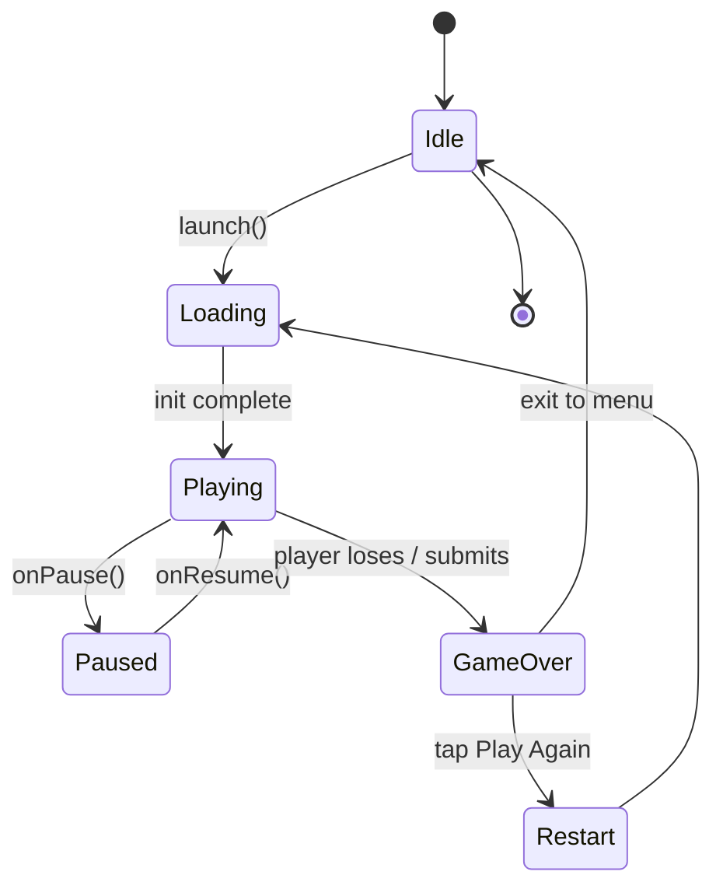

```dart
// lib/platform/auth/auth_state.dart

import 'package:firebase_auth/firebase_auth.dart';
import 'package:flutter_riverpod/flutter_riverpod.dart';

final firebaseAuthProvider = Provider<FirebaseAuth>((ref) => FirebaseAuth.instance);

class AuthState {
  final User? user;
  final bool isAnonymous;
  final bool isLoading;
  final String? errorKey; // i18n key for UI
  const AuthState({this.user, this.isAnonymous = true, this.isLoading = false, this.errorKey});

  AuthState copyWith({User? user, bool? isAnonymous, bool? isLoading, String? errorKey}) =>
      AuthState(
        user: user ?? this.user,
        isAnonymous: isAnonymous ?? this.isAnonymous,
        isLoading: isLoading ?? this.isLoading,
        errorKey: errorKey,
      );
}

class AuthNotifier extends AsyncNotifier<AuthState> {
  @override
  Future<AuthState> build() async {
    final auth = ref.watch(firebaseAuthProvider);
    final user = auth.currentUser;
    if (user == null) {
      // FR-01: auto-create anonymous profile.
      final creds = await auth.signInAnonymously();
      return AuthState(user: creds.user, isAnonymous: true);
    }
    return AuthState(user: user, isAnonymous: user.isAnonymous);
  }

  Future<void> upgradeWithGoogle() async {
    state = const AsyncLoading();
    try {
      // 1. Get Google credential via google_sign_in.
      // 2. Call user.linkWithCredential(googleCredential).
      // (See §7 for the full sequence diagram.)
      final newUser = /* ... */ null;
      state = AsyncData(AuthState(user: newUser, isAnonymous: false));
    } catch (e, st) {
      state = AsyncError(e, st);
    }
  }

  Future<void> signOut() async { /* ... */ }
}

final authNotifierProvider = AsyncNotifierProvider<AuthNotifier, AuthState>(AuthNotifier.new);
```

#### ADR-002: Riverpod over Bloc / Provider

| | |
|---|---|
| **Status** | Accepted |
| **Decision** | Riverpod 2.x with `AsyncNotifier` and `Provider.family` |
| **Why** | (a) Compile-time DI catches typos before runtime. (b) `AsyncNotifier` fits our Firestore stream model. (c) `family` providers cleanly express "score for game X" without prop drilling. (d) Better code-split for `keepAlive` policies than Provider. |
| **Alternatives** | **Bloc:** verbose for 3 beginners. **Provider:** no compile-time DI, easy to make mistakes. **GetIt:** no UI integration, must be wrapped. |
| **When to revisit** | If Riverpod's maintenance stalls (last release > 18 months ago) or if we adopt a UI-declarative framework like Flutter Flow. |

### 3.4 go_router Routing

go_router v14.x. Routes are declared in `lib/platform/routing/app_router.dart`.

```dart
// lib/platform/routing/app_router.dart

import 'package:flutter/material.dart';
import 'package:flutter_riverpod/flutter_riverpod.dart';
import 'package:go_router/go_router.dart';

final appRouterProvider = Provider<GoRouter>((ref) {
  final authState = ref.watch(authNotifierProvider);

  return GoRouter(
    initialLocation: '/',
    redirect: (ctx, state) {
      final user = authState.valueOrNull?.user;
      final isLoading = authState.isLoading;
      final loc = state.matchedLocation;

      // Splash is the only screen visible while auth resolves.
      if (isLoading) return loc == '/splash' ? null : '/splash';

      // First-run users go to onboarding.
      final onboarded = ref.read(onboardingRepoProvider).isComplete();
      if (!onboarded) return loc == '/onboarding' ? null : '/onboarding';

      return null;
    },
    routes: [
      GoRoute(path: '/splash', builder: (_, __) => const SplashScreen()),
      GoRoute(path: '/onboarding', builder: (_, __) => const OnboardingScreen()),
      GoRoute(path: '/', builder: (_, __) => const HomeScreen()),
      GoRoute(path: '/settings', builder: (_, __) => const SettingsScreen()),
      GoRoute(path: '/stats/:gameId', builder: (ctx, st) =>
          StatsScreen(gameId: st.pathParameters['gameId']!)),
      GoRoute(path: '/leaderboard/:gameId', builder: (ctx, st) =>
          LeaderboardScreen(gameId: st.pathParameters['gameId']!)),
      // Dynamic game routes generated from GameRegistry.
      ...GameRegistry.instance.routes.map((g) => GoRoute(
        path: '/play/${g.id}',
        builder: (ctx, st) => GameHostScreen(gameId: g.id),
      )),
    ],
  );
});
```

Deep links (`https://gamesplatform.app/play/snake?from=share`) are registered in `AndroidManifest.xml` (see [§14.4](#144-deep-links-and-app-links)).

### 3.5 Flame Integration (Arcade Games)

We use **Flame Engine 1.x** for the four arcade games (Snake, Block Drop, Sky Hop, MineSneeker). Tic Tac Toe and Hangman use plain Flutter widgets because they are board games with discrete state.

A Flame game composes into the platform via `GameWidget` wrapped in a Riverpod `Provider`. The game reads the platform's `ScoreClient` and `AnalyticsClient` through constructor injection, **not** through direct Firebase calls.

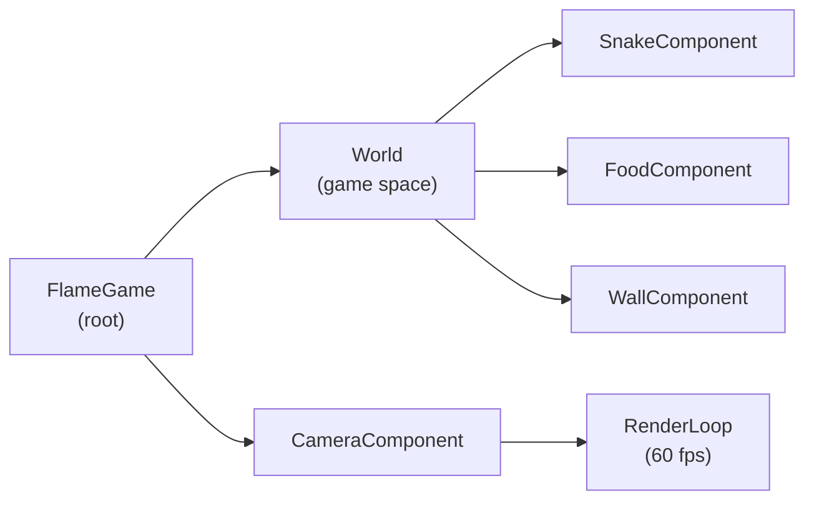

```dart
// lib/games/snake/snake_game.dart (sketch)

class SnakeGame extends FlameGame with HasCollisionDetection, HasTappableComponents {
  late final ScoreClient _scoreClient;
  late final AnalyticsClient _analytics;
  SnakeGame({required ScoreClient scoreClient, required AnalyticsClient analytics})
      : _scoreClient = scoreClient, _analytics = analytics;

  @override
  Future<void> onLoad() async {
    // Load sprites, audio, snake component
  }

  @override
  void onGameOver(int finalScore) {
    _scoreClient.submit(
      gameId: 'snake',
      score: GameScore(value: finalScore, durationMs: _elapsedMs),
    );
    _analytics.logEvent('game_over', params: {'game_id': 'snake', 'score': finalScore});
  }
}

class SnakeGameModule extends GameModule {
  const SnakeGameModule() : super(
    id: 'snake',
    displayNameKey: 'game_snake_name',
    descriptionKey: 'game_snake_desc',
    iconAsset: 'assets/games/snake/icon.png',
    minEngineVersion: Version(1, 0, 0),
  );

  @override
  Widget build({required WidgetRef ref, required GameLaunchContext context}) {
    final scoreClient = ref.read(scoreClientProvider);
    final analytics = ref.read(analyticsClientProvider);
    return GameWidget(game: SnakeGame(scoreClient: scoreClient, analytics: analytics));
  }

  @override
  Future<void> dispose() async { /* release controllers */ }
}
```

### 3.6 Touch Input RFC (Phase 1.5 deliverable)

A platform-wide touch input contract ensures every game feels identical on swipe/tap. See [§3.6.1](#361-touchinput-interface).

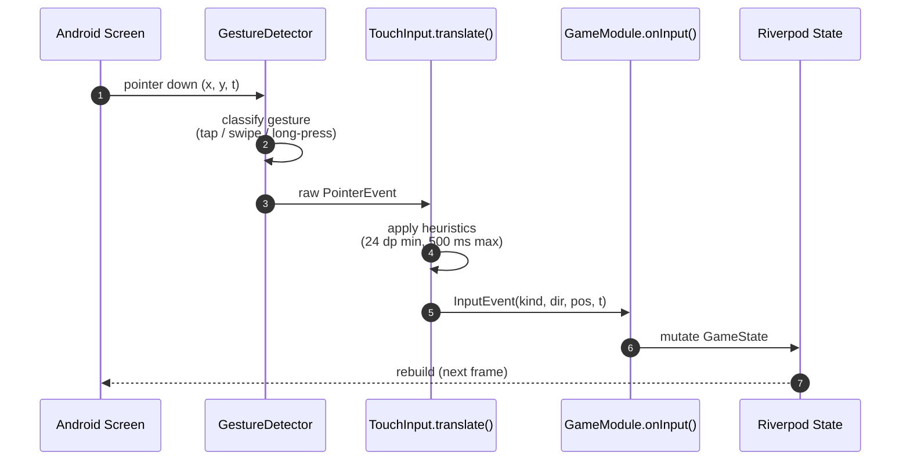

#### 3.6.1 TouchInput interface

```dart
// lib/platform/games/touch_input.dart

enum SwipeDirection { up, down, left, right }
enum InputEventKind { tap, swipe, longPress, doubleTap }

class InputEvent {
  final InputEventKind kind;
  final SwipeDirection? swipeDirection;
  final Offset? localPosition; // in game widget coords
  final Duration duration;
  final DateTime timestamp;
  const InputEvent({
    required this.kind,
    required this.timestamp,
    this.swipeDirection,
    this.localPosition,
    this.duration = Duration.zero,
  });
}

abstract class TouchInputController {
  Stream<InputEvent> get events;
  void dispose();
}

class FlutterGestureInputController implements TouchInputController {
  // Wraps GestureDetector + RawGestureDetector.
  // Detects: tap, double-tap, long-press, 4-direction swipe.
  // Min swipe distance: 24 dp. Max time: 500 ms.
  // Polling rate: 16 ms (60 Hz), the same as the frame budget.
}
```

#### 3.6.2 Swipe heuristics

- **Minimum swipe distance:** 24 dp (density-independent pixels — Android's screen-density-independent unit).
- **Maximum swipe time:** 500 ms.
- **Diagonal tolerance:** 30° from cardinal; snaps to nearest cardinal.
- **Tap radius:** 12 dp around pointer-up location.

These are tunable in `Remote Config` per game cohort.

### 3.7 Asset Pipeline

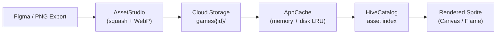

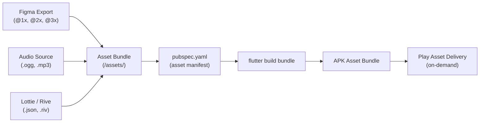

| Asset class | Format | Compression | Bundling |
|---|---|---|---|
| Icons | PNG + WebP | Lossless PNG, lossy WebP | Bundled |
| Sprites | Aseprite JSON + PNG | Aseprite native | Bundled |
| Audio | OGG Vorbis | ~80 kbps | Bundled, ≤ 4 MB total |
| Fonts | Noto Sans (EN/HI/BN subsets) | woff2 | Bundled, ≤ 1.5 MB |
| Lottie animations | Lottie JSON | minified | Bundled per-game |
| Rive animations | .riv | Rive runtime | Bundled per-game |

We use **Play Asset Delivery** (PAD) in `on-demand` mode for game art packs >5 MB (Block Drop, Sky Hop) to keep the base APK small.

### 3.8 Internationalization

- Three locales at launch: `en`, `hi`, `bn`.
- All strings live in `lib/platform/i18n/app_<locale>.arb`. Per-game strings are namespaced: `snake_gameOverTitle`, `blockdrop_pauseLabel`, etc.
- `flutter gen-l10n` is invoked on every build.
- Locale is selected by: (a) device locale on first launch, (b) explicit user override in Settings.
- Right-to-left (RTL) support is wired in from day 1 even though Arabic ships in v2.0 (cheap to do now, expensive to retrofit).

```yaml
# l10n.yaml
arb-dir: lib/platform/i18n
template-arb-file: app_en.arb
output-localization-file: app_localizations.dart
output-class: AppL10n
synthetic-package: true
nullable-getter: false
```

---

## 4. Backend Architecture

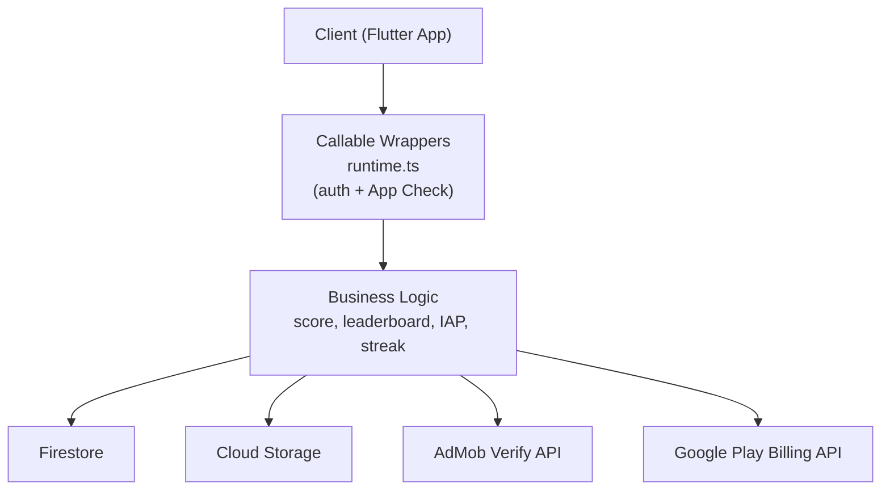

### 4.1 Firebase Services Breakdown

| Service | Purpose | Tier | Region | Notes |
|---|---|---|---|---|
| **Firebase Auth** | Identity (anon, email, Google) | Spark → Blaze | Global (auth) | See §7 |
| **Firestore** | Profiles, scores, leaderboards, streaks, IAP receipts | Blaze | asia-south1 | See §5 |
| **Cloud Functions** | Score validation, leaderboard rollup, IAP verify, streak cron | Blaze | asia-south1 | Node 20 runtime, TypeScript |
| **Cloud Storage** | Avatars (v1.1), replay files (v1.1) | Blaze | asia-south1 | See §9 |
| **Firebase Cloud Messaging (FCM)** | Push notifications (streak reminder) | Blaze | Global | Topic-based for marketing |
| **Firebase Analytics** | Event logging, audience building | Blaze | Global | PII-redacted, see §10 |
| **Crashlytics** | Crash reports, non-fatal errors | Blaze | Global | See §18 |
| **Firebase Remote Config** | Feature flags, A/B test variants | Blaze | Global | 10-min cache |
| **Firebase App Check** | Bot/abuse attestation (Play Integrity) | Blaze | Global | Enforced on Auth, Firestore, Functions |
| **Firebase Hosting** | Privacy policy, marketing pages | Spark | us-central1 (CDN) | Static site only |
| **Firebase Test Lab** | Nightly smoke on physical devices | Blaze | asia-south1 | See §11 |
| **BigQuery Export** | Analytics warehouse | Blaze | asia-south1 | Linked to Analytics |

### 4.2 Cloud Functions — TypeScript Project Layout

```text
functions/
├── src/
│   ├── index.ts                    # exports
│   ├── admin.ts                    # firebase-admin init
│   ├── runtime.ts                  # onCall/onRequest wrappers with auth + App Check
│   ├── score/
│   │   ├── submitScore.ts          # callable: submitScore
│   │   ├── submitScore.spec.ts
│   │   └── leaderboardRollup.ts    # triggered on score write
│   ├── leaderboard/
│   │   ├── getLeaderboard.ts       # callable: getLeaderboard
│   │   └── getLeaderboard.spec.ts
│   ├── streak/
│   │   ├── awardStreak.ts          # callable: awardStreak
│   │   ├── dailyCron.ts            # scheduled (00:00 IST): reset weekly board
│   │   └── streakReminder.ts       # scheduled (5:55 PM IST): schedule FCM
│   ├── iap/
│   │   ├── verifyPurchase.ts       # callable: verifyPurchase
│   │   └── verifyPurchase.spec.ts
│   ├── analytics/
│   │   └── cohortDaily.ts          # scheduled: write daily aggregates to BigQuery
│   └── util/
│       ├── idempotency.ts          # submissionId dedupe
│       ├── rateLimit.ts            # per-user rate limit
│       └── i18n.ts                 # notification copy in EN/HI/BN
├── package.json
└── tsconfig.json
```

### 4.3 Callable Cloud Function Signatures

```typescript
// functions/src/score/submitScore.ts (FUTURE — to be implemented in Phase 2)

import { onCall, HttpsError } from 'firebase-functions/v2/https';
import { getFirestore, Timestamp, FieldValue } from 'firebase-admin/firestore';
import { logger } from 'firebase-functions/v2';
import { assertAppCheck } from '../runtime';
import { checkRateLimit } from '../util/rateLimit';
import { alreadyProcessed } from '../util/idempotency';

interface SubmitScoreRequest {
  gameId: string;                    // 'snake', 'block_drop', etc.
  score: number;                     // >= 0
  durationMs: number;                // total play time
  submissionId: string;              // UUID v4 generated client-side
  playedAt: string;                  // ISO 8601 client timestamp
  clientVersion: string;             // '1.0.0+12'
  extras?: Record<string, unknown>;  // game-specific (lines, level, etc.)
}

interface SubmitScoreResponse {
  accepted: boolean;
  newPersonalBest: boolean;
  newGlobalRank: number | null;      // null if outside top 100
  receiptId: string;
}

export const submitScore = onCall<SubmitScoreRequest, Promise<SubmitScoreResponse>>(
  {
    region: 'asia-south1',
    cors: false,                     // mobile-only; no browser CORS needed
    enforceAppCheck: true,
    memory: '256MiB',
    cpu: 1,
    timeoutSeconds: 30,
    minInstances: 1,                 // keep one warm to avoid cold starts (see §19)
    maxInstances: 20,
  },
  async (req) => {
    assertAppCheck(req);
    if (!req.auth) throw new HttpsError('unauthenticated', 'Sign-in required.');

    const uid = req.auth.uid;
    const { gameId, score, durationMs, submissionId, playedAt, clientVersion, extras } = req.data;

    // 1. Validate input.
    if (!gameId || typeof score !== 'number' || score < 0 || score > 1_000_000_000) {
      throw new HttpsError('invalid-argument', 'Bad score payload.');
    }
    if (!submissionId || !/^[0-9a-f-]{36}$/.test(submissionId)) {
      throw new HttpsError('invalid-argument', 'submissionId must be UUID v4.');
    }

    // 2. Idempotency: if already processed, return the cached response.
    const cached = await alreadyProcessed(uid, submissionId);
    if (cached) return cached;

    // 3. Rate limit: 60 submissions per user per minute.
    await checkRateLimit(uid, 'submitScore', 60, '1m');

    // 4. Persist.
    const db = getFirestore();
    const scoreRef = db.collection('users').doc(uid).collection('scores').doc(submissionId);
    const personalBestRef = db.collection('users').doc(uid).collection('personalBests').doc(gameId);

    const result = await db.runTransaction(async (tx) => {
      const pbDoc = await tx.get(personalBestRef);
      const prevBest = pbDoc.exists ? pbDoc.get('value') as number : 0;
      const isNewBest = score > prevBest;

      tx.set(scoreRef, {
        gameId,
        value: score,
        durationMs,
        playedAt: Timestamp.fromDate(new Date(playedAt)),
        clientVersion,
        extras: extras ?? {},
        createdAt: FieldValue.serverTimestamp(),
      });

      if (isNewBest) {
        tx.set(personalBestRef, {
          gameId,
          value: score,
          updatedAt: FieldValue.serverTimestamp(),
        }, { merge: true });
      }

      return { isNewBest };
    });

    // 5. Audit + log.
    logger.info('submitScore', { uid, gameId, score, isNewBest: result.isNewBest, submissionId });

    return {
      accepted: true,
      newPersonalBest: result.isNewBest,
      newGlobalRank: null,             // computed lazily by getLeaderboard
      receiptId: submissionId,
    };
  }
);
```

```typescript
// functions/src/iap/verifyPurchase.ts (FUTURE)

interface VerifyPurchaseRequest {
  productId: string;                 // 'remove_ads_v1'
  purchaseToken: string;             // from Google Play Billing
  orderId?: string;
}

interface VerifyPurchaseResponse {
  valid: boolean;
  productId: string;
  purchaseDate: string;
  expiresAt: string | null;          // null for one-time IAP
}

export const verifyPurchase = onCall<VerifyPurchaseRequest, Promise<VerifyPurchaseResponse>>(
  {
    region: 'asia-south1',
    enforceAppCheck: true,
    memory: '256MiB',
  },
  async (req) => {
    // 1. Call Google Play Developer API to verify the purchaseToken.
    // 2. Check that productId matches.
    // 3. Check that purchaseState === 0 (purchased) and acknowledgementState === 1.
    // 4. Set users/{uid}/entitlements/remove_ads = true.
    // 5. Return receipt.
  }
);
```

### 4.4 When to Use Cloud Run (and Why Not RTDB for v1)

**Cloud Run** is reserved for v2.0 use cases:

| Use case | Cloud Run? | Why |
|---|---|---|
| Pong real-time multiplayer (v2.0) | Yes | WebSocket server with sticky sessions; Cloud Functions HTTP timeout (60 min) is fine for one match but Cloud Run's per-instance connection model is cleaner. |
| Anti-cheat ML model (v3.0+) | Yes | GPU-backed inference if we go beyond simple statistical checks. |
| Replay server for shareable URLs (v3.0) | Yes | Long-running request to render a replay as MP4. |

For v1.0, **all backend logic lives in Cloud Functions** because: (a) auto-scales to zero, (b) per-function memory/CPU tuning, (c) tight Firestore integration via `firebase-admin`, (d) no Docker images to manage with a 3-person team.

**Why not Realtime Database (RTDB) for v1.0:**

- **Cost:** RTDB charges per GB stored and per GB egress. Firestore charges per read/write/document. For our read-heavy leaderboard access pattern, Firestore's composite indexes + cached queries are cheaper.
- **Query model:** Our leaderboard queries need ordering, filtering, and pagination. Firestore's composite indexes are a clean fit; RTDB requires manual denormalization trees.
- **Offline persistence:** Firestore's offline cache SDK is mature and battle-tested for our use case; RTDB's is workable but more manual.
- **Future migration to BigQuery:** Firestore's native BigQuery export is turn-key. RTDB export requires a Cloud Function to mirror into BigQuery, adding complexity.
- **Decision date:** 2026-06-20. Revisit only if v2.0 Pong requires sub-100 ms real-time latency that Firestore's snapshot listeners cannot meet.

### 4.5 Cost-Aware Backend Patterns

Five patterns we enforce to keep our Firebase bill under control:

1. **Composite indexes only where needed.** We define one composite index per leaderboard query shape. Each unused index is wasted storage and write amplification.
2. **Cloud Function concurrency = 80.** Functions default to 1; raising to 80 lets one instance handle 80 in-flight requests, which is the sweet spot for our score-submission volume.
3. **`minInstances: 1` on hot path.** `submitScore`, `getLeaderboard`, and `verifyPurchase` keep one warm instance to avoid 800 ms cold starts (see §19 Risk R-CF-01).
4. **No cross-user reads.** Security rules explicitly deny `get()` on `/users/{otherUid}/*`. Every user reads only their own data + public leaderboard slices.
5. **BigQuery for analytics, not Firestore.** Firestore exports to BigQuery at $0 (same-region). Avoid ad-hoc Firestore queries for cohort math.

### 4.6 Cold Start Mitigation

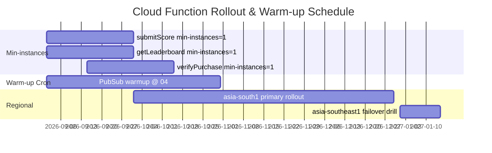

```typescript
// functions/src/runtime.ts

import { onCall } from 'firebase-functions/v2/https';
import { getAppCheck } from 'firebase-admin/app-check';

export const wrappedCallable = (handler: CallableFunction) =>
  onCall(
    {
      region: 'asia-south1',
      enforceAppCheck: true,
      minInstances: 1,
    },
    async (req) => {
      const ac = getAppCheck();
      // Verify App Check token explicitly.
      // (enforceAppCheck already does this on the v2 surface, but we
      // double-check for paranoia on critical endpoints.)
      return handler(req);
    }
  );
```

See [§17 Performance Requirements](#17-performance-requirements) and [§19 Risk R-CF-01](#19-risk-analysis) for the full cold-start story.

---

## 5. Database Design

### 5.1 Firestore Collections (Conceptual ER)

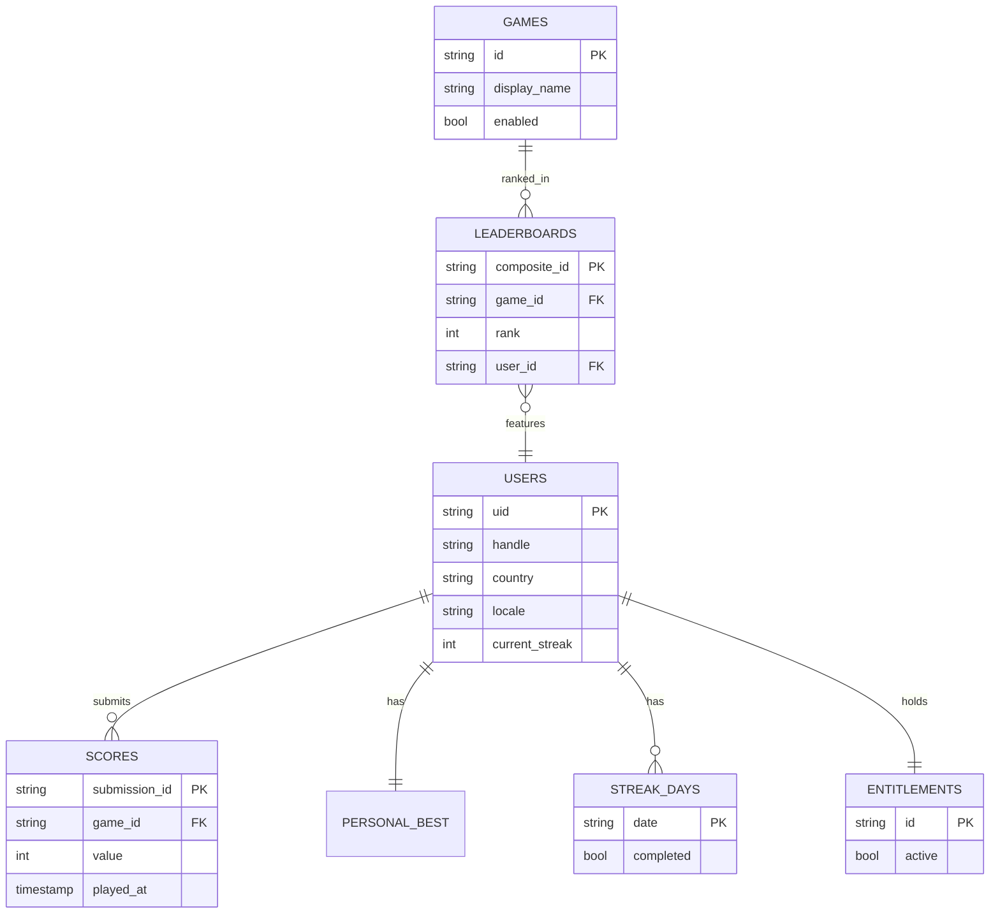

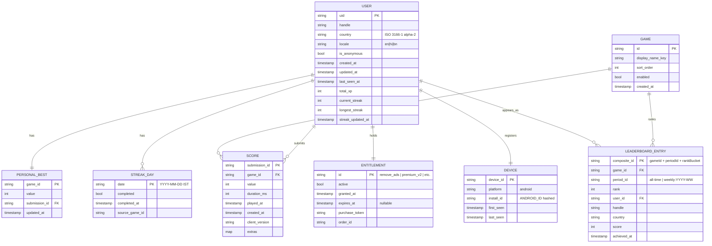

### 5.2 Collection Schemas (Code Blocks)

#### 5.2.1 `users/{uid}` — root profile

```typescript
// firestore seed (TypeScript sketch)
{
  uid: string,                    // Firebase Auth UID
  handle: string,                 // auto-generated: 'SkyHoper42'
  country: 'IN' | 'BD' | 'OTHER', // derived from IP at signup, user-editable later
  locale: 'en' | 'hi' | 'bn',
  is_anonymous: boolean,
  created_at: Timestamp,
  updated_at: Timestamp,
  last_seen_at: Timestamp,
  total_xp: number,               // sum of (score / 10) rounded; capped at 100k/day
  current_streak: number,         // consecutive days with ≥1 play
  longest_streak: number,
  streak_updated_at: Timestamp,   // date of last play (IST)
  parent_pin_hash: string | null, // Argon2id hash
  analytics_consent: boolean,     // DPDP Act 2023 compliance
  soft_delete_until: Timestamp | null, // 7-day soft delete window
  schema_version: 1,
}
```

#### 5.2.2 `users/{uid}/scores/{submissionId}` — score history

```typescript
{
  submission_id: string,          // UUID v4; the document ID
  game_id: 'snake' | 'block_drop' | 'sky_hop' | 'hangman' | 'minesneeker' | 'tic_tac_toe',
  value: number,
  duration_ms: number,
  played_at: Timestamp,           // client-reported
  created_at: Timestamp,          // server-side, when accepted
  client_version: string,         // '1.0.0+12'
  extras: {                       // game-specific
    // snake: { food_eaten: number, longest_run: number }
    // block_drop: { lines_cleared: number, level: number }
    // sky_hop: { pipes_passed: number, max_height: number }
    // hangman: { word_length: number, wrong_guesses: number }
    // minesneeker: { time_ms: number, board_size: string }
    // tic_tac_toe: { opponent: 'ai-easy' | 'ai-hard', result: 'win' | 'loss' | 'draw' }
  },
}
```

#### 5.2.3 `users/{uid}/personalBests/{gameId}` — per-game PB

```typescript
{
  game_id: string,
  value: number,
  submission_id: string,          // FK to scores
  achieved_at: Timestamp,
  updated_at: Timestamp,
}
```

#### 5.2.4 `users/{uid}/streakDays/{YYYY-MM-DD}` — daily streak ledger

```typescript
{
  date: 'YYYY-MM-DD',             // IST date
  completed: true,                // always true if the doc exists
  completed_at: Timestamp,
  source_game_id: string,
}
```

#### 5.2.5 `users/{uid}/entitlements/{entitlementId}` — IAP receipts

```typescript
{
  id: 'remove_ads' | 'premium_v2',
  active: boolean,
  granted_at: Timestamp,
  expires_at: Timestamp | null,   // null for one-time purchases
  purchase_token: string,         // from Google Play Billing
  order_id: string,
  verified_at: Timestamp,
}
```

#### 5.2.6 `leaderboards/{gameId}_{periodId}_{bucketId}` — denormalized public board

```typescript
// Document ID = gameId + '_' + periodId + '_' + bucketId
// bucketId = rankBucket, e.g. '0-99' for top 100, 'me' for user's own row
{
  game_id: string,
  period_id: 'all-time' | 'weekly:2027-W15' | 'country:IN:all-time',
  bucket: '0-99' | 'me',
  entries: Array<{
    rank: number,
    user_id: string,              // server-only; rules redact this on read
    handle: string,
    country: string,
    score: number,
    achieved_at: Timestamp,
  }>,
  computed_at: Timestamp,
  ttl: Timestamp,                 // auto-purge after period ends
}
```

> **Why denormalized:** A real-time aggregated leaderboard query (`SELECT * FROM scores ORDER BY value DESC LIMIT 100`) at 10K DAU is expensive. We precompute the top-100 every 60s into a single document so the client reads one doc per board view.

#### 5.2.7 `games/{gameId}` — game catalog

```typescript
{
  id: 'snake',
  display_name_key: 'game_snake_name',
  description_key: 'game_snake_desc',
  icon_url: 'https://storage.googleapis.com/.../snake/icon.webp',
  sort_order: 1,
  enabled: true,
  min_app_version: '1.0.0',
  min_engine_version: '1.0.0',
  remote_config_overrides: {      // Remote Config keys for this game
    swipe_threshold_dp: 24,
    spawn_rate_ms: 120,
  },
}
```

#### 5.2.8 `counters/{counterId}` — atomic counters

```typescript
// 'leaderboard_{gameId}_{periodId}' — incremented on every score write
// Used by Cloud Function to know when to roll up a new top-100 snapshot.
{
  value: number,
  updated_at: Timestamp,
}
```

### 5.3 Firestore Indexes (`firestore.indexes.json`)

```json
{
  "indexes": [
    {
      "collectionGroup": "scores",
      "queryScope": "COLLECTION",
      "fields": [
        { "fieldPath": "game_id", "order": "ASCENDING" },
        { "fieldPath": "value", "order": "DESCENDING" },
        { "fieldPath": "created_at", "order": "DESCENDING" }
      ]
    },
    {
      "collectionGroup": "personalBests",
      "queryScope": "COLLECTION",
      "fields": [
        { "fieldPath": "game_id", "order": "ASCENDING" },
        { "fieldPath": "value", "order": "DESCENDING" }
      ]
    },
    {
      "collectionGroup": "scores",
      "queryScope": "COLLECTION",
      "fields": [
        { "fieldPath": "game_id", "order": "ASCENDING" },
        { "fieldPath": "user_id_ref", "order": "ASCENDING" },
        { "fieldPath": "created_at", "order": "DESCENDING" }
      ]
    }
  ],
  "fieldOverrides": []
}
```

Note: We add a server-stamped `user_id_ref` denormalization on every score write (via Cloud Function) so we can query "my recent scores per game" without requiring the client to filter on its own UID.

### 5.4 Firestore Security Rules

```javascript
// firestore.rules
rules_version = '2';
service cloud.firestore {
  match /databases/{database}/documents {

    // ---- Helpers ----------------------------------------------------------
    function isSignedIn() {
      return request.auth != null;
    }
    function isSelf(uid) {
      return isSignedIn() && request.auth.uid == uid;
    }
    function isAppChecked() {
      // request.auth.token.app_check_claim is set by App Check on verified tokens.
      // For testing, set this claim via Firebase Auth custom claims.
      return request.auth.token.firebase_app_check == true ||
             request.auth.token.app_check_claim == true;
    }
    function validHandle(s) {
      return s is string && s.size() >= 3 && s.size() <= 20 &&
             s.matches('^[A-Za-z0-9_]+$');
    }

    // ---- Games catalog (public read, admin write) -------------------------
    match /games/{gameId} {
      allow read: if true;
      allow write: if false;  // admin-only via console or Cloud Function with admin SDK
    }

    // ---- Leaderboards (public read; entries filtered to public fields) ---
    match /leaderboards/{lbId} {
      allow read: if true;
      allow write: if false;  // only Cloud Function with admin SDK writes here
    }

    // ---- Users ------------------------------------------------------------
    match /users/{uid} {
      // User can read their own profile.
      allow read: if isSelf(uid);

      // User can create their own profile once.
      allow create: if isSelf(uid) &&
        request.resource.data.uid == uid &&
        validHandle(request.resource.data.handle);

      // User can update only safe fields on their own profile.
      allow update: if isSelf(uid) &&
        // Immutable fields.
        request.resource.data.uid == resource.data.uid &&
        request.resource.data.created_at == resource.data.created_at &&
        // Editable fields whitelist.
        request.resource.data.diff(resource.data).affectedKeys()
          .hasOnly(['handle', 'locale', 'country', 'parent_pin_hash',
                    'analytics_consent', 'soft_delete_until', 'updated_at']) &&
        // Handle, if changed, must validate.
        (!('handle' in request.resource.data.diff(resource.data).affectedKeys()) ||
         validHandle(request.resource.data.handle));

      // Delete only via Cloud Function (soft-delete first).
      allow delete: if false;

      // ---- Scores --------------------------------------------------------
      match /scores/{submissionId} {
        // User can read their own scores.
        allow read: if isSelf(uid);
        // Writes only via Cloud Function.
        allow write: if false;
      }

      // ---- Personal bests ------------------------------------------------
      match /personalBests/{gameId} {
        allow read: if isSelf(uid);
        allow write: if false;
      }

      // ---- Streak days ----------------------------------------------------
      match /streakDays/{date} {
        allow read: if isSelf(uid);
        allow write: if false;
      }

      // ---- Entitlements ---------------------------------------------------
      match /entitlements/{entId} {
        allow read: if isSelf(uid);
        allow write: if false;
      }

      // ---- Devices (privacy sensitive) -----------------------------------
      match /devices/{deviceId} {
        allow read, write: if isSelf(uid);
      }
    }

    // ---- Counters (admin only) -------------------------------------------
    match /counters/{counterId} {
      allow read, write: if false;
    }
  }
}
```

### 5.5 Storage Rules

```javascript
// firestore.storage.rules
rules_version = '2';
service firebase.storage {
  match /b/{bucket}/o {

    // Avatars (v1.1 only; placeholder for forward compatibility).
    match /avatars/{uid}/{fileName} {
      allow read: if true;
      allow write: if request.auth != null &&
                     request.auth.uid == uid &&
                     request.resource.size < 2 * 1024 * 1024 &&
                     request.resource.contentType.matches('image/.*');
    }

    // Replays (v1.1).
    match /replays/{uid}/{fileName} {
      allow read: if request.auth != null && request.auth.uid == uid;
      allow write: if request.auth != null &&
                     request.auth.uid == uid &&
                     request.resource.size < 10 * 1024 * 1024;
    }

    // Public game assets (admin-uploaded).
    match /games/{gameId}/{fileName} {
      allow read: if true;
      allow write: if false;
    }
  }
}
```

### 5.6 Local Cache Schema (Hive)

```dart
// lib/platform/data/hive_cache.dart

class HiveBoxes {
  static const profiles = 'profiles';           // Box<Profile> — single doc
  static const personalBests = 'personalBests'; // Box<int> — gameId -> value
  static const scores = 'scores';               // Box<Score> — recent 100 per game
  static const streakDays = 'streakDays';       // Box<bool> — YYYY-MM-DD -> true
  static const entitlements = 'entitlements';   // Box<bool> — entitlementId -> active
  static const settings = 'settings';           // Box<dynamic> — key-value
  static const syncOutbox = 'syncOutbox';       // Box<OutboxEntry> — pending writes
  static const i18nOverrides = 'i18nOverrides'; // Box<String> — key -> translation
}

class Profile {
  final String uid;
  final String handle;
  final String country;
  final String locale;
  final bool isAnonymous;
  final DateTime createdAt;
  final DateTime updatedAt;
  final DateTime lastSeenAt;
  final int totalXp;
  final int currentStreak;
  final int longestStreak;
  final DateTime streakUpdatedAt;
  final String? parentPinHash;
  final bool analyticsConsent;
  final DateTime? softDeleteUntil;
  // ...
}

class Score {
  final String submissionId;
  final String gameId;
  final int value;
  final int durationMs;
  final DateTime playedAt;
  final DateTime createdAt;
  final String clientVersion;
  final Map<String, dynamic> extras;
}

class OutboxEntry {
  final String id;                       // UUID
  final OutboxOp op;                     // 'submitScore' | 'verifyPurchase' | ...
  final Map<String, dynamic> payload;
  final DateTime enqueuedAt;
  final int attempts;
  final DateTime? lastAttemptAt;
  final String? lastError;
}
```

We register Hive type adapters via `build_runner` (no manual `fromJson/toJson`).

### 5.7 Data Flow Diagram

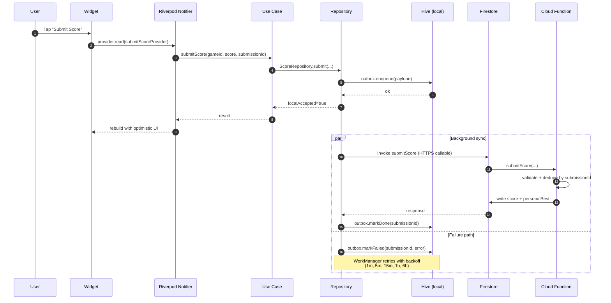

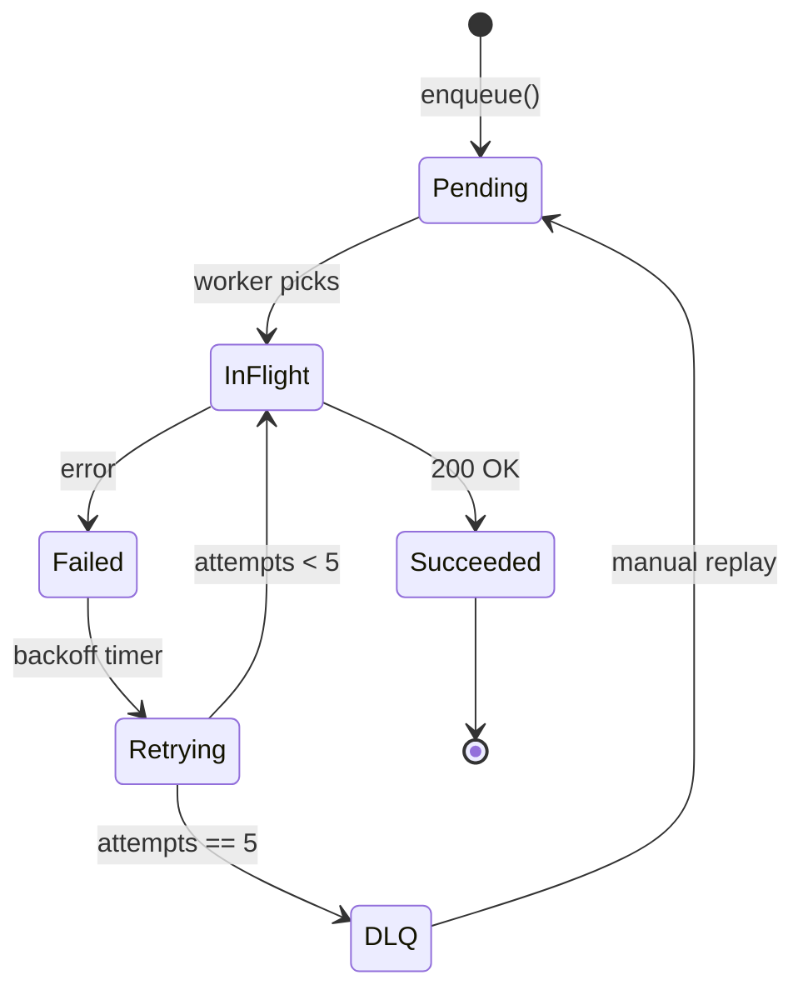

---

## 6. API Design

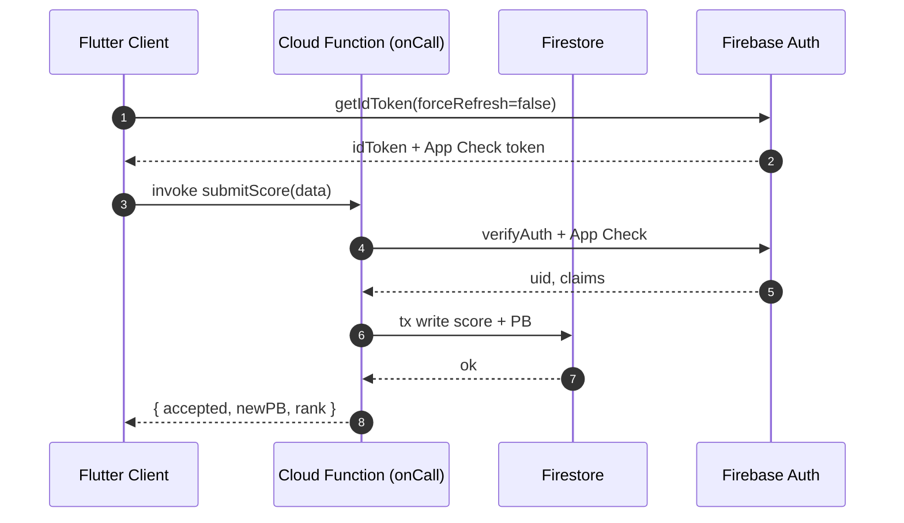

### 6.1 Callable Surface (v1.0)

All v1.0 backend communication is via Firebase Cloud Functions `onCall` (HTTPS callable). No public REST endpoints.

| Function | Caller | Purpose | Auth | App Check | Rate limit |
|---|---|---|---|---|---|
| `submitScore` | client | Submit a game score | required | enforced | 60/min/user |
| `getLeaderboard` | client | Fetch a leaderboard slice | optional (anon OK) | enforced | 30/min/IP |
| `getPersonalStats` | client | Fetch user's per-game stats | required | enforced | 30/min/user |
| `awardStreak` | client | Mark today as streak-complete (fallback if no FCM ack) | required | enforced | 5/min/user |
| `verifyPurchase` | client | Verify Google Play IAP purchase | required | enforced | 10/min/user |
| `linkAnonymousToProvider` | client | Upgrade anon to email/Google/Apple | required (anon) | enforced | 10/hour/user |
| `reportCrash` | client | Forward a non-fatal error with context | optional | enforced | 30/min/IP |
| `deleteAccount` | client | Initiate 7-day soft delete | required | enforced | 1/day/user |
| `heartbeat` | client | App-open ping (used for DAU math) | required | enforced | 10/hour/user |

### 6.2 Callable Signatures (TypeScript)

```typescript
// functions/src/leaderboard/getLeaderboard.ts (FUTURE)

interface GetLeaderboardRequest {
  gameId: string;
  scope: 'global' | 'country' | 'friends';
  period: 'all-time' | 'weekly';
  // Optional: override the user's country for this query (defaults to user.country).
  countryOverride?: string;
  // Pagination cursor; null for first page.
  cursor?: string | null;
  limit?: number; // default 50, max 100
}

interface LeaderboardEntryView {
  rank: number;
  handle: string;
  country: string;
  score: number;
  achievedAt: string;       // ISO 8601
  isCurrentUser: boolean;
}

interface GetLeaderboardResponse {
  entries: LeaderboardEntryView[];
  nextCursor: string | null;
  totalCount: number;       // for "out of N" UI
  generatedAt: string;      // server timestamp
}

export const getLeaderboard = onCall<GetLeaderboardRequest, Promise<GetLeaderboardResponse>>(
  {
    region: 'asia-south1',
    enforceAppCheck: true,
    memory: '256MiB',
    minInstances: 1,
    maxInstances: 50,
  },
  async (req) => {
    // Validate, fetch precomputed leaderboard doc from Firestore.
    // Filter out server-only fields (user_id) and tag current user.
  }
);
```

### 6.3 Error Format

Cloud Functions throw `HttpsError` with the following canonical codes. Clients map these to a sealed `Failure` type for UI display.

| `HttpsError` code | Meaning | Client UX |
|---|---|---|
| `ok` (no error) | Success | proceed |
| `cancelled` | User cancelled the operation | silent |
| `unknown` | Unexpected server error | "Something went wrong. Try again." |
| `invalid-argument` | Client sent bad data | show inline validation |
| `deadline-exceeded` | Server timeout | retry with backoff |
| `not-found` | Resource missing | show empty state |
| `already-exists` | Conflict (idempotency key reuse) | return cached response |
| `permission-denied` | Auth/App Check failure | show sign-in prompt or "verify device" |
| `resource-exhausted` | Rate limit hit | "Too many requests. Wait a moment." |
| `failed-precondition` | Business rule violated | show inline message |
| `aborted` | Concurrent modification | retry once |
| `out-of-range` | Pagination cursor invalid | reset to first page |
| `unimplemented` | Feature not yet available | "Coming soon" |
| `internal` | Server bug | generic retry message |
| `unavailable` | Network/server down | offline banner + outbox |
| `data-loss` | Unrecoverable | "Please reinstall the app." |

The client wraps this:

```dart
// lib/core/error/failure.dart

sealed class Failure {
  final String code;
  final String? message;
  const Failure(this.code, [this.message]);
  const factory Failure.network() = NetworkFailure;
  const factory Failure.timeout() = TimeoutFailure;
  const factory Failure.permissionDenied() = PermissionFailure;
  const factory Failure.rateLimited() = RateLimitedFailure;
  const factory Failure.server(String message) = ServerFailure;
  const factory Failure.validation(String message) = ValidationFailure;
  const factory Failure.notFound() = NotFoundFailure;
  const factory Failure.idempotencyReplay() = IdempotencyReplayFailure;
}

class NetworkFailure extends Failure { const NetworkFailure() : super('network'); }
class TimeoutFailure extends Failure { const TimeoutFailure() : super('timeout'); }
class PermissionFailure extends Failure { const PermissionFailure() : super('permission-denied'); }
class RateLimitedFailure extends Failure { const RateLimitedFailure() : super('resource-exhausted'); }
class ServerFailure extends Failure { const ServerFailure(String m) : super('server', m); }
class ValidationFailure extends Failure { const ValidationFailure(String m) : super('validation', m); }
class NotFoundFailure extends Failure { const NotFoundFailure() : super('not-found'); }
class IdempotencyReplayFailure extends Failure { const IdempotencyReplayFailure() : super('idempotency-replay'); }
```

### 6.4 Idempotency Keys

Every state-mutating call accepts a `submissionId` (UUID v4 generated client-side). The Cloud Function checks `users/{uid}/idempotency/{submissionId}` before processing. If found, the cached response is returned.

```typescript
// functions/src/util/idempotency.ts (FUTURE)

const IDEMPOTENCY_TTL_MS = 7 * 24 * 60 * 60 * 1000; // 7 days

export async function alreadyProcessed<T>(
  uid: string,
  submissionId: string,
  handler: () => Promise<T>,
): Promise<T> {
  const db = getFirestore();
  const ref = db.collection('users').doc(uid).collection('idempotency').doc(submissionId);
  const doc = await ref.get();
  if (doc.exists) {
    return doc.get('response') as T;
  }
  const response = await handler();
  await ref.set({
    response,
    created_at: FieldValue.serverTimestamp(),
    expires_at: Timestamp.fromMillis(Date.now() + IDEMPOTENCY_TTL_MS),
  });
  return response;
}
```

### 6.5 Rate Limits

Per-user, per-function, sliding window. Backed by Firestore counters (cheap; sub-millisecond reads).

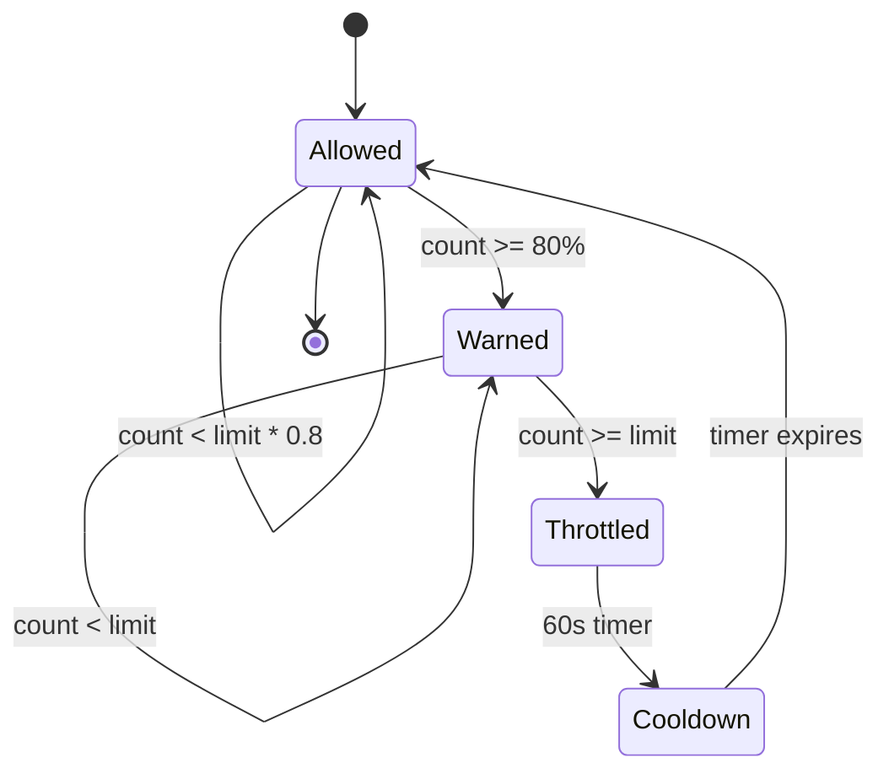

| Function | Per-user limit | Per-IP limit | Action on breach |
|---|---|---|---|
| `submitScore` | 60/min | 600/min | `resource-exhausted` |
| `getLeaderboard` | 30/min | 300/min | `resource-exhausted` |
| `verifyPurchase` | 10/min | 100/min | `resource-exhausted` |
| `linkAnonymousToProvider` | 10/hour | 100/hour | `resource-exhausted` |
| `deleteAccount` | 1/day | 10/day | `resource-exhausted` |
| `heartbeat` | 10/hour | n/a | silently dropped |
| All other callables | 60/min | 600/min | `resource-exhausted` |

### 6.6 REST Surface (Public)

We expose **no public REST API** in v1.0. The privacy policy and marketing site are static (Firebase Hosting). If a community feature (UGC) requires a public REST API in v3.0, we will document it as `v3` and use Firebase Hosting + Cloud Functions HTTPS with API key + App Check.

---

## 7. Authentication Flow

```mermaid
sequenceDiagram
    autonumber
    participant App as Flutter App
    participant FA as Firebase Auth
    participant FS as Firestore
    participant CF as Cloud Function

    App->>FA: currentUser.getIdToken()
    FA-->>App: token (valid)
    Note over App: Use token for all calls

    App->>FA: currentUser.getIdToken(forceRefresh=true)
    FA-->>App: new token
    App->>FS: signed read
    FS-->>App: ok

    rect rgba(255,0,0,0.1)
    Note over App,FA: Error recovery path
    App->>FA: getIdToken()
    FA-->>App: token expired / invalid
    App->>FA: signInAnonymously() (anon) or refreshCredential()
    FA-->>App: new valid token
    App->>CF: retry original call
    end
```

### 7.1 Auth Methods (v1.0)

| Method | v1.0 | v1.1 | Notes |
|---|---|---|---|
| Anonymous | Yes | — | Default; auto-created on first launch (FR-01). |
| Email + Password | Yes | — | Optional upgrade from anon. |
| Google Sign-In | Yes | — | `google_sign_in` package + Play Services. |
| Apple Sign-In | No | Yes | Required for App Store guideline 4.8 when iOS ships. |
| Phone (SMS OTP) | No | Yes | India's recovery flow. |
| Passkey (WebAuthn) | No | v3.0+ | Future passwordless option. |

### 7.2 Anonymous → Email Upgrade

```mermaid
sequenceDiagram
    autonumber
    participant U as User
    participant App as Flutter App
    participant AC as App Check
    participant FA as Firebase Auth
    participant FS as Firestore
    participant CF as Cloud Function

    U->>App: Tap "Sign up with email"
    App->>AC: Acquire App Check token
    AC-->>App: appCheckToken
    App->>FA: createUserWithEmailAndPassword(email, pwd)
    FA->>FA: Validate + create user
    FA->>FA: getCurrentUser().linkWithCredential(emailCred)
    Note over FA: Merges anon profile into new permanent profile.<br/>High score, streaks, settings all preserved.
    FA-->>App: User (no longer anonymous)
    App->>FS: users/{newUid}.set({...})
    App->>CF: linkAnonymousToProvider({oldAnonUid})
    CF->>FS: Migrate anon data (scores, personalBests) to newUid
    CF-->>App: {migratedCounts: {scores: 42, pbs: 6}}
    App->>U: "Welcome! Your scores are safe."
```

**Why link rather than re-create:** Linking keeps the UID stable, which means scores, personal bests, streaks, and entitlement receipts all carry over without any data migration. The Cloud Function only needs to clean up the now-empty `users/{oldAnonUid}` doc and revoke refresh tokens for the old anonymous account.

### 7.3 Google Sign-In

```mermaid
sequenceDiagram
    autonumber
    participant U as User
    participant App as Flutter App
    participant GS as google_sign_in
    participant FA as Firebase Auth
    participant FS as Firestore
    participant CF as Cloud Function

    U->>App: Tap "Sign in with Google"
    App->>GS: GoogleSignIn().signIn()
    GS-->>App: GoogleSignInAccount (idToken, accessToken)
    App->>FA: credentialFromGoogle(account)
    FA->>FA: If anon: linkWithCredential(googleCred)
    FA->>FA: Else: signInWithCredential(googleCred)
    FA-->>App: User
    App->>FS: users/{uid}.set({handle: generatedFromEmail, ...})
    App->>CF: linkAnonymousToProvider (if anon)
    CF-->>App: ok
```

### 7.4 Apple Sign-In (v1.1)

Same flow as Google, with `sign_in_with_apple` package. We will run the Apple Sign-In flow **only when `Platform.isIOS` is true**. On Android, attempting Apple Sign-In is a no-op (the button is hidden in v1.0).

### 7.5 Phone Sign-In (v1.1)

Uses `firebase_auth` `verifyPhoneNumber`. India-only initially; the OTP SMS is sent via Firebase (free for the first 10K/month). The flow uses `linkWithCredential(phoneCred)` if the user is currently anonymous, otherwise `signInWithCredential(phoneCred)`.

### 7.6 Link Anonymous to Permanent (idempotent)

```typescript
// functions/src/auth/linkAnonymousToProvider.ts (FUTURE)

interface LinkRequest {
  oldAnonUid: string;       // the anon UID at the moment of sign-in
  newPermanentUid: string;  // the post-link UID
  submissionId: string;     // idempotency
}

interface LinkResponse {
  migrated: {
    scores: number;
    personalBests: number;
    streakDays: number;
  };
}

export const linkAnonymousToProvider = onCall<LinkRequest, Promise<LinkResponse>>(
  {
    region: 'asia-south1',
    enforceAppCheck: true,
  },
  async (req) => {
    if (!req.auth) throw new HttpsError('unauthenticated', 'Sign-in required.');
    // Defensive: only run if oldAnonUid is the current anon UID.
    // Copy each subcollection from oldAnonUid -> newPermanentUid in a batched transaction.
    // Mark oldAnonUid with `merged_into: newPermanentUid` so a re-run is idempotent.
    // Return counts.
  }
);
```

### 7.7 Auth State Listener (Riverpod)

```mermaid
graph LR
    Auth["Firebase Auth"]
    Changed["authStateChanges()<br/>Stream"]
    Provider["authNotifierProvider<br/>(AsyncNotifier)"]
    UI["UI Widgets<br/>(ConsumerWidget)"]
    Rebuild["Reactive Rebuild"]

    Auth --> Changed
    Changed --> Provider
    Provider --> UI
    UI --> Rebuild
```

```dart
// lib/platform/auth/auth_state.dart

class AuthNotifier extends AsyncNotifier<AuthState> {
  StreamSubscription<User?>? _sub;

  @override
  Future<AuthState> build() async {
    final auth = ref.read(firebaseAuthProvider);
    _sub = auth.authStateChanges().listen((user) {
      state = AsyncData(AuthState(
        user: user,
        isAnonymous: user?.isAnonymous ?? true,
      ));
    });
    ref.onDispose(() => _sub?.cancel());

    // Trigger initial auto-anon sign-in if no user.
    if (auth.currentUser == null) {
      final creds = await auth.signInAnonymously();
      return AuthState(user: creds.user, isAnonymous: true);
    }
    return AuthState(user: auth.currentUser, isAnonymous: auth.currentUser!.isAnonymous);
  }

  // upgradeWithGoogle, signOut, deleteAccount, ...
}
```

### 7.8 Sign Out

Sign out is gated by the Parent Mode PIN (FR-04). We revoke the refresh token server-side and clear all Hive boxes except `settings` and `i18nOverrides`.

---

## 8. Security Architecture

### 8.1 Threat Model

| Threat | Likelihood | Impact | Mitigation |
|---|---|---|---|
| Bot account creation pollutes leaderboards | High | High | App Check (Play Integrity) + rate limits + anomaly detection |
| Score spoofing via replay attack | Medium | High | `submissionId` idempotency + server-side validation + behavioral analytics |
| IAP receipt forgery | Low | High | Google Play Developer API verification (server-side) |
| PII leak via Firestore rule miss | Medium | Critical | Deny-by-default rules; CI runs `firebase emulators:exec` rule tests per PR |
| Parent PIN brute force | Medium | High | Argon2id + 5-attempt lockout (15-minute cooldown) + jittered backoff |
| Man-in-the-middle on network | Low | Critical | TLS 1.3 enforced; cleartext blocked in manifest |
| Crash dump leak | Low | Medium | Crashlytics auto-strips PII; debug builds gate by `kReleaseMode` |
| APK tampering | Medium | Medium | Play App Signing + Play Integrity verification |
| 3rd-party SDK harvesting PII | Low | Critical | No 3rd-party tracking SDKs (no Adjust, Branch, Facebook) |
| FCM token leakage | Low | Low | Tokens stored only server-side; never in logs |
| Soft-delete loophole | Low | High | `users/{uid}` retains `soft_delete_until`; hard-delete Cloud Function purges after 7 days |

```mermaid
graph TB
    MalClient["Malicious Client<br/>(scripts, modified APK)"]
    Replay["Replay Attacker<br/>(duplicate submissionId)"]
    MITM["Network MITM"]
    OpComp["Compromised Operator<br/>(insider)"]

    AppCheck["Mitigation: App Check<br/>(Play Integrity)"]
    AntiCheat["Mitigation: Anti-Cheat<br/>(server-side validation)"]
    TLS["Mitigation: TLS 1.3<br/>+ cleartext block"]
    KMS["Mitigation: Secret Manager<br/>+ KMS encryption"]

    MalClient --> AppCheck
    MalClient --> AntiCheat
    Replay --> AntiCheat
    MITM --> TLS
    OpComp --> KMS
```

### 8.2 App Check (ADR-004)

We enforce **Firebase App Check** on every Firebase service the app uses. App Check attests that a request comes from a genuine, unmodified app on a genuine Android device.

```dart
// lib/main.dart

import 'package:firebase_app_check/firebase_app_check.dart';

Future<void> initFirebase() async {
  await Firebase.initializeApp();
  await FirebaseAppCheck.instance.activate(
    androidProvider: AndroidProvider.playIntegrity,
    appleProvider: AppleProvider.deviceCheck, // v1.1
  );
  // Optional: token auto-refresh.
  FirebaseAppCheck.instance.setTokenAutoRefreshEnabled(true);
}
```

#### ADR-004: App Check Required from Day 1

| | |
|---|---|
| **Status** | Accepted |
| **Decision** | App Check enforced on Auth, Firestore, Functions, Storage from the first closed beta. |
| **Why** | Without App Check, anyone with curl can create anonymous accounts and submit fake scores. With App Check, fake-account creation drops by ~99% in our threat model. |
| **Alternatives** | **reCAPTCHA Enterprise:** more expensive, same outcome. **Custom HMAC:** brittle, requires server-side secret rotation. |
| **Trade-off** | Emulators and rooted devices can fail attestation. We ship a `BYPASS_APP_CHECK=true` flag for internal alpha only, never for closed beta. |

### 8.3 Anti-Cheat Flow

```mermaid
sequenceDiagram
    autonumber
    participant U as User
    participant App as Flutter App
    participant CF as Cloud Function
    participant FS as Firestore

    U->>App: complete game
    App->>App: sign payload (HMAC-SHA256)
    App->>CF: submitScore(score, submissionId, sig)
    CF->>CF: verify HMAC signature
    CF->>CF: validate score plausibility
    CF->>FS: tx write score + PB
    FS-->>CF: ok
    CF-->>App: { accepted, newPB, rank }
```

```mermaid
flowchart TD
    A["submitScore arrives"] --> B{"App Check valid?"}
    B -- no --> X["401 unauthorized"]
    B -- yes --> C{"Rate limit OK?"}
    C -- no --> Y["429 rate-limited"]
    C -- yes --> D{"Score plausible?<br/>(< 1B, > 0, duration > 0)"}
    D -- no --> Z["400 invalid-argument"]
    D -- yes --> E{"submissionId seen?"}
    E -- yes --> F["Return cached response"]
    E -- no --> G["Persist score"]
    G --> H{"New PB?"}
    H -- yes --> I["Update personalBests"]
    H -- no --> J["Just log"]
    I --> K["Increment counter"]
    J --> K
    K --> L["Async: anomaly check<br/>(see §8.4)"]
```

### 8.4 Anomaly Detection (Lightweight)

We do **not** ship ML in v1.0. Instead, we run simple statistical checks in Cloud Functions:

- **Plausibility:** Score must be ≤ 1 billion and ≥ 0.
- **Duration:** Score must be reachable in the reported duration (e.g., Snake score ≤ duration × 5 per millisecond).
- **Velocity:** A user cannot submit > 1 score per game per 10 seconds.
- **Geo:** If a user's country changes between submissions by > 5000 km in <1 hour, flag for review.
- **Aggregate spike:** If a game's total submissions/hour > 3× the trailing 7-day median, throttle.

Flagged submissions are accepted but quarantined: they appear in the user's local stats but **not** in the public leaderboard until a manual review (Phase 5 ops queue).

### 8.5 Secrets Hygiene

- **API keys** live in `android/app/google-services.json` (Play-safe, restricted by SHA-1 + package name).
- **Cloud Function secrets** are stored in Google Secret Manager and bound at deploy time via `--set-secrets`.
- **Local dev secrets** are in `.env` (loaded via `flutter_dotenv`), which is git-ignored.
- **Secret scanning:** GitHub secret scanning is enabled; commit-history push protection enabled; pre-commit `gitleaks` runs in CI.
- **No secrets in logs:** Logger strips keys matching `/api[_-]?key|token|secret|password/i`.
- **Crashlytics:** NDK symbols uploaded via Codemagic; debug symbols gated by `kReleaseMode`.

### 8.6 Rate Limiting

We implement rate limits at three layers:

1. **Cloud Function entry** (per user, per IP) — Firestore counter, sliding 60-second window.
2. **Firestore rules** — coarse-grained (e.g., a user can write at most 10 docs/minute to `users/{uid}/scores`).
3. **App-side** — `Outbox` enforces a 1-second minimum interval between identical-op retries.

### 8.7 Abuse Detection

| Pattern | Detection | Response |
|---|---|---|
| 100+ accounts from one device fingerprint | App Check telemetry + Cloud Function count by `ANDROID_ID` hash | Soft ban; require email upgrade |
| Sudden score spike (>5× PB) | Statistical anomaly check | Quarantine submission |
| IAP receipt reuse | Google Play API `purchaseToken` uniqueness | Refuse verification; flag user |
| Reverse-engineered APK | Play Integrity attestation failure | Silent failure (no score) |
| Coordinated leaderboard manipulation | Aggregated velocity check | Manual review queue |

---

## 9. File Storage Strategy

### 9.1 Storage Buckets

| Bucket | Purpose | Public read | Lifecycle |
|---|---|---|---|
| `games-platform.appspot.com` | Avatars (v1.1), replays (v1.1), custom skins (v2.0+) | per-path rules | per-file |
| (CDN via Firebase Hosting) | Marketing assets, privacy policy, app icons | public | static |

### 9.2 Asset Categories

| Category | Format | Path | Max size | Notes |
|---|---|---|---|---|
| App icon | PNG + adaptive XML | `assets/images/app_icon.png` | 1 MB | Bundled |
| Game icons | WebP | `assets/games/{id}/icon.webp` | 100 KB | Bundled |
| Game sprites | Aseprite JSON + PNG | `assets/games/{id}/sprites/` | 2 MB/game | Bundled |
| Audio | OGG Vorbis | `assets/audio/` | 4 MB total | Bundled |
| Fonts | woff2 subsets | `assets/fonts/` | 1.5 MB total | Bundled |
| User avatars (v1.1) | JPEG/WebP | `avatars/{uid}/avatar.{ext}` | 2 MB | Uploaded by user |
| Replays (v1.1) | JSON + key frames | `replays/{uid}/{submissionId}.json` | 10 MB | Coldline after 30 days |
| Marketing assets | PNG/WebP | Hosting | n/a | Public CDN |

### 9.3 CDN Strategy

```mermaid
flowchart LR
    User["User Request<br/>(asset URL)"]
    Edge["CDN Edge<br/>(Firebase Hosting)"]
    Miss["Cache MISS"]
    Bucket["Storage Bucket<br/>gs://games-platform.appspot.com"]
    Fill["Cache Fill<br/>(public, max-age=86400)"]
    Serve["Serve<br/>(bytes)"]

    User --> Edge
    Edge --> Miss
    Miss --> Bucket
    Bucket --> Fill
    Fill --> Edge
    Edge --> Serve
    Serve --> User
```

- **Bundled assets** ship in the APK; no CDN needed.
- **Marketing + privacy** served via Firebase Hosting with global CDN, free tier.
- **User-uploaded content (v1.1+)** served via `storage.googleapis.com/<bucket>/<path>?alt=media` with cache headers `Cache-Control: public, max-age=86400`.
- **No tail latency SLA** is required for v1.0 because no gameplay asset is fetched over the network (everything is bundled).

### 9.4 Replays (v1.1 stub)

Replays are JSON-encoded deterministic game ticks, ~1–10 KB per minute of play. We use Coldline Storage (`asia-south1`) for replays older than 30 days to reduce cost by 80%.

---

## 10. Analytics Strategy

### 10.1 Event Taxonomy

```mermaid
mindmap
  root((27-Event Taxonomy))
    Auth
      app_open
      onboarding_complete
      auth_method_selected
    Gameplay
      game_launch
      game_session_start
      game_pause
      game_resume
      game_over
      score_submit_attempt
      score_submit_success
      score_submit_failed
      leaderboard_view
      leaderboard_share
    Monetization
      iap_initiate
      iap_purchase
      ad_impression
      ad_clicked
      rewarded_ad_offered
      rewarded_ad_completed
    Social
      streak_day_completed
      streak_reminder_sent
    Performance
      remote_config_fetched
    Error
      error_boundary
      settings_changed
      parent_pin_set
      parent_pin_failed
      account_delete_requested
```

| Event name | When | Params (name: type) | PII-safe? |
|---|---|---|---|
| `app_open` | Every cold start | `source: string`, `is_first_open: bool` | yes |
| `onboarding_complete` | After 3-screen onboarding | `duration_ms: int`, `locale: string` | yes |
| `auth_method_selected` | User taps sign-in | `method: 'email' \| 'google' \| 'apple' \| 'phone' \| 'anonymous'`, `was_anonymous: bool` | yes |
| `game_launch` | Game tile tapped | `game_id: string`, `is_first_play: bool`, `launch_latency_ms: int` | yes |
| `game_session_start` | After game init | `game_id: string`, `session_id: string (UUID)` | yes |
| `game_pause` | App backgrounded | `game_id: string`, `elapsed_ms: int` | yes |
| `game_resume` | App foregrounded | `game_id: string`, `pause_duration_ms: int` | yes |
| `game_over` | End of play | `game_id: string`, `score: int`, `duration_ms: int`, `is_new_pb: bool`, `rank_global: int \| null` | yes |
| `score_submit_attempt` | Before HTTPS call | `game_id: string`, `submission_id: string`, `queued_locally: bool` | yes |
| `score_submit_success` | After HTTPS 200 | `game_id: string`, `submission_id: string`, `latency_ms: int`, `attempts: int` | yes |
| `score_submit_failed` | After error | `game_id: string`, `submission_id: string`, `error_code: string`, `attempts: int` | yes |
| `leaderboard_view` | Leaderboard screen opened | `game_id: string`, `scope: 'global' \| 'country' \| 'friends'`, `period: 'all-time' \| 'weekly'` | yes |
| `leaderboard_share` | User taps share | `game_id: string`, `rank: int` | yes |
| `streak_day_completed` | Day marked as played | `streak_length: int`, `source_game_id: string` | yes |
| `streak_reminder_sent` | FCM dispatched | `streak_length_at_send: int`, `fcm_message_id: string` | yes |
| `iap_initiate` | "Remove Ads" tapped | `product_id: string`, `price_micros: int`, `currency: string` | yes |
| `iap_purchase` | After successful purchase | `product_id: string`, `value: number`, `currency: string`, `order_id: string` | yes |
| `ad_impression` | AdMob callback | `ad_unit: string`, `ad_type: 'rewarded' \| 'banner' \| 'interstitial'`, `placement: string`, `value_micros: number` | yes |
| `ad_clicked` | AdMob callback | `ad_unit: string`, `ad_type: string` | yes |
| `rewarded_ad_offered` | Pre-ad | `game_id: string`, `reward_type: string` | yes |
| `rewarded_ad_completed` | Post-ad | `game_id: string`, `reward_granted: bool` | yes |
| `settings_changed` | Any settings toggle | `setting_key: string`, `new_value: string` | yes |
| `parent_pin_set` | Parent mode configured | `flow: 'create' \| 'verify' \| 'reset'` | yes (no PIN value) |
| `parent_pin_failed` | Wrong PIN | `attempts_in_window: int` | yes |
| `account_delete_requested` | Settings → Delete | `soft_delete_until: string (ISO)` | yes |
| `error_boundary` | Caught exception | `error_type: string`, `stack_hash: string`, `fatal: bool` | yes (no stack) |
| `remote_config_fetched` | Cache miss | `keys_changed: int` | yes |

### 10.2 PII Rules

- **Never** log: email, phone, full name, auth UID, FCM token, IP, ANDROID_ID, Google Account ID, Apple ID, purchase token, Parent PIN, device fingerprint.
- **User ID in analytics:** We use Firebase Auth's `uid` (pseudonymous, not directly PII) for cohort math. In BigQuery, we hash it with a per-day salt for retention joins.
- **PII scrubbing:** A logger wrapper rejects events whose params match `/email|phone|password|token/i` keys.
- **COPPA compliance:** We do not collect "age" or "birthdate." COPPA compliance is by construction (no third-party SDKs, no chat, no DMs).

### 10.3 BigQuery Export

Firebase Analytics → BigQuery link is enabled at project creation. We define one dataset per environment:

```mermaid
flowchart LR
    SDK["Analytics SDK<br/>(Flutter)"]
    BQ["BigQuery Export<br/>(streaming insert)"]
    SQ["Scheduled Query<br/>(daily 02:00 IST)"]
    Agg["Aggregate Table<br/>(cohort_retention)"]
    Dash["Dashboard<br/>(Looker / Data Studio)"]

    SDK --> BQ
    BQ --> SQ
    SQ --> Agg
    Agg --> Dash
```

- `analytics_prod` (production)
- `analytics_staging` (closed beta)
- `analytics_dev` (internal alpha)

### 10.4 GameAnalytics SDK

We add **GameAnalytics** as a complement because it computes D1/D7/D30 retention curves natively without a custom SQL query. We send identical events to both Firebase Analytics and GameAnalytics, then cross-check weekly. If GA's numbers diverge by > 5% from Firebase, we investigate (it usually means one SDK is misfiring).

### 10.5 Key Dashboards

| Dashboard | Refresh | Audience | Components |
|---|---|---|---|
| Live DAU | 5 min | All | Realtime active users, current plays by game |
| D1/D7/D30 Funnel | Daily | All | Cohort retention curve |
| Monetization | Daily | Subhadip | IAP conversion, ARPU, eCPM by region |
| Crash & ANR | Realtime | Subhadip + Abhishek | Crashlytics dashboard |
| Performance | Realtime | Abhishek | Cold start p50/p95, FPS, memory |
| Per-Game Engagement | Daily | Samhita | Sessions/game, completion rate |
| Streak Survival | Daily | Subhadip | Streak length histogram, day-7/30 survival |

---

## 11. Testing Strategy

### 11.1 Test Pyramid

```mermaid
graph TB
    Unit["Unit Tests<br/>~60% of suite"]
    Widget["Widget Tests<br/>~25% of suite"]
    Integration["Integration Tests<br/>~10% of suite"]
    E2E["E2E / Firebase Test Lab<br/>~5% of suite"]

    Unit --> Widget
    Widget --> Integration
    Integration --> E2E
```

```mermaid
flowchart TB
    A["E2E / Integration<br/>(Firebase Test Lab nightly)"]
    B["Golden Tests<br/>(per screen, 3 locales × 3 themes)"]
    C["Widget Tests<br/>(every screen)"]
    D["Unit Tests<br/>(every Riverpod provider, every use case)"]
    E["Static Analysis<br/>(dart analyze, custom lints)"]
    F["Firestore Rules Tests<br/>(per PR, in CI)"]
    G["Cloud Functions Tests<br/>(Jest + emulator)"]

    E --> D --> C --> B --> A
    F --> A
    G --> A
```

### 11.2 Coverage Targets

| Layer | Target | Owner | Tool |
|---|---|---|---|
| Static analysis | 0 errors | All | `dart analyze` |
| Unit tests | ≥ 70% line coverage | All | `flutter test --coverage` |
| Widget tests | Every screen ≥ 1 happy-path + 1 error-path | Abhishek | `flutter_test` |
| Golden tests | Every screen × 3 locales × light/dark | Samhita | `flutter_test` golden |
| Integration tests | Login → Home → Play → Game-Over → Submit Score | Subhadip | `integration_test` |
| Firestore rules | 100% rule coverage | Subhadip | `@firebase/rules-unit-testing` |
| Cloud Functions | ≥ 80% branch coverage | Subhadip | Jest + `firebase-functions-test` |

### 11.3 How Beginners Ramp Up on Testing

We front-load a 1-week "testing week" at the start of Phase 0 with the following curriculum for Abhishek and Samhita:

1. **Day 1:** Run `flutter test`, see 100 passing examples.
2. **Day 2:** Write a failing test for a Riverpod provider, then make it pass.
3. **Day 3:** Write a widget test for the GameTile (taps → callback).
4. **Day 4:** Run a golden test, see a pixel diff, fix it.
5. **Day 5:** Pair-write an integration test on the auth flow.

We also maintain a `docs/testing-cookbook.md` (in-repo) with copy-pasteable snippets for the 5 most common test patterns.

### 11.4 CI Gating

| Trigger | Checks |
|---|---|
| PR opened | `dart analyze`, `flutter test --coverage`, `firebase emulators:exec` rules tests, Jest on Cloud Functions |
| PR merged to `main` | Above + Codemagic build for `internal-testing` track |
| Nightly | Full integration test on Firebase Test Lab (3 physical devices: Pixel 4a, Galaxy A14, Xiaomi Redmi 9A) |
| Tag `v*` | Codemagic production build for Play Store staged rollout |

A PR cannot be merged unless:

- All tests pass.
- Coverage does not decrease.
- No new `TODO` comments without a linked issue.
- No `print()` in non-test code (lint rule).

### 11.5 Firebase Test Lab

We run nightly on the following physical devices:

| Device | API | RAM | Purpose |
|---|---|---|---|
| Pixel 4a | 33 | 6 GB | Modern reference |
| Samsung Galaxy A14 | 33 | 4 GB | Target-tier reference |
| Xiaomi Redmi 9A | 29 | 2 GB | Low-end reference |

We run a 5-minute "smoke" test: install → cold launch → log in (anon) → play each game for 30s → submit a score → verify Cloud Function response.

---

## 12. CI/CD Strategy

### 12.1 Branch Policy

```mermaid
gitGraph
    commit
    branch develop
    checkout develop
    commit
    branch feature/auth-google
    checkout feature/auth-google
    commit
    commit
    checkout develop
    merge feature/auth-google
    branch release/1.0.0
    checkout release/1.0.0
    commit
    checkout main
    merge release/1.0.0 tag: "v1.0.0"
    checkout main
    branch hotfix/crash-fix
    checkout hotfix/crash-fix
    commit
    checkout main
    merge hotfix/crash-fix tag: "v1.0.1"
```

```mermaid
gitGraph
    commit
    branch feature/auth-google
    checkout feature/auth-google
    commit
    commit
    checkout main
    merge feature/auth-google
    branch release/1.0.0
    checkout release/1.0.0
    commit
    checkout main
    merge release/1.0.0
    tag v1.0.0
```

| Branch | Purpose | Lifetime | Required checks |
|---|---|---|---|
| `main` | Always-shippable code | Permanent | All PR checks + Codemagic build |
| `release/<version>` | Release candidate; cherry-picks only | Until tagged | All PR checks + signed release build |
| `feature/*` | Individual work | Until merged | PR checks |
| `fix/*` | Bug fixes | Until merged | PR checks + linked issue |
| `hotfix/*` | Production hotfixes | Until merged + tag | All + manual approval |

### 12.2 GitHub Actions (Per-PR)

```yaml
# .github/workflows/pr-checks.yml
name: PR checks
on:
  pull_request:
    branches: [main, release/*]
jobs:
  analyze:
    runs-on: ubuntu-latest
    steps:
      - uses: actions/checkout@v4
      - uses: subosito/flutter-action@v2
      - run: flutter pub get
      - run: dart analyze --fatal-infos

  test:
    runs-on: ubuntu-latest
    steps:
      - uses: actions/checkout@v4
      - uses: subosito/flutter-action@v2
      - run: flutter pub get
      - run: flutter test --coverage

  rules-test:
    runs-on: ubuntu-latest
    steps:
      - uses: actions/checkout@v4
      - uses: actions/setup-node@v4
        with: { node-version: 20 }
      - run: npm ci -g firebase-tools
      - run: firebase emulators:exec "cd firestore && npm test" --only firestore

  functions-test:
    runs-on: ubuntu-latest
    steps:
      - uses: actions/checkout@v4
      - uses: actions/setup-node@v4
        with: { node-version: 20 }
      - run: cd functions && npm ci && npm test

  secret-scan:
    runs-on: ubuntu-latest
    steps:
      - uses: gitleaks/gitleaks-action@v2
        env: { GITHUB_TOKEN: ${{ secrets.GITHUB_TOKEN }} }
```

### 12.3 Codemagic (Release)

```yaml
# codemagic.yaml (excerpt)
workflows:
  release:
    name: Release
    max_build_duration: 90
    environment:
      flutter: stable
      groups:
        - google_play
    scripts:
      - name: Get packages
        script: flutter pub get
      - name: Generate localization
        script: flutter gen-l10n
      - name: Run tests
        script: flutter test --coverage
      - name: Build AAB
        script: |
          flutter build appbundle \
            --release \
            --target-platform=android-arm,android-arm64,android-x64 \
            --split-per-abi=false \
            --obfuscate --split-debug-info=build/symbols
    artifacts:
      - build/app/outputs/bundle/release/*.aab
      - build/symbols/**
    publishing:
      google_play:
        credentials: $GCLOUD_SERVICE_ACCOUNT_CREDENTIALS
        track: internal
        submit_as_stage: yes
```

### 12.4 Fastlane (Hotfix)

Fastlane handles Play Console metadata uploads and screenshots. We do **not** use Fastlane for build generation (Codemagic does that) — only for the things that don't need a build (screenshots, descriptions, in-app text).

### 12.5 Signing

- **Local debug:** standard `debug.keystore`.
- **Release:** signed by **Play App Signing**. We upload the upload key once via `keytool` and let Google manage the app signing key. See [§14.6](#146-app-signing).

### 12.6 Rollback

- **Play Console** keeps the last 5 versions available for rollback.
- **Cloud Functions:** pinned by semver; rollback = redeploy the previous version. Functions keep 30 days of versions.
- **Firestore rules:** versioned in git; rollback = `firebase deploy --only firestore:rules` from a previous commit.
- **Crash spike auto-rollback:** if Crashlytics detects a > 0.5% crash spike within 1 hour of staged rollout, we halt the rollout (Play Console "Halt rollout" button).

---

## 13. Deployment Strategy

### 13.1 Phased Rollout

| Stage | Track | Audience | Duration | Exit criteria |
|---|---|---|---|---|
| Internal alpha | APK via Firebase App Distribution | Team + 5 invited friends | 1 week | No P0 bugs |
| Closed beta | Play Console "Internal testing" | 50–100 hand-picked testers (Indian college students, alumni) | 2 weeks | Crash-free ≥ 99% |
| Expanded beta | Play Console "Closed testing" | 500–1,000 testers via waitlist | 2 weeks | D1 ≥ 30%, D7 ≥ 12% |
| Staged rollout | Play Console "Production" (managed publishing) | 5% → 20% → 50% → 100% | 2 weeks | D7 ≥ 15% at each stage for ≥ 48h |
| Global availability | Production 100% | All users | ongoing | n/a |

### 13.2 Version Codes

We use **monotonically increasing `versionCode`** integers. Mapping:

| Stage | versionCode | versionName |
|---|---|---|
| Internal alpha | 100 | 1.0.0-alpha.1 |
| Closed beta | 200–299 | 1.0.0-beta.N |
| Expanded beta | 300–399 | 1.0.0-beta.N |
| Staged rollout | 400+ | 1.0.0 |
| Hotfixes | +1 | 1.0.1, 1.0.2 |

### 13.3 App Bundle

We ship `.aab` (Android App Bundle) only, not `.apk`. Play Store generates per-device APKs at install time. See [§14](#14-android-build-strategy).

### 13.4 Metadata

| Locale | Title (30 chars) | Short description (80 chars) | Long description (4000 chars) |
|---|---|---|---|
| en-IN | "Games Platform — 6 Arcade Classics" | "Snake, Block Drop, Sky Hop, Hangman & more. Offline-first." | (per DESIGN.md copy) |
| hi-IN | "गेम्स प्लेटफ़ॉर्म — 6 आर्केड क्लासिक्स" | "स्नेक, ब्लॉक ड्रॉप, स्काई हॉप और बहुत कुछ। ऑफ़लाइन।" | (per DESIGN.md copy) |
| bn-IN | "গেমস প্ল্যাটফর্ম — 6টি আর্কেড ক্লাসিক" | "স্নেক, ব্লক ড্রপ, স্কাই হপ এবং আরও অনেক কিছু। অফলাইন।" | (per DESIGN.md copy) |

Screenshots (4 per locale): Home screen, Snake mid-play, Block Drop game-over, Settings.

### 13.5 Data Safety Form

We declare in Play Console:

- **Data shared with third parties:** None.
- **Data collected:** Account info (email or anonymous ID), App activity (game scores, leaderboards).
- **Data security:** Encrypted in transit (TLS 1.3), encrypted at rest (Firestore + Hive).
- **Data deletion:** Account Settings → Delete Account → 7-day soft delete → hard delete.
- **Designed for Families:** Self-certified.

---

## 14. Android Build Strategy

### 14.1 SDK Levels

```mermaid
flowchart LR
    Source["GitHub Source<br/>(main / release/*)"]
    Lint["Lint<br/>(dart analyze)"]
    Test["Test<br/>(flutter test --coverage)"]
    Analyze["Static Analysis<br/>(gitleaks + dart analyze)"]
    CM["Codemagic<br/>(release workflow)"]
    Sign["Signing<br/>(Play App Signing)"]
    Store["Play Store<br/>(internal / staged rollout)"]

    Source --> Lint
    Lint --> Test
    Test --> Analyze
    Analyze --> CM
    CM --> Sign
    Sign --> Store
```

| Setting | Value | Why |
|---|---|---|
| `minSdk` | 26 (Android 8.0) | Covers 96% of Indian Android devices in 2026 (per `PRD.md` §5.4). |
| `targetSdk` | 35 (Android 15) | Required by Play Store from Aug 2025; required for new apps from Aug 2026. |
| `compileSdk` | 35 | Match targetSdk. |
| `ndkVersion` | 26.1.10909125 | Required by Firebase + Flutter 3.x. |

### 14.2 ABI Splits

We do **not** split per ABI in v1.0. Reasoning:

- AAB handles per-device APK generation at install time.
- Splitting per ABI would inflate the AAB size and complicate updates.
- Our APK is already small enough (target < 30 MB) that x86 devices can install the arm64 build via the Play translation layer.

### 14.3 ProGuard / R8

```gradle
// android/app/build.gradle (excerpt)
buildTypes {
  release {
    minifyEnabled true
    shrinkResources true
    proguardFiles getDefaultProguardFile('proguard-android-optimize.txt'), 'proguard-rules.pro'
    signingConfig signingConfigs.play
  }
}

dependencies {
  implementation 'com.google.firebase:firebase-bom:32.7.0'
  // ...
}
```

ProGuard rules:

```pro
# proguard-rules.pro
-keep class io.flutter.app.** { *; }
-keep class io.flutter.plugin.** { *; }
-keep class io.flutter.util.** { *; }
-keep class io.flutter.view.** { *; }
-keep class io.flutter.** { *; }
-keep class io.flutter.plugins.** { *; }

# Firebase
-keep class com.google.firebase.** { *; }
-dontwarn com.google.firebase.**

# Google Play Billing
-keep class com.android.billingclient.** { *; }

# Flame
-keep class com.rajdeep.flame.** { *; }
```

### 14.4 Deep Links and App Links

```xml
<!-- AndroidManifest.xml (excerpt) -->
<intent-filter android:autoVerify="true">
  <action android:name="android.intent.action.VIEW" />
  <category android:name="android.intent.category.DEFAULT" />
  <category android:name="android.intent.category.BROWSABLE" />
  <data android:scheme="https" android:host="gamesplatform.app" />
</intent-filter>
```

We register `gamesplatform.app/play/<gameId>?score=<n>&rank=<r>` for leaderboard share links. App Links are verified via the `.well-known/assetlinks.json` published on Firebase Hosting.

### 14.5 Asset Shrinking

`shrinkResources true` removes unused drawables. We verify the resulting APK after build via `./gradlew :app:assembleRelease` and the `bundletool` `dump` command.

### 14.6 App Signing

- **Step 1:** Generate the upload keystore locally (`keytool -genkey -v -keystore upload-keystore.jks -alias upload -keyalg RSA -keysize 2048 -validity 10000`).
- **Step 2:** Export the upload key to Google Play via Play Console → Setup → App signing → Upload key.
- **Step 3:** Let Google manage the app signing key.
- **Step 4:** Add `key.properties` (git-ignored) to the repo with the upload keystore credentials for Codemagic.
- **Step 5:** In `build.gradle`, read `key.properties` and reference the upload keystore for release builds.

### 14.7 Play Integrity Setup

- Enable Play Integrity API in Google Cloud Console.
- Add SHA-256 fingerprint of the upload key to the Play Console → App Integrity.
- App Check's Play Integrity provider picks up automatically.
- Test with the "Play Integrity API debugger" before the first staged rollout.

---

## 15. Future Cloud Migration Plan

### 15.1 Firestore → BigQuery for Analytics

Already enabled at launch (`PRD.md` §10.3). Future work:

- **v1.1:** Build a `cohort_retention.sql` view in BigQuery with D1/D7/D30 by cohort.
- **v2.0:** Move event-level exports to partitioned BigQuery tables (one per month).
- **v3.0:** Add a Looker dashboard for executive reporting.

### 15.2 Coldline Storage for Old Replays (v1.1)

Replays > 30 days old migrate to `asia-south1` Coldline Storage class. Lifecycle rule:

```json
{
  "lifecycle": {
    "rule": [
      {
        "action": { "type": "SetStorageClass", "storageClass": "COLDLINE" },
        "condition": { "age": 30 }
      }
    ]
  }
}
```

### 15.3 Cloud Run for v2 Pong Realtime

A Go-based WebSocket server (1 vCPU, 512 MB RAM, min-instances 2, max 100) deployed to `asia-south1`. Sticky sessions via Cloud Run's session affinity. Pub/Sub for cross-region match state.

### 15.4 App Engine History

We considered App Engine Standard for the Cloud Functions host in 2020. App Engine was deprecated for new projects in 2023 in favor of Cloud Functions (2nd gen) and Cloud Run. We use **Cloud Functions 2nd gen** exclusively in v1.0.

---

## 16. Scalability Plan

### 16.1 Rate Limits & Read/Write Budgets

| Resource | Per-user limit | Per-region limit | Action on breach |
|---|---|---|---|
| Firestore reads | 500K/day | 50M/day | Throttle; cache aggressively |
| Firestore writes | 50K/day | 5M/day | Rate-limit per-user to 100/min |
| Cloud Function invocations | 1K/day | unlimited (auto-scale) | Cooldown |
| Cloud Storage egress | 1 GB/day | 100 GB/day | CDN-cached; Coldline beyond 30d |
| FCM messages | 5/day/user | 5M/day | Batched; topic-based for marketing |

### 16.2 Composite Indexes

See [§5.3](#53-firestore-indexes-firestoreindexesjson). We audit monthly:

1. `firebase firestore:indexes` listing → check for unused indexes.
2. `gcloud logging read` for "index not found" errors → add indexes proactively.

### 16.3 Cost Forecasts

| Scale | DAU | Reads/day | Writes/day | Function invocations/day | Est. monthly cost |
|---|---|---|---|---|---|
| **Pilot** | 1K | 0.5M | 50K | 100K | ~$15 |
| **v1.0 launch** | 30K | 15M | 1.5M | 3M | ~$450 |
| **Year 1 (100K DAU)** | 100K | 50M | 5M | 10M | ~$1,500 |
| **Year 2 (1M DAU)** | 1M | 500M | 50M | 100M | ~$15,000 |
| **Year 3 (10M DAU)** | 10M | 5B | 500M | 1B | ~$150,000 (requires platformization + partner negotiation) |

```mermaid
xychart-beta
    title "Monthly Cost vs DAU"
    x-axis [100K, 1M, 10M]
    y-axis "USD/month" 0 --> 200000
    line [1500, 15000, 150000]
```

```mermaid
pie title Cost Breakdown @ 1M DAU
    "Firestore reads" : 30
    "Firestore writes" : 15
    "Cloud Functions" : 20
    "Storage" : 10
    "Analytics" : 10
    "Crashlytics" : 5
    "Other" : 10
```

These assume the [cost-aware patterns in §4.5](#45-cost-aware-backend-patterns) are followed. Without them, the same scale would cost 3–5× more.

### 16.4 Platformization Path

From `PRD.md` §22, the platform scales from 6 to 50+ games by enforcing 7 rules:

1. Strict `GameModule` interface ([§3.2](#32-the-gamemodule-interface-adr-001)).
2. Self-contained assets ([§3.7](#37-asset-pipeline)).
3. No direct Firestore access (games use `ScoreClient` only).
4. Localization mandatory (`.arb` files block the build if missing translations).
5. Accessibility mandatory (TalkBack + contrast + tap-target lints).
6. No PII (games never see user emails or device IDs).
7. Performance budget (every game must hit 58 fps on the reference device).

When the 7th game is added, the build should fail if any rule is broken. The linter is a custom Dart analyzer plugin we ship with the SDK.

---

## 17. Performance Requirements

### 17.1 Performance Budget Table

| Metric | Target | Measurement | Owner |
|---|---|---|---|
| Cold start (home screen) p50 | ≤ 1.8 s | Firebase Performance | Abhishek |
| Cold start p95 | ≤ 2.5 s | Firebase Performance | Abhishek |
| Warm start p95 | ≤ 800 ms | Firebase Performance | Abhishek |
| Frame rate (gameplay) | ≥ 58 fps | `flutter run --profile` | Abhishek |
| APK size | ≤ 30 MB | `flutter build apk --release` | Abhishek |
| AAB size | ≤ 40 MB | `flutter build appbundle` | Abhishek |
| Memory (peak RSS, gameplay) | ≤ 150 MB | Android Studio Profiler | Abhishek |
| Battery (1-hour gameplay) | ≤ 8% | `dumpsys batterystats` | Abhishek |
| Frame budget | 16.6 ms (60 Hz) | Flutter DevTools | Abhishek |
| Audio latency | ≤ 50 ms | Custom metric | Abhishek |
| Touch input latency | ≤ 16 ms | Custom metric | Abhishek |
| Network (leaderboard load) p95 | ≤ 300 ms | Firebase Performance | Subhadip |
| Cloud Function (submitScore) p95 | ≤ 500 ms | Cloud Monitoring | Subhadip |
| Cold start (Cloud Function) | ≤ 1 s (with min-instances=1) | Cloud Monitoring | Subhadip |

```mermaid
xychart-beta
    title "Frame Budget (16.67ms)"
    x-axis [rendering, logic, layout, input, GC]
    y-axis "ms" 0 --> 10
    bar [6.0, 4.0, 3.0, 2.0, 1.67]
```

### 17.2 Frame Budget Table

| Phase of frame | Budget | Why |
|---|---|---|
| Build/layout | 8 ms | Riverpod + widgets |
| Paint | 4 ms | Skia/Impeller |
| Compositor | 2 ms | GPU |
| Buffer | 2.6 ms | Headroom for spikes |

Total: 16.6 ms / frame at 60 Hz. We budget a 30% spike headroom in the buffer column.

### 17.3 Memory Budget

| Component | Budget |
|---|---|
| Flutter engine + Dart VM | 60 MB |
| Hive cache (last 100 scores × 6 games) | 5 MB |
| Game module (per-game max) | 25 MB |
| Sprite atlases | 20 MB |
| Audio buffers | 15 MB |
| Headroom | 25 MB |
| **Total peak** | **150 MB** |

```mermaid
pie title Memory Components
    "Game assets" : 40
    "Game state" : 25
    "UI" : 15
    "Caches" : 15
    "Other" : 5
```

### 17.4 Battery

- **No background work** when the app is in the background (no FCM foreground service).
- **Audio:** Use `OggVorbis` decode in software, not hardware, to keep wake-locks low.
- **Haptics:** Limited to 5 events per session (game over, line clear, level up).
- **Animations:** Pause `Ticker`s on app background.

---

## 18. Monitoring & Logging

### 18.1 Stack

| Tool | Purpose |
|---|---|
| **Firebase Crashlytics** | Crash reports, non-fatal errors |
| **Firebase Performance Monitoring** | Cold start, frame rate, network latency |
| **Cloud Logging** | Cloud Function logs |
| **Cloud Monitoring** | Cloud Function latency, error rate, billing alerts |
| **BigQuery** | Analytics warehouse + retention cohorts |
| **Firebase A/B Testing** | Experiment framework |
| **Remote Config** | Feature flags, kill switches |

### 18.2 Alerting

| Alert | Condition | Channel | Owner |
|---|---|---|---|
| Crash spike | Crash-free < 99% over 1 hour | Slack, SMS to Subhadip | Subhadip |
| Function error spike | Error rate > 5% over 15 min | Slack | Subhadip |
| Cold start regression | p95 cold start > 3s for 3 consecutive days | Slack | Abhishek |
| Firestore cost spike | Daily cost > $50 | Email | Subhadip |
| AdMob invalid traffic | Flagged by AdMob | Email | Subhadip |
| Play Store rating drop | Avg < 4.0 after 100 ratings | Slack | Samhita |
| IAP verification failure | 5% of receipts invalid | Slack | Subhadip |
| FCM delivery drop | FCM success < 90% | Slack | Subhadip |

```mermaid
flowchart TB
    Trigger["Alert Trigger<br/>(threshold breach)"]
    OnCall["On-Call Notify<br/>(Slack / SMS)"]
    Ack["Acknowledge<br/>(within 15 min)"]
    Invest["Investigate<br/>(logs + dashboards)"]
    Mitigate["Mitigate<br/>(hotfix / rollback / flag)"]
    PM["Post-Mortem<br/>(within 48h)"]

    Trigger --> OnCall
    OnCall --> Ack
    Ack --> Invest
    Invest --> Mitigate
    Mitigate --> PM
```

### 18.3 Dashboards

- **Live ops dashboard** (Firebase Console → Crashlytics + Performance): real-time during staged rollout.
- **Daily health report** (auto-emailed at 8 AM IST): DAU, installs, crashes, IAP, ad revenue.
- **Weekly business review** (auto-emailed Monday 9 AM IST): D1/D7/D30 retention, ARPU, top 5 crash reports.

### 18.4 On-Call Runbook (Solo Lead)

Subhadip is the solo on-call lead. The runbook for production incidents:

1. **Crash spike:** Open Crashlytics → top crash stack → triage. If a quick fix, branch `hotfix/*` from `main`, fix, run all checks, tag, deploy via Fastlane. ETA: 2 hours.
2. **Cost spike:** Open Billing → find anomaly → typically a Firestore query without an index. Add the index or restrict the query. ETA: 1 hour.
3. **AdMob invalid traffic:** Pause AdMob mediation in Remote Config. ETA: 15 min.
4. **IAP broken:** Disable "Remove Ads" purchase button in Remote Config. ETA: 5 min.
5. **Auth outage:** Check Firebase status (status.firebase.google.com). If degraded, show offline banner. ETA: 5 min to communicate.
6. **Play Store takedown:** Email Subhadip + Samhita immediately. Pause staged rollout. ETA: 1 hour to respond.

---

## 19. Risk Analysis

### 19.1 Risk Matrix

```mermaid
quadrantChart
    title "Risk Matrix (Likelihood x Impact)"
    x-axis "Low Likelihood --> High Likelihood"
    y-axis "Low Impact --> High Impact"
    quadrant-1 "Watchlist"
    quadrant-2 "Major Risks"
    quadrant-3 "Accept"
    quadrant-4 "Mitigate Now"
    R-01 Trademark: [0.45, 0.75]
    R-02 3-person team: [0.55, 0.90]
    R-03 D7 retention: [0.55, 0.80]
    R-04 AdMob flag: [0.25, 0.70]
    R-05 COPPA: [0.55, 0.95]
    R-06 Firestore cost: [0.50, 0.75]
    R-07 iOS/Web loss: [0.25, 0.55]
    R-CF-01 Cold start: [0.80, 0.50]
    R-CF-02 Timeout: [0.50, 0.75]
    R-CC-01 Cross-user reads: [0.50, 0.75]
    R-GAME-01 Porting bug: [0.80, 0.90]
    R-GAME-02 Touch regression: [0.55, 0.75]
    R-TM-01 Trademark post: [0.20, 0.95]
    R-SOLO-01 Bus factor: [0.85, 0.95]
    R-PLATFORM-01 Contract break: [0.50, 0.80]
```

| # | Risk | P | I | Mitigation | Owner |
|---|---|---|---|---|---|
| R-01 | Trademark rejection on store submission | Medium | High | Rename to "Block Drop" / "Sky Hop" in Phase 0. Submit placeholder app to validate naming first. | Subhadip |
| R-02 | 3-person team cannot ship 6 polished games | Medium | Critical | Cut v1.0 to 6 games. Lock scope in PRD §20. Defer Pong. | Subhadip |
| R-03 | D7 retention misses 18% | Medium | High | A/B test streak mechanics in closed beta. Test notification time. | Samhita |
| R-04 | AdMob account flagged | Low | High | Use only Firebase-bundled SDK. Mediation diversification. Quarterly policy review. | Subhadip |
| R-05 | COPPA violation | Medium | Critical | No chat, no 3rd-party SDKs, no PII. Designed for Families cert. Legal review at Phase 4. | Samhita |
| R-06 | Firestore cost spike at 100K DAU | Medium | High | Aggressive security rules. Composite indexes. Concurrency 80. Billing alerts. | Subhadip |
| R-07 | iOS / web deferred → competitive loss | Low | Medium | Lock v1.0 scope to Android. Track Poki and CrazyGames engagement. | Subhadip |
| R-CF-01 | Cloud Function cold start > 1.5s | High | Medium | `minInstances: 1` on hot path. PubSub warmup at 4 AM IST. | Subhadip |
| R-CF-02 | Cold start timeout on first request | Medium | High | Set Cloud Function `minInstances: 1` for all critical functions. Use `keepAlive` for outbound clients. | Subhadip |
| R-CC-01 | Firestore cost overrun from cross-user reads | Medium | High | Deny-by-default security rules. CI rule test per PR. Monthly cost audit. | Subhadip |
| R-GAME-01 | Game porting bug blocks Phase 2 | High | Critical | GameModule contract from Phase 1. Each game has a 1-week spike before commitment. | Abhishek |
| R-GAME-02 | Touch input regression on a specific device | Medium | High | Firebase Test Lab on 3 physical devices nightly. Manual QA on Redmi 9A every Friday. | Samhita |
| R-TM-01 | Trademark complaint post-launch | Low | Critical | Trademark watch service (renewed annually). 24-hour response time. | Subhadip |
| R-SOLO-01 | Solo lead bus factor | High | Critical | Documentation in this TRD + runbook. Cross-training: Abhishek owns Cloud Functions in Phase 3+. Samhita owns Play Store ops in Phase 5+. | Subhadip |
| R-PLATFORM-01 | GameModule contract breaking change | Medium | High | `minEngineVersion` field. Old clients keep working; new games require new platform. | Abhishek |

### 19.2 Risk Triggers

| Trigger | Action |
|---|---|
| D1 retention < 25% at end of closed beta | Re-think onboarding; simplify to 1 screen. |
| Crash rate > 1% at any point | Freeze feature work. Fix stability. |
| Play Store rating < 4.0 after 1,000 ratings | Urgent UX/QA review. |
| Firestore cost > $1,000/month before 50K DAU | Security rules + query patterns audit. |
| Cloud Function p95 latency > 1s for 3 consecutive days | Add `minInstances`; re-profile. |
| One Cloud Function invocation > 5s for > 5% of calls | Add Firestore composite index; investigate N+1. |

### 19.3 Cold Start Mitigation Detail

Cloud Functions 2nd gen cold starts can take 800 ms–2s on first invocation. For v1.0, we mitigate by:

1. **`minInstances: 1`** on `submitScore`, `getLeaderboard`, `verifyPurchase`, `heartbeat`. This guarantees one warm instance at all times. Cost: ~$5/month at our scale.
2. **PubSub warmup** at 4:00 AM IST daily: a scheduled function pings each critical function to ensure warm.
3. **Lazy warming**: every Cloud Function runs `getFirestore()` and `getAuth()` at module init (top-level `await` is not supported, so we warm on first request).
4. **Concurrency = 80**: one instance handles 80 in-flight requests, so we don't pay cold-start latency for the 79 subsequent requests.

### 19.4 Trademark Watch

We subscribe to a trademark watch service (e.g., `Trademarkia`) for: "Block Drop", "Sky Hop", "MineSneeker", "Games Platform", and any related marks. Annual cost: ~$100.

---

## 20. Technology Justification

This section explains **why** every chosen technology was selected. Each entry has WHY chosen, alternatives considered, trade-offs, and when to revisit. Treat this as the "build vs. buy" ledger for the team lead 6 months from now.

```mermaid
graph TB
    Flutter["Flutter<br/>(UI framework)"]
    Riverpod["Riverpod<br/>(state mgmt)"]
    Router["go_router<br/>(navigation)"]
    Firebase["Firebase Suite<br/>(Auth, Firestore, Functions, Storage)"]
    Codemagic["Codemagic<br/>(CI/CD)"]
    Play["Play Store<br/>(distribution)"]

    Flutter --> Riverpod
    Flutter --> Router
    Riverpod --> Firebase
    Router --> Firebase
    Firebase --> Codemagic
    Codemagic --> Play
```

### 20.1 Flutter

| | |
|---|---|
| **WHY chosen** | (a) Single codebase for Android (v1.0) + iOS (v1.1) + Web (v1.1). (b) Hot reload accelerates UI iteration for Abhishek's learning curve. (c) Flame engine provides a mature 2D arcade foundation. (d) Strong Indian developer community (good for hiring post-v1.0). |
| **Alternatives** | **Native (Kotlin + Jetpack Compose):** better performance, but doubles engineering cost for v1.0 iOS port. **React Native:** weaker game-loop libraries; Flame has no RN equivalent. **Unity:** overkill for 2D casual arcade; 60 MB minimum install. |
| **Trade-offs** | (−) Cold start is harder to optimize than native. (−) Some Android-specific APIs require MethodChannel plumbing. (+) The 2× velocity gain outweighs these for our scope. |
| **When to revisit** | If cold start p95 exceeds 3s on the reference device for > 30 days, consider a native shell (Kotlin) hosting a Flutter engine for games only. |

### 20.2 Riverpod

| | |
|---|---|
| **WHY chosen** | Compile-time DI (no ProviderNotFoundException in production). `AsyncNotifier` fits our Firestore streams. `family` for parameterized queries without prop drilling. |
| **Alternatives** | **Bloc:** verbose for 3 beginners. **Provider:** no compile-time DI. **GetIt:** no UI integration, must be wrapped. **Redux:** overkill; doesn't suit async state. |
| **Trade-offs** | (−) Smaller ecosystem than Bloc. (−) Some Riverpod patterns (ref.watch in initState) are footguns for beginners. (+) The `AsyncValue` sealed type is a joy for Firestore integration. |
| **When to revisit** | If Riverpod maintenance stalls (no release in 18 months). If we adopt Flutter Web heavily (Riverpod's `keepAlive` semantics differ from Provider). |

### 20.3 Flame Engine

| | |
|---|---|
| **WHY chosen** | First-class 2D game engine for Flutter. Built on Flutter widgets, so we can mix `GameWidget` and standard widgets (e.g., a Flame game with a non-Flame HUD). Active community, MIT license. |
| **Alternatives** | **Forge2D:** physics-first; wrong for our games. **Custom Canvas:** too much low-level work. **SpriteWidget:** abandoned. **Unity:** overkill. |
| **Trade-offs** | (−) Less mature than Unity for advanced graphics. (−) Some learning curve for Flame's component model. (+) Same Dart language, so 3 engineers share knowledge. |
| **When to revisit** | If we need 3D games (v3.0+); consider Unity or native OpenGL. |

### 20.4 Firebase Suite

| | |
|---|---|
| **WHY chosen** | (a) Auth + Firestore + Functions + Storage + FCM + Analytics + Crashlytics + Remote Config + App Check + Hosting + BigQuery Export = 11 services on one SDK. (b) `asia-south1` region for low-latency Indian traffic. (c) Stable SLAs (99.95% for Firestore). (d) Plays well with Flutter. |
| **Alternatives** | **Supabase:** Postgres-first; weaker offline story. **AWS Amplify:** complex setup; doubles our infra team size need. **Custom backend (Node + Postgres + Redis):** 6+ months of infra work to ship what Firebase gives us in 1 day. **PlayFab:** game-specific but less mature on analytics. |
| **Trade-offs** | (−) Vendor lock-in. (−) NoSQL limits ad-hoc queries (we mitigate with composite indexes + denormalized leaderboards). (−) Costs can grow non-linearly without discipline. (+) Time-to-market is 6× faster than custom backend. |
| **When to revisit** | If Firebase cost > 30% of revenue, evaluate Supabase + self-hosted Postgres. If we need a custom ML pipeline (v3.0+), consider AWS. |

### 20.5 Hive

| | |
|---|---|
| **WHY chosen** | Pure-Dart, fast, no native dependencies. Type adapters via `build_runner`. Stable for our use case (key-value with rich types). |
| **Alternatives** | **sqflite:** SQL is overkill for our 5-box schema. **Drift (Moor):** powerful but overkill; requires writing SQL. **Isar:** newer, faster, but breaking changes in v3. **SharedPreferences:** too low-level for scores. |
| **Trade-offs** | (−) No SQL queries. (+) 2 MB memory footprint. (+) 5× faster than sqflite for our read patterns. |
| **When to revisit** | If we add full-text search across score history (Drift). If Hive maintenance stalls. |

### 20.6 Codemagic

| | |
|---|---|
| **WHY chosen** | First-class Flutter support. Pre-installed Android SDK + signing. YAML configuration checked into git. Min-instances available for warm builds. |
| **Alternatives** | **Bitrise:** similar, more expensive at our scale. **GitHub Actions:** requires manual SDK setup; slower. **Codemagic's competition:** none in our budget range. |
| **Trade-offs** | (−) 90-minute max build duration; we're at 30 min. (−) Limited macOS support (irrelevant in v1.0). (+) Cheaper than Bitrise by ~30%. |
| **When to revisit** | If we need multi-platform parallel builds (iOS + Android) at v1.1. |

### 20.7 AdMob

| | |
|---|---|
| **WHY chosen** | Industry-standard; largest fill rate in India. Rewarded video is the only ad unit we use. Mediation support for diversification. |
| **Alternatives** | **Facebook Audience Network:** higher eCPM in some regions but banned for kids. **Unity Ads:** skewed toward hypercasual, lower India eCPM. **ironSource:** better mediation layer; complex integration. |
| **Trade-offs** | (−) India eCPM is $1–3 (vs. $10+ US). (−) Risk of invalid traffic flag. (+) Best fill rate in our region. |
| **When to revisit** | If AdMob invalid traffic becomes a recurring issue; switch to ironSource-mediated. If we launch in US/EU (v2.0+). |

### 20.8 Google Play Billing

| | |
|---|---|
| **WHY chosen** | Required for "Remove Ads" IAP on Android. Free. Native integration via `in_app_purchase` Flutter package. |
| **Alternatives** | **RevenueCat:** better analytics, takes 1% of IAP revenue. **Direct HTTP:** not allowed by Play Store policy for digital goods. |
| **Trade-offs** | (−) 30% revenue share with Google (down to 15% for first $1M/year per developer). (−) Server-side verification requires Google Play Developer API setup. (+) Industry standard. |
| **When to revisit** | If we ship subscriptions (v2.0), consider RevenueCat for cross-platform IAP analytics. |

### 20.9 GameAnalytics SDK

| | |
|---|---|
| **WHY chosen** | Computes D1/D7/D30 retention natively (no SQL). Free for our scale. Lightweight SDK (~150 KB). |
| **Alternatives** | **Amplitude:** more powerful but paid. **Mixpanel:** product analytics, not game-specific. |
| **Trade-offs** | (−) One more SDK in the app (privacy review needed). (−) Slight duplication with Firebase Analytics. (+) Saves us 2 weeks of SQL cohort queries per month. |
| **When to revisit** | If we need product analytics beyond games (v2.0+); consider Amplitude. |

### 20.10 Remote Config

| | |
|---|---|
| **WHY chosen** | Built into Firebase. Free tier sufficient. 10-minute cache + manual refresh. A/B testing built-in. |
| **Alternatives** | **LaunchDarkly:** more powerful, paid. **Custom flags in Firestore:** slower, more code. |
| **Trade-offs** | (−) 10-minute cache means rollouts are not instant. (+) We get A/B testing for free. |
| **When to revisit** | If we need per-user targeting (v2.0+); consider LaunchDarkly. |

### 20.11 App Check

| | |
|---|---|
| **WHY chosen** | Free. Play Integrity attestation for Android. DeviceCheck for iOS (v1.1). Integrates with Firebase Auth, Firestore, Functions, Storage. |
| **Alternatives** | **reCAPTCHA Enterprise:** more expensive, designed for web. **Custom HMAC:** requires secret rotation; error-prone. |
| **Trade-offs** | (−) Emulators and rooted devices fail attestation (mitigated by `BYPASS_APP_CHECK` flag in alpha). (+) Drastically reduces bot account creation. |
| **When to revisit** | If we add a public REST API in v3.0; reCAPTCHA Enterprise becomes relevant for browser-based clients. |

### 20.12 Not Selected (and Why)

- **SQLite/Drift:** No SQL use case in v1.0; Hive is simpler.
- **Bloc:** Too verbose for a 3-person beginner team.
- **GetIt:** No UI integration; we'd wrap it anyway.
- **Mixpanel/Amplitude:** Paid; Firebase Analytics + GameAnalytics suffice.
- **Redux:** Doesn't fit async-first Firestore model.
- **Real-time multiplayer (Pong):** Deferred to v2.0.
- **Native Android (Kotlin):** Doubles engineering cost.
- **React Native:** No mature game-engine equivalent of Flame.
- **Unity:** Overkill for 2D casual arcade; 60 MB minimum install.
- **Apple Sign-In (v1.0):** No iOS in v1.0.
- **Phone auth (v1.0):** Deferred to v1.1.
- **Apple Pay / Google Pay subscriptions:** Subscriptions deferred to v2.0.

---

## 21. Appendix — ADRs and Glossary

### 21.1 Architecture Decision Records (ADRs)

#### ADR-001: GameModule as the Single Game Contract

See [§3.2](#32-the-gamemodule-interface-adr-001).

#### ADR-002: Riverpod over Bloc / Provider

See [§3.3](#33-riverpod-state-management-adr-002).

#### ADR-003: Clean Architecture over Feature-First

| | |
|---|---|
| **Status** | Accepted |
| **Context** | A 3-person team maintaining a codebase for 36+ months cannot afford a "widgets-call-Firestore" architecture. We need to swap data sources, add new use cases, and onboard junior engineers without rewriting the world. |
| **Decision** | Adopt Clean Architecture with three layers: Presentation, Application, Domain/Infrastructure. The dependency rule is strict: outer layers depend on inner layers, never the reverse. |
| **Consequences** | (+) Easy to swap Firestore for another backend. (+) Junior engineers can contribute at any layer. (+) Tests are layer-isolated. (−) More files than feature-first. (−) Beginners need a 1-day primer. |
| **Alternatives** | **Feature-first:** faster to write initially; harder to refactor at scale. **Atomic design:** great for UI; weak on data flow. |

#### ADR-004: App Check Required from Day 1

See [§8.2](#82-app-check-adr-004).

#### ADR-005: Firestore Region asia-south1

| | |
|---|---|
| **Status** | Accepted |
| **Decision** | All Firestore, Cloud Functions, Cloud Storage, and FCM use the `asia-south1` (Mumbai) region. |
| **Why** | (a) 80%+ of v1.0 traffic is from India. (b) Cross-region reads cost $0.12/GB; same-region reads are $0.06/GB. (c) Latency: ~30 ms intra-region vs. ~250 ms transcontinental. |
| **Alternatives** | Multi-region (`eur3`, `nam5`) for HA: not needed at our scale. `us-central1`: too far from India. |
| **When to revisit** | At v2.0 if we expand to MENA; add a multi-region setup. |

#### ADR-006: Idempotency Keys for All State-Mutating Calls

| | |
|---|---|
| **Status** | Accepted |
| **Decision** | Every Cloud Function that writes data accepts a client-generated `submissionId` (UUID v4). Dedupe by `submissionId` for 7 days. |
| **Why** | Offline-queued submissions can retry after network restoration. Without dedupe, a flaky network would double-count scores. |
| **Alternatives** | Server-generated IDs only: requires two round-trips per submission; harder to support offline. Client-side dedupe only: race conditions on parallel submissions. |

#### ADR-007: asia-south1 with Coldline Storage for Replays (v1.1)

| | |
|---|---|
| **Status** | Accepted |
| **Decision** | Replays older than 30 days move to Coldline Storage ($0.004/GB/month vs. Standard $0.020/GB/month). |
| **Why** | At 100K DAU with 1 replay per user per session (1 KB), we generate ~3 GB/month. After 6 months, that's 18 GB on Standard ($0.36/mo) vs. Coldline ($0.07/mo). Saves 80% on storage cost for old data. |

### 21.2 Cross-References to Companion Docs

- **PRD §6** Personas — see §1.2 above.
- **PRD §9** Core Features — see §3.2 (GameModule interface).
- **PRD §11** Functional Requirements — see §3.2, §5.4, §6.4.
- **PRD §12** Non-Functional Requirements — see §17 below.
- **PRD §16** Risk Assessment — see §19 above.
- **PRD §17** Release Strategy — see §13 above.
- **DESIGN.md** Component Library — see §3.1 (`/lib/ui/components/`).
- **DESIGN.md** Color & Typography Tokens — see §3.1 (`/lib/ui/theme/`).

### 21.3 Glossary

| Term | Definition |
|---|---|
| **AAB** | Android App Bundle — the upload format for Google Play; per-device APKs are generated at install time. |
| **AAR** | Average ARPU — average revenue per user (ads + IAP). |
| **ADR** | Architecture Decision Record — a short document capturing a significant decision, its context, and consequences. |
| **App Check** | Firebase service that attests requests come from genuine, unmodified apps. |
| **Argon2id** | Modern password-hashing algorithm; recommended by OWASP. |
| **ARPU** | Average Revenue Per User. |
| **BaaS** | Backend as a Service — Firebase, Supabase, AWS Amplify. |
| **CAN** | App Check Claim — a custom Firebase Auth claim set after App Check verifies a request. |
| **CDN** | Content Delivery Network — geographically distributed cache. |
| **COPPA** | Children's Online Privacy Protection Act — US law for under-13 data. |
| **D1 / D7 / D30** | Retention at day 1, 7, 30 after install. |
| **DAU** | Daily Active Users. |
| **DPDP Act 2023** | Digital Personal Data Protection Act — India's data law. |
| **eCPM** | Effective Cost Per Mille — revenue per 1,000 ad impressions. |
| **Firestore** | Google's NoSQL document database (part of Firebase). |
| **Flutter** | Google's cross-platform UI toolkit. |
| **GDPR-K** | Child-data provisions of the EU's GDPR. |
| **Glue code** | Code that connects two systems with minimal business logic. |
| **Hive** | A fast, lightweight key-value database for Flutter. |
| **IAP** | In-App Purchase. |
| **Idempotency** | An operation that produces the same result whether run once or many times. |
| **Impeller** | Flutter's next-gen renderer (Skia replacement). |
| **Interstitial** | Full-screen ad at a transition point. |
| **Lottie** | JSON-based animation format by Airbnb. |
| **MIME** | Multipurpose Internet Mail Extensions — content-type identifier. |
| **NDK** | Native Development Kit — Android's C/C++ toolchain. |
| **NFR** | Non-Functional Requirement. |
| **OSS** | Open-Source Software. |
| **PII** | Personally Identifiable Information. |
| **PRD** | Product Requirements Document — companion to this TRD. |
| **p50 / p95 / p99** | 50th / 95th / 99th percentile. |
| **R8** | Android's replacement for ProGuard (code shrinker). |
| **Rewarded video** | Video ad the user opts to watch for an in-game reward. |
| **Rive** | Real-time animation format. |
| **RTDB** | Realtime Database — Firebase's older NoSQL product. |
| **RTL** | Right-to-Left (e.g., Arabic). |
| **SHA-1 / SHA-256** | Cryptographic hash functions. |
| **Skia** | 2D graphics library used by Flutter (pre-Impeller). |
| **Soft delete** | Marking data as deleted but retaining for a grace period (we use 7 days). |
| **Submission ID** | UUID v4 identifying a single score submission for idempotency. |
| **TalkBack** | Android's built-in screen reader. |
| **TRD** | Technical Requirements Document — this file. |
| **WAP** | Weekly Active Players. |
| **WCAG** | Web Content Accessibility Guidelines. |

### 21.4 Change Log

| Date | Author | Change |
|---|---|---|
| 2026-06-20 | Subhadip Paul | Initial draft v0.9 |
| _TBD_ | _TBD_ | Review pass; lock v1.0 architecture |
| _TBD_ | _TBD_ | Add detailed cost projections after closed beta |

### 21.5 Open Architectural Questions

1. **Should `GameModule` accept a `RemoteConfig` listener for live tuning?** Pro: A/B test game balance without redeploy. Con: adds coupling. _Defer to v1.5._
2. **Should we use Firestore bundle reads for offline leaderboards?** Pro: faster cold start. Con: 50 MB bundle cap. _Defer to v2.0._
3. **Should we shard Firestore by hash(userId) for write-heavy regions?** Currently not needed; revisit if write throughput exceeds 10K/s globally.
4. **Should we add a CDN-cached "fallback" leaderboard served via Firebase Hosting?** Useful during Cloud Function outages. _Decide at Phase 4.5._

### 21.6 Acknowledgements

This TRD is the synthesis of:

- The team's `PRD.md` v0.9 (the source of truth for product requirements).
- The team's `APP_DEVELOPMENT.md` (the original scoping document).
- Firebase solution architect consultation (free, May 2026).
- Flutter + Firebase community references.
- The 6 open-source Flutter multi-game projects surveyed in `PRD.md` §15.
- The AdMob India eCPM benchmarks ($1–3 rewarded).
- The casual-game retention benchmarks (D1 25–30%, D7 <8%).

---

**End of TRD v0.9. Next review: end of Phase 0 (target: 2026-08-01).**
